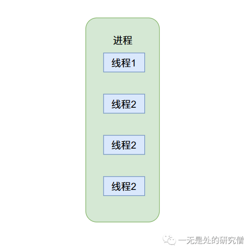
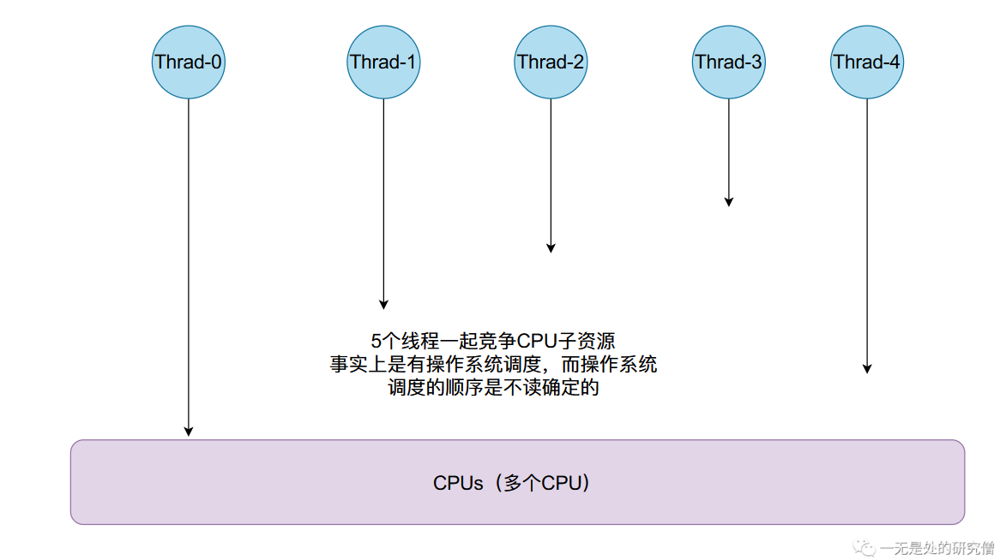

# 并发开篇——带你从0到1建立并发知识体系的基石

## 前言

在本篇文章当中主要跟大家介绍并发的基础知识，从最基本的问题出发层层深入，帮助大家了解并发知识，并且打好并发的基础，为后面深入学习并发提供保证。

## 并发的需求

- 我们常用的软件就可能会有这种需求，对于一种软件我们可能有多重需求，程序可能一边在运行一边在后台更新，因此在很多情况下对于一个进程或者一个任务来说可能想要同时执行两个不同的子任务，因此就需要在一个进程当中产生多个子线程，不同的线程执行不同的任务。
- 现在的机器的CPU核心个数一般都有很多个，比如现在一般的电脑都会有4个CPU，而每一个CPU在同一个时刻都可以执行一个任务，因此为了充分利用CPU的计算资源，我们可以让这多个CPU同时执行不同的任务，让他们同时工作起来，而不是空闲没有事可做。


- 还有就是在科学计算和高性能计算领域有这样的需求，比如矩阵计算，如果一个线程进行计算的话需要很长的时间，那么我们就可能使用多核的优势，让多个CPU同时进行计算，这样一个计算任务的计算时间就会比之前少很多，比如一个任务单线程的计算时间为24小时，如果我们有24个CPU核心，那么我们的计算任务可能在1-2小时就计算完成了，可以节约非常多的时间。

## 并发的基础概念

在并发当中最常见的两个概念就是进程和线程了，那什么是进程和线程呢？

- 进程简单的说来就是一个程序的执行，比如说你再windows操作系统当中双击一个程序，在linux当中在命令行执行一条命令等等，就会产生一个进程，总之进程是一个独立的主体，他可以被操作系统调度和执行。
- 而线程必须依赖进程执行，只有在进程当中才能产生线程，现在通常会将线程称为轻量级进程（Light Weight Process）。一个进程可以产生多个线程，二者多个线程之间共享进程当中的某些数据，比如全局数据区的数据，但是线程的本地数据是不进行共享的。



>你可能会听过进程是资源分配的基本单位，这句话是怎么来的呢？在上面我们已经提到了线程必须依赖于进程而存在，在我们启动一个程序的时候我们就会开启一个进程，而这个进程会像操作系统申请资源，比如内存，磁盘和CPU等等，这就是为什么操作系统是申请资源的基本单位。

>你可能也听过线程是操作系统调度的基本单位。那这又是为什么呢？首先你需要明白CPU是如何工作的，首先需要明白我们的程序会被编译成一条条的指令，而这些指令会存在在内存当中，而CPU会从内存当中一一的取出这些指令，然后CPU进行指令的执行，而一个线程通常是执行一个函数，而这个函数也是会被编译成很多指令，因此这个线程也可以被CPU执行，因为线程可以被操作系统调度，将其放到CPU上进行执行，而且没有比线程更小的可以被CPU调度的单位了，因此说线程是操作系统调度的基本单位。

## Java实现并发

### 继承Thread类

```java
public class ConcurrencyMethod1 extends Thread {

    @Override
    public void run() {
        // Thread.currentThread().getName() 得到当前正在执行的线程的名字
        System.out.println(Thread.currentThread().getName());
    }

    public static void main(String[] args) {
        for (int i = 0; i < 5; i++) {
            // 新开启一个线程
            ConcurrencyMethod1 t = new ConcurrencyMethod1();
            t.start();// 启动这个线程
        }
    }
}
// 某次执行输出的结果（输出的顺序不一定）
Thread-0
Thread-4
Thread-1
Thread-2
Thread-3
```

上面代码当中不同的线程需要得到CPU资源，在CPU当中被执行，而这些线程需要被操作系统调度，然后由操作系统放到不同的CPU上，最终输出不同的字符串。



### 使用匿名内部类实现runnable接口

```java
public class ConcurrencyMethod2 extends Thread {

    public static void main(String[] args) {
        for (int i = 0; i < 5; i++) {
            Thread thread = new Thread(new Runnable() {
                @Override
                public void run() {
                    // Thread.currentThread().getName() 得到当前正在执行的线程的名字
                    System.out.println(Thread.currentThread().getName());
                }
            });
            thread.start();
        }
    }
}
// 某次执行输出的结果（输出的顺序不一定）
Thread-0
Thread-1
Thread-2
Thread-4
Thread-3
```

当然你也可以采用Lambda函数去实现：

```java
public class ConcurrencyMethod3 {

    public static void main(String[] args) {
        for (int i=0; i < 5; i++) {
            Thread thread = new Thread(() -> {
                System.out.println(Thread.currentThread().getName());
            });
            thread.start();
        }
    }
}
// 输出结果
Thread-0
Thread-1
Thread-2
Thread-4
Thread-3
```

其实还有一种`JDK`给我们提供的方法去实现多线程，这个点我们在后文当中会进行说明。

## 第一个并发任务——求$x^2$的积分


