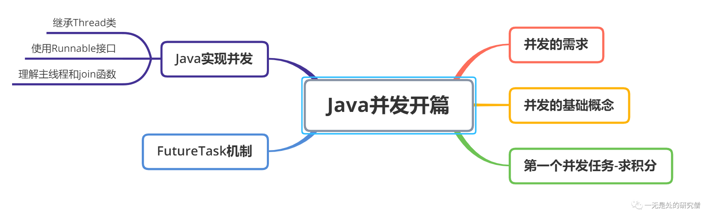

# 并发开篇——带你从0到1建立并发知识体系的基石

## 前言

在本篇文章当中主要跟大家介绍并发的基础知识，从最基本的问题出发层层深入，帮助大家了解并发知识，并且打好并发的基础，为后面深入学习并发提供保证。本篇文章的篇章结构如下：



## 并发的需求

- 我们常用的软件就可能会有这种需求，对于一种软件我们可能有多重需求，程序可能一边在运行一边在后台更新，因此在很多情况下对于一个进程或者一个任务来说可能想要同时执行两个不同的子任务，因此就需要在一个进程当中产生多个子线程，不同的线程执行不同的任务。
- 现在的机器的CPU核心个数一般都有很多个，比如现在一般的电脑都会有4个CPU，而每一个CPU在同一个时刻都可以执行一个任务，因此为了充分利用CPU的计算资源，我们可以让这多个CPU同时执行不同的任务，让他们同时工作起来，而不是空闲没有事可做。


- 还有就是在科学计算和高性能计算领域有这样的需求，比如矩阵计算，如果一个线程进行计算的话需要很长的时间，那么我们就可能使用多核的优势，让多个CPU同时进行计算，这样一个计算任务的计算时间就会比之前少很多，比如一个任务单线程的计算时间为24小时，如果我们有24个CPU核心，那么我们的计算任务可能在1-2小时就计算完成了，可以节约非常多的时间。

## 并发的基础概念

在并发当中最常见的两个概念就是进程和线程了，那什么是进程和线程呢？

- 进程简单的说来就是一个程序的执行，比如说你在windows操作系统当中双击一个程序，在linux当中在命令行执行一条命令等等，就会产生一个进程，总之进程是一个独立的主体，他可以被操作系统调度和执行。
- 而线程必须依赖进程执行，只有在进程当中才能产生线程，现在通常会将线程称为轻量级进程（Light Weight Process）。一个进程可以产生多个线程，二者多个线程之间共享进程当中的某些数据，比如全局数据区的数据，但是线程的本地数据是不进行共享的。


>你可能会听过进程是资源分配的基本单位，这句话是怎么来的呢？在上面我们已经提到了线程必须依赖于进程而存在，在我们启动一个程序的时候我们就会开启一个进程，而这个进程会向操作系统申请资源，比如内存，磁盘和CPU等等，这就是为什么操作系统是申请资源的基本单位。

>你可能也听过线程是操作系统调度的基本单位。那这又是为什么呢？首先你需要明白CPU是如何工作的，首先需要明白我们的程序会被编译成一条条的指令，而这些指令会存在在内存当中，而CPU会从内存当中一一的取出这些指令，然后CPU进行指令的执行，而一个线程通常是执行一个函数，而这个函数也是会被编译成很多指令，因此这个线程也可以被CPU执行，因为线程可以被操作系统调度，将其放到CPU上进行执行，而且没有比线程更小的可以被CPU调度的单位了，因此说线程是操作系统调度的基本单位。

## Java实现并发

### 继承Thread类

```java
public class ConcurrencyMethod1 extends Thread {

    @Override
    public void run() {
        // Thread.currentThread().getName() 得到当前正在执行的线程的名字
        System.out.println(Thread.currentThread().getName());
    }

    public static void main(String[] args) {
        for (int i = 0; i < 5; i++) {
            // 新开启一个线程
            ConcurrencyMethod1 t = new ConcurrencyMethod1();
            t.start();// 启动这个线程
        }
    }
}
// 某次执行输出的结果（输出的顺序不一定）
Thread-0
Thread-4
Thread-1
Thread-2
Thread-3
```

上面代码当中不同的线程需要得到CPU资源，在CPU当中被执行，而这些线程需要被操作系统调度，然后由操作系统放到不同的CPU上，最终输出不同的字符串。


### 使用匿名内部类实现runnable接口

```java
public class ConcurrencyMethod2 extends Thread {

    public static void main(String[] args) {
        for (int i = 0; i < 5; i++) {
            Thread thread = new Thread(new Runnable() {
                @Override
                public void run() {
                    // Thread.currentThread().getName() 得到当前正在执行的线程的名字
                    System.out.println(Thread.currentThread().getName());
                }
            });
            thread.start();
        }
    }
}
// 某次执行输出的结果（输出的顺序不一定）
Thread-0
Thread-1
Thread-2
Thread-4
Thread-3
```

当然你也可以采用Lambda函数去实现：

```java
public class ConcurrencyMethod3 {

    public static void main(String[] args) {
        for (int i=0; i < 5; i++) {
            Thread thread = new Thread(() -> {
                System.out.println(Thread.currentThread().getName());
            });
            thread.start();
        }
    }
}
// 输出结果
Thread-0
Thread-1
Thread-2
Thread-4
Thread-3
```

其实还有一种`JDK`给我们提供的方法去实现多线程，这个点我们在后文当中会进行说明。

### 理解主线程和Join函数

>假如现在我们有一个任务，子线程输出一下自己的线程的名字，在线程输出完自己的名字之后，主线程再输出字符串“线程执行完成”。

在完成上面的任务之前，首先我们需要明白什么是主线程和子线程，所谓主线程就是在执行Java程序的时候不是通过`new Thread`操作这样显示的创建的线程。比如在我们的非并发的程序当中，执行程序的线程就是主线程。

```java
public class MainThread {

    public static void main(String[] args) {
        System.out.println("我是主线程");
    }
}

```

比如在上面的代码当中执行语句`System.out.println("我是主线程");`的线程就是主线程。

```java
public class MainThread {

    public static void main(String[] args) {
        // 下面这段代码是由主线程执行的
        // 主线程通过下面这段代码创建一个子线程
        Thread thread = new Thread(() -> {
            System.out.println("我是主线程创建的子线程");
        });
        // 这句代码也是主线程执行的
        // 主要意义就是主线程启动子线程
        thread.start();
        System.out.println("我是主线程");
    }
}
```

现在我们再来看一下我们之前的任务：

>假如现在我们有一个任务，子线程输出一下自己的线程的名字，在线程输出完自己的名字之后，主线程再输出字符串“线程执行完成”。

上面的任务很明确就是主线程在执行输出自己线程的名字的语句之前，比须等待子线程执行完成，而在`Java`线程当中给我提供了一种方式，帮助我们实现这一点，可以保证主线程的某段代码可以在子线程执行完成之后再执行。

```java
public class MainThread {

    public static void main(String[] args) throws InterruptedException {
        // 下面这段代码是由主线程执行的
        // 主线程通过下面这段代码创建一个子线程
        Thread thread = new Thread(() -> {
            System.out.println(Thread.currentThread().getName());
        });
        // 这句代码也是主线程执行的
        // 主要意义就是主线程启动子线程
        thread.start();
        // 这句代码的含义就是阻塞主线程
        // 直到 thread 的 run 函数执行完成
        thread.join();
        System.out.println(Thread.currentThread().getName());
    }
}
// 输出结果
Thread-0
main
```

上面代码的执行流程大致如下图所示：


我们需要知道的一点是`thread.join()`这条语句是主线程执行的，它的主要功能就是等待线程`thread`执行完成，只有`thread`执行完成之后主线程才会继续执行`thread.join()`后面的语句。

## 第一个并发任务——求$x^2$的积分

接下来我们用一个例子去具体体会并发带来的效果提升。我们的这个例子就是求函数的积分，我们的函数为最简单的二次函数$x^2$，当然我们就积分（下图当中的阴影部分）完全可以根据公式进行求解（如果你不懂积分也没有关系，下文我们会把这个函数写出来，不会影响你对并发的理解）：
$$
\int_0^{10} x^2\mathrm{d}x = \frac{1}{3}x^3+C
$$


但是我们用程序去求解的时候并不是采用上面的方法，而是使用微元法：
$$
\int_0^{10} x^2\mathrm{d}x =\sum_{ i= 0}^{1000000}(i * 0.00001) ^2 * 0.00001
$$


下面我们用一个单线程先写出求$x^2$积分的代码：

```java
public class X2 {

  public static double x2integral(double a, double b) {
    double delta = 0.001;
    return x2integral(a, b, delta);
  }

  /**
   * 这个函数是计算 x^2 a 到 b 位置的积分
   * @param a 计算积分的起始位置
   * @param b 计算积分的最终位置
   * @param delta 表示微元法的微元间隔
   * @return x^2 a 到 b 位置的积分结果
   */
  public static double x2integral(double a, double b, double delta) {
    double sum = 0;
    while (a <= b) {
      sum += delta * Math.pow(a, 2);
      a += delta;
    }
    return sum;
  }

  public static void main(String[] args) {
    // 这个输出的结果为 0.3333333832358528
    // 这个函数计算的是 x^2 0到1之间的积分
    System.out.println(x2integral(0, 1, 0.0000001));
  }
}
```

上面代码当中的函数`x2integral`主要是用于计算区间$[a, b]$之间的二次函数$x^2$的积分结果，我们现在来看一下如果我们想计算区间`[0, 10000]`之间的积分结果且`delta = 0.000001`需要多长时间，其中`delta`表示每一个微元之间的距离。

```java
public static void main(String[] args) {
    long start = System.currentTimeMillis();
    System.out.println(x2integral(0, 10000, 0.000001));
    long end = System.currentTimeMillis();
    System.out.println(end - start);
}
```

从上面的结果来看计算区间`[0, 10000]`之间的积分结果且`delta = 0.000001`，现在假设我们使用`8`个线程来做这件事，我们改如何去规划呢？

因为我们是采用`8`个线程来做这件事儿，因此我们可以将这个区间分成`8`段，每个线程去执行一小段，最终我们将每一个小段的结果加起来就行，整个过程大致如下。


首先我们先定义一个继承`Thread`的类（因为我们要进行多线程计算，所以要继承这个类）去计算区间`[a, b]`之间的函数$x^2$的积分：

```java
class ThreadX2 extends Thread {
    private double a;
    private double b;
    private double sum = 0;
    private double delta = 0.000001;

    public double getSum() {
        return sum;
    }

    public void setSum(double sum) {
        this.sum = sum;
    }

    public double getDelta() {
        return delta;
    }

    public void setDelta(double delta) {
        this.delta = delta;
    }

    /**
   * 重写函数 run
   * 计算区间 [a, b] 之间二次函数的积分
   */
    @Override
    public void run() {
        while (a <= b) {
            sum += delta * Math.pow(a, 2);
            a += delta;
        }
    }

    public double getA() {
        return a;
    }

    public void setA(double a) {
        this.a = a;
    }

    public double getB() {
        return b;
    }

    public void setB(double b) {
        this.b = b;
    }
}
```

我们最终开启8个线程的代码如下所示：

```java
public static void main(String[] args) throws InterruptedException {
	// 单线程测试计算时间
    System.out.println("单线程");
    long start = System.currentTimeMillis();
    ThreadX2 x2 = new ThreadX2();
    x2.setA(0);
    x2.setB(1250 * 8);
    x2.start();
    x2.join();
    System.out.println(x2.getSum());
    long end = System.currentTimeMillis();
    System.out.println("花费时间为：" + (end - start));
    System.out.println("多线程");
	
    // 多线程测试计算时间
    start = System.currentTimeMillis();
    ThreadX2[] threads = new ThreadX2[8];
    for (int i = 0; i < 8; i++) {
        threads[i] = new ThreadX2();
        threads[i].setA(i * 1250);
        threads[i].setB((i + 1) * 1250);
    }
    // 这里要等待每一个线程执行完成
    // 因为只有执行完成才能得到计算的结果
    for (ThreadX2 thread : threads) {
        thread.start();
    }
    for (ThreadX2 thread : threads) {
        thread.join();
    }
    end = System.currentTimeMillis();
    System.out.println("花费时间为：" + (end - start));
    double ans = 0;
    for (ThreadX2 thread : threads) {
        ans += thread.getSum();
    }
    System.out.println(ans);
}
// 输出结果
单线程
3.333332302493948E11
花费时间为：14527
多线程
花费时间为：2734
3.333332303236695E11
```

|          | 单线程               | 多线程（8个线程）    |
| -------- | -------------------- | -------------------- |
| 计算结果 | 3.333332302493948E11 | 3.333332303236695E11 |
| 执行时间 | 14527                | 2734                 |

从上面的结果来看，当我们使用多个线程执行的时候花费的时间比单线程少的多，几乎减少了7倍，由此可见并发的“威力”。

## FutureTask机制

在前文和代码当中，我们发现不论是我们继承自`Thread`类或者写匿名内部内我们都没有返回值，我们的返回值都是`void`，那么如果我们想要我们的`run`函数有返回值怎么办呢？`JDK`为我们提供了一个机制，可以让线程执行我们指定函数并且带有返回值，我们来看下面的代码：

```java
import java.util.concurrent.Callable;
import java.util.concurrent.ExecutionException;
import java.util.concurrent.FutureTask;

public class FT {

    public static void main(String[] args) throws ExecutionException, InterruptedException {
        FutureTask<Integer> task = new FutureTask<>(new MyCallable());
        Thread thread = new Thread(task);
        thread.start();
        // get 函数如果结果没有计算出来
        // 主线程会在这里阻塞，如果计算
        // 出来了将返回结果
        Integer integer = task.get();
        System.out.println(integer);
    }
}

class  MyCallable implements Callable<Integer> {

    @Override
    public Integer call() throws Exception {
        System.out.println("线程正在执行");
        return 101;
    }
}
// 输出结果
线程正在执行
101
```


从上面的继承结构我们可以看出`FutureTask`实现了`Runnable`接口，而上面的代码当中我们最终会将一个`FutureTask`作为参数传入到`Thread`类当中，因此线程最终会执行`FutureTask`当中的`run`方法，而我们也给`FutureTask`传入了一个`Callable`接口实现类对象，那么我们就可以在`FutureTask`当中的`run`方法执行我们传给`FutureTask`的`Callable`接口中实现的`call`方法，然后将`call`方法的返回值保存下来，当我们使用`FutureTask`的`get`函数去取结果的时候就将`call`函数的返回结果返回回来，在了解这个过程之后你应该可以理解上面代码当中`FutureTask`的使用方式了。

需要注意的一点是，如果我们在调用`get`函数的时候`call`函数还没有执行完成，`get`函数会阻塞调用`get`函数的线程，关于这里面的实现还是比较复杂，我们在之后的文章当中会继续讨论，大家现在只需要在逻辑上理解上面使用`FutureTask`的使用过程就行。

## 总结

在本篇文章当中主要给大家介绍了一些并发的需求和基础概念，并且使用了一个求积分的例子带大家切身体会并发带来的效果提升，并且给大家介绍了在Java当中3中实现并发的方式，并且给大家梳理了一下`FutureTask`的方法的大致工作过程，帮助大家更好的理解`FutureTask`的使用方式。除此之外给大家介绍了join函数，大家需要好好去理解这一点，仔细去了解join函数到底是阻塞哪个线程，这个是很容搞错的地方。

以上就是本文所有的内容了，希望大家有所收获，我是LeHung，我们下期再见！！！（记得**点赞**收藏哦！）

---

更多精彩内容合集可访问项目：<https://github.com/Chang-LeHung/CSCore>

关注公众号：一无是处的研究僧，了解更多计算机（Java、Python、计算机系统基础、算法与数据结构）知识。


