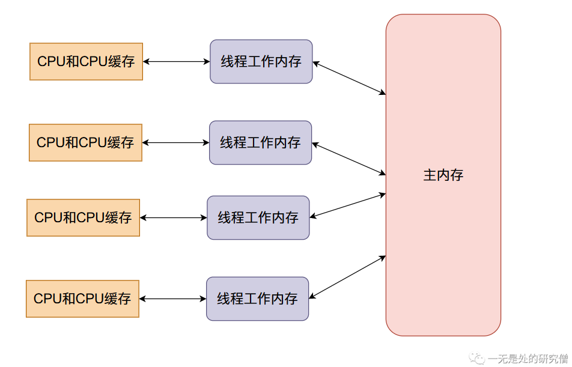

# 并发程序的噩梦——数据竞争

## 前言

在本文当中我主要通过不同线程对同一个数据进行操作的例子，层层递进，跟大家分享我们在并发编程经常使用的方法和并发编程当中会经常遇到的问题。

## 问题介绍

>在本文当中会有一个贯穿全文的例子：不同的线程会对一个全局变量不断的进行加的操作！然后比较结果，具体来说我们设置一个静态类变量`data`，然后使用两个线程循环10万次对`data`进行加一操作！！！

像这种多个线程会存在同时对同一个数据进行修改操作的现象就叫做**数据竞争**。**数据竞争**会给程序造成很多不可预料的结果，让程序存在许多漏洞。而我们上面的任务就是一个典型的**数据竞争**的问题。

## 并发不安全版本

在这一小节我们先写一个上述问题的并发不安全的版本：

```java
public class Sum {

    public static int data;

    public static void main(String[] args) throws InterruptedException {
        Thread t1 = new Thread(() -> {
            for (int i = 0; i < 100000; i++)
                data++;
        });

        Thread t2 = new Thread(() -> {
            for (int i = 0; i < 100000; i++)
                data++;
        });

        t1.start();
        t2.start();
        // 让主线程等待 t1 和 t2
        // 直到 t1 和 t2 执行完成
        t1.join();
        t2.join();
        System.out.println(data);
    }
}
// 输出结果
131888
```

上面两个线程执行的结果最终都会小于`200000`，为什么会出现这种情况呢？

我们首先来看一下内存的逻辑布局图：



`data`全局变量保存在**主内存**当中，当现成开始执行的时候会从**主内存**拷贝一份到线程的**工作内存**当中，也就是线程的**本地内存**，在本地进行计算之后就会将**本地内存**当中的数据同步到**主内存**

我们现在来模拟一下出现问题的过程：

- 主内存`data`的初始值等于0，两个线程得到的`data`初始值都等于0。


- 现在线程一将`data`加一，然后线程一将`data`的值同步回主内存，整个内存的数据变化如下：


- 现在线程二`data`加一，然后将`data`的值同步回主内存（将原来主内存的值覆盖掉了）：


我们本来希望`data`的值在经过上面的变化之后变成`2`，但是线程二覆盖了我们的值，因此在多线程情况下，会使得我们最终的结果变小。

## 忙等待（Busy waiting）

那么我们能在不使用锁或者`synchronized`的情况实现上面这个任务吗？答案是可以，这种方法叫做**忙等待**。具体怎么做呢，我们可以用一个布尔值`flag`去标识是那个线程执行`sum++`，我们先看代码然后进行分析：

```java
public class BusyWaiting {

    public static int sum;
    public static boolean flag;

    public static void main(String[] args) throws InterruptedException {
        Thread t1 = new Thread(() -> {
            for (int i = 0; i < 100000; i++) {
                // 当 flag == false 的时候这个线程进行
                // sum++ 操作然后让 flat = true
                // 让另外一个线程进行 sum++ 操作
                while (flag);
                sum++;
                flag = true;
                System.out.println("Thread 1 : " + sum);
            }
        });

        Thread t2 = new Thread(() -> {
            for (int i = 0; i < 100000; i++) {
                // 当 flag = true 的之后这个线程进行
                // sum++ 操作然后让 flat = false
                // 让另外一个线程进行 sum++ 操作
                while (!flag) ;
                sum++;
                flag = false;
                System.out.println("Thread 2 : " + sum);
            }
        });
        t1.start();
        t2.start();
        // 让主线程等待 t1 和 t2
        // 直到 t1 和 t2 执行完成
        t1.join();
        t2.join();
        System.out.println(sum);
    }
}

```

上面代码的流程是一个线程进行完`sum++`操作之后会将自己的`flag`变成另外一个值，然后自己的`while`循环当中的条件会一直为`true`自己就会一直处于`while`循环当中，然后另外一个线程的`while`循环条件会变成`false`，则另外一个线程会执行`sum++`操作，然后将`flag`变成另外一个值，然后线程有开始执行了......

## 忙等待中数据竞争的BUG

但是上面的代码会出现问题，就是在执行一段时间之后两个线程都会卡死，都会一直处于死循环当中。这是因为一个线程在更新完`flag`之后，另外一个线程的`flag`值没有更新，也就是说两个线程的`flag`值不一样，这样就都会处于死循环当中。出现这个问题的原因是一个线程更新完`flag`之后，另外一个线程的`flag`使用的还是旧值。

比如在某个时刻**主内存**当中的`flag`的值等于`false`，**线程t1**和**线程t2**当中的`flag`的值都等于`false`，这个情况下**线程t1**是可以进行`sum++`操作的，然后**线程t1**进行`sum++`操作之后将`flag`的值改成`true`，然后将这个值同步更新回**主内存**，但是此时**线程t2**拿到的还是旧值`false`，他依旧处于死循环当中，就这样两个线程都处于死循环了。

上面的问题本质上是一个数据可见性的问题，也就是说一个线程修改了`flag`的值，另外一个线程拿不到最新的值，使用的还是旧的值，而在`java`当中给我们提供了一中机制可以解决数据可见性的问题。在`java`当中我们可以使用`volatile`去解决数据可见性的问题。当一个变量被volatile关键字修饰时，对于共享资源的写操作先要修改工作内存，但是修改结束后会立刻将其刷新到主内存中。当其他线程对该`volatile`修饰的共享资源进行了修改，则会导致当前线程在工作内存中的共享资源失效，所以必须从主内存中再次获取。这样的话就可以保证共享数据的可见性了。因为某个线程如果修改了`volatile`修饰的共享变量时，其他线程的值会失效，然后重新从主内存当中加载最新的值，关于`volatile`的内容还是比较多，在本文当中我们只谈他在本文当中作用。

修改后的正确代码如下：

```java
public class BusyWaiting {

    public static volatile int sum;
    public static volatile boolean flag;

    public static void main(String[] args) throws InterruptedException {
        Thread t1 = new Thread(() -> {
            for (int i = 0; i < 100000; i++) {
                // 当 flag == false 的时候这个线程进行
                // sum++ 操作然后让 flat = true
                // 让另外一个线程进行 sum++ 操作
                while (flag);
                sum++;
                flag = true;
                System.out.println("Thread 1 : " + sum);
            }
        });

        Thread t2 = new Thread(() -> {
            for (int i = 0; i < 100000; i++) {
                // 当 flag = true 的之后这个线程进行
                // sum++ 操作然后让 flat = false
                // 让另外一个线程进行 sum++ 操作
                while (!flag) ;
                sum++;
                flag = false;
                System.out.println("Thread 2 : " + sum);
            }
        });
        t1.start();
        t2.start();
        // 让主线程等待 t1 和 t2
        // 直到 t1 和 t2 执行完成
        t1.join();
        t2.join();
        System.out.println(sum);
    }
}
```

上面的`sum`也需要使用`volatile`进行修饰，因为如果某个线程`++`之后，如果另外一个线程没有更新最新的值就进行`++`的话，在数据更新回主内存的时候就会覆盖原来的值，最终的结果就会变小，因此需要使用`volatile`进行修饰。

在上文当中我们主要分析了如何使用**忙等待**来解决我们的问题，但是忙等待有一个很大的问题就是线程会不断的进行循环，这很消耗CPU资源，在下文当中我们将主要介绍两种方法解决本文开头提出的问题，而且可以不进行循环操作，而是将线程挂起，而不是一直在执行。

## synchronized并发安全版本

`synchronized`是`java`语言的关键字，它可以用来保证程序的原子性。在并发的情况下我们可以用它来保证我们的程序在某个时刻只能有一个线程执行，保证同一时刻只有一个线程获得`synchronized`锁对象。

```java
public class Sum01 {
    public static int sum;

    public static synchronized void addSum() {
        for (int i = 0; i < 100000; i++)
            sum++;
    }

    public static void main(String[] args) throws InterruptedException {
        Thread t1 = new Thread(Sum01::addSum);
        Thread t2 = new Thread(Sum01::addSum);

        t1.start();
        t2.start();
        // 让主线程等待 t1 和 t2
        // 直到 t1 和 t2 执行完成
        t1.join();
        t2.join();

        System.out.println(sum);
    }
}

// 输出结果
200000
```

上面的代码`addSum`方法加入了`synchronized`进行修饰，在`java`当中被`synchronized`的静态方法在同一个时刻只能有一个线程能够进入，也就是说上面的代码会让线程`t1`或者`t2`先执行`addSum`函数，然后另外一个线程在进行执行，那这个跟串行执行就一样了。那么我们就可以不在静态方法上加`synchronized`的关键字，可以使用静态代码块：

```java
public class Sum02 {

    public static int sum;
    public static Object lock = new Object();

    public static void addSum() {
        for (int i = 0; i < 100000; i++)
            synchronized (lock) {
            sum++;
        }
    }

    public static void main(String[] args) throws InterruptedException {
        Thread t1 = new Thread(Sum02::addSum);
        Thread t2 = new Thread(Sum02::addSum);
        t1.start();
        t2.start();
        // 让主线程等待 t1 和 t2
        // 直到 t1 和 t2 执行完成
        t1.join();
        t2.join();

        System.out.println(sum);
    }
}
```

上面代码虽然没有使用用`synchronized`修饰的静态方法，但是上面的代码使用了用`synchronized`修饰的同步代码块，在每一个时刻只能有一个线程执行下面这段代码：

```java
// synchronized 修饰的代码块称作同步代码块 ，
// lock 是一个 全局的静态类变量 只有竞争到 lock 对象的线程
// 才能够进入同步代码块 同样的每一个时刻只能有一个线程进入
synchronized (lock) {
    sum++;
}
```

上面代码虽然没有使用静态同步方法（`synchronized`修饰的静态方法），但是有同步代码块（`synchronized`修饰的代码块），在一个代码当中会有`100000`次进入同步代码块，这里也花费很多时间，因此上面的代码的效率也不高。

其实我们可以用一个临时变量存储`100000`次加法的结果，最后一次将结果加入到`data`当中：

```java
public class Sum03 {
    public static int sum;
    public static Object lock = new Object();

    public static void addSum() {
        int tempSum = 0;
        for (int i = 0; i < 100000; i++)
            tempSum++;
        synchronized (lock) {
            sum += tempSum;
        }
    }

    public static void main(String[] args) throws InterruptedException {
        Thread t1 = new Thread(Sum03::addSum);
        Thread t2 = new Thread(Sum03::addSum);
        t1.start();
        t2.start();
        // 让主线程等待 t1 和 t2
        // 直到 t1 和 t2 执行完成
        t1.join();
        t2.join();

        System.out.println(sum);
    }
}
```

## 使用锁进行临界区的保护

>临界区：像这种与数据竞争又关的代码块叫做临界区，比如上文代码当中的`sum++`。

在`java`当中除了使用`synchronized`形成同步方法或者同步代码块的方法保证多个线程访问临界区的顺序，还可以使用锁对临界区进行保护。在`java`当中一个非常常用的锁就是可重入锁`ReentrantLock`，可以保证在`lock`和`unlock`之间的区域在每一个时刻只有一个线程在执行。

```java
import java.util.concurrent.locks.ReentrantLock;

public class Sum04 {

    public static int sum;
    public static ReentrantLock lock = new ReentrantLock();


    public static void addSum() {
        int tempSum = 0;
        for (int i = 0; i < 100000; i++)
            tempSum++;
        lock.lock();
        try {
            sum += tempSum;
        }catch (Exception ignored) {

        }finally {
            lock.unlock();
        }
    }

    public static void main(String[] args) throws InterruptedException {
        Thread t1 = new Thread(Sum04::addSum);
        Thread t2 = new Thread(Sum04::addSum);
        t1.start();
        t2.start();
        // 让主线程等待 t1 和 t2
        // 直到 t1 和 t2 执行完成
        t1.join();
        t2.join();

        System.out.println(sum);
    }
}
```

## synchronized和锁对可见性的影响

>在上文当中我们仅仅提到了`synchronized`和锁可以保证在每一个时刻只能有一个线程在临界区当中执行，这一点其实前面的忙等待也可以实现，但是后面我们提到了第一版忙等待的实现是有错误的，在程序运行的时候程序会陷入死循环。因此`synchronized`和锁也会有这样的问题，但是为什么`synchronized`和锁可以使得程序能够正常执行呢？原因如下：
>
>- `synchronized`关键字能够保证可见性，`synchronized `关键字能够不仅能够保证同一时刻只有一个线程获得锁，并且还会确保在锁释放之前，会将对变量的修改刷新到主内存当中。
>- `JDK`给我们提供的锁工具（比如`ReentrantLock`）也能够保证可见性，锁的lock方法能够保证在同一时刻只有一个线程获得锁然后执行同步方法，并且会确保在锁释放(锁的unlock方法)之前会将对变量的修改刷新到主内存当中。

## 数据竞争的知名后果——死锁

