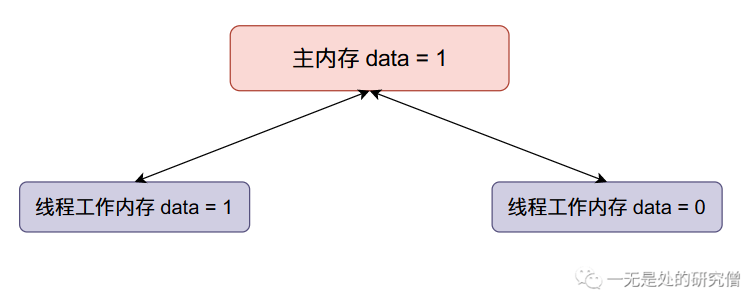

# 并发程序的噩梦——数据竞争（Java）

## 前言

在本文当中我主要通过不同线程对同一个数据进行操作的例子，层层递进，跟大家分享我们在并发编程经常使用的方法和并发编程当中会经常遇到的问题。

## 问题介绍

>在本文当中会有一个贯穿全文的例子：不同的线程会对一个全局变量不断的进行加的操作！然后比较结果，具体来说我们设置一个静态类变量`data`，然后使用两个线程循环10万次对`data`进行加一操作！！！

像这种多个线程会存在同时对同一个数据进行修改操作的现象就叫做**数据竞争**。**数据竞争**会给程序造成很多不可预料的结果，让程序存在许多漏洞。

## 并发不安全版本

在这一小节我们先写一个上述问题的并发不安全的版本：

```java
public class Sum {

    public static int data;

    public static void main(String[] args) throws InterruptedException {
        Thread t1 = new Thread(() -> {
            for (int i = 0; i < 100000; i++)
                data++;
        });

        Thread t2 = new Thread(() -> {
            for (int i = 0; i < 100000; i++)
                data++;
        });

        t1.start();
        t2.start();
        // 让主线程等待 t1 和 t2
        // 直到 t1 和 t2 执行完成
        t1.join();
        t2.join();
        System.out.println(data);
    }
}
// 输出结果
131888
```

上面两个线程执行的结果最终都会小于`200000`，为什么会出现这种情况呢？

我们首先来看一下内存的逻辑布局图：


`data`全局变量保存在**主内存**当中，当现成开始执行的时候会从**主内存**拷贝一份到线程的**工作内存**当中，也就是线程的**本地内存**，在本地进行计算之后就会将**本地内存**当中的数据同步到**主内存**

我们现在来模拟一下出现问题的过程：

- 主内存`data`的初始值等于0，两个线程得到的`data`初始值都等于0。


- 现在线程一将`data`加一，然后线程一将`data`的值同步回主内存，整个内存的数据变化如下：



- 现在线程二`data`加一，然后将`data`的值同步回主内存（将原来主内存的值覆盖掉了）：


