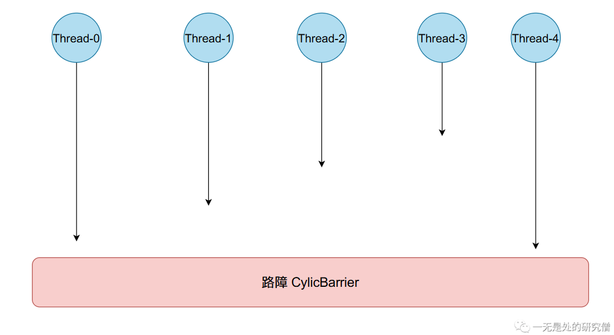
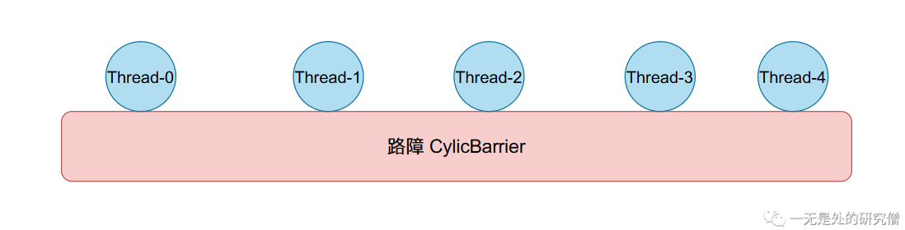

# 仅需几十行写自己的并发工具类(Semaphore, CyclicBarrier, CountDownLatch)是什么体验？

## 前言

在本篇文章当中首先给大家介绍三个工具`Semaphore, CyclicBarrier, CountDownLatch`该如何使用，然后会跟大家一起用`ReentrantLock`实现这三个工具。

## 并发工具类的使用

### CountDownLatch

>`CountDownLatch`最主要的作用是允许一个或多个线程等待其他线程完成操作。比如我们现在有一个任务，有$N$个线程会往数组`data[N]`当中对应的位置根据不同的任务放入数据，然后主线程需要将这个数组当中所有的数据进行求和计算！在这样的场景下，我们就可以使用`CountDownLatch`。

上面问题的代码：

```java
import java.util.Arrays;
import java.util.Random;
import java.util.concurrent.CountDownLatch;

public class CountDownLatchDemo {

    public static int[] data = new int[10];

    public static void main(String[] args) throws InterruptedException {
        CountDownLatch latch = new CountDownLatch(10);

        for (int i = 0; i < 10; i++) {
            int temp = i;
            new Thread(() -> {
                Random random = new Random();
                data[temp] = random.nextInt(100001);
                latch.countDown();
            }).start();
        }

        // 只有函数 latch.countDown() 至少被调用10主线程才不会被阻塞
        // 这个10是在CountDownLatch初始化传递的10
        latch.await();
        System.out.println("求和结果为：" + Arrays.stream(data).sum());
    }
}
```

在上面的代码当中，主线程通过调用`latch.await();`将自己阻塞住，然后需要等他其他线程调用方法`latch.countDown()`只有这个方法被调用的次数等于在初始化时给`CountDownLatch`传递的参数时，主线程才会被释放。

### CyclicBarrier

>`CyclicBarrier`它要做的事情是，让一 组线程到达一个屏障（也可以叫同步点）时被阻塞，直到最后一个线程到达屏障时，屏障才会开门，所有被屏障拦截的线程才会继续运行。我们通常也将`CyclicBarrier`称作**路障**。

示例代码：

```java
public class CycleBarrierDemo {

    public static void main(String[] args) {
        CyclicBarrier barrier = new CyclicBarrier(5);

        for (int i = 0; i < 5; i++) {
            new Thread(() -> {
                try {
                    System.out.println(Thread.currentThread().getName() + "开始等待");
                    // 所有线程都会调用这行代码
                    // 在这行代码调用的线程个数不足5
                    // 个的时候所有的线程都会阻塞在这里
                    // 只有到5的时候，这5个线程才会被放行
                    // 所以这行代码叫做同步点
                    barrier.await();
                } catch (InterruptedException e) {
                    e.printStackTrace();
                } catch (BrokenBarrierException e) {
                    e.printStackTrace();
                }
                System.out.println(Thread.currentThread().getName() + "等待完成");
            }).start();
        }
    }
}
```

我们在初始化`CyclicBarrier`对象时，传递的数字为`5`，这个数字表示只有5个线程到达同步点的时候，那5个线程才会同时被放行，而如果到了6个线程的话，第一次没有被放行的线程必须等到下一次有`5`个线程到达同步点`barrier.await()`时，才会放行5个线程。

- 比如刚开始的时候5个线程的状态如下，**同步点**还没有5个线程到达，因此不会放行。



- 当有5个线程或者更多的线程到达**同步点**`barrier.await()`的时候，才会放行`5`个线程，注意是5个线程，如果有多的线程必须等到下一次集合5个线程才会进行又一次放行，也就是说每次只放行5个线程，这也是它叫做`CyclicBarrier`（循环路障）的原因。



## 自己动手写并发工具类

### CountDownLatch

```java
import java.util.concurrent.TimeUnit;
import java.util.concurrent.locks.Condition;
import java.util.concurrent.locks.ReentrantLock;

public class MyCountDownLatch {
    private ReentrantLock lock = new ReentrantLock();
    private Condition condition = lock.newCondition();
    private int curValue;

    public MyCountDownLatch(int targetValue) {
        this.curValue = targetValue;
    }

    public void countDown() {
        lock.lock();
        try {
            curValue--;
            if (curValue <= 0)
                condition.signalAll();
        }catch (Exception ignored){}
        finally {
            lock.unlock();
        }
    }

    public void await() {
        lock.lock();
        try {
            if (curValue > 0)
                condition.await();
        }catch (Exception ignored){}
        finally {
            lock.unlock();
        }
    }
}
```

### CyclicBarrier

```java
import java.util.concurrent.TimeUnit;
import java.util.concurrent.locks.Condition;
import java.util.concurrent.locks.ReentrantLock;

public class MyBarrier {

    private ReentrantLock lock = new ReentrantLock();
    private Condition condition = lock.newCondition();
    private int threadCount;
    private int currentThreadNumber;
    private Runnable runnable;

    public MyBarrier(int count) {
        threadCount = count;
    }

    public MyBarrier(int count, Runnable runnable) {
        this(count);
        this.runnable = runnable;
    }

    public void barrier() {
        lock.lock();
        currentThreadNumber++;
        try {
            if (currentThreadNumber == threadCount) {
                currentThreadNumber = 0;
                if (runnable != null) {
                    new Thread(runnable).start();
                }
                condition.signalAll();
            }else {
                condition.await();
            }
        }catch (Exception ignored){}
        finally {
            lock.unlock();
        }
    }
}
```

### Semaphore

```java
import java.util.concurrent.TimeUnit;
import java.util.concurrent.locks.Condition;
import java.util.concurrent.locks.ReentrantLock;

public class MySemaphore {

    private ReentrantLock lock = new ReentrantLock();
    private Condition condition = lock.newCondition();
    private int semCount;
    private int curCount;

    public MySemaphore(int semCount) {
        this.semCount = semCount;
    }

    public void acquire() {
        lock.lock();
        try {
            curCount++;
            if (curCount > semCount) {
                condition.await();
            }
        }catch (Exception ignored) {}
        finally {
            lock.unlock();
        }
    }

    public void release() {
        lock.lock();
        try {
            curCount--;
            condition.signal();
        }catch (Exception ignored){}
        finally {
            lock.unlock();
        }
    }
}
```

