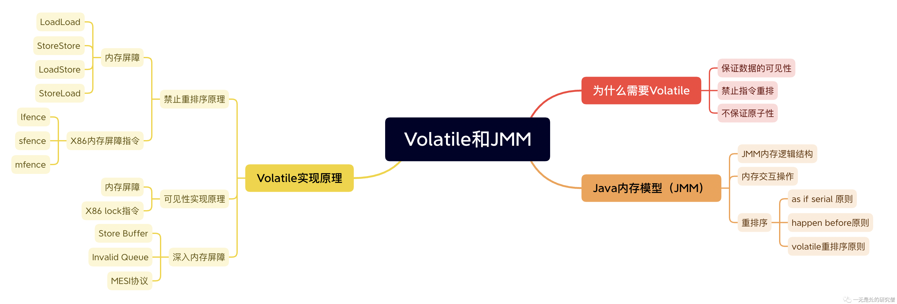
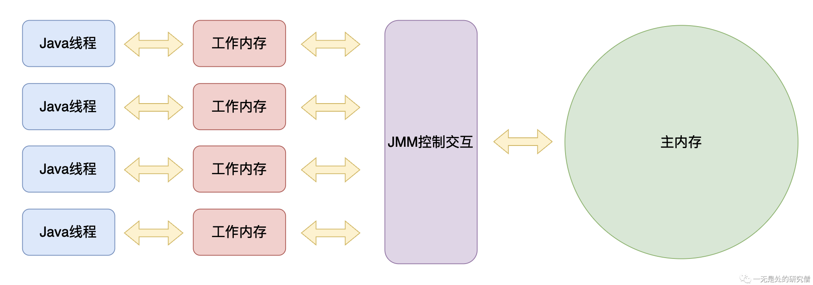
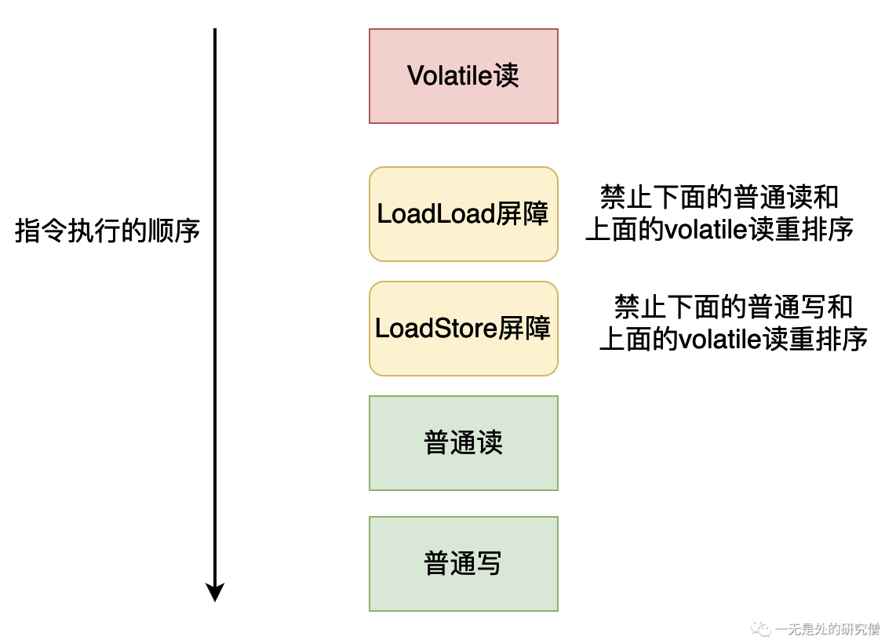
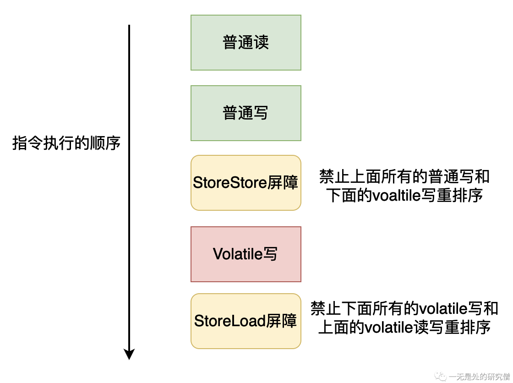
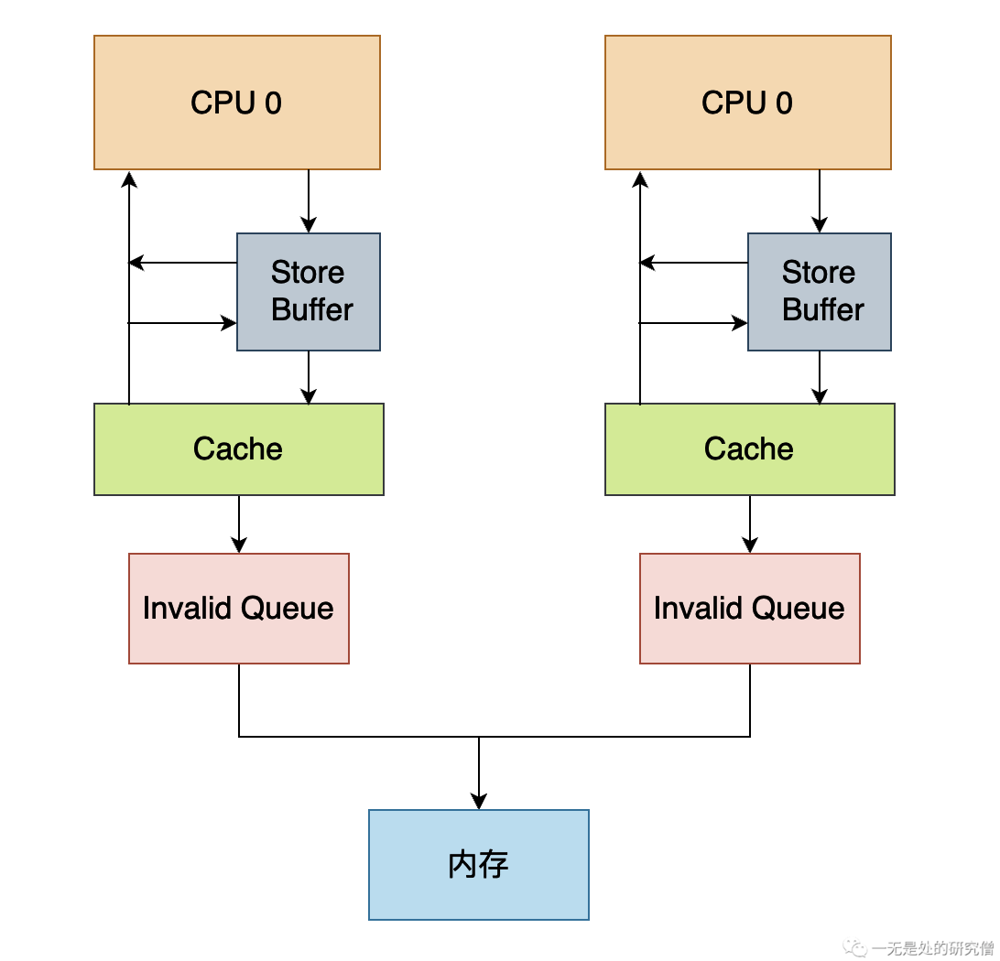
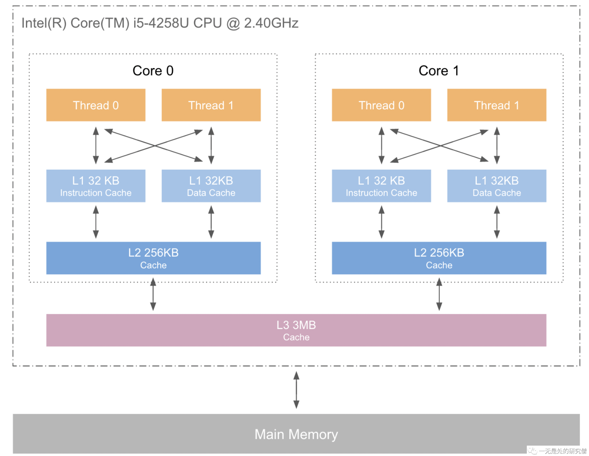
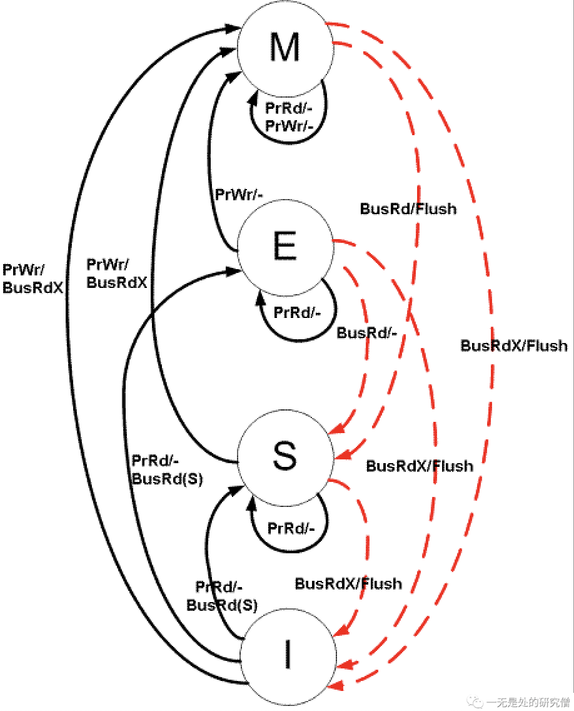

# 从计算机本源深入探寻volatile和Java内存模型

## 前言

本篇文章超级干，请大家**坐稳扶好**，发车了！！！



## 为什么我们需要volatile？

### 保证数据的可见性

假如现在有两个线程分别执行不同的代码，但是他们有同一个共享变量`flag`，其中线程`updater`会执行的代码是将`flag`从`false`修改成`true`，而另外一个线程`reader`会进行`while`循环，当`flag`为`true`的时候跳出循环，代码如下：

```java
import java.util.concurrent.TimeUnit;

class Resource {
    public boolean flag;

    public void update() {
        flag = true;
    }
}

public class Visibility {

    public static void main(String[] args) throws InterruptedException {
        Resource resource = new Resource();
        Thread thread = new Thread(() -> {
            System.out.println(resource.flag);
            try {
                TimeUnit.SECONDS.sleep(1);
            } catch (InterruptedException e) {
                e.printStackTrace();
            }
            resource.update();
        }, "updater");

        new Thread(() -> {
            System.out.println(resource.flag);
            while (!resource.flag) {

            }
            System.out.println("循环结束");
        }, "reader").start();

        thread.start();
    }
}
```

运行上面的代码你会发现，`reader`线程始终打印不出`循环结束`，也就是说它一只在进行`while`循环，而进行`while`循环的原因就是`resouce.flag=false`，但是线程`updater`在经过1秒之后会进行更新啊！为什么`reader`线程还读取不到呢？

这实际上就是一种可见性的问题，`updater`线程更新数据之后，`reader`线程看不到，在分析这个问题之间我们首先先来了解一下Java内存模型的逻辑布局：


在上面的代码执行顺序大致如下：

- `reader`线程从主内存当中拿到`flag`变量并且存储道线程的本地内存当中，进行`while`循环。
- 在休眠一秒之后，`Updater`线程从主内存当中拷贝一份`flag`保存到本地内存当中，然后将`flag`改成`true`，将其写回到主内存当中。
- 但是虽然`updater`线程将`flag`写回，但是`reader`线程使用的还是之前从主内存当中加载的`flag`，也就是说还是`false`，因此`reader`线程才会一直陷入死循环当中。

现在我们稍微修改一下上面的代码，先让`reader`线程休眠一秒，然后在进行`while`循环，让`updater`线程直接修改。

```java
import java.util.concurrent.TimeUnit;

class Resource {
    public boolean flag;

    public void update() {
        flag = true;
    }
}

public class Visibility {

    public static void main(String[] args) throws InterruptedException {
        Resource resource = new Resource();
        Thread thread = new Thread(() -> {
            System.out.println(resource.flag);
            resource.update();
        }, "updater");

        new Thread(() -> {
            System.out.println(resource.flag);
            try {
                TimeUnit.SECONDS.sleep(1);
            } catch (InterruptedException e) {
                e.printStackTrace();
            }
            while (!resource.flag) {

            }
            System.out.println("循环结束");
        }, "reader").start();

        thread.start();
    }
}
```

上面的代码就不会产生死循环了，我们再来分析一下上面的代码的执行过程：

- `reader`线程先休眠一秒。
- `updater`线程直接修改`flag`为`true`，然后将这个值写回主内存。
- 在`updater`写回之后，`reader`线程从主内存获取`flag`，这个时候的值已经更新了，因此可以跳出`while`循环了，因此上面的代码不会出现死循环的情况。

像这种多个线程共享同一个变量的情况的时候，就会产生数据可见性的问题，如果在我们的程序当中忽略这种问题的话，很容易让我们的并发程序产生BUG。如果在我们的程序当中需要保持多个线程对某一个数据的可见性，即如果一个线程修改了共享变量，那么这个修改的结果要对其他线程可见，也就是其他线程再次访问这个共享变量的时候，得到的是共享变量最新的值，那么在Java当中就需要使用关键字`volatile`对变量进行修饰。

现在我们将第一个程序的共享变量`flag`加上`volatile`进行修饰：

```java
import java.util.concurrent.TimeUnit;

class Resource {
    public volatile boolean flag; // 这里使用 volatile 进行修饰

    public void update() {
        flag = true;
    }
}

public class Visibility {

    public static void main(String[] args) throws InterruptedException {
        Resource resource = new Resource();
        Thread thread = new Thread(() -> {
            try {
                TimeUnit.SECONDS.sleep(1);
            } catch (InterruptedException e) {
                e.printStackTrace();
            }
            System.out.println(resource.flag);
            resource.update();
        }, "updater");

        new Thread(() -> {
            System.out.println(resource.flag);
            while (!resource.flag) {

            }
            System.out.println("循环结束");
        }, "reader").start();

        thread.start();
    }
}
```

上面的代码是可以执行完成的，`reader`线程不会产生死循环。

### 禁止指令重排序

#### 指令重排序介绍

首先我们需要了解一下什么是指令重排序：

>```java
>int a = 0;
>int b = 1;
>int c = 1;
>a++;
>b--;
>```
>
>比如对于上面的代码我们正常的执行流程是：
>
>- 定义一个变量`a`，并且赋值为0。
>- 定义一个变量`b`，并且赋值为1。
>- 定义一个变量`c`，并且赋值为1。
>
>- 变量`a`进行自增操作。
>- 变量`b`进行自减操作。
>
>而当编译器去编译上面的程序时，可能不是安装上面的流程一步步进行操作的，编译器可能在编译优化之后进行如下操作：
>
>- 定义一个变量`c`，并且赋值为1。
>
>- 定义一个变量`a`，并且赋值为1。
>- 定义一个变量`b`，并且赋值为0。
>
>从上面来看代码的最终结果是没有发生变化的，但是指令执行的流程和指令的数目是发生变化的，编译器帮助我们省略了一些操作，这可以让CPU执行更少的指令，加快程序的执行速度。

上面就是一个比较简单的在编译优化当中指令重排和优化的例子。

**但是如果我们在语句`int c = 1`前面加上`volatile`时，上面的代码执行顺序就会保证`a`和`b`的定义在语句`volatile int c = 1;`之前，变量`a`和变量`b`的操作在语句`volatile int c = 1;`之后。**

```java
int a = 0;
int b = 1;
volatile int c = 1;
a++;
b--;
```

**但是`volatile`并不限制到底是`a`先定义还是`b`先定义，它值保证这两个变量的定义发生在用`volatile`修饰的语句之前**。

>`volatile`关键字会禁止JVM和处理器（CPU）对含有`volatile`关键字修饰的变量的指令进行重排序，但是对于`volatile`前后没有依赖关系的指令没有禁止，也就是说编译器只需要保证编译之后的代码的顺序语义和正常的逻辑一样，它可以尽可能的对代码进行编译优化和重排序！

#### Volatile禁止重排序使用——双重检查单例模式

在单例模式当中，有一种单例模式的写法就**双重检查**单例模式，其代码如下：

```java
public class DCL {
	// 这里没有使用 volatile 进行修饰
  public static DCL INSTANCE;

  public static DCL getInstance() {
		// 如果单例还没有生成
    if (null == INSTANCE) {
      // 进入同步代码块
      synchronized (DCL.class) {
        // 因为如果两个线程同时进入上一个 if 语句
        // 的话，那么第一个线程会 new 一个对象
        // 第二个线程也会进入这个代码块，因此需要重新
        // 判断是否为 null 如果不判断的话 第二个线程
        // 也会 new 一个对象，那么就破坏单例模式了
        if (null == INSTANCE) {
          INSTANCE = new DCL();
        }
      }
    }
    return INSTANCE;
  }
}
```

上面的代码当中`INSTANCE`是没有使用`volatile`进行修饰的，这会导致上面的代码存在问题。在分析这其中的问题之前，我们首先需要明白，在Java当中new一个对象会经历以下三步：

- 步骤1:申请对象所需要的内存空间。
- 步骤2:在对应的内存空间当中，对对象进行初始化。
- 步骤3:对INSTANCE进行赋值。

但是因为变量INSTANCE没有使用`volatile`进行修饰，就可能存在指令重排序，上面的三个步骤的执行顺序变成：

- 步骤1。
- 步骤3。
- 步骤2。

假设一个线程的执行顺序就是上面提到的那样，如果线程在执行完成步骤3之后在执行完步骤2之前，另外一个线程进入`getInstance`，这个时候`INSTANCE != null`，因此这个线程会直接返回这个对象进行使用，但是此时第一个线程还在执行步骤2，也就是说对象还没有初始化完成，这个时候使用对象是不合法的，因此上面的代码存在问题，而当我们使用`volatile`进行修饰就可以禁止这种重排序，从而让他按照正常的指令去执行。

### 不保证原子性

在这里我们先介绍和验证`volatile`不保证原子性，在后文当中我们回仔细分析它不保证原子性和保证可见性和有序性的原理。

原子性：一个操作要么不做要么全做，而且在做这个操作的时候其他线程不能够插入破坏这个操作的完整性

```java
public class AtomicTest {

  public static volatile int data;

  public static void add() {
    for (int i = 0; i < 10000; i++) {
      data++;
    }
  }

  public static void main(String[] args) throws InterruptedException {
    Thread t1 = new Thread(AtomicTest::add);
    Thread t2 = new Thread(AtomicTest::add);

    t1.start();
    t2.start();
    t1.join();
    t2.join();
    System.out.println(data);
  }
}
```

上面的代码就是两个线程不断的进行`data++`操作，一共回进行20000次，但是我们回发现最终的结果不等于20000，因此这个可以验证`volatile`不保证原子性，如果`volatile`能够保证原子性，那么出现的结果回等于20000。

## Java内存模型（JMM）

### JMM下的内存逻辑结构

我们都知道Java程序可以跨平台运行，之所以可以跨平台，是因为JVM帮助我们屏蔽了这些不同的平台和操作系统的差异，而内存模型也是一样，各个平台是不一样的，Java为了保证程序可以跨平台使用，Java虚拟机规范就定义了“Java内存模型”，规定Java应该如何并发的访问内存，每一个平台实现的JVM都需要遵循这个规则，这样就可以保证程序在不同的平台执行的结果都是一样的。

下图当中的绿色部门就是由JMM进行控制的


JMM对Java线程和线程的工作内存还有主内存的规定如下：

- 共享变量存储在主内存当中，每个线程都可以进行访问。
- 每个线程都有自己的工作内存，叫做线程的本地内存。
- 线程如果像操作共享内存必须首先将共享变量拷贝一份到自己的本地内存。
- 线程不能直接对主内存当中的数据进行修改，只能直接修改自己本地内存当中的数据，然后通过JMM的控制，将修改后的值写回道主内存当中。

这里区分一下主内存和工作内存（线程本地内存）：

- 主内存：主要是Java堆当中的对象数据。
- 工作内存：Java虚拟机栈中的某些区域、CPU的缓存（Cache）和寄存器。

因此线程、线程的工作内存和主内存的交互方式的逻辑结构大致如下图所示：



### 内存交互的操作

JMM规定了线程的工作内存应该如何和主内存进行交互，即共享变量如何从内存拷贝到工作内存、工作内存如何同步回主内存，为了实现这些操作，JMM定义了下面8个操作，而且这8个操作都是原子的、不可再分的，如果下面的操作不是原子的话，程序的执行就会出错，比如说在锁定的时候不是原子的，那么很可能出现两个线程同时锁定一个变量的情况，这显然是不对的！！

- lock（锁定）：作用于主内存的变量，它把一个变量标识为一条线程独占的状态。 

- unlock（解锁）：作用于主内存的变量，它把一个处于锁定状态的变量释放出来，释放后的变量才可以被其他线程锁定。 

- read（读取）：作用于主内存的变量，它把一个变量的值从主内存传输到线程的工作内存中，以便随后的load动作使用。 

- load（载入）：作用于工作内存的变量，它把read操作从主内存中得到的变量值放入工作内存的变量副本中。 

- use（使用）：作用于工作内存的变量，它把工作内存中一个变量的值传递给执行引擎，每当虚拟机遇到一个需要使用变量的值的字节码指令时将会执行这个操作。 

- assign（赋值）：作用于工作内存的变量，它把一个从执行引擎接收的值赋给工作内存的变量，每当虚拟机遇到一个给变量赋值的字节码指令时执行这个操作。 

- store（存储）：作用于工作内存的变量，它把工作内存中一个变量的值传送到主内存中，以便随后的write操作使用。 

- write（写入）：作用于主内存的变量，它把store操作从工作内存中得到的变量的值放入主内存的变量中。

如果需要将主内存的变量拷贝到工作内存，就需要顺序执行`read`和`load`操作，如果需要将工作内存的值更新回主内存，就需要顺序执行`store`和`writer`操作。

JMM定义了上述8条规则，但是在使用这8条规则的时候，还需要遵循下面的规则：

- 不允许read和load、store和write操作之一单独出现，即不允许一个变量从主内存读取了但工作内存不接受，或者工作内存发起回写了但主内存不接受的情况出现。 

- 不允许一个线程丢弃它最近的assign操作，即变量在工作内存中改变了之后必须把该变化同步回主内存。不允许一个线程无原因地（没有发生过任何assign操作）把数据从线程的工作内存同步回主内存 中。·
- 一个新的变量只能在主内存中“诞生”，不允许在工作内存中直接使用一个未被初始化（load或assign）的变量，换句话说就是对一个变量实施use、store操作之前，必须先执行assign和load操作。 

- 一个变量在同一个时刻只允许一条线程对其进行lock操作，但lock操作可以被同一条线程重复执行多次，多次执行lock后，只有执行相同次数的unlock操作，变量才会被解锁。 

- 如果对一个变量执行lock操作，那将会清空工作内存中此变量的值，在执行引擎使用这个变量前，需要重新执行load或assign操作以初始化变量的值。 

- 如果一个变量事先没有被lock操作锁定，那就不允许对它执行unlock操作，也不允许去unlock一个被其他线程锁定的变量。 
- 对一个变量执行unlock操作之前，必须先把此变量同步回主内存中（执行store、write操作）。

### 重排序

#### 重排序介绍

我们在上文当中已经谈到了，编译器为了更好的优化程序的性能，会对程序进行进行编译优化，在优化的过程当中可能会对指令进行重排序。我们这里谈到的编译器是JIT（即时编译器）。它JVM当中的一个组件，它可以通过分析Java程序当中的热点代码（经常执行的代码），然后会对这段代码进行分析然后进行编译优化，将其直接编译成机器代码，也就是CPU能够直接执行的机器码，然后用这段代码代替字节码，通过这种方式来优化程序的性能，让程序执行的更快。

重排序通常有以下几种重排序方式：

- JIT编译器对字节码进行优化重排序。
- CPU在执行指令的时候，CPU会在保证指令执行时的语义不发生变化的情况下（与单线程执行的结果相同），可以通过调整指令之间的顺序，让指令并行执行，加快指令执行的速度。
- 还有一种不是显示的重排序方式，这种方式就是内存系统的重排序。这是由于处理器使用缓存和读/写缓冲区，这使得加载和存储操作看上去可能是在乱序执行。这并不是显示的将指令进行重排序，只是因为缓存的原因，让指令的执行看起来像乱序。

#### as-if-serial规则

as-if-serial语义的意思是：不管怎么重排序（编译器和处理器为了提高并行度），（单线程）程序的执行结果不能被改变。编译器、处理器都必须遵守as-if-serial语义，因为如果连这都不遵守，在单线程下执行的结果都不正确，那我们写的程序执行的结果都不是我们想要的，这显然是不正确的。 

```java
1. int a = 1;
2. int b = 2;
3. int c = a + b;
```

比如上面三条语句，编译器和处理器可以对第一条和第二条语句进行重排序，但是必须保证第三条语句必须执行在第一和第二条语句之后，因为第三条语句依赖于第一和第二条语句，重排序必须保证这种存在数据依赖关系的语句在重排序之后执行的结果和顺序执行的结果是一样的。

#### happer-before规则

重排序除了需要遵循as-if-serial规则，还需要遵循下面几条规则，也就是说不管是编译优化还是处理器重排序必须遵循下面的原则：

- **程序顺序原则** ：线程当中的每一个操作，happen-before线程当中的后续操作。

- **锁规则** ：解锁(unlock)操作必然发生在后续的同一个锁的加锁(lock)之前。

- **volatile规则** ：volatile变量的写，先发生于读。

- **线程启动规则** ：线程的start()方法，happen-before它的每一个后续操作。

- **线程终止规则** ：线程的所有操作先于线程的终结，Thread.join()方法的作用是等待 当前执行的线程终止。假设在线程B终止之前，修改了共享变量，线程A从线程B的 join方法成功返回后，线程B对共享变量的修改将对线程A可见。

- **线程中断规则** ：对线程 interrupt()方法的调用先行发生于被中断线程的代码检测到中断事件的发生，可以通Thread.interrupted()方法检测线程是否中断。

- **对象终结规则** ：对象的构造函数执行，需要先于finalize()方法的执行。
- **传递性** ：A先于B ，B先于C 那么A必然先于C。

总而言之，重排序必须遵循下面两条基本规则：

- 对于会改变程序执行结果的重排序，JMM要求编译器和处理器必须禁止这种重排序。
- 对于不会改变程序执行结果的重排序，JMM对编译器和处理器不做要求（JMM允许这种重排序）。

#### Volatile重排序规则

下表是JMM为了实现volatile的内存语义制定的volatile重排序规则，列表示第一个操作，行表示第二个操作：

| 是否可以重排序 | 第二个操作 | 第二个操作 | 第二个操作 |
| -------------- | ---------- | ---------- | ---------- |
| 第一个操作     | 普通读/写  | volatile读 | volatile写 |
| 普通读/写      | Yes        | Yes        | No         |
| volatile读     | No         | No         | No         |
| volatile写     | Yes        | No         | No         |

说明：

- 比如在上表当中说明，当第二个操作是volatile写的时候，那么这个指令不能和前面的普通读写和volatile读写进行重排序。
- 当第一个操作是volatile读的时候，这个指令不能和后面的普通读写和volatile读写重排序。

## Volatile实现原理

### 禁止重排序实现原理

#### 内存屏障

在了解禁止重排序如何实现的之前，我们首先需要了解一下内存屏障。所谓内存屏障就是为了保证内存的可见性而设计的，因为重排序的存在可能会造成内存的不可见，因此Java编译器（JIT编译器）在生成指令的时候为了禁止指令重排序就会在生成的指令当中插入一些内存屏障指令，禁止指令重排序，从而保证内存的可见性。

| 屏障类型           | 指令例子                 | 解释                                                         |
| ------------------ | ------------------------ | ------------------------------------------------------------ |
| LoadLoad Barrier   | Load1;LoadLoad;Load2     | 确保Load1数据的加载先于Load2和后面的Load指令                 |
| StoreStore Barrier | Store1;StoreStore;Store2 | 确保Store1操作的数据对其他处理器可见（将Cache刷新到内存），即这个指令的执行要先于Store2和后面的存储指令 |
| LoadStore Barrier  | Load1;LoadStore;Store2   | 确保Load1数据加载先于Store2以及后面所有存储指令              |
| StoreLoad Barrier  | Store1;StoreLoad;Load2   | 确保Store1数据对其他处理器可见，也就是将这个数据从CPU的Cache刷新到内存当中，这个内存屏障会让StoreLoad前面的所有的内存访问指令（不管是Store还是Load）全部完成之后，才执行Store Load后面的Load指令 |

#### X86当中内存屏障指令

现在处理器可能不会支持上面屏障指令当中的所有指令，但是一般都会支持Store Load屏障指令，这个指令可以达到其他三个指令的效果，因此在实际的机器指令当中如果像达到上面的四种指令的效果，可能不需要四个指令，像在X86当中就主要有三个内存屏障指令：

- `lfence`，这是一种Load Barrier，一种读屏障指令，这个指令可以让高速缓存（CPU的Cache）失效，如果需要加载数据，那么就需要从内存当中重新加载（这样可以加载最新的数据，因为如果其他处理器修改了缓存当中的数据的时候，这个缓存当中的值已经不对了，去内存当中重新加载就可以拿到最新的数据），这个指令其实可以达到上面指令当中LoadLoad和Load Store指令的效果。同时这条指令不会让这条指令之后读操作被调度到`lfence`指令之前执行。
- `sfence`，这是一种Store Barrier，一种写屏障指令，这个指令可以将写入高速缓存的数据刷新到内存当中，这样内存当中的数据就是最新的了，数据就可以全局可见了，其他处理器就可以加载内存当中最新的数据。这条指令有StoreStore的效果。同时这条指令不会让在其之后的写操作调度到其之前执行。
- `mfence`，这是一种全能型的屏障，相当于上面`lfence`和`sfence`两个指令的效果，这条指令可以达到StoreLoad指令的效果。这同样也说明了Store Load可以达到其他三个指令的效果，因为`mfence`相当于`lfence`和`sfence`，而这两条指令可以实现StoreStore、Load Load、Load Store的效果。

#### Volatile需要的内存屏障

为了实现Volatile的内存语义，Java编译器（JIT编译器）在进行编译的时候，会进行如下指令的插入操作：

- 在每个volatile写操作的前面插入一个StoreStore屏障。 

- 在每个volatile写操作的后面插入一个StoreLoad屏障。 

- 在每个volatile读操作的后面插入一个LoadLoad屏障。 

- 在每个volatile读操作的后面插入一个LoadStore屏障。 

Volatile读内存屏障指令插入情况如下：



Volatile写内存屏障指令插入情况如下：



其实上面插入内存屏障只是理论上所需要的，但是因为不同的处理器重排序的规则不一样，因此在插入内存屏障指令的时候需要具体问题具体分析。比如X86处理器只会对读-写这样的操作进行重排序，不会对读-读、读-写和写-写这样的操作进行重排序，因此在X86处理器进行内存屏障指令的插入的时候可以省略这三种情况。

根据volatile重排序的规则表，我们可以发现在写-读的情况下，只禁止了`volatile写-volatile读`的情况：


而X86仅仅只会对写-读的情况进行重排序，因此我们在插入内存屏障的时候只需要关心`volatile写-volatile读`这一种情况，这种情况下我们需要使用的内存屏障指令为StoreLoad，即`volatile写-StoreLoad-volatile读`，因此在X86当中我们只需要在volatile写后面加入StoreLoad内存屏障指令即可，在X86当中Store Load对应的具体的指令为`mfence`。

#### Java虚拟机源码实现Volatile语义

在Java虚拟机当中，当对一个被volatile修饰的变量进行写操作的时候，在操作进行完成之后，在X86体系结构下，JVM会执行下面一段代码：（下面代码来自于：hotspot/src/os_cpu/linux_x86/vm/orderAccess_linux_x86.inline.hpp）

```java
inline void OrderAccess::fence() {
  if (os::is_MP()) {
    // 这里说明了使用 lock 指令的原因 有时候使用 mfence 代价很高
    // 相比起 lock 指令来说会降低程序的性能
    // always use locked addl since mfence is sometimes expensive
#ifdef AMD64 // 这个表示如果是 64 位机器
    __asm__ volatile ("lock; addl $0,0(%%rsp)" : : : "cc", "memory");
#else // 如果不是64位机器 s
  // 32位和64位主要区别就是 寄存器不同 在64 位当中是 rsp 在32位机器当中是 esp
    __asm__ volatile ("lock; addl $0,0(%%esp)" : : : "cc", "memory");
#endif
  }
}
```

上面代码主要是通过内联汇编代码去执行指令`lock`，如果你不熟悉C语言和内联汇编的形式也没有关系，你只需要知道JVM会执行`lock`指令，`lock`指令有`mfence`相同的作用，它可以实现StoreLoad内存屏障的作用，可以保证执行执行的顺序，在前文当中我们说`mfence`是用于实现StoreLoad内存屏障，因为`lock`指令也可以实现同样的效果，而且有时候`mfence`的指令可能对程序的性能影响比较大，因此JVM使用`lock`指令，这样可以提高程序的性能。

### 可见性实现原理

可见性存在的根本原因是一个线程读，一个线程写，一个线程写操作对另外一个线程的读不可见，因此我们主要分析volatile的写操作就行，因为如果都是进行读操作的话，数据就不会发生变化了，也就不存在可见性的问题了。

在上文当中我们已经谈到了Java虚拟机在执行volatile变量的写操作时候，会执行`lock`指令，而这个指令有`mfence`的效果：

- 将执行`lock`指令的处理器的缓存行写回到内存当中，因为我们进行了volatile数据的更新，因此我们需要将这个更新的数据写回内存，好让其他处理器在访问内存的时候，能够看见被修改后的值。
- 写回内存的操作会使在其他CPU里缓存了该内存地址的数据无效，这些处理器如果想使用这些数据的话，就需要从内存当中重新加载。因为修改了volatile变量的值，但是现在其他处理器中的缓存（Cache）还是旧值，因此我们需要让其他处理器缓存了这个用volatile修饰的变量的缓存行失效，那么其他处理器想要再使用这个数据的话就需要重新去内存当中加载，而最新的数据已经更新到内存当中了。

### 深入内存屏障——Store Buffer和Invalid Queue

在前面我们提到了`lock`指令，`lock`指令可保证其他CPU当中缓存了volatile变量的缓存行无效。这是因为当处理器修改数据之后会在总线上发送消息说改动了这个数据，而其他处理器会通过总线嗅探的方式在总线上发现这个改动消息，然后将对应的缓存行置为无效。

这其实是处理器在处理共享数据时保证缓存数据一致性(Cache coherence)的协议，比如说Intel的MESI协议，在这个协议之下缓存行有以下四种状态：

- 已修改Modified (M) 缓存行是脏的（*dirty*），与主存的值不同。如果别的CPU内核要读主存这块数据，该缓存行必须回写到主存，状态变为共享(S).

- 独占Exclusive (E)缓存行只在当前缓存中，但是干净的（clean）--缓存数据同于主存数据。当别的缓存读取它时，状态变为共享；当前写数据时，变为已修改状态。

- 共享Shared (S)缓存行也存在于其它缓存中且是干净的。缓存行可以在任意时刻抛弃。

- 无效Invalid (I)缓存行是无效的。
- 如果你想仔细了解MESI协议，请看文末，这里就不详细说明了！

假设在某个时刻，CPU的多个核心共享一个内存数据，其中一个一个核心想要修改这个数据，那么他就会通过总线给其他核心发送消息表示想要修改这个数据，然后其他核心将这个数据修改为Invalid状态，再给修改数据的核心发送一个消息，表示已经收到这个消息，然后这个修改数据的核心就会将这个数据的状态设置为Modified。

在上面的例子当中当一个核心给其他CPU发送消息时需要等待其他CPU给他返回确认消息，这显然会降低CPU的性能，为了能够提高CPU处理数据的性能，硬件工程师做了一层优化，在CPU当中加了一个部分，叫做“Store Buffer”，当CPU写数据之后，需要等待其他处理器返回确认消息，因此处理器先不将数据写入缓存（Cache）当中，而时写入到Store Buffer当中，当其他处理器返回确认消息之后，再将Store Buffer当中的消息写入缓存，以后如果CPU需要数据就会先从Store Buffer当中去查找，如果找不到才回去缓存当中找，这个过程也叫做Store Forwarding。

处理器在接受到其他处理器发来的修改数据的消息的时候，需要将被修改的数据对应的缓存行进行失效处理，然后再返回确认消息，为了提高处理器的性能，CPU会在接到消息之后立即返回，然后将这个Invalid的消息放入到Invalid Queue当中，这就可以降低处理器响应Invalid消息的时间。其实这样做还有一个好处，因为处理器的Store Buffer是有限的，如果发出Invalid消息的处理器迟迟接受不到响应信息的话，那么Store Buffer就可以写满，这个时候处理器还会卡主，然后等待其他处理器的响应消息，因此处理器在接受到Invalid的消息的时候立马返回也可以提升发出Invalid消息的处理器的性能，会减少处理器卡住的时间，从而提升处理器的性能。

Store Buffer、Valid Queue、CPU、CPU缓存以及内存的逻辑机构大致如下：



还记得前面的两条指令`lfence`和`sfence`吗，现在我们重新回顾一下这两条指令：

- `lfence`，在前面的内容当中，这个屏障能够让高速缓存失效，事实上是，它扫描Invalid Queue中的消息，然后让后让对应数据的缓存行失效，这样的话就可以更新到内存当中最新的数据了。这里的失效并不是L1缓存失效，而是L2和L3中的缓存行失效，读取数据也不一定从内存当中读取，因为L1Cache当中可能有最新的数据，如果有的话就可以从L1Cache当中读取。
- `sfence`，在前面的内容当中，我们谈到这个屏障时，说它可以将写入高速缓存的数据刷新到内存当中，这样内存当中的数据就是最新的了，数据就可以全局可见了。事实上这个内存屏障是将StoreBuffer当中的数据刷行到L1Cache当中，这样其他的处理器就可以看到变化了，因为多个处理器是共享同一个L1Cache的，比如下图当中的CPU结构。当中它也是可以被刷新到内存当中的。

（下面图片来源于网络）



### MESI协议

在前面的文章当中我们已经提到了在MESI协议当中缓存行的四种状态：

- 已修改Modified (M) 缓存行是脏的（*dirty*），与主存的值不同。如果别的CPU内核要读主存这块数据，该缓存行必须回写到主存，状态变为共享(S).

- 独占Exclusive (E)缓存行只在当前缓存中，但是干净的（clean）--缓存数据同于主存数据。当别的缓存读取它时，状态变为共享；当前写数据时，变为已修改状态。

- 共享Shared (S)缓存行也存在于其它缓存中且是干净的。缓存行可以在任意时刻抛弃。

- 无效Invalid (I)缓存行是无效的。

在介绍MESI协议之前，我们先介绍一些基本操作：




## 参考书籍和资料

《Java并发编程的艺术》

《深入理解Java虚拟机》

《Java高并发编程详解》

《JSR-133: Java™ Memory Model and Thread Specifification》

https://blog.the-pans.com/std-atomic-from-bottom-up/

https://en.wikipedia.org/wiki/MESI_protocol

https://www.felixcloutier.com/x86/index.html

