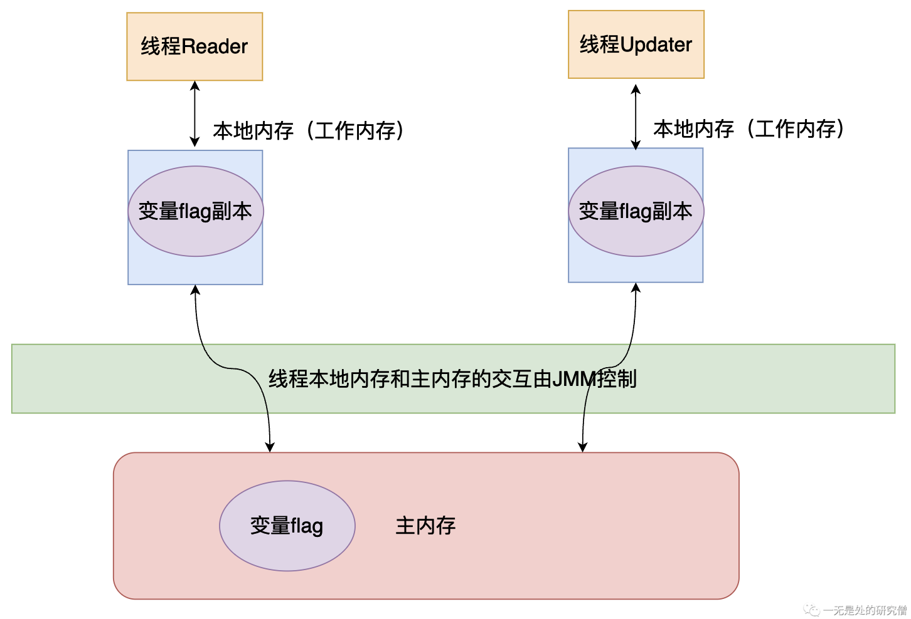

# 从计算机本源深入探寻volatile关键字

## 为什么我们需要volatile？

### 保证数据的可见性

假如现在有两个线程分别执行不同的代码，但是他们有同一个共享变量`flag`，其中线程`updater`会执行的代码是将`flag`从`false`修改成`true`，而另外一个线程`reader`会进行`while`循环，当`flag`为`true`的时候跳出循环，代码如下：

```java
import java.util.concurrent.TimeUnit;

class Resource {
    public boolean flag;

    public void update() {
        flag = true;
    }
}

public class Visibility {

    public static void main(String[] args) throws InterruptedException {
        Resource resource = new Resource();
        Thread thread = new Thread(() -> {
            System.out.println(resource.flag);
            try {
                TimeUnit.SECONDS.sleep(1);
            } catch (InterruptedException e) {
                e.printStackTrace();
            }
            resource.update();
        }, "updater");

        new Thread(() -> {
            System.out.println(resource.flag);
            while (!resource.flag) {

            }
            System.out.println("循环结束");
        }, "reader").start();

        thread.start();
    }
}
```

运行上面的代码你会发现，`reader`线程始终打印不出`循环结束`，也就是说它一只在进行`while`循环，而进行`while`循环的原因就是`resouce.flag=false`，但是线程`updater`在经过1秒之后会进行更新啊！为什么`reader`线程还读取不到呢？

这实际上就是一种可见性的问题，`updater`线程更新数据之后，`reader`线程看不到，在分析这个问题之间我们首先先来了解一下Java内存模型的逻辑布局：



在上面的代码执行顺序大致如下：

- `reader`线程从主内存当中拿到`flag`变量并且存储道线程的本地内存当中，进行`while`循环。
- 在休眠一秒之后，`Updater`线程从主内存当中拷贝一份`flag`保存到本地内存当中，然后将`flag`改成`true`，将其写回到主内存当中。
- 但是虽然`updater`线程将`flag`写回，但是`reader`线程使用的还是之前从主内存当中加载的`flag`，也就是说还是`false`，因此`reader`线程才会一直陷入死循环当中。

现在我们稍微修改一下上面的代码，先让`reader`线程休眠一秒，然后在进行`while`循环，让`updater`线程直接修改。

```java
import java.util.concurrent.TimeUnit;

class Resource {
    public boolean flag;

    public void update() {
        flag = true;
    }
}

public class Visibility {

    public static void main(String[] args) throws InterruptedException {
        Resource resource = new Resource();
        Thread thread = new Thread(() -> {
            System.out.println(resource.flag);
            resource.update();
        }, "updater");

        new Thread(() -> {
            System.out.println(resource.flag);
            try {
                TimeUnit.SECONDS.sleep(1);
            } catch (InterruptedException e) {
                e.printStackTrace();
            }
            while (!resource.flag) {

            }
            System.out.println("循环结束");
        }, "reader").start();

        thread.start();
    }
}
```

上面的代码就不会产生死循环了，我们再来分析一下上面的代码的执行过程：

- `reader`线程先休眠一秒。
- `updater`线程直接修改`flag`为`true`，然后将这个值写回主内存。
- 在`updater`写回之后，`reader`线程从主内存获取`flag`，这个时候的值已经更新了，因此可以跳出`while`循环了，因此上面的代码不会出现死循环的情况。

像这种多个线程共享同一个变量的情况的时候，就会产生数据可见性的问题，如果在我们的程序当中忽略这种问题的话，很容易让我们的并发程序产生BUG。如果在我们的程序当中需要保持多个线程对某一个数据的可见性，即如果一个线程修改了共享变量，那么这个修改的结果要对其他线程可见，也就是其他线程再次访问这个共享变量的时候，得到的是共享变量最新的值，那么在Java当中就需要使用关键字`volatile`对变量进行修饰。

现在我们将第一个程序的共享变量`flag`加上`volatile`进行修饰：

```java
import java.util.concurrent.TimeUnit;

class Resource {
    public volatile boolean flag; // 这里使用 volatile 进行修饰

    public void update() {
        flag = true;
    }
}

public class Visibility {

    public static void main(String[] args) throws InterruptedException {
        Resource resource = new Resource();
        Thread thread = new Thread(() -> {
            try {
                TimeUnit.SECONDS.sleep(1);
            } catch (InterruptedException e) {
                e.printStackTrace();
            }
            System.out.println(resource.flag);
            resource.update();
        }, "updater");

        new Thread(() -> {
            System.out.println(resource.flag);
            while (!resource.flag) {

            }
            System.out.println("循环结束");
        }, "reader").start();

        thread.start();
    }
}
```

上面的代码是可以执行完成的，`reader`线程不会产生死循环。

### 禁止指令重排序

首先我们需要了解一下什么是指令重排序：

>```java
>int a = 0;
>int b = 1;
>int c = 1;
>a++;
>b--;
>```
>
>比如对于上面的代码我们正常的执行流程是：
>
>- 定义一个变量`a`，并且赋值为0。
>- 定义一个变量`b`，并且赋值为1。
>- 定义一个变量`c`，并且赋值为1。
>
>- 变量`a`进行自增操作。
>- 变量`b`进行自减操作。
>
>而当编译器去编译上面的程序时，可能不是安装上面的流程一步步进行操作的，编译器可能在编译优化之后进行如下操作：
>
>- 定义一个变量`c`，并且赋值为1。
>
>- 定义一个变量`a`，并且赋值为1。
>- 定义一个变量`b`，并且赋值为0。
>
>从上面来看代码的最终结果是没有发生变化的，但是指令执行的流程和指令的数目是发生变化的，编译器帮助我们省略了一些操作，这可以让CPU执行更少的指令，加快程序的执行速度。

上面就是一个比较简单的在编译优化当中指令重排和优化的例子。

**但是如果我们在语句`int c = 1`前面加上`volatile`时，上面的代码执行顺序久必须保证`a`和`b`的定义在语句`volatile int c = 1;`之前，变量`a`和变量`b`的操作在语句`volatile int c = 1;`之后。

```java
int a = 0;
int b = 1;
volatile int c = 1;
a++;
b--;
```

