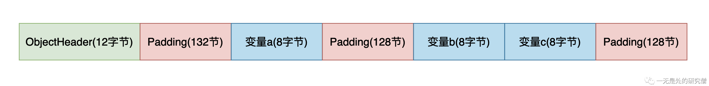

# 并发刺客（False Sharing）——并发程序的隐藏杀手

## 前言

前段时间在各种社交平台“雪糕刺客”这个词比较火，简单的来说就是雪糕的价格非常高！其实在并发程序当中也有一个刺客，如果在写并发程序的时候不注意不小心，这个刺客很可能会拖累我们的并发程序，让我们并发程序执行的效率变低，让并发程序付出很大的代价，这和“雪糕刺客”当中的“刺客”的含义是一致的。这个并发程序当中的刺客就是——假共享（False Sharing）。

## 假共享（False Sharing）

### 缓存行

当CPU从更慢级别的缓存读取数据的时候（三级Cache会从内存当中读取数据，二级缓存会从三级缓存当中读取数据，一级缓存会从二级缓存当中读取数据，缓存级别越低执行速度越快），CPU并不是一个字节一个字节的读取的，而是一次会读取一块数据，然后将这个数据缓存到CPU当中，而这一块数据就叫做**缓存行**。有一种缓存行的大小就是64字节，那么我们为什么会做这种优化呢？这是因为**局部性原理**，所谓局部性原理简单说来就是，当时使用一个数据的时候，它附近的数据在未来的一段时间你也很可能用到，比如说我们遍历数组，我们通常从前往后进行遍历，比如我们数组当中的数据大小是8个字节，如果我们的缓存行是64个字节的话，那么一个缓存行就可以缓存8个数据，那么我们在遍历第一个数据的时候将这8个数据加载进入缓存行，那么我们在遍历未来7个数据的时候都不需要再从内存当中拿数据，直接从缓存当中拿就行，这就可以节约程序执行的时间。

### 假共享

当两个线程在CPU上两个不同的核心上执行代码的时候，如果着两个线程使用了同一个缓存行C，而且对这个缓存行当中两个不同的变量进行写操作，比如线程A对变量a进行写操作，线程B对变量b进行写操作。而由于缓存一致性（Cache coherence）协议的存在，如果其中A线程对缓存行C中变量a进行了写操作的话，为了保证各个CPU核心的数据一致（也就是说两个CPU核心看到了a的值是一样的，因为a的值已经发生变化了，需要让另外的CPU核心知道，不然另外的CPU核心使用的就是旧的值，那么程序结果就不对了），其他核心的这个缓存行就会失效，如果他还想使用这个缓存行的话就需要重新三级Cache加载，如果数据不存在三级Cache当中的话，就会从内存当中加载，而这个重新加载的过程就会很拖累程序的执行效率，而事实上线程A写的是变量a，线程B写的是变量b，他们并没有真正的有共享的数据，只是他们需要的数据在同一个缓存行当中，因此称这种现象叫做**假共享（False Sharing）**。


上面我们谈到了，当缓存行失效的时候会从三级Cache或者内存当中加载，而多个不同的CPU核心是共享三级Cache的（上图当中已经显示出来了），其中一个CPU核心更新了数据，会把数据刷新到三级Cache或者内存当中，因此这个时候其他的CPU核心去加载数据的时候就是新值了。

上面谈到的关于CPU的缓存一致性（Cache coherence）的内容还是比较少的，如果你想深入了解缓存一致性（Cache coherence）和缓存一致性协议可以仔细去看[这篇文章](https://mp.weixin.qq.com/s?__biz=Mzg3ODgyNDgwNg==&mid=2247486127&idx=1&sn=29d6079f6f26bd82633ec611feb3da85&chksm=cf0c96a6f87b1fb006e2f108879a0066aeb14e4bf5a4a9e2a83057a084dd2dfa2c257a813399&token=302443384&lang=zh_CN#rd)。

我们再来举一个更加具体的例子：

假设在内存当中，变量a和变量b都占四个字节，而且他们的内存地址是连续且相邻的，现在有两个线程A和B，线程A要不断的对变量a进行+1操作，线程B需要不断的对变量进行+1操作，现在这个两个数据所在的缓存行已经被缓存到三级缓存了。

- 线程A从三级缓存当中将数据加载到二级缓存和一级缓存然后在CPU- Core0当中执行代码，线程B从三级缓存将数据加载到二级缓存和一级缓存然后在CPU- Core1当中执行代码。
- 线程A不断的执行a += 1，因为线程B缓存的缓存行当中包含数据a，线程A在修改a的值之后，就会在总线上发送消息，让其他处理器当中含有变量a的缓存行失效，在处理器将缓存行失效之后，就会在总线上发送消息，表示缓存行已经失效，线程A所在的CPU- Core0收到消息之后将更新后的数据刷新到三级Cache。
- 这个时候线程B所在的CPU-Core1当中含有a的缓存行已经失效，因为变量b和变量a在同一个缓存行，现在线程B想对变量b进行加一操作，但是在一级和二级缓存当中已经没有了，它需要三级缓存当中加载这个缓存行，如果三级缓存当中没有就需要去内存当中加载。
- 仔细分析上面的过程你就会发现线程B并没有对变量a有什么操作，但是它需要的缓存行就失效了，虽然和线程B共享需要同一个内容的缓存行，但是他们之间冰没有真正共享数据，所以这中现象叫做假共享。

## Java代码复现假共享

### 复现假共享

下面是两个线程不断对两个变量执行++操作的代码：

```java
class Data {
  public volatile long a;
  public volatile long b;
}

public class FalseSharing {
  public static void main(String[] args) throws InterruptedException {
    Data data = new Data();
    long start = System.currentTimeMillis();
    Thread A = new Thread(() -> {
      for (int i = 0;  i < 500_000_000; i++) {
        data.a += 1;
      }
    }, "A");

    Thread B = new Thread(() -> {
      for (int i = 0;  i < 500_000_000; i++) {
        data.b += 1;
      }
    }, "B");
    A.start();
    B.start();
    A.join();
    B.join();
    long end = System.currentTimeMillis();
    System.out.println("花费时间为：" + (end - start));
    System.out.println(data.a);
    System.out.println(data.b);
  }
}

```

上面的代码比较简单，这里就不进行说明了，上面的代码在我的笔记本上的执行时间大约是**17秒**。

上面的代码变量a和变量b在内存当中的位置是相邻的，他们在被CPU加载之后会在同一个缓存行当中，因此会存在假共享的问题，程序的执行时间会变长。

下面的代码是优化过后的代码，在变量a前面和后面分别加入56个字节的数据，在加上a的8个字节（long类型是8个字节），这样a前后加上a的数据有64个字节，而现在主流的缓存行是64个字节，够一个缓存行的大小，因为数据a和数据b就不会在同一个缓存行当中，因此就不会存在**假共享**的问题了。而下面的代码在我笔记本当中执行的时间大约为**5秒**。这就足以看出**假共享**会对程序的执行带来多大影响了。

```java
class Data {
  public volatile long a1, a2, a3, a4, a5, a6, a7;
  public volatile long a;
  public volatile long b1, b2, b3, b4, b5, b6, b7;
  public volatile long b;
}

public class FalseSharing {
  public static void main(String[] args) throws InterruptedException {
    Data data = new Data();
    long start = System.currentTimeMillis();
    Thread A = new Thread(() -> {
      for (int i = 0;  i < 500_000_000; i++) {
        data.a += 1;
      }
    }, "A");

    Thread B = new Thread(() -> {
      for (int i = 0;  i < 500_000_000; i++) {
        data.b += 1;
      }
    }, "B");
    A.start();
    B.start();
    A.join();
    B.join();
    long end = System.currentTimeMillis();
    System.out.println("花费时间为：" + (end - start));
    System.out.println(data.a);
    System.out.println(data.b);
  }
}
```

### JDK解决假共享

为了解决**假共享**的问题，JDK为我们提供了一个注解`@Contened`解决假共享的问题。

```java
import sun.misc.Contended;

class Data {
//  public volatile long a1, a2, a3, a4, a5, a6, a7;
  @Contended
  public volatile long a;
//  public volatile long b1, b2, b3, b4, b5, b6, b7;
  @Contended
  public volatile long b;
}

public class FalseSharing {
  public static void main(String[] args) throws InterruptedException {
    Data data = new Data();

    long start = System.currentTimeMillis();
    Thread A = new Thread(() -> {
      for (long i = 0;  i < 500_000_000; i++) {
        data.a += 1;
      }
    }, "A");

    Thread B = new Thread(() -> {
      for (long i = 0;  i < 500_000_000; i++) {
        data.b += 1;
      }
    }, "B");
    A.start();
    B.start();
    A.join();
    B.join();
    long end = System.currentTimeMillis();
    System.out.println("花费时间为：" + (end - start));
    System.out.println(data.a);
    System.out.println(data.b);
  }
}

```

上面代码的执行时间也是5秒左右，和之前我们自己在变量的左右两边假如变量的效果是一样的，但是JDK提供的这个接口和我们自己实现的还是有所区别的。（**注意：**上面的代码是在JDK1.8下执行的，如果要想`@Contended`注解生效，你还需要在JVM参数上加入`-XX:-RestrictContended`，这样上面的代码才能生效否则是不能够生效的）

- 在我们自己解决假共享的代码当中，是在变量`a`的左右两边加入56个字节的其他变量，让他和变量`b`不在同一个缓存行当中。
- 在JDK给我们提供的注解`@Contended`，是在被加注解的字段的右边加入一定数量的空字节，默认加入128空字节，那么变量`a`和变量`b`之间的内存地址大一点，最终不在同一个缓存行当中。这个字节数量可以使用JVM参数`-XX:ContendedPaddingWidth=64`，进行控制，比如这个是64个字节。

- 除此之外`@Contended`注解还能够将变量进行分组：

```java
class Data {
  @Contended("a")
  public volatile long a;
  
  @Contended("bc")
  public volatile long b;
  @Contended("bc")
  public volatile long c;
}
```

在解析注解的时候会让同一组的变量在内存当中的位置相邻，不同的组之间会有一定数量的空字节，配置方式还是跟上面一样，默认每组之间空字节的数量为128。

比如上面的变量在内存当中的逻辑布局详细布局如下：



```
 OFFSET  SIZE   TYPE DESCRIPTION                               VALUE
      0     4        (object header)                           01 00 00 00 (00000001 00000000 00000000 00000000) (1)
      4     4        (object header)                           00 00 00 00 (00000000 00000000 00000000 00000000) (0)
      8     4        (object header)                           20 0a 06 00 (00100000 00001010 00000110 00000000) (395808)
     12   132        (alignment/padding gap)                  
    144     8   long Data.a                                    0
    152   128        (alignment/padding gap)                  
    280     8   long Data.b                                    0
    288     8   long Data.c                                    0
    296   128        (loss due to the next object alignment)
Instance size: 424 bytes
Space losses: 260 bytes internal + 128 bytes external = 388 bytes total
```

上面的内容是通过下面代码打印的，你只要在pom文件当中引入包`jol`即可：

```java
import org.openjdk.jol.info.ClassLayout;
import sun.misc.Contended;


class Data {
  @Contended("a")
  public volatile long a;
  
  @Contended("bc")
  public volatile long b;
  @Contended("bc")
  public volatile long c;
}

public class FalseSharing {
  public static void main(String[] args) throws InterruptedException {
    Data data = new Data();

    System.out.println(ClassLayout.parseInstance(data).toPrintable());
  }
}

```


