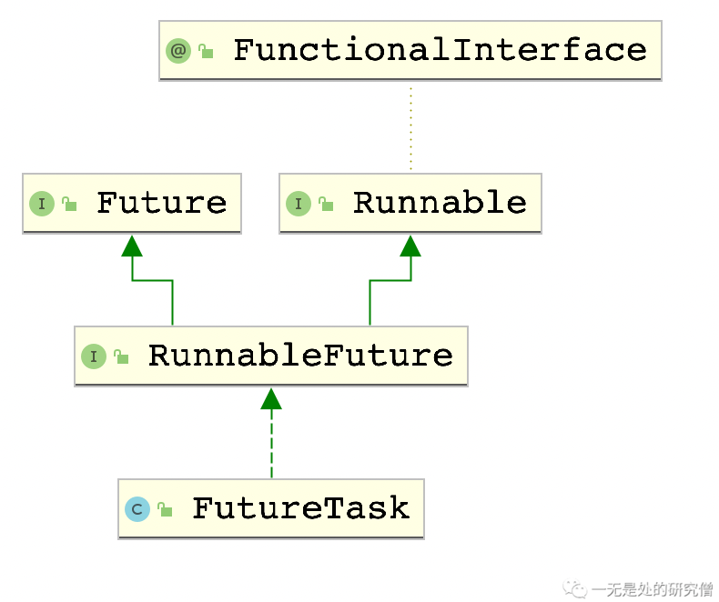

# 手写FutureTask以及FutureTask源码剖析

## 前言

在并发编程当中我们最常见的需求就是启动一个线程执行一个函数去完成我们的需求，而在这种需求当中，我们常常需要函数有返回值。比如我们需要同一个非常大的数组当中数据的和，让每一个线程求某一个区间内部的和，最终将这些和加起来，那么每个线程都需要返回对应区间的和。而在Java当中给我们提供了这种机制，去实现这一个效果——`FutureTask`。

## FutureTask

在自己写`FutureTask`之前我们首先写一个例子来回顾一下`FutureTask`的编程步骤：

- 写一个类实现`Callable`接口。

```java
@FunctionalInterface
public interface Callable<V> {
    /**
     * Computes a result, or throws an exception if unable to do so.
     *
     * @return computed result
     * @throws Exception if unable to compute a result
     */
    V call() throws Exception;
}
```

实现接口就实现`call`即可，可以看到这个函数是有返回值的，而`FutureTask`返回给我们的值就是这个函数的返回值。

- `new`一个`FutureTask`对象，并且`new`一个第一步写的类，`new FutureTask<>(callable实现类)`。
- 最后将刚刚得到的`FutureTask`对象传入`Thread`类当中，然后启动线程即可`new Thread(futureTask).start();`。
- 然后我们可以调用`FutureTask`的`get`方法得到返回的结果`futureTask.get();`。

>假如有一个数组`data`，长度为100000，现在有10个线程，第`i`个线程求数组`[i * 10000, (i + 1) * 10000)`所有数据的和，然后将这十个线程的结果加起来。

```java
import java.lang.reflect.Array;
import java.util.Arrays;
import java.util.Random;
import java.util.concurrent.Callable;
import java.util.concurrent.ExecutionException;
import java.util.concurrent.FutureTask;

public class FutureTaskDemo {

  public static void main(String[] args) throws ExecutionException, InterruptedException {
    int[] data = new int[100000];
    Random random = new Random();
    for (int i = 0; i < 100000; i++) {
      data[i] = random.nextInt(10000);
    }
    @SuppressWarnings("unchecked")
    FutureTask<Integer>[] tasks = (FutureTask<Integer>[]) Array.newInstance(FutureTask.class, 10);
    // 设置10个 futuretask 任务计算数组当中数据的和
    for (int i = 0; i < 10; i++) {
      int idx = i;
      tasks[i] = new FutureTask<>(() -> {
        int sum = 0;
        for (int k = idx * 10000; k < (idx + 1) * 10000; k++) {
          sum += data[k];
        }
        return sum;
      });
    }
    // 开启线程执行 futureTask 任务
    for (FutureTask<Integer> futureTask : tasks) {
      new Thread(futureTask).start();
    }
    int threadSum = 0;
    for (FutureTask<Integer> futureTask : tasks) {
      threadSum += futureTask.get();
    }
    int sum = Arrays.stream(data).sum();
    System.out.println(sum == threadSum); // 结果始终为 true
  }
}

```

可能你会对`FutureTask`的使用方式感觉困惑，或者不是很清楚，现在我们来仔细捋一下思路。

1. 首先启动一个类要么是继承自`Thread`类，然后重写`Thread`类的`run`方法，要么是给`Thread`类传递一个实现了`Runnable`的类对象，当然可以用匿名内部类实现。
2. 既然我们的`FutureTask`对象可以传递给`Thread`类，说明`FutureTask`肯定是实现了`Runnable`接口，我们现在来看一下`FutureTask`的继承体系。



​	可以发现的是`FutureTask`确实实现了`Runnable`接口，同时还实现了`Future`接口，这个`Future`接口主要提供了后面我们使用`FutureTask`的一系列函数比如`get`。

3. 看到这里你应该能够大致想到在`FutureTask`中的`run`方法回调用`Callable`当中实现的`call`方法，然后将结果保存下来，当调用`get`方法的时候再将这个结果返回。

## 自己实现FutureTask

经过上文的分析你可能已经大致了解了`FutureTask`的大致执行过程了，但是需要注意的是，如果你执行`FutureTask`的`get`方法是可能阻塞的，因为可能`Callable`的`call`方法还没有执行完成。因此在`get`方法当中就需要有阻塞线程的代码，但是当`call`方法执行完成之后需要将这些线程都唤醒。