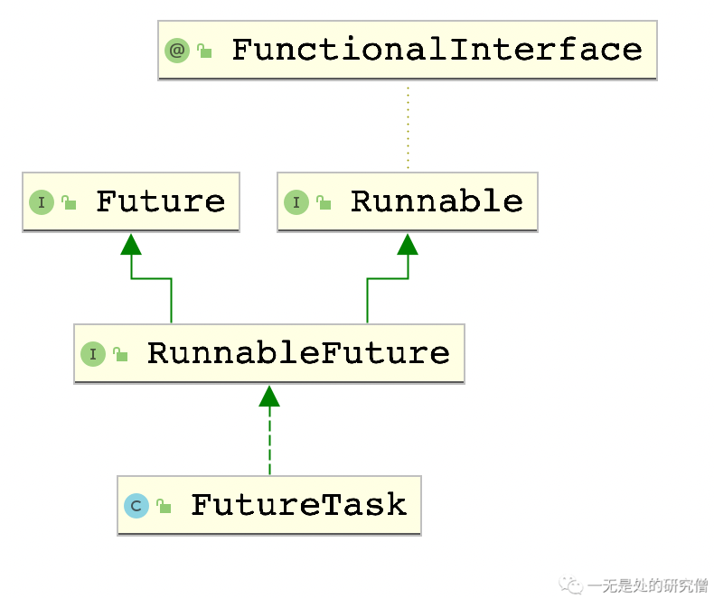

# FutureTask源码深度剖析

## 前言

在前面的文章[自己动手写FutureTask](https://mp.weixin.qq.com/s?__biz=Mzg3ODgyNDgwNg==&mid=2247486245&idx=1&sn=b75ded67ef8ca328f23ca2acc35dc7a8&chksm=cf0c972cf87b1e3a4cb93e707c4574cfeabab13809f72878f946b6b73439f384f2752d98a183&token=302443384&lang=zh_CN#rd)当中我们已经仔细分析了FutureTask给我们提供的功能，并且深入分析了我们该如何实现它的功能，并且给出了使用`ReentrantLock`和条件变量实现FutureTask的具体代码。而在本篇文章当中我们将仔细介绍JDK内部是如何实现FutureTask的。(如果对`FutureTask`的内部大致过程还不是很了解的话，可以先阅读[自己动手写FutureTask](https://mp.weixin.qq.com/s?__biz=Mzg3ODgyNDgwNg==&mid=2247486245&idx=1&sn=b75ded67ef8ca328f23ca2acc35dc7a8&chksm=cf0c972cf87b1e3a4cb93e707c4574cfeabab13809f72878f946b6b73439f384f2752d98a183&token=302443384&lang=zh_CN#rd))。

## 工具准备

在JDK的`FutureTask`当中会使用到一个工具`LockSupport`，在正式介绍`FutureTask`之前我们先熟悉一下这个工具。

`LockSupport`主要是用于阻塞和唤醒线程的，它主要是通过包装`UnSafe`类，通过`UnSafe`类当中的方法进行实现的，他底层的方法是通过依赖JVM实现的。在`LockSupport`当中主要有以下三个方法：

- `unpark(Thread thread))`方法，这个方法可以给线程`thread`发放一个**许可证**，你可以通过多次调用这个方法给线程发放**许可证**，每次调用都会给线程发放一个**许可证**，但是这个**许可证**不能够进行累计，也就是说一个线程能够拥有的最大的许可证的个数是1一个。
- `park()`方法，这个线程会消费调用这个方法的线程一个许可证，因为线程的默认许可证的个数是0，如果调用一次那么许可证的数目就变成-1，当许可证的数目小于0的时候线程就会阻塞，因此如果线程从来没用调用`unpark`方法的话，那么在调用这个方法的时候会阻塞，如果线程在调用`park`方法之前，有线程调用`unpark(thread)`方法，给这个线程发放一个许可证的话，那么调用`park`方法就不会阻塞。

- `parkNanos(long nanos)`方法，同park方法一样，nanos表示最长阻塞超时时间，超时后park方法将自动返回，如果调用这个方法的线程有许可证的话也不会阻塞。

```java
import java.util.concurrent.TimeUnit;
import java.util.concurrent.locks.LockSupport;

public class Demo {

  public static void main(String[] args) throws InterruptedException {
    Thread thread = new Thread(() -> {
      LockSupport.park(); // 没有许可证 阻塞住这个线程
      try {
        TimeUnit.SECONDS.sleep(1);
      } catch (InterruptedException e) {
        e.printStackTrace();
      }
      System.out.println("阻塞完成");
    });
    thread.start();
    TimeUnit.SECONDS.sleep(2);
    LockSupport.unpark(thread); //给线程 thread 发放一个许可证
    System.out.println("线程启动");

  }
}

```

上面代码的执行结果

```java
线程启动
阻塞完成
```

从上面代码我们可以知道`LockSupport.park()`可以阻塞一个线程，因为如果没有阻塞的话肯定会先打印`阻塞完成`，因为打印这句话的线程只休眠一秒，主线程休眠两秒。

在源代码当中你可以会遇到`UNSAFE.compareAndSwapXXX`的代码，这行代码主要是进行原子交换操作**CAS**，比如：
```java
UNSAFE.compareAndSwapInt(this, stateOffset, NEW, CANCELLED)))
```

上面的代码主要是将`this`对象当中的内存偏移地址为`stateOffset`的对象拿出来与`NEW`进行比较，如果等于`NEW`那就将这个值设置为`CANCELLED`，这整个操作是原子的（因为可能多个线程同时调用这个函数，因此需要保证操作是原子的），如果操作成功返回`true`反之返回`false`。如果你目前不是很理解也没关系，只需要知道它是将对象`this`的内存偏移为`stateOffset`的值替换为`CANCELLED`就行，如果这个操作成功返回`true`，不成功返回`false`。

## 深入FutureTask内部

### FutureTask回顾

我们首先来回顾一下`FutureTask`的编程步骤：

- 写一个类实现`Callable`接口。

```java
@FunctionalInterface
public interface Callable<V> {
    /**
     * Computes a result, or throws an exception if unable to do so.
     *
     * @return computed result
     * @throws Exception if unable to compute a result
     */
    V call() throws Exception;
}
```

实现接口就实现`call`即可，可以看到这个函数是有返回值的，而`FutureTask`返回给我们的值就是这个函数的返回值。

- `new`一个`FutureTask`对象，并且`new`一个第一步写的类，`new FutureTask<>(callable实现类)`。
- 最后将刚刚得到的`FutureTask`对象传入`Thread`类当中，然后启动线程即可`new Thread(futureTask).start();`。
- 然后我们可以调用`FutureTask`的`get`方法得到返回的结果`futureTask.get();`。

可能你会对`FutureTask`的使用方式感觉困惑，或者不是很清楚，现在我们来仔细捋一下思路。

1. 首先启动一个线程要么是继承自`Thread`类，然后重写`Thread`类的`run`方法，要么是给`Thread`类传递一个实现了`Runnable`的类对象，当然可以用匿名内部类实现。
2. 既然我们的`FutureTask`对象可以传递给`Thread`类，说明`FutureTask`肯定是实现了`Runnable`接口，事实上也确实如此：



​	可以发现的是`FutureTask`确实实现了`Runnable`接口，同时还实现了`Future`接口，这个`Future`接口主要提供了后面我们使用`FutureTask`的一系列函数比如`get`。

3. 看到这里你应该能够大致想到在`FutureTask`中的`run`方法会调用`Callable`当中实现的`call`方法，然后将结果保存下来，当调用`get`方法的时候再将这个结果返回。

### 状态表示

首先我们先了解一下FutureTask的几种状态：

- NEW，刚刚新建一个FutureTask对象。
- COMPLETING，FutureTask正在执行。
- NORMAL，FutureTask正常结束。
- EXCEPTIONAL，如果FutureTask对象在执行`Callable`实现类对象的`call`方法的时候出现的异常，那么FutureTask的状态就变成这个状态了。
- CANCELLED，表示FutureTask的执行过程被取消了。
- INTERRUPTING，表示正在终止FutureTask对象的执行过程。
- INTERRUPTED，表示FutureTask对象在执行的过程当中被中断了。

这些状态之间的可能的转移情况如下所示：

- NEW -> COMPLETING -> NORMAL。
- NEW -> COMPLETING -> EXCEPTIONAL。
- NEW -> CANCELLED。
- NEW -> INTERRUPTING -> INTERRUPTED。

在`FutureTask`当中用数字去表示这几个状态：

```java
private volatile int state;
private static final int NEW          = 0;
private static final int COMPLETING   = 1;
private static final int NORMAL       = 2;
private static final int EXCEPTIONAL  = 3;
private static final int CANCELLED    = 4;
private static final int INTERRUPTING = 5;
private static final int INTERRUPTED  = 6;
```

### 核心函数和字段

- `FutureTask`类当中的核心字段

  ```java
  private Callable<V> callable; // 用于保存传入 FutureTask 对象的 Callable 对象
  ```

  ```java
  private Object outcome; // 用于保存 Callable 当中 call 函数的返回结果
  ```

  ```java
  private volatile Thread runner; // 表示正在执行 call 函数的线程
  ```

  ```java
  private volatile WaitNode waiters;// 被 get 函数挂起的线程 是一个单向链表 waiters 表示单向链表的头节点
  static final class WaitNode {
    volatile Thread thread; // 表示被挂起来的线程
    volatile WaitNode next; // 表示下一个节点
    WaitNode() { thread = Thread.currentThread(); }
  }
  ```

- 构造函数：

```java
public FutureTask(Callable<V> callable) {
  if (callable == null)
    throw new NullPointerException();
  this.callable = callable; //保存传入来的 Callable 接口的实现类对象
  this.state = NEW;       // 这个就是用来保存 FutureTask 的状态 初识时 是新建状态
}
```

- `run`方法，这个函数是实现`Runnable`接口的方法，也就是传入`Thread`类之后，`Thread`启动时执行的方法。

```java
public void run() {
  // 如果 futuretask 的状态 state 不是 NEW
  // 或者不能够设置 runner 为当前的线程的话直接返回
  // 不在执行下面的代码 因为 state 已经不是NEW 
  // 说明取消了 futuretask 的执行
  if (state != NEW ||
      !UNSAFE.compareAndSwapObject(this, runnerOffset,
                                   null, Thread.currentThread()))
    return;
  try {
    Callable<V> c = callable;
    if (c != null && state == NEW) {
      V result;
      boolean ran; // 这个值主要用于表示 call 函数是否正常执行完成 如果正常执行完成就为 true
      try {
        result = c.call(); // 执行 call 函数得到我们需要的返回值并且柏村在
        ran = true;
      } catch (Throwable ex) {
        result = null;
        ran = false;
        setException(ex); // call 函数异常执行 设置 state 为异常状态 并且唤醒由 get 函数阻塞的线程
      }
      if (ran)
        set(result); // call 函数正常执行完成 将得到的结果 result 保存到 outcome 当中 并且唤醒被 get 函数阻塞的线程
    }
  } finally {
    // runner must be non-null until state is settled to
    // prevent concurrent calls to run()
    runner = null;
    // state must be re-read after nulling runner to prevent
    // leaked interrupts
    int s = state;
    // 如果这个if语句条件满足的话就表示执行过程被中断了
    if (s >= INTERRUPTING)
      // 这个主要是后续处理中断的过程不是很重要
      handlePossibleCancellationInterrupt(s);
  }
}

```

- `set`方法，主要是用于设置`state`的状态，并且唤醒由`get`函数阻塞的线程。

```java
protected void set(V v) { // call 方法正常执行完成执行下面的方法 v 是 call 方法返回的结果
  // 这个是原子交换 state 从 NEW 状态变成 COMPLETING 状态
  if (UNSAFE.compareAndSwapInt(this, stateOffset, NEW, COMPLETING)) {
    outcome = v; // 将 call 函数的返回结果保存到 outcome 当中 然后会在 get 函数当中使用 outcome 
   							 // 因为 get 函数需要得到 call 函数的结果 因此我们需要在 call 函数当中返回 outcome
    // 下面代码是将 state 的状态变成 NORMAL 表示程序执行完成
    UNSAFE.putOrderedInt(this, stateOffset, NORMAL); // final state
    // 因为其他线程可能在调用 get 函数的时候 call 函数还没有执行完成 因此这些线程会被阻塞 下面的这个方法主要是将这些线程唤醒
    finishCompletion();
  }
}

protected void setException(Throwable t) {
  if (UNSAFE.compareAndSwapInt(this, stateOffset, NEW, COMPLETING)) {
    outcome = t; // 将异常作为结果返回
    // 将最后的状态设置为 EXCEPTIONAL
    UNSAFE.putOrderedInt(this, stateOffset, EXCEPTIONAL); // final state
    finishCompletion();
  }
}
```

- `get`方法，这个方法主要是从`FutureTask`当中取出数据，但是这个时候可能`call`函数还没有执行完成，因此这个方法可能会阻塞调用这个方法的线程。

```java
public V get() throws InterruptedException, ExecutionException {
  int s = state;
  // 如果当前的线程还没有执行完成就需要将当前线程挂起
  if (s <= COMPLETING)
    // 调用 awaitDone 函数将当前的线程挂起
    s = awaitDone(false, 0L);
  // 如果 state 大于 COMPLETING 也就说是完成状态 可以直接调用这个函数返回 
  // 当然也可以是从 awaitDone 函数当中恢复执行才返回
  return report(s);// report 方法的主要作用是将结果 call 函数的返回结果 返回出去 也就是将 outcome 返回
  
}

private V report(int s) throws ExecutionException {
  Object x = outcome;
  if (s == NORMAL) // 如果程序正常执行完成则直接返回结果
    return (V)x;
  if (s >= CANCELLED) // 如果 s 大于 CANCELLED 说明程序要么是被取消要么是被中断了 抛出异常
    throw new CancellationException();
  // 如果上面两种转台都不是那么说明在执行 call 函数的时候程序发生异常
  // 还记得我们在 setException 函数当中将异常赋值给了 outcome 吗？
  // 在这里将那个异常抛出了
  throw new ExecutionException((Throwable)x);
}

```

- `awaitDone`方法，这个方法主要是将当前线程挂起。

```java
private int awaitDone(boolean timed, long nanos) // timed 表示是否超时阻塞  nanos 表示如果是超时阻塞的话 超时时间是多少
  throws InterruptedException {
  final long deadline = timed ? System.nanoTime() + nanos : 0L;
  WaitNode q = null;
  boolean queued = false;
  for (;;) { // 注意这是个死循环
    
    // 如果线程被中断了 那么需要从 “等待队列” 当中移出去
    if (Thread.interrupted()) {
      removeWaiter(q);
      throw new InterruptedException();
    }

    int s = state;
    // 如果 call 函数执行完成 注意执行完成可能是正常执行完成 也可能是异常 取消 中断的任何一个状态
    if (s > COMPLETING) {
      if (q != null)
        q.thread = null;
      return s;
    }
    // 如果是正在执行的话 说明马上就执行完成了 只差将 call 函数的执行结果赋值给 outcome 了
    // 因此可以不进行阻塞先让出 CPU 让其它线程执行 可能下次调度到这个线程 state 的状态很可能就
    // 变成 完成了
    else if (s == COMPLETING) // cannot time out yet
      Thread.yield();
    else if (q == null)
      q = new WaitNode();
    else if (!queued) // 如果节点 q 还没有入队
      // 下面这行代码稍微有点复杂 其中 waiter 表示等待队列的头节点
      // 这行代码的作用是将 q 节点的 next 指向 waiters 然后将 q 节点
      // 赋值给 waiters 也就是说 q 节点变成等待队列的头节点 整个过程可以用
      // 下面代码标识
      // q.next = waiters;
      // waiters = q;
      // 但是将 q 节点赋值给 waiter这个操作是原子的 可能成功也可能不成功
      // 如果不成功 因为 for 循环是死循环下次喊 还会进行 if 判断
      // 如果 call 函数已经执行完成得到其返回结果那么就可以直接返回
      // 如果还没有结束 那么就会调用下方的两个 if 分支将线程挂起
      queued = UNSAFE.compareAndSwapObject(this, waitersOffset,
                                           q.next = waiters, q);
    else if (timed) {
      // 如果是使用超时挂起 deadline 表示如果时间超过这个值的话就可以将线程启动了
      nanos = deadline - System.nanoTime();
      if (nanos <= 0L) {
        // 如果线程等待时间到了就需要从等待队列当中将当前线程对应的节点移除队列
        removeWaiter(q);
        return state;
      }
      LockSupport.parkNanos(this, nanos);
    }
    else
      // 如果不是超时阻塞的话 直接将这个线程挂起即可
      // 这个函数前面已经提到了就是将当前线程唤醒
      // 就是将调用 park 方法的线程唤醒
      LockSupport.park(this);
  }
}

```

- `finishCompletion`方法，这个方法是用于将所有被`get`函数阻塞的线程唤醒。

```java
private void finishCompletion() {
  // assert state > COMPLETING;
  for (WaitNode q; (q = waiters) != null;) {
    // 如果可以将 waiter 设置为 null 则进入 for 循环 在 for 循环内部将所有线程唤醒
    // 这个操作也是原子操作
    if (UNSAFE.compareAndSwapObject(this, waitersOffset, q, null)) {
      for (;;) {
        Thread t = q.thread;
        // 如果线程不等于空 则需要将这个线程唤醒
        if (t != null) {
          q.thread = null;
          // 这个函数已经提到了 就是将线程 t 唤醒
          LockSupport.unpark(t);
        }
        // 得到下一个节点
        WaitNode next = q.next;
        // 如果节点为空 说明所有的线程都已经被唤醒了 可以返回了
        if (next == null)
          break;
        q.next = null; // unlink to help gc
        q = next; // 唤醒下一个节点
      }
      break;
    }
  }

  done();// 这个函数是空函数没有实现

  callable = null;        // to reduce footprint
}

```

- `cancel`方法，这个方法主要是取消`FutureTask`的执行过程。

```java
public boolean cancel(boolean mayInterruptIfRunning) {
  // 参数 mayInterruptIfRunning 表示可能在线程执行的时候中断
  
  // 只有 state == NEW 并且能够将 state 的状态从 NEW 变成 中断或者取消才能够执行下面的 try 代码块
  // 否则直接返回 false
  if (!(state == NEW &&
        UNSAFE.compareAndSwapInt(this, stateOffset, NEW,
                                 mayInterruptIfRunning ? INTERRUPTING : CANCELLED)))
    return false;
  try {    // in case call to interrupt throws exception
    // 如果在线程执行的时候中断代码就执行下面的逻辑
    if (mayInterruptIfRunning) {
      try {
        Thread t = runner; // 得到正在执行 call 函数的线程
        if (t != null)
          t.interrupt();
      } finally { // final state
        // 将 state 设置为 INTERRUPTED 状态
        UNSAFE.putOrderedInt(this, stateOffset, INTERRUPTED);
      }
    }
  } finally {
    // 唤醒被 get 函数阻塞的线程
    finishCompletion();
  }
  return true;
}

```

上面谈到了`FutureTask`当中最核心的一些函数，这些过程还是非常复杂的，必须理好思路仔细分析才能够真正理解。除了上面的这些函数之外，在`FutureTask`当中还有一些其他的函数没有谈到，因为这些函数不会影响我们的理解，如果大家感兴趣可以自行去看`FutureTask`源代码！

## 总结

在本篇文章当中主要讨论了以下问题：

- `LockSupport`的`park`和`unpark`方法，主要用于阻塞和唤醒线程，更加确切的说是给线程发放凭证，当凭证的数据小于0的时候线程就会阻塞。
- `UNSAFE.compareAndSwapXXX`方法，这个方法主要是进行原子交换（CAS过程），判断对象的某个内存偏移地址的值是否与指定的值相等，如果相等则进行交换，如果以上操作成功执行则返回`true`否则返回`false`，同时这个操作是具有原子性的。
- 在`get`方法当中，如果`state`的状态小于或者等于`COMPLETING`，则需要调用函数`awaitDone`将线程挂起，否则直接返回结果即可。
- `run`方法是整个`FutureTask`最核心的方法，在这个方法当中会调用传入`FutureTask`对象的`Callable`对象当中的`call`方法，然后将其的返回值保存到`outcome`当中，最后会将所有被`get`函数阻塞的线程都唤醒。
- `finishCompletion`方法，是将等待队列当中所有的被阻塞的线程全部唤醒。

如果大家是第一次接触这些问题的话，理解起来的难度还是非常大的。如果大家对一些基本的工具还不够熟悉可以先去慢慢熟悉这些基本工具，在熟悉完基本工具之后就不会在细节问题上卡住了。大家也可以先了解整体的过程，然后再去分析细节，这样大家对大局观的把握有了，去分析细节问题也可以得心应手。

---

更多精彩内容合集可访问项目：<https://github.com/Chang-LeHung/CSCore>

关注公众号：**一无是处的研究僧**，了解更多计算机（Java、Python、计算机系统基础、算法与数据结构）知识。


