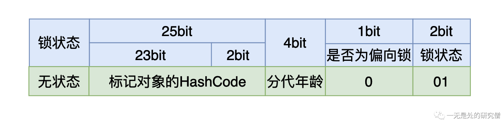
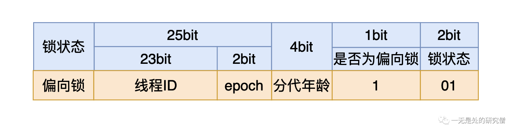
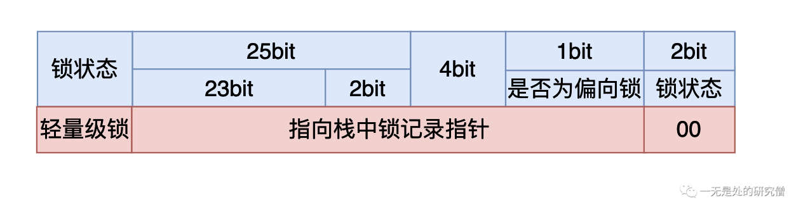
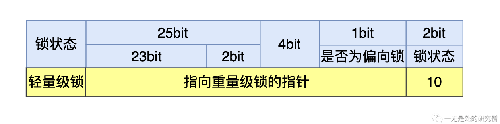

# Synchronized锁升级原理深入剖析

## 前言

在上篇文章[深入学习Synchronized各种使用方法](https://mp.weixin.qq.com/s?__biz=Mzg3ODgyNDgwNg==&mid=2247486361&idx=1&sn=dce819edcce0d509d7fec212abc2bd03&chksm=cf0c9790f87b1e86fcef49c58cbad141a43e803f01fec8a2170c82fae25a284601c5f9f27929&token=1166204888&lang=zh_CN#rd)当中我们仔细介绍了在各种情况下该如何使用synchronized关键字。因为在我们写的程序当中可能会经常使用到synchronized关键字，因此JVM对synchronized做出了很多优化，而在本篇文章当中我们将仔细介绍JVM对synchronized的各种优化的细节。

## 工具准备

在正式谈synchronized的原理之前我们先谈一下**自旋锁**，因为在synchronized的优化当中**自旋锁**发挥了很大的作用。而需要了解**自旋锁**，我们首先需要了解什么是**原子性**。

所谓**原子性**简答说来就是一个一个操作要么不做要么全做，全做的意思就是在操作的过程当中不能够被中断，比如说对变量`data`进行加一操作，有以下三个步骤：

- 将`data`从内存加载到寄存器。
- 将`data`这个值加一。
- 将得到的结果写回内存。

原子性就表示一个线程在进行加一操作的时候，不能够被其他线程中断，只有这个线程执行完这三个过程的时候其他线程才能够操作数据`data`。

我们现在用代码体验一下，在Java当中我们可以使用`AtomicInteger`进行对整型数据的原子操作：

```java
import java.util.concurrent.atomic.AtomicInteger;

public class AtomicDemo {

  public static void main(String[] args) throws InterruptedException {
    AtomicInteger data = new AtomicInteger();
    data.set(0); // 将数据初始化位0
    Thread t1 = new Thread(() -> {
      for (int i = 0; i < 100000; i++) {
        data.addAndGet(1); // 对数据 data 进行原子加1操作
      }
    });
    Thread t2 = new Thread(() -> {
      for (int i = 0; i < 100000; i++) {
        data.addAndGet(1);// 对数据 data 进行原子加1操作
      }
    });
    // 启动两个线程
    t1.start();
    t2.start();
    // 等待两个线程执行完成
    t1.join();
    t2.join();
    // 打印最终的结果
    System.out.println(data); // 200000
  }
}

```

从上面的代码分析可以知道，如果是一般的整型变量如果两个线程同时进行操作的时候，最终的结果是会小于200000。

我们现在来模拟一下出现问题的过程：

- 主内存`data`的初始值等于0，两个线程得到的`data`初始值都等于0。


- 现在线程一将`data`加一，然后线程一将`data`的值同步回主内存，整个内存的数据变化如下：


- 现在线程二`data`加一，然后将`data`的值同步回主内存（将原来主内存的值覆盖掉了）：


我们本来希望`data`的值在经过上面的变化之后变成`2`，但是线程二覆盖了我们的值，因此在多线程情况下，会使得我们最终的结果变小。

但是在上面的程序当中我们最终的输出结果是等于20000的，这是因为给`data`进行`+1`的操作是原子的不可分的，在操作的过程当中其他线程是不能对`data`进行操作的。这就是**原子性**带来的优势。

事实上上面的`+1`原子操作就是通过**自旋锁**实现的，我们可以看一下`AtomicInteger`的源代码：

```java
public final int addAndGet(int delta) {
  // 在 AtomicInteger 内部有一个数据 value 用于存储具体的数值的
  // 这个 valueOffset 表示这个数据 value 在对象 this （也就是 AtomicInteger一个具体的对象）
  // 当中的内存偏移地址
  // delta 就是我们需要往 value 上加的值 在这里我们加上的是 1
  return unsafe.getAndAddInt(this, valueOffset, delta) + delta;
}
```

上面的代码最终时调用`UnSafe`类的方法进行实现的，我们再看一下他的源代码：

```java
public final int getAndAddInt(Object o, long offset, int delta) {
  int v;
  do {
    v = getIntVolatile(o, offset); // 从对象 o 偏移地址为 offset 的位置取出数据 value 也就是前面提到的存书具体数据的变量
  } while (!compareAndSwapInt(o, offset, v, v + delta));
  return v;
}
```

上面的代码主要流程是不断的从内存当中取对象内偏移地址为`offset`的数据，然后执行语句`!compareAndSwapInt(o, offset, v, v + delta)`

这条语句的主要作用是：比较对象`o`内存偏移地址为`offset`的数据是否等于`v`，如果等于`v`则将偏移地址为`offset`的数据设置为`v + delta`，如果这条语句执行成功返回 `true`否则返回`false`，这就是我们常说的Java当中的**CAS**。

看到这里你应该就发现了当上面的那条语句执行不成的话就会一直进行while循环操作，直到操作成功之后才退出while循环，假如没有操作成功就会一直“旋”在这里，像这种操作就是**自旋**，通过这种**自旋**方式所构成的锁🔒就叫做**自旋锁**。

## 对象的内存布局

在JVM当中，一个Java对象的内存主要有三块：

- 对象头，对象头包含两部分数据，分别是**Mark word**和类型指针（**Kclass pointer**）。
- 实例数据，就是我们在累当中定义的各种数据。
- 对齐填充，JVM在实现的时候要求每一个对象所占有的内存大小都需要是8字节的整数倍，如果一个对象的数据所占有的内存大小不够8字节的整数倍，那就需要进行填充，补齐到8字节，比如说如果一个对象站60字节，那么最终会填充到64字节。

而与我们要谈到的synchronized锁升级原理密切相关的是**Mark word**，这个字段主要是存储对象运行时的数据，比如说对象的Hashcode、GC的分代年龄、持有线程的锁、偏向锁的线程等等。

在32位Java虚拟机当中Mark word有4个字节一共32个比特位，其内容如下：



我们在使用synchronized时，如果我们是将synchronized用在同步代码块，我们需要一个锁对象。对于这个锁对象来说一开始还没有线程执行到同步代码块时，这个4个字节的内容如上图所示，其中有25个比特用来存储哈希值，4个比特用来存储垃圾回收的分代年龄（如果不了解可以跳过），剩下三个比特其中一个用俩来表示当前的锁状态是否为偏向锁，最后的两个比特表示当前的锁是哪一种状态：

- 如果最后三个比特是：001，则说明锁状态是没有锁。
- 如果最后三个比特是：001，则说明锁状态是偏向锁。
- 如果最后两个比特是：00，  则说明锁状态是轻量级锁。
- 如果最后两个比特是：10，  则说明锁状态是重量级锁。

而synchronized锁升级的顺序是：无🔒->偏向🔒->轻量级🔒->重量级🔒。

## 锁升级过程

### 偏向锁

假如你写的synchronized代码块没有多个线程执行，而只有一个线程执行的时候这中锁对性能的提高还是非常大的。他的具体做法是JVM会将对象头当中的第三个用于表示是否为偏向锁的比特位设置为1，同时会使用CAS操作将线程的ID记录到Mark Word当中，如果操作成功就相当于获得🔒了，那么下次这个线程想进入临界区就只需要比较一下线程ID是否相同了，而不需要进行CAS或者加锁这样花费比较大的操作了，只需要进行一个简单的比较即可。



可能你会有一个疑问在无锁的状态下Mark Word存储的是哈希值，而在偏向锁的状态下存储的是线程的ID，那么之前存储的Hash Code不就没有了嘛！你可能会想没有就没有吧，再算一遍不就行了！事实上不是这样，如果我们计算过哈希值之后我们需要尽量保持哈希值不变（但是这个在Java当中并没有强制，因为在Java当中可以重写hashCode方法），因此在Java当中为了能够保持哈希值的不变性就会在第一次计算一致性哈希值**（Mark Word里面存储的是一致性哈希值，并不是指重写的hashCode返回值，在Java当中可以通过 Object.hashCode()或者System.identityHashCode(Object)方法计算一致性哈希值）**的时候就将计算出来的一致性哈希值存储到Mark Word当中，下一次再有一致性哈希值的请求的时候就将存储下来的一致性哈希值返回，这样就可以保证每次计算的一致性哈希值相同。但是在变成偏向锁的时候回使用线程ID覆盖哈希值，**因此当一个对象计算过一致性哈希值之后，他就再也不能进行偏向锁状态，而且当一个对象正处于偏向锁状态的时候，收到了一致性哈希值的请求的时候，偏向锁就回立马膨胀为重量级锁，然后将Mark Word 储在重量级锁里。**

#### 轻量级锁



