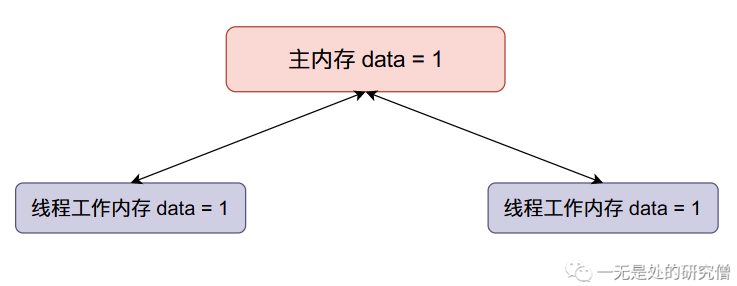

# Synchronized锁升级原理深入剖析

## 前言

在上篇文章[深入学习Synchronized各种使用方法](https://mp.weixin.qq.com/s?__biz=Mzg3ODgyNDgwNg==&mid=2247486361&idx=1&sn=dce819edcce0d509d7fec212abc2bd03&chksm=cf0c9790f87b1e86fcef49c58cbad141a43e803f01fec8a2170c82fae25a284601c5f9f27929&token=1166204888&lang=zh_CN#rd)当中我们仔细介绍了在各种情况下该如何使用synchronized关键字。因为在我们写的程序当中可能会经常使用到synchronized关键字，因此JVM对synchronized做出了很多优化，而在本篇文章当中我们将仔细介绍JVM对synchronized的各种优化的细节。

## 基础准备

在正式谈synchronized的原理之前我们先谈一下**自旋锁**，因为在synchronized的优化当中**自旋锁**发挥了很大的作用。而需要了解**自旋锁**，我们首先需要了解什么是**原子性**。

所谓**原子性**简答说来就是一个一个操作要么不做要么全做，全做的意思就是在操作的过程当中不能够被中断，比如说对变量`data`进行加一操作，有以下三个步骤：

- 将`data`从内存加载到寄存器。
- 将`data`这个值加一。
- 将得到的结果写回内存。

原子性就表示一个线程在进行加一操作的时候，不能够被其他线程中断，只有这个线程执行完这三个过程的时候其他线程才能够操作数据`data`。

我们现在用代码体验一下，在Java当中我们可以使用`AtomicInteger`进行对整型数据的原子操作：

```java
import java.util.concurrent.atomic.AtomicInteger;

public class AtomicDemo {

  public static void main(String[] args) throws InterruptedException {
    AtomicInteger data = new AtomicInteger();
    data.set(0); // 将数据初始化位0
    Thread t1 = new Thread(() -> {
      for (int i = 0; i < 100000; i++) {
        data.addAndGet(1); // 对数据 data 进行原子加1操作
      }
    });
    Thread t2 = new Thread(() -> {
      for (int i = 0; i < 100000; i++) {
        data.addAndGet(1);// 对数据 data 进行原子加1操作
      }
    });
    // 启动两个线程
    t1.start();
    t2.start();
    // 等待两个线程执行完成
    t1.join();
    t2.join();
    // 打印最终的结果
    System.out.println(data); // 200000
  }
}

```

从上面的代码分析可以知道，如果是一般的整型变量如果两个线程同时进行操作的时候，最终的结果是会小于200000。

我们现在来模拟一下出现问题的过程：

- 主内存`data`的初始值等于0，两个线程得到的`data`初始值都等于0。


- 现在线程一将`data`加一，然后线程一将`data`的值同步回主内存，整个内存的数据变化如下：


- 现在线程二`data`加一，然后将`data`的值同步回主内存（将原来主内存的值覆盖掉了）：



我们本来希望`data`的值在经过上面的变化之后变成`2`，但是线程二覆盖了我们的值，因此在多线程情况下，会使得我们最终的结果变小。

但是在上面的程序当中我们最终的输出结果是等于20000的，这是因为给`data`进行`+1`的操作是原子的不可分的，在操作的过程当中其他线程是不能对`data`进行操作的。这就是**原子性**带来的优势。

事实上上面的`+1`原子操作就是通过**自旋锁**实现的，我们可以看一下`AtomicInteger`的源代码：

```java
public final int addAndGet(int delta) {
  // 在 AtomicInteger 内部有一个数据 value 用于存储具体的数值的
  // 这个 valueOffset 表示这个数据 value 在对象 this （也就是 AtomicInteger一个具体的对象）
  // 当中的内存偏移地址
  // delta 就是我们需要往 value 上加的值 在这里我们加上的是 1
  return unsafe.getAndAddInt(this, valueOffset, delta) + delta;
}
```

上面的代码最终时调用`UnSafe`类的方法进行实现的，我们再看一下他的源代码：

```java
public final int getAndAddInt(Object o, long offset, int delta) {
  int v;
  do {
    v = getIntVolatile(o, offset);
  } while (!compareAndSwapInt(o, offset, v, v + delta));
  return v;
}
```

