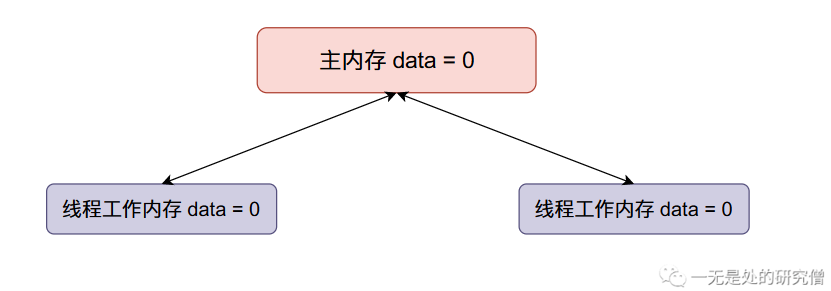
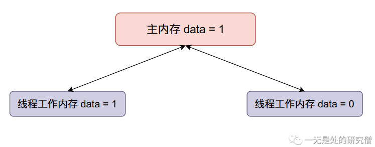

# 从零开始自己动手写自旋锁

## 前言

我们在写并发程序的时候，一个非常常见的需求就是保证在某一个时刻只有一个线程执行某段代码，像这种代码叫做临界区，而通常保证一个时刻只有一个线程执行临界区的代码的方法就是锁🔒。在本篇文章当中我们将会仔细分析和学习自旋锁

## 自旋锁

### 原子性

在谈自旋锁之前就不得不谈原子性了。所谓**原子性**简单说来就是一个一个操作要么不做要么全做，全做的意思就是在操作的过程当中不能够被中断，比如说对变量`data`进行加一操作，有以下三个步骤：

- 将`data`从内存加载到寄存器。
- 将`data`这个值加一。
- 将得到的结果写回内存。

原子性就表示一个线程在进行加一操作的时候，不能够被其他线程中断，只有这个线程执行完这三个过程的时候其他线程才能够操作数据`data`。

我们现在用代码体验一下，在Java当中我们可以使用`AtomicInteger`进行对整型数据的原子操作：

```java
import java.util.concurrent.atomic.AtomicInteger;

public class AtomicDemo {

  public static void main(String[] args) throws InterruptedException {
    AtomicInteger data = new AtomicInteger();
    data.set(0); // 将数据初始化位0
    Thread t1 = new Thread(() -> {
      for (int i = 0; i < 100000; i++) {
        data.addAndGet(1); // 对数据 data 进行原子加1操作
      }
    });
    Thread t2 = new Thread(() -> {
      for (int i = 0; i < 100000; i++) {
        data.addAndGet(1);// 对数据 data 进行原子加1操作
      }
    });
    // 启动两个线程
    t1.start();
    t2.start();
    // 等待两个线程执行完成
    t1.join();
    t2.join();
    // 打印最终的结果
    System.out.println(data); // 200000
  }
}

```

从上面的代码分析可以知道，如果是一般的整型变量如果两个线程同时进行操作的时候，最终的结果是会小于200000。

我们现在来模拟一下一般的整型变量出现问题的过程：

- 主内存`data`的初始值等于0，两个线程得到的`data`初始值都等于0。



- 现在线程一将`data`加一，然后线程一将`data`的值同步回主内存，整个内存的数据变化如下：



- 现在线程二`data`加一，然后将`data`的值同步回主内存（将原来主内存的值覆盖掉了）：


我们本来希望`data`的值在经过上面的变化之后变成`2`，但是线程二覆盖了我们的值，因此在多线程情况下，会使得我们最终的结果变小。

但是在上面的程序当中我们最终的输出结果是等于20000的，这是因为给`data`进行`+1`的操作是原子的不可分的，在操作的过程当中其他线程是不能对`data`进行操作的。这就是**原子性**带来的优势。

### 自己动手写自旋锁

现在我们已经了解了原子性的作用了，我们现在来了解`AtomicInteger`类的另外一个原子性的操作——`compareAndSet`，这个操作叫做**比较并交换（CAS）**，他具有原子性。

```java
public static void main(String[] args) {
  AtomicInteger atomicInteger = new AtomicInteger();
  atomicInteger.set(0);
  atomicInteger.compareAndSet(0, 1);
}
```

compareAndSet函数的意义：首先会比较第一个参数（对应上面的代码就是0）和atomicInteger的值，如果相等则进行交换，也就是将atomicInteger的值设置为第二个参数（对应上面的代码就是1），如果这些操作成功，那么compareAndSet函数就返回`true`，如果操作失败则返回`false`，操作失败可能是因为第一个参数的值（期望值）和atomicInteger不相等，如果相等也可能因为在更改atomicInteger的值的时候失败（因为可能有多个线程在操作，因为原子性的存在，只能有一个线程操作成功）。


```java
import java.util.concurrent.atomic.AtomicInteger;

public class SpinLock {

  protected AtomicInteger value;

  public SpinLock() {
    this.value = new AtomicInteger();
    this.value.set(0);
  }

  public void lock() {
    while (!value.compareAndSet(0, 1));
  }

  public void unlock() {
    value.compareAndSet(1, 0);
  }

}
```


测试程序：

```java
public class SpinLockTest {

  public static int data;
  public static SpinLock lock = new SpinLock();

  public static void add() {
    for (int i = 0; i < 100000; i++) {
      lock.lock();
      data++;
      lock.unlock();
    }
  }

  public static void main(String[] args) throws InterruptedException {
    Thread[] threads = new Thread[100];
    for (int i = 0; i < 100; i ++) {
      threads[i] = new Thread(SpinLockTest::add);
    }
    for (int i = 0; i < 100; i++) {
      threads[i].start();
    }
    for (int i = 0; i < 100; i++) {
      threads[i].join();
    }
    System.out.println(data);
  }
}

```


### 自己动手写可重入自旋锁

```java
public class ReentrantSpinLock extends SpinLock {

  private Thread owner;
  private int count;

  @Override
  public void lock() {
    if (owner == null || owner != Thread.currentThread()) {
      while (!value.compareAndSet(0, 1));
      owner = Thread.currentThread();
      count = 1;
    }else {
      count++;
    }

  }

  @Override
  public void unlock() {
    if (count == 1) {
      count = 0;
      value.compareAndSet(1, 0);
    }else
      count--;
  }
}

```


测试程序：

```java
import java.util.concurrent.TimeUnit;

public class ReentrantSpinLockTest {

  public static int data;
  public static ReentrantSpinLock lock = new ReentrantSpinLock();

  public static void add(int state) throws InterruptedException {
    TimeUnit.SECONDS.sleep(1);
    if (state <= 3) {
      lock.lock();
      System.out.println(Thread.currentThread().getName() + "\t进入临界区 state = " + state);
      for (int i = 0; i < 10; i++)
        data++;
      add(state + 1);
      lock.unlock();
    }
  }

  public static void main(String[] args) throws InterruptedException {
    Thread[] threads = new Thread[10];
    for (int i = 0; i < 10; i++) {
      threads[i] = new Thread(new Thread(() -> {
        try {
          ReentrantSpinLockTest.add(1);
        } catch (InterruptedException e) {
          e.printStackTrace();
        }
      }));
    }
    for (int i = 0; i < 10; i++) {
      threads[i].start();
    }
    for (int i = 0; i < 10; i++) {
      threads[i].join();
    }
    System.out.println(data);
  }
}

```


事实上上面的`+1`原子操作就是通过**自旋**实现的，我们可以看一下`AtomicInteger`的源代码：

```java
public final int addAndGet(int delta) {
  // 在 AtomicInteger 内部有一个整型数据 value 用于存储具体的数值的
  // 这个 valueOffset 表示这个数据 value 在对象 this （也就是 AtomicInteger一个具体的对象）
  // 当中的内存偏移地址
  // delta 就是我们需要往 value 上加的值 在这里我们加上的是 1
  return unsafe.getAndAddInt(this, valueOffset, delta) + delta;
}
```

上面的代码最终是调用`UnSafe`类的方法进行实现的，我们再看一下他的源代码：

```java
public final int getAndAddInt(Object o, long offset, int delta) {
  int v;
  do {
    v = getIntVolatile(o, offset); // 从对象 o 偏移地址为 offset 的位置取出数据 value ，也就是前面提到的存储整型数据的变量
  } while (!compareAndSwapInt(o, offset, v, v + delta));
  return v;
}
```

上面的代码主要流程是不断的从内存当中取对象内偏移地址为`offset`的数据，然后执行语句`!compareAndSwapInt(o, offset, v, v + delta)`

这条语句的主要作用是：比较对象`o`内存偏移地址为`offset`的数据是否等于`v`，如果等于`v`则将偏移地址为`offset`的数据设置为`v + delta`，如果这条语句执行成功返回 `true`否则返回`false`，这就是我们常说的Java当中的**CAS**。

看到这里你应该就发现了当上面的那条语句执行不成功的话就会一直进行while循环操作，直到操作成功之后才退出while循环，假如没有操作成功就会一直“旋”在这里，像这种操作就是**自旋**，通过这种**自旋**方式所构成的锁🔒就叫做**自旋锁**。