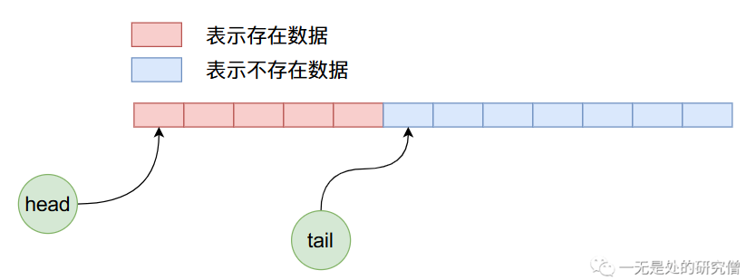

# 从零开始自己动手写阻塞队列

## 前言

在我们平时编程的时候一个很重要的工具就是容器，在本篇文章当中主要给大家介绍阻塞队列的原理，并且在了解原理之后自己动手实现一个低配版的阻塞队列。

## 需求分析

在前面的两片文章[ArrayDeque（JDK双端队列）源码深度剖析](https://mp.weixin.qq.com/s?__biz=Mzg3ODgyNDgwNg==&mid=2247484612&idx=1&sn=63a5a21fab640619333d9836a000ea44&chksm=cf0c98cdf87b11db7d63b2d028f0a70ea73e7c84338bce8e7cdf4bee9d5b0c7ec2bf23663233&token=1311889589&lang=zh_CN#rd)和[深入剖析（JDK）ArrayQueue源码](https://mp.weixin.qq.com/s?__biz=Mzg3ODgyNDgwNg==&mid=2247484813&idx=1&sn=ace534e0492bbc9f77b9cf488c7c4edc&chksm=cf0c9984f87b109210387f71d9591450ead667611351cd6857b7accb6f1fdc02939e12ad0434&token=969171239&lang=zh_CN#rd)当中我们仔细介绍了队列的原理，如果大家感兴趣可以查看一下！

而在本篇文章所谈到的阻塞队列当中，是在并发的情况下使用的，上面所谈到的是队列是**并发不安全**的，但是阻塞队列在并发下情况是安全的。阻塞队列的主要的需求如下：

- 队列基础的功能需要有，往队列当中放数据，从队列当中取数据。
- 所有的队列操作都要是**并发安全**的。
- 当队列满了之后再往队列当中放数据的时候，线程需要被挂起，当队列当中的数据被取出，让队列当中有空间的时候线程需要被唤醒。
- 当队列空了之后再往队列当中取数据的时候，线程需要被挂起，当有线程往队列当中加入数据的时候被挂起的线程需要被唤醒。
- 在我们实现的队列当中我们使用数组去存储数据，因此在构造函数当中需要提供数组的初始大小，设置用多大的数组。

## 阻塞队列实现原理

### 线程阻塞和唤醒

在上面我们已经谈到了阻塞队列是**并发安全**的，而且我们还有将线程唤醒和阻塞的需求，因此我们可以选择可重入锁`ReentrantLock`保证并发安全，但是我们还需要将线程唤醒和阻塞，因此我们可以选择条件变量`Condition`进行线程的唤醒和阻塞操作，在`Condition`当中我们将会使用到的，主要有以下两个函数：

- `signal`用于唤醒线程，当一个线程调用`Condition`的`signal`函数的时候就可以唤醒一个被`await`函数阻塞的线程。
- `await`用于阻塞线程，当一个线程调用`Condition`的`await`函数的时候这个线程就会阻塞。

### 数组循环使用

因为队列是一端进一端出，因此队列肯定有头有尾。


当我们往队列当中加入一些数据之后，队列的情况可能如下：



在上图的基础之上我们在进行四次出队操作，结果如下：


在上面的状态下，我们继续加入8个数据，那么布局情况如下：


我们知道上图在加入数据的时候不仅将数组后半部分的空间使用完了，而且可以继续使用前半部分没有使用过的空间，也就是说在队列内部实现了一个循环使用的过程。

为了保证数组的循环使用，我们需要用一个变量记录队列头在数组当中的位置，用一个变量记录队列尾部在数组当中的位置，还需要有一个变量记录队列当中有多少个数据。

## 代码实现

### 成员变量定义

根据上面的分析我们可以知道，在我们自己实现的类当中我们需要有如下的类成员变量：

```java
// 用于保护临界区的锁
private final ReentrantLock lock;
// 用于唤醒取数据的时候被阻塞的线程
private final Condition notEmpty;
// 用于唤醒放数据的时候被阻塞的线程
private final Condition notFull;
// 用于记录从数组当中取数据的位置 也就是队列头部的位置
private int takeIndex;
// 用于记录从数组当中放数据的位置 也就是队列尾部的位置
private int putIndex;
// 记录队列当中有多少个数据
private int count;
// 用于存放具体数据的数组
private Object[] items;
```

### 构造函数

我们的构造函数也很简单，最核心的就是传入一个数组大小的参数，并且给上面的变量进行初始化赋值。

```java
@SuppressWarnings("unchecked")
public MyArrayBlockingQueue(int size) {
  this.lock = new ReentrantLock();
  this.notEmpty = lock.newCondition();
  this.notFull = lock.newCondition();
  // 其实可以不用初始化 类会有默认初始化 默认初始化为0
  takeIndex = 0;
  putIndex = 0;
  count = 0;
  // 数组的长度肯定不能够小于0
  if (size <= 0)
    throw new RuntimeException("size can not be less than 1");
  items = (E[])new Object[size];
}

```

### put函数

这是一个比较重要的函数了，在这个函数当中如果队列没有满，则直接将数据放入到数组当中即可，如果数组满了，则需要将线程挂起。

```java
public void put(E x){
  // put 函数可能多个线程调用 但是我们需要保证在给变量赋值的时候只能够有一个线程
  // 因为如果多个线程同时进行赋值的话 那么可能后一个线程的赋值操作覆盖了前一个线程的赋值操作
  // 因此这里需要上锁
  lock.lock();

  try {
    // 如果队列当中的数据个数等于数组的长度的话 说明数组已经满了
    // 这个时候需要将线程挂起
    while (count == items.length)
      notFull.await(); // 将调用 await的线程挂起
    // 当数组没有满 或者在挂起之后再次唤醒的话说明数组当中有空间了
    // 这个时候需要将数组入队 
    // 调用入队函数将数据入队
    enqueue(x);
  } catch (InterruptedException e) {
    e.printStackTrace();
  } finally {
    // 解锁
    lock.unlock();
  }
}

// 将数据入队
private void enqueue(E x) {
  this.items[putIndex] = x;
  if (++putIndex == items.length)
    putIndex = 0;
  count++;
  notEmpty.signal(); // 唤醒一个被 take 函数阻塞的线程唤醒
}

```

### offer函数

offer函数和put函数一样，但是与put函数不同的是，当数组当中数据填满之后offer函数返回`false`，而不是被阻塞。

```java
public boolean offer(E e) {
  final ReentrantLock lock = this.lock;
  lock.lock();
  try {
    // 如果数组满了 则直接返回false 而不是被阻塞
    if (count == items.length)
      return false;
    else {
      // 如果数组没有满则直接入队 并且返回 true
      enqueue(e);
      return true;
    }
  } finally {
    lock.unlock();
  }
}

```

### add函数

这个函数和上面两个函数作用一样，也是往队列当中加入数据，但是单队列满了之后这个函数会抛出异常。

```java
public boolean add(E e) {
  if (offer(e))
    return true;
  else
    throw new RuntimeException("Queue full");
}

```

### take函数

这个函数主要是从队列当中取出一个数据，但是当队列为空的时候，这个函数会阻塞调用该函数的线程：

```java
public E take() throws InterruptedException {
  // 这个函数也是不能够并发的 否则可能不同的线程取出的是同一个位置的数据
  // 进行加锁操作
  lock.lock();
  try {
    // 当 count 等于0 说明队列为空
    // 需要将线程挂起等待
    while (count == 0)
      notEmpty.await();
    // 当被唤醒之后进行出队操作
    return dequeue();
  }finally {
    lock.unlock();
  }
}

private E  dequeue() {
  final Object[] items = this.items;
  @SuppressWarnings("unchecked")
  E x = (E) items[takeIndex];
  items[takeIndex] = null; // 将对应的位置设置为 null GC就可以回收了
  if (++takeIndex == items.length)
    takeIndex = 0;
  count--; // 队列当中数据少一个了
  // 因为出队了一个数据 可以唤醒一个被 put 函数阻塞的线程 如果这个时候没有被阻塞的线程
  // 这个函数就不会起作用 也就说在这个函数调用之后被 put 函数挂起的线程也不会被唤醒
  notFull.signal(); // 唤醒一个被 put 函数阻塞的线程
  return x;
}
```

### 重写toString函数

因为我们在后面的测试函数当中会打印我们这个类，而打印这个类的时候会调用对象的`toString`方法得到一个字符串，最后打印这个字符串。

```java
@Override
public String toString() {
  StringBuilder stringBuilder = new StringBuilder();
  stringBuilder.append("[");
  // 这里需要上锁 因为我们在打印的时候需要打印所有的数据
  // 打印所有的数据就需要对数组进行遍历操作 而在进行遍历
  // 操作的时候是不能进行插入和删除操作的 因为打印的是某
  // 个时刻的数据
  lock.lock();
  try {
    if (count == 0)
      stringBuilder.append("]");
    else {
      int cur = 0;
      // 对数据进行遍历 一共遍历 count 次 因为数组当中一共有 count
      // 个数据
      while (cur != count) {
        // 从 takeIndex 位置开始进行遍历 因为数据是从这个位置开始的
        stringBuilder.append(items[(cur + takeIndex) % items.length].toString() + ", ");
        cur += 1;
      }
      // 删除掉最后一次没用的 ", "
      stringBuilder.delete(stringBuilder.length() - 2, stringBuilder.length());
      stringBuilder.append(']');
    }
  }finally {
    lock.unlock();
  }
  return stringBuilder.toString();
}

```

### 完整代码

整个我们自己完成的阻塞队列的代码如下：

```java

import java.util.concurrent.locks.Condition;
import java.util.concurrent.locks.ReentrantLock;

public class MyArrayBlockingQueue<E> {

  // 用于保护临界区的锁
  private final ReentrantLock lock;
  // 用于唤醒取数据的时候被阻塞的线程
  private final Condition notEmpty;
  // 用于唤醒放数据的时候被阻塞的线程
  private final Condition notFull;
  // 用于记录从数组当中取数据的位置 也就是队列头部的位置
  private int takeIndex;
  // 用于记录从数组当中放数据的位置 也就是队列尾部的位置
  private int putIndex;
  // 记录队列当中有多少个数据
  private int count;
  // 用于存放具体数据的数组
  private Object[] items;


  @SuppressWarnings("unchecked")
  public MyArrayBlockingQueue(int size) {
    this.lock = new ReentrantLock();
    this.notEmpty = lock.newCondition();
    this.notFull = lock.newCondition();
    // 其实可以不用初始化 类会有默认初始化 默认初始化为0
    takeIndex = 0;
    putIndex = 0;
    count = 0;
    if (size <= 0)
      throw new RuntimeException("size can not be less than 1");
    items = (E[])new Object[size];
  }

  public void put(E x){
    lock.lock();

    try {
      while (count == items.length)
        notFull.await();
      enqueue(x);
    } catch (InterruptedException e) {
      e.printStackTrace();
    } finally {
      lock.unlock();
    }
  }

  private void enqueue(E x) {
    this.items[putIndex] = x;
    if (++putIndex == items.length)
      putIndex = 0;
    count++;
    notEmpty.signal();
  }

  private E  dequeue() {
    final Object[] items = this.items;
    @SuppressWarnings("unchecked")
    E x = (E) items[takeIndex];
    items[takeIndex] = null;
    if (++takeIndex == items.length)
      takeIndex = 0;
    count--;
    notFull.signal();
    return x;
  }

  public boolean add(E e) {
    if (offer(e))
      return true;
    else
      throw new RuntimeException("Queue full");
  }

  public boolean offer(E e) {
    final ReentrantLock lock = this.lock;
    lock.lock();
    try {
      if (count == items.length)
        return false;
      else {
        enqueue(e);
        return true;
      }
    } finally {
      lock.unlock();
    }
  }

  public E poll() {
    final ReentrantLock lock = this.lock;
    lock.lock();
    try {
      return (count == 0) ? null : dequeue();
    } finally {
      lock.unlock();
    }
  }

  public E take() throws InterruptedException {
    lock.lock();
    try {
      while (count == 0)
        notEmpty.await();
      return dequeue();
    }finally {
      lock.unlock();
    }
  }

  @Override
  public String toString() {
    StringBuilder stringBuilder = new StringBuilder();
    stringBuilder.append("[");
    lock.lock();
    try {
      if (count == 0)
        stringBuilder.append("]");
      else {
        int cur = 0;
        while (cur != count) {
          stringBuilder.append(items[(cur + takeIndex) % items.length].toString()).append(", ");
          cur += 1;
        }
        stringBuilder.delete(stringBuilder.length() - 2, stringBuilder.length());
        stringBuilder.append(']');
      }
    }finally {
      lock.unlock();
    }
    return stringBuilder.toString();
  }

}

```

现在对上面的代码进行测试：

我们现在使用阻塞队列模拟一个生产者消费者模型，设置阻塞队列的大小为5，生产者线程会往队列当中加入数据，数据为0-9的10个数字，消费者线程一共会消费10次。

```java
import java.util.concurrent.TimeUnit;

public class Test {

  public static void main(String[] args) throws InterruptedException {
    MyArrayBlockingQueue<Integer> queue = new MyArrayBlockingQueue<>(5);
    Thread thread = new Thread(() -> {
      for (int i = 0; i < 10; i++) {
        System.out.println(Thread.currentThread().getName() + " 往队列当中加入数据：" + i);
        queue.put(i);
      }
    }, "生产者");


    Thread thread1 = new Thread(() -> {
      for (int i = 0; i < 10; i++) {
        try {
          System.out.println(Thread.currentThread().getName() + " 从队列当中取出数据：" + queue.take());
          System.out.println(Thread.currentThread().getName() + " 当前队列当中的数据：" + queue);
        } catch (InterruptedException e) {
          e.printStackTrace();
        }
      }
    }, "消费者");
    thread.start();
    TimeUnit.SECONDS.sleep(3);
    thread1.start();

  }
}

```

上面代码的输出如下所示：

```java
生产者 往队列当中加入数据：0
生产者 往队列当中加入数据：1
生产者 往队列当中加入数据：2
生产者 往队列当中加入数据：3
生产者 往队列当中加入数据：4
生产者 往队列当中加入数据：5
消费者 从队列当中取出数据：0
生产者 往队列当中加入数据：6
消费者 当前队列当中的数据：[1, 2, 3, 4, 5]
消费者 从队列当中取出数据：1
消费者 当前队列当中的数据：[2, 3, 4, 5]
消费者 从队列当中取出数据：2
消费者 当前队列当中的数据：[3, 4, 5, 6]
生产者 往队列当中加入数据：7
消费者 从队列当中取出数据：3
消费者 当前队列当中的数据：[4, 5, 6, 7]
消费者 从队列当中取出数据：4
消费者 当前队列当中的数据：[5, 6, 7]
消费者 从队列当中取出数据：5
消费者 当前队列当中的数据：[6, 7]
生产者 往队列当中加入数据：8
消费者 从队列当中取出数据：6
消费者 当前队列当中的数据：[7, 8]
消费者 从队列当中取出数据：7
消费者 当前队列当中的数据：[8]
消费者 从队列当中取出数据：8
消费者 当前队列当中的数据：[]
生产者 往队列当中加入数据：9
消费者 从队列当中取出数据：9
消费者 当前队列当中的数据：[]

```

从上面的输出结果我们知道，生产者线程打印5之后被挂起了，因为如果没有被挂起，生产者线程肯定可以一次行输出完成，因为消费者线程阻塞了3秒。但是他没有输出完成说明在打印5之后，因为阻塞队列满了，因而生产者线程被挂起了。然后消费者开始消费，这样阻塞队列当中就有空间了，生产者线程就可以继续生产了。

## 总结

在本篇文章当中，主要向大家介绍了阻塞队列的原理并且实现了一个低配版的数组阻塞队列，其实如果你了解数组队列和锁的话，这个代码实现起来还是相对比较简单的，我们只需要使用锁去保证我们的程序并发安全即可。

- 我们在实现put函数的时候，如果当前队列已经满了，则当前线程需要调用`await`函数进行阻塞，当线程被唤醒或者队列没有满可以继续执行的时候，我们在往队列当中加入数据之后需要调用一次`signal`函数，因为这样可以唤醒在调用`take`函数的时候因为队列空而阻塞的线程。
- 我们实现take函数的时候，如果当前队列已经空了，则当前线程也需要调用`await`函数进行阻塞，当线程被唤醒或者队列不为空线程可以继续执行，在出队之后需要调用一次`signal`函数，因为这样可以唤醒在调用`put`函数的时候因为队列满而阻塞的线程。

---

以上就是本篇文章的所有内容了，我是**LeHung**，我们下期再见！！！更多精彩内容合集可访问项目：<https://github.com/Chang-LeHung/CSCore>

关注公众号：**一无是处的研究僧**，了解更多计算机（Java、Python、计算机系统基础、算法与数据结构）知识。


