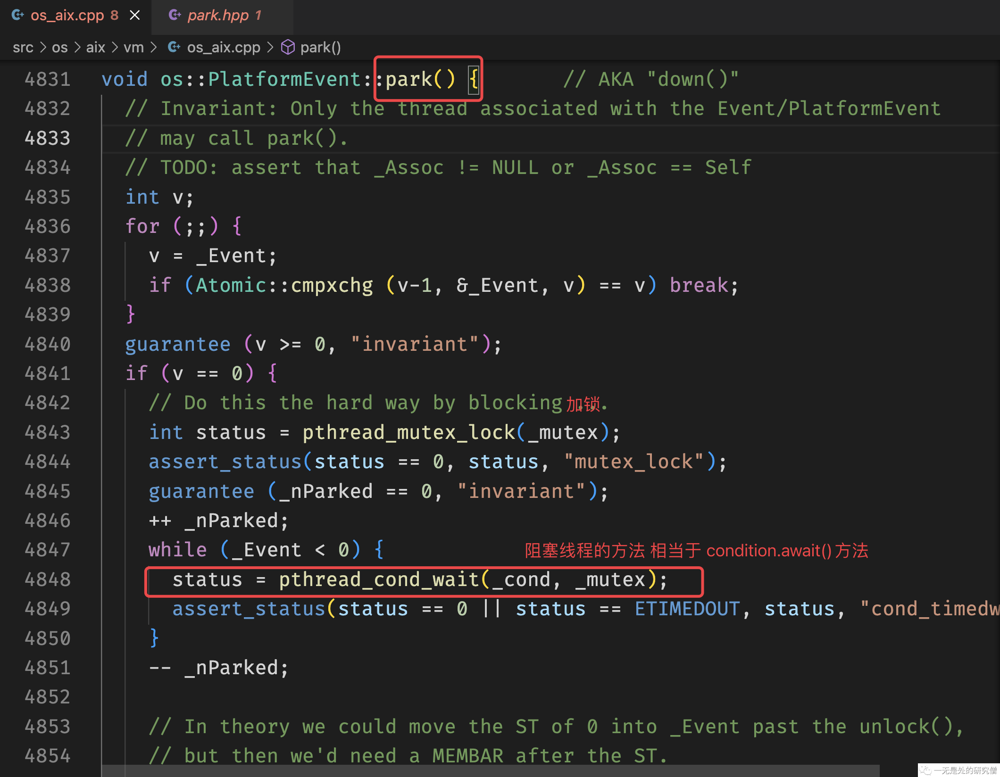

# 60行自己动手写LockSupport是什么体验？

## 前言

在JDK当中给我们提供的各种并发工具当中，比如`ReentrantLock`等等工具的内部实现，经常会使用到一个工具，这个工具就是`LockSupport`。`LockSupport`给我们提供了一个非常强大的功能，它是线程阻塞最基本的元语，他可以将一个线程阻塞也可以将一个线程唤醒，因此经常在并发的场景下进行使用。

## LockSupport实现原理

在了解LockSupport实现原理之前我们先用一个案例来了解一下LockSupport的功能！

```java
import java.util.concurrent.TimeUnit;
import java.util.concurrent.locks.LockSupport;

public class Demo {

  public static void main(String[] args) throws InterruptedException {
    Thread thread = new Thread(() -> {
      System.out.println("park 之前");
      LockSupport.park(); // park 函数可以将调用这个方法的线程挂起
      System.out.println("park 之后");
    });
    thread.start();
    TimeUnit.SECONDS.sleep(5);
    System.out.println("主线程休息了 5s");
    System.out.println("主线程 unpark thread");
    LockSupport.unpark(thread); // 主线程将线程 thread 唤醒 唤醒之后线程 thread 才可以继续执行
  }
}

```

上面的代码的输出如下：

```java
park 之前
主线程休息了 5s
主线程 unpark thread
park 之后
```

乍一看上面的LockSupport的park和unpark实现的功能和await和signal实现的功能好像是一样的，但是其实不然，我们来看下面的代码：

```java

import java.util.concurrent.TimeUnit;
import java.util.concurrent.locks.LockSupport;

public class Demo02 {
  public static void main(String[] args) throws InterruptedException {
    Thread thread = new Thread(() -> {
      try {
        TimeUnit.SECONDS.sleep(5);
      } catch (InterruptedException e) {
        e.printStackTrace();
      }
      System.out.println("park 之前");
      LockSupport.park(); // 线程 thread 后进行 park 操作 
      System.out.println("park 之后");
    });
    thread.start();
    System.out.println("主线程 unpark thread");
    LockSupport.unpark(thread); // 先进行 unpark 操作

  }
}
```

上面代码输出结果如下：

```java
主线程 unpark thread
park 之前
park 之后
```

在上面的代码当中主线程会先进行`unpark`操作，然后线程thread才进行`park`操作，这种情况下程序也可以正常执行。但是如果是signal的调用在await调用之前的话，程序则不会执行完成，比如下面的代码：

```java
import java.util.concurrent.TimeUnit;
import java.util.concurrent.locks.Condition;
import java.util.concurrent.locks.ReentrantLock;

public class Demo03 {

  private static final ReentrantLock lock = new ReentrantLock();
  private static final Condition condition = lock.newCondition();

  public static void thread() throws InterruptedException {
    lock.lock();

    try {
      TimeUnit.SECONDS.sleep(5);
      condition.await();
      System.out.println("等待完成");
    }finally {
      lock.unlock();
    }
  }

  public static void mainThread() {
    lock.lock();
    try {
      System.out.println("发送信号");
      condition.signal();
    }finally {
      lock.unlock();
      System.out.println("主线程解锁完成");
    }
  }

  public static void main(String[] args) {
    Thread thread = new Thread(() -> {
      try {
        thread();
      } catch (InterruptedException e) {
        e.printStackTrace();
      }
    });
    thread.start();

    mainThread();
  }
}

```

上面的代码输出如下：

```
发送信号
主线程解锁完成
```

在上面的代码当中“等待完成“始终是不会被打印出来的，这是因为signal函数的调用在await之前，signal函数只会对在它之前执行的await函数有效果，对在其后面调用的await是不会产生影响的。

那是什么原因导致的这个效果呢？

**其实JVM在实现LockSupport的时候，内部会给每一个线程维护一个计数器变量`_counter`，这个变量是表示的含义是“许可证的数量”，只有当有许可证的时候线程才可以执行，同时许可证最大的数量只能为1。当调用一次park的时候许可证的数量会减一。当调用一次unpark的时候计数器就会加一，但是计数器的值不能超过1**。

当一个线程调用park之后，他就需要等待一个许可证，只有拿到许可证之后这个线程才能够继续执行，或者在park之前已经获得一个了一个许可证，那么它就不需要阻塞，直接可以执行。

## 自己动手实现自己的LockSupport

### 实现原理

在前文当中我们已经介绍了locksupport的原理，它主要的内部实现就是通过许可证实现的：

- 每一个线程能够获取的许可证的最大数目就是1。
- 当调用unpark方法时，线程可以获取一个许可证，许可证数量的上限是1，如果已经有一个许可证了，那么许可证就不能累加。
- 当调用park方法的时候，如果调用park方法的线程没有许可证的话，则需要将这个线程挂起，直到有其他线程调用unpark方法，给这个线程发放一个许可证，线程才能够继续执行。但是如果线程已经有了一个许可证，那么线程将不会阻塞可以直接执行。

### 自己实现LockSupport协议规定

在我们自己实现的Parker当中我们也可以给每个线程一个计数器，记录线程的许可证的数目，当许可证的数目大于等于0的时候，线程可以执行，反之线程需要被阻塞，协议具体规则如下：

- 初始线程的许可证的数目为0。

- 如果我们在调用park的时候，计数器的值等于1，计数器的值变为0，则线程可以继续执行。
- 如果我们在调用park的时候，计数器的值等于0，则线程不可以继续执行，需要将线程挂起，且将计数器的值设置为-1。
- 如果我们在调用unpark的时候，被unpark的线程的计数器的值等于0，则需要将计数器的值变为1。
- 如果我们在调用unpark的时候，被unpark的线程的计数器的值等于1，则不需要改变计数器的值，因为计数器的最大值就是1。
- 我们在调用unpark的时候，如果计数器的值等于-1，说明线程已经被挂起了，则需要将线程唤醒，同时需要将计数器的值设置为0。

### 工具

因为涉及线程的阻塞和唤醒，我们可以使用可重入锁`ReentrantLock`和条件变量`Condition`，因此需要熟悉这两个工具的使用。

- ReentrantLock 主要用于加锁和开锁，用于保护临界区。
- Condition.awat 方法用于将线程阻塞。
- Condition.signal 方法用于将线程唤醒。
- 因为我们在unpark方法当中需要传入具体的线程，将这个线程发放许可证，同时唤醒这个线程，因为是需要针对特定的线程进行唤醒，而condition唤醒的线程是不确定的，因此我们需要为每一个线程维护一个**计数器**和**条件变量**，这样每个条件变量只与一个线程相关，唤醒的肯定就是一个特定的线程。我们可以使用HashMap进行实现，键为线程，值为计数器或者条件变量。

### 具体实现

- 因此综合上面的分析我们的类变量如下：

```java
private final ReentrantLock lock; // 用于保护临界去
private final HashMap<Thread, Integer> permits; // 许可证的数量
private final HashMap<Thread, Condition> conditions; // 用于唤醒和阻塞线程的条件变量
```

- 构造函数主要对变量进行赋值：

```java
public Parker() {
  lock = new ReentrantLock();
  permits = new HashMap<>();
  conditions = new HashMap<>();
}
```

- park方法

```java
public void park() {
  Thread t = Thread.currentThread(); // 首先得到当前正在执行的线程
  if (conditions.get(t) == null) { // 如果还没有线程对应的condition的话就进行创建
    conditions.put(t, lock.newCondition());
  }
  lock.lock();
  try {
    // 如果许可证变量还没有创建 或者许可证等于0 说明没有许可证了 线程需要被挂起
    if (permits.get(t) == null || permits.get(t) == 0) {
      permits.put(t, -1); // 同时许可证的数目应该设置为-1
      conditions.get(t).await();
    }else if (permits.get(t) > 0) {
      permits.put(t, 0); // 如果许可证的数目大于0 也就是为1 说明线程已经有了许可证因此可以直接被放行 但是需要消耗一个许可证
    }
  } catch (InterruptedException e) {
    e.printStackTrace();
  } finally {
    lock.unlock();
  }
}


```

- unpark方法

```java
public void unpark(Thread thread) {
  Thread t = thread; // 给线程 thread 发放一个许可证
  lock.lock();
  try {
    if (permits.get(t) == null) // 如果还没有创建许可证变量 说明线程当前的许可证数量等于初始数量也就是0 因此方法许可证之后 许可证的数量为 1
      permits.put(t, 1);
    else if (permits.get(t) == -1) { // 如果许可证数量为-1，则说明肯定线程 thread 调用了park方法，而且线程 thread已经被挂起了 因此在 unpark 函数当中不急需要将许可证数量这是为0 同时还需要将线程唤醒
      permits.put(t, 0);
      conditions.get(t).signal();
    }else if (permits.get(t) == 0) { // 如果许可证数量为0 说明线程正在执行 因此许可证数量加一
      permits.put(t, 1);
    } // 除此之外就是许可证为1的情况了 在这种情况下是不需要进行操作的 因为许可证最大的数量就是1
  }finally {
    lock.unlock();
  }
}
```

### 完整代码

```java
import java.util.HashMap;
import java.util.concurrent.locks.Condition;
import java.util.concurrent.locks.ReentrantLock;

public class Parker {

  private final ReentrantLock lock;
  private final HashMap<Thread, Integer> permits;
  private final HashMap<Thread, Condition> conditions;

  public Parker() {
    lock = new ReentrantLock();
    permits = new HashMap<>();
    conditions = new HashMap<>();
  }

  public void park() {
    Thread t = Thread.currentThread();
    if (conditions.get(t) == null) {
      conditions.put(t, lock.newCondition());
    }
    lock.lock();
    try {
      if (permits.get(t) == null || permits.get(t) == 0) {
        permits.put(t, -1);
        conditions.get(t).await();
      }else if (permits.get(t) > 0) {
        permits.put(t, 0);
      }
    } catch (InterruptedException e) {
      e.printStackTrace();
    } finally {
      lock.unlock();
    }
  }

  public void unpark(Thread thread) {
    Thread t = thread;
    lock.lock();
    try {
      if (permits.get(t) == null)
        permits.put(t, 1);
      else if (permits.get(t) == -1) {
        permits.put(t, 0);
        conditions.get(t).signal();
      }else if (permits.get(t) == 0) {
        permits.put(t, 1);
      }
    }finally {
      lock.unlock();
    }
  }
}

```

### JVM实现一瞥

其实在JVM底层对于park和unpark的实现也是基于锁和条件变量的，只不过是用更加底层的操作系统和libc(linux操作系统)提供的API进行实现的。虽然API不一样，但是原理是相仿的，思想也相似。

比如下面的就是JVM实现的unpark方法：

```C++
void Parker::unpark() {
  int s, status;
  // 进行加锁操作 相当于 可重入锁的 lock.lock()
  status = pthread_mutex_lock(_mutex);
  assert (status == 0, "invariant");
  s = _counter;
  _counter = 1;
  if (s < 1) {
    // 如果许可证小于 1 进行下面的操作
    if (WorkAroundNPTLTimedWaitHang) {
      // 这行代码相当于 condition.signal() 唤醒线程
      status = pthread_cond_signal (_cond);
      assert (status == 0, "invariant");
      // 解锁操作 相当于可重入锁的 lock.unlock()
      status = pthread_mutex_unlock(_mutex);
      assert (status == 0, "invariant");
    } else {
      status = pthread_mutex_unlock(_mutex);
      assert (status == 0, "invariant");
      status = pthread_cond_signal (_cond);
      assert (status == 0, "invariant");
    }
  } else {
    // 如果有许可证 也就是 s == 1 那么不许要将线程挂起
    // 解锁操作 相当于可重入锁的 lock.unlock()
    pthread_mutex_unlock(_mutex);
    assert (status == 0, "invariant");
  }
}
```

JVM实现的park方法，如果没有许可证也是会将线程挂起的：



## 总结

在本篇文章当中主要介绍啦lock support的用法以及它的大致原理，以及介绍啦我们自己该如何实现类似lock support的功能，并且定义了我们自己实现lock support的大致协议，整个过程还是比较清晰的，我们只是实现了lock support当中两个核心方法，其他的方法其实也类似，原理差不多，在这里咱就实现一个乞丐版的lock support的吧！！！

- 使用锁和条件变量进行线程的阻塞和唤醒。
- 使用`Thread.currentThread()`方法得到当前正在执行的线程。
- 使用HashMap去存储线程和许可证以及条件变量的关系。

---

以上就是本篇文章的所有内容了，我是**LeHung**，我们下期再见！！！更多精彩内容合集可访问项目：<https://github.com/Chang-LeHung/CSCore>

关注公众号：**一无是处的研究僧**，了解更多计算机（Java、Python、计算机系统基础、算法与数据结构）知识。


