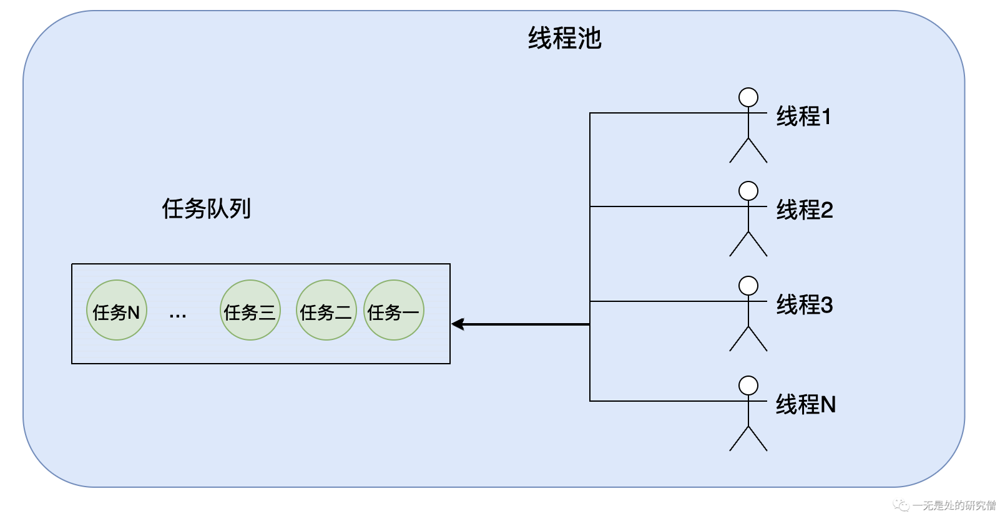

# 彻底了解线程池的原理——40行从零开始自己写线程池

## 前言

在我们的日常的编程当中，并发是始终离不开的主题，而在并发多线程当中，线程池又是一个不可规避的问题。多线程可以提高我们并发程序的效率，可以让我们不去频繁的申请和释放线程，这是一个很大的花销，而在线程池当中就不需要去频繁的申请线程，他的主要原理是申请完线程之后并不中断，而是不断的去队列当中领取任务，然后执行，反复这样的操作。在本篇文章当中我们主要是介绍线程池的原理，因此我们会自己写一个非常非常简单的线程池，主要帮助大家理解线程池的核心原理！！！

## 线程池给我们提供的功能

我们首先来看一个使用线程池的例子：

```java
import java.util.concurrent.ExecutorService;
import java.util.concurrent.Executors;

public class Demo01 {

  public static void main(String[] args) {
    ExecutorService pool = Executors.newFixedThreadPool(5);
    for (int i = 0; i < 100; i++) {
      pool.execute(new Runnable() {
        @Override
        public void run() {
          for (int i = 0; i < 100; i++) {
            System.out.println(Thread.currentThread().getName() + " print " + i);
          }
        }
      });
    }
  }
}

```

在上面的例子当中，我们使用`Executors.newFixedThreadPool`去生成来一个固定线程数目的线程池，在上面的代码当中我们是使用5个线程，然后通过`execute`方法不断的去向线程池当中提交任务，大致流程如下图所示：



线程池通过`execute`函数不断的往线程池当中的任务队列加入任务，而线程池当中的线程会不断的从任务队列当中取出任务，然后进行执行，然后继续取任务，继续执行....，线程的执行过程如下：

```java
while (true) {
  Runnable runnable = taskQueue.take(); // 从任务队列当中取出任务
  runnable.run(); // 执行任务
}
```

根据上面所谈到的内容，现在我们的需求很清晰了，首先我们需要有一个队列去存储我们所需要的任务，然后需要开启多个线程不断的去任务队列当中取出任务，然后进行执行，然后重复取任务执行任务的操作。

## 工具介绍

在我们前面提到的线程池实现的原理当中有一个非常重要的数据结构，就是`ArrayBlockingQueue`阻塞队列，它是一个并发安全的数据结构，我们首先先简单介绍一下这个数据结构的使用方法。（如果你想深入了解阻塞队列的实现原理，可以参考这篇文章[JDK数组阻塞队列源码剖析](https://mp.weixin.qq.com/s?__biz=Mzg3ODgyNDgwNg==&mid=2247486596&idx=1&sn=43b09e72333f1561c3cc77aad26b2a1d&chksm=cf0c908df87b199ba77bb0dc9db95bf360dacfd1986d4d1c007154312cef6a25750b58c38bdb&token=2045951226&lang=zh_CN#rd)）

我们主要是用的是`ArrayBlockingQueue`的下面两个方法：

- `put`函数，这个函数是往线程当中加入数据的。我们需要了解的是，如果一个线程调用了这个函数往队列当中加入数据，如果此时队列已经满了则线程需要被挂起，如果没有满则需要将数据加入到队列当中，也就是将数据存储到数组当中。
- `take`函数，从队列当中取出数据，但是当队列为空的时候需要将调用这个方法的线程阻塞。当队列当中有数据的时候，就可以从队列当中取出数据。
- 需要注意的是，如果一个线程被上面两个任何一个线程阻塞之后，可以调用对应线程的`interrupt`方法终止线程的执行，同时还会抛出一个异常。

下面是一份测试代码：

```java
import java.util.concurrent.ArrayBlockingQueue;
import java.util.concurrent.TimeUnit;

public class QueueTest {

  public static void main(String[] args) throws InterruptedException {
    ArrayBlockingQueue<Integer> queue = new ArrayBlockingQueue<Integer>(5); // 队列的容量为5
    Thread thread = new Thread(() -> {
      for (int i = 0; i < 10; i++) {
        try {
          queue.put(i);
          System.out.println("数据 " + i + "被加入到队列当中");
        } catch (InterruptedException e) {
          System.out.println("出现了中断异常");
          // 如果出现中断异常 则退出 线程就不会一直在 put 方法被挂起了
          return;
        }finally {
        }
      }
    });
    thread.start();
    TimeUnit.SECONDS.sleep(1);
    thread.interrupt();
  }
}

```

上面代码输出结果：

```
数据 0被加入到队列当中
数据 1被加入到队列当中
数据 2被加入到队列当中
数据 3被加入到队列当中
数据 4被加入到队列当中
出现了中断异常
```

上面代码的执行顺序是：

线程`thread`会将0-4这5个数据加入到队列当中，但是在加入第6个数据的时候，阻塞队列已经满了，因此在加入数据的时候线程`thread`会被阻塞，然后主线程在休息一秒之后中断了线程`thread`，然后线程`thread`发生了中断异常，然后被捕获进入`catch`代码块，然后函数返回，线程`thread`就不会一直被阻塞了，这一点在我们后面写线程池非常重要！！！

## Worker设计

在前文当中我们已经提到了我们的线程需要不断的去任务队列里面取出任务然后执行，我们设计一个`Worker`类去做这件事！

- 首先在类当中肯定需要有一个线程池的任务队列，因为`worker`需要不断的从阻塞队列当中取出任务进行执行。
- 我们用一个`isStopped`变量表示线程是否需要终止了，也就是线程池是否需要关闭，如果线程池需要关闭了，那么线程也应该停止了。
- 我们还需要有一个变量记录执行任务的线程，因为当我们需要关闭线程池的时候需要等待任务队列当中所有的任务执行完成，那么当所有的任务都执行执行完成的时候，队列肯定是空的，而如果这个时候有线程还去取任务，那么肯定会被阻塞，前面已经提到了`ArrayBlockingQueue`的使用方法了，我们可以使用这个线程的`interrupt`的方法去中断这个线程的执行，这个线程会出现异常，然后这个线程捕获这个异常就可以退出了，因此我们需要知道对那个线程执行`interrupt`方法！

`Worker`实现的代码如下：

```java
import java.util.concurrent.ArrayBlockingQueue;

public class Worker implements Runnable {

  // 用于保存任务的队列
  private ArrayBlockingQueue<Runnable> tasks;
  // 线程的状态 是否终止
  private volatile boolean isStopped;

  // 保存执行 run 方法的线程
  private volatile Thread thisThread;

  public Worker(ArrayBlockingQueue<Runnable> tasks) {
    // 这个参数是线程池当中传入的
    this.tasks = tasks;
  }

  @Override
  public void run() {
    thisThread = Thread.currentThread();
    while (!isStopped) {
      try {
        Runnable task = tasks.take();
        task.run();
      } catch (InterruptedException e) {
        // do nothing
      }
    }
  }
	// 注意是其他线程调用这个方法 同时需要注意是 thisThread 这个线程在执行上面的 run 方法
  // 其他线程调用 thisThread 的 interrupt 方法之后 thisThread 会出现异常 然后就不会一直阻塞了
  // 会判断 isStopped 是否为 true 如果为 true 的话就可以退出 while 循环了
  public void stop() {
    isStopped = true;
    thisThread.interrupt(); // 中断线程 thisThread
  }

  public boolean isStopped(){
    return isStopped;
  }
}

```

## 线程池设计

- 首先线程池需要可以指定有多少个线程，阻塞队列的最大长度，因此我们需要有这两个参数。
- 线程池肯定需要有一个队列去存放通过`submit`函数提交的任务。
- 需要有一个变量存储所有的woker，因为线程池关闭的时候需要将这些worker都停下来，也就是调用worker的stop方法。
- 需要有一个`shutDown`函数表示关闭线程池。
- 需要有一个函数能够停止所有线程的执行，因为关闭线程池就是让所有线程的工作停下来。

线程池实现代码：

```java
import java.util.ArrayList;
import java.util.concurrent.ArrayBlockingQueue;

public class MyFixedThreadPool {
  // 用于存储任务的阻塞队列
  private ArrayBlockingQueue<Runnable> taskQueue;

  // 保存线程池当中所有的线程
  private ArrayList<Worker> threadLists;

  // 线程池是否关闭
  private boolean isShutDown;

  // 线程池当中的线程数目
  private int numThread;

  public MyFixedThreadPool(int i) {
    this(Runtime.getRuntime().availableProcessors() + 1, 1024);
  }

  public MyFixedThreadPool(int numThread, int maxTaskNumber) {
    this.numThread = numThread;
    taskQueue = new ArrayBlockingQueue<>(maxTaskNumber); // 创建阻塞队列
    threadLists = new ArrayList<>();
    // 将所有的 worker 都保存下来
    for (int i = 0; i < numThread; i++) {
      Worker worker = new Worker(taskQueue);
      threadLists.add(worker);
    }
    for (int i = 0; i < threadLists.size(); i++) {
      new Thread(threadLists.get(i),
              "ThreadPool-Thread-" + i).start(); // 让worker开始工作
    }
  }
	
  // 停止所有的 worker 这个只在线程池要关闭的时候才会调用
  private void stopAllThread() {
    for (Worker worker : threadLists) {
      worker.stop();
    }
  }

  public void shutDown() {
    // 等待任务队列当中的任务执行完成
    while (taskQueue.size() != 0) {
      // 如果队列当中还有任务 则让出 CPU 的使用权
      Thread.yield();
    }
    // 在所有的任务都被执行完成之后 停止所有线程的执行
    stopAllThread();
  }

  public void submit(Runnable runnable) {
    try {
      taskQueue.put(runnable);
    } catch (InterruptedException e) {
      e.printStackTrace();
    }
  }
}

```

测试代码：

```java
public class Test {

  public static void main(String[] args) {
    MyFixedThreadPool pool = new MyFixedThreadPool(5, 1024);
    for (int i = 0; i < 1000000; i++) {
      pool.submit(() -> {
        System.out.println(Thread.currentThread().getName());
      });
    }
    pool.shutDown();
  }
}
```

上面的代码是可以正常执行并且结束的，这个输出太长了这里就不进行列出了。
