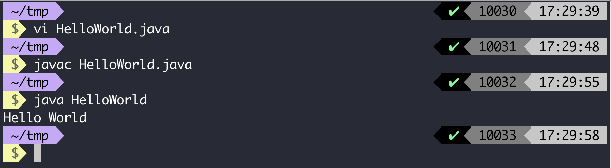

# 再谈线程池——深入剖析线程池的前世今生

## 深入剖析线程

灵魂质问：线程和进程的区别是什么？

一个非常经典的答案就是：进程是资源分配的最小单位，线程是操作系统调度的最小单位。

这句话是当然是正确的，但是如果你对整个计算机系统没有很好的理解的话你可能比较难去理解这句话。我们现在使用最简单的一个`Java`代码来看看一个`Java`代码是怎么被执行的。

```java
public class HelloWorld {

  public static void main(String[] args) {
    System.out.println("Hello World");
  }
}

```

我们可以使用`javac HelloWorld.java`编译这个文件，得到一个`HelloWorld.class`文件，然后我们执行`java HelloWorld`，然后就可以看到字符串的输出了。



## 由线程到线程池


## 线程池实现原理

## 总结

