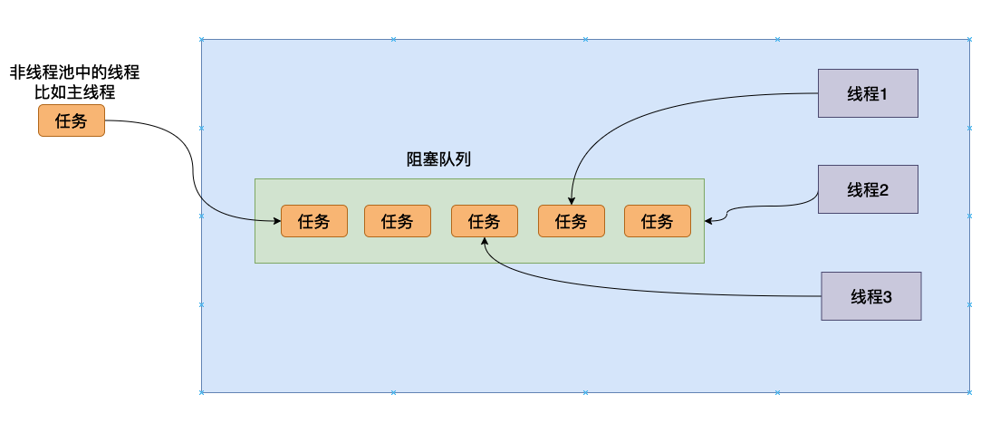

# 再谈线程池——深入剖析线程池的前世今生

## 深入剖析线程

灵魂质问：线程和进程的区别是什么？

一个非常经典的答案就是：进程是资源分配的最小单位，线程是操作系统调度的最小单位。

这句话是当然是正确的，但是如果你对整个计算机系统没有很好的理解的话你可能比较难去理解这句话。我们现在使用最简单的一个`Java`代码来看看一个`Java`代码是怎么被执行的。

```java
public class HelloWorld {

  public static void main(String[] args) {
    System.out.println("Hello World");
  }
}

```

我们可以使用`javac HelloWorld.java`编译这个文件，得到一个`HelloWorld.class`文件，然后我们执行`java HelloWorld`，然后就可以看到字符串的输出了。


## 由线程到线程池

### 线程在做什么？

灵魂拷问：写了那么多代码，你能够用一句话简练描述线程在干啥吗？

```java
public class Demo01 {

  public static void main(String[] args) {
    var thread = new Thread(() -> {
      System.out.println("Hello world from a Java thread");
    });
    thread.start();
  }
}
```

我们上面的这个用线程输出字符串的代码来进行说明。我们知道上面的Java代码启动了一个线程，然后执行`lambda`函数，在以前没有`lambda`表达式的时候我们可以使用匿名内部类实现，向下面这样。

```java
public class Demo01 {

  public static void main(String[] args) {
    var thread = new Thread(new Runnable() {
      @Override
      public void run() {
        System.out.println("Hello world from a Java thread");
      }
    });
    thread.start();
  }
}
```

但是本质上Java编译器在编译的时候都认为传递给他的是一个对象，然后执行对象的`run`方法。刚刚我们使用的`Thread`的构造函数如下：

```java
    public Thread(Runnable target) {
        this(null, target, "Thread-" + nextThreadNum(), 0);
    }
```

`Thread`在拿到这个对象的时候，当我们执行`Thread`的`start`方法的时候，会执行到一个`native`方法`start0`：


当JVM执行到这个方法的时候会调用操作系统给上层提供的API创建一个线程，然后这个线程会去解释执行我们之前给`Thread`对象传入的对象的`run`方法字节码，当`run`方法字节码执行完成之后，这个线程就会退出。

看到这里我们仔细思考一下线程在做一件什么样的事情，JVM给我们创建一个线程好像执行完一个函数（`run`）的字节码之后就退出了，线程的生命周期就结束了。确实是这样的，JVM给我们提供的线程就是去完成一个函数，然后退出（记住这一点，这一点很重要，为你后面理解线程池的原理有很大的帮助）。事实上JVM在使用操作系统给他提供的线程的时候也是给这个线程传递一个函数地址，然后让这个线程执行完这个函数。只不过JVM给操作系统传递的函数，这个函数的功能就是去解释执行字节码，当解释执行字节码完成之后，这个函数也会退出（被系统回收）。

看到这里可以将线程的功能总结成一句话：执行一个函数，当这个函数执行完成之后，线程就会退出，然后被回收，当然这个函数可以调用其他的函数，可能你会觉得这句话非常简单，但是这句话会我们理解线程池的原理非常有帮助。

### 为什么需要线程池

上面我们已经谈到了，当我们执行`start`的方法的时候，最终会走到`start0`方法，这是一个`native`方法，JVM在执行这个方法的时候会通过系统底层函数创建一个线程，然后去执行`run`方法，这里需要注意，创建线程是需要系统资源的，比如说内存，因为操作系统是系统资源的管理者，因此一般需要系统资源的方法都需要操作系统的参与，因此创建线程需要操作系统的帮忙，而一旦需要操作系统介入，执行代码的状态就需要从用户态到内核态转换（内核态能够执行许多用户态不能够执行的指令），当操作系统创建完线程之后有需要返回用户态，我们的代码将继续被执行，整个过程像下面这样。


从上图可以看到我们需要两次的上下文切换，同时还需要执行一些操作系统的函数，这个过程是非常耗时间的，如果在并发非常高的情况，我们频繁的去生成线程然后销毁，这对我们程序的性能影响还是非常大的。因此许许多多聪明的程序员就想能不能不去频繁的创建线程而且也能够完成我们的功能——我们创建线程的目的就是想让我们的程序完成的更加快速，让多个不同的线程同时执行不同的任务。于是线程池就被创造出来了。

## 线程池实现原理



## 总结

