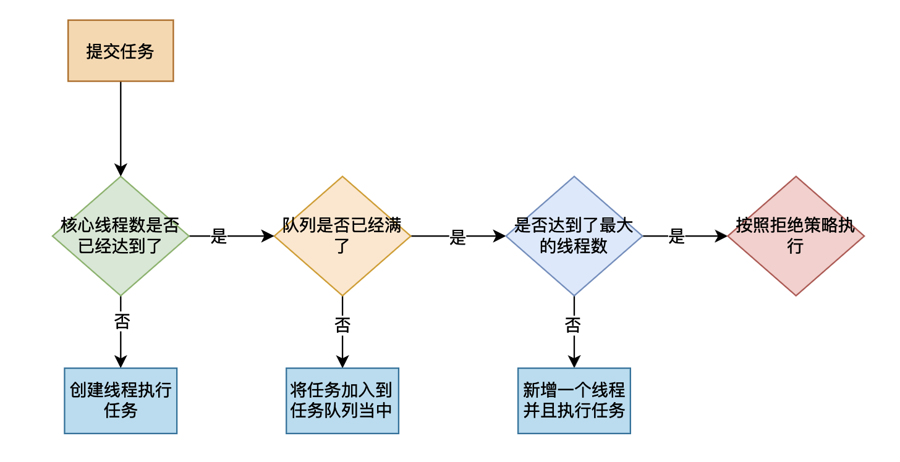

# 自己动手写线程池——向JDK线程池进发

## 前言

在前面的文章[自己动手写乞丐版线程池](https://mp.weixin.qq.com/s?__biz=Mzg3ODgyNDgwNg==&mid=2247487063&idx=1&sn=89f3025d3b23e399ced13e6991e8afb2&chksm=cf0c925ef87b1b480165986028d0605672d6047b9fd4111831a70f2b9b5dc5e6e01902e60efb&token=624247549&lang=zh_CN#rd)中，我们写了一个非常简单的线程池实现，这个只是一个非常简单的实现，在本篇文章当中我们将要实现一个和JDK内部实现的线程池非常相似的线程池。

## JDK线程池一瞥

我们首先看一个JDK给我们提供的线程池`ThreadPoolExecutor`的构造函数的参数：

```java
public ThreadPoolExecutor(int corePoolSize,
                              int maximumPoolSize,
                              long keepAliveTime,
                              TimeUnit unit,
                              BlockingQueue<Runnable> workQueue,
                              ThreadFactory threadFactory,
                              RejectedExecutionHandler handler) 
```

参数解释：

- corePoolSize：这个参数你可以理解为线程池当中至少需要 corePoolSize 个线程，初始时线程池当中线程的个数为0，当线程池当中线程的个数小于 corePoolSize 每次提交一个任务都会创建一个线程，并且先执行这个提交的任务，然后再去任务队列里面去获取新的任务，然后再执行。
- maximumPoolSize：这个参数指的是线程池当中能够允许的最大的线程的数目，当任务队列满了之后如果这个时候有新的任务想要加入队列当中，当发现队列满了之后就创建新的线程去执行任务，但是需要满足最大的线程的个数不能够超过 maximumPoolSize 。
- keepAliveTime 和 unit：这个主要是用于时间的表示，当队列当中多长时间没有数据的时候线程自己退出，前面谈到了线程池当中任务过多的时候会超过 corePoolSize ，当线程池闲下来的时候这些多余的线程就可以退出了。
- workQueue：这个就是用于保存任务的阻塞队列。
- threadFactory：这个参数倒不是很重要，线程工厂。
- handler：这个表示拒绝策略，JDK给我们提供了四种策略：
  - AbortPolicy：抛出异常。
  - DiscardPolicy：放弃这个任务。
  - CallerRunPolicy：提交任务的线程执行。
  - DiscardOldestPolicy:放弃等待时间最长的任务。

如果上面的参数你不能够理解，可以先阅读这篇文章[自己动手写乞丐版线程池](https://mp.weixin.qq.com/s?__biz=Mzg3ODgyNDgwNg==&mid=2247487063&idx=1&sn=89f3025d3b23e399ced13e6991e8afb2&chksm=cf0c925ef87b1b480165986028d0605672d6047b9fd4111831a70f2b9b5dc5e6e01902e60efb&token=624247549&lang=zh_CN#rd)。基于上面谈到的参数，线程池当中提交任务的流程大致如下图所示：



## 自己动手实现线程池

根据前面的参数分析我们自己实现的线程池需要实现一下功能：

- 能够提交Runnable的任务和Callable的任务。
- 线程池能够自己实现动态的扩容和所容，动态调整线程池当中线程的数目，当任务多的时候能够增加线程的数目，当任务少的时候多出来的线程能够自动退出。
- 有自己的拒绝策略，当任务队列满了，线程数也达到最大的时候，需要拒绝提交的任务。

### 线程池参数介绍

```java
  private AtomicInteger ct = new AtomicInteger(0); // 当前在执行任务的线程个数
  private int corePoolSize;
  private int maximumPoolSize;
  private long keepAliveTime;
  private TimeUnit unit;
  private BlockingQueue<Runnable> taskQueue;
  private RejectPolicy policy;

  private ArrayList<Worker> workers = new ArrayList<>();

  private volatile boolean isStopped;
  private boolean useTimed;

```

参数解释如下：

- ct：表示当前线程池当中线程的个数。

- corePoolSize：线程池当中核心线程的个数，意义和上面谈到的JDK的线程池意义一致。
- maximumPoolSize：线程池当中最大的线程个数，意义和上面谈到的JDK的线程池意义一致。
- keepAliveTime 和 unit：和JDK线程池的参数意义一致。
- taskQueue：任务队列，用不保存提交的任务。
- policy：拒绝策略，主要有一下四种策略：

```java
public enum RejectPolicy {

  ABORT,
  CALLER_RUN,
  DISCARD_OLDEST,
  DISCARD
}
```

- workers：用于保存工作线程。
- isStopped：线程池是否被关闭了。
- useTimed：主要是用于表示是否使用上面的 keepAliveTime 和 unit，如果使用就是在一定的时间内，如果没有从任务队列当中获取到任务，线程就从线程池退出，但是需要保证线程池当中最小的线程个数不小于 corePoolSize 。

### 实现Runnable

```java
  // 下面这个方法是向线程池提交任务
  public void execute(Runnable runnable) throws InterruptedException {
    checkPoolState();

    if (addWorker(runnable, false)  // 如果能够加入新的线程执行任务 加入成功就直接返回
            || !taskQueue.offer(runnable) // 如果 taskQueue.offer(runnable) 返回 false 说明提交任务失败 任务队列已经满了
            || addWorker(runnable, true)) // 使用能够使用的最大的线程数 (maximumPoolSize) 看是否能够产生新的线程
      return;

    // 如果任务队列满了而且不能够加入新的线程 则拒绝这个任务
    if (!taskQueue.offer(runnable))
      reject(runnable);
  }

```

在上面的代码当中：

- checkPoolState函数是检查线程池的状态，当线程池被停下来之后就不能够在提交任务：

```java
  private void checkPoolState() {
    if (isStopped) {
      // 如果线程池已经停下来了，就不在向任务队列当中提交任务了
      throw new RuntimeException("thread pool has been stopped, so quit submitting task");
    }
  }

```

- addWorker函数是往线程池当中提交任务并且产生一个线程，并且这个线程执行的第一个任务就是传递的参数。max表示线程的最大数目，max == true 的时候表示使用 maximumPoolSize 否则使用 corePoolSize，当返回值等于 true 的时候表示执行成功，否则表示执行失败。

```java
  /**
   *
   * @param runnable 需要被执行的任务
   * @param max 是否使用 maximumPoolSize
   * @return boolean
   */
  public synchronized boolean addWorker(Runnable runnable, boolean max) {

    if (ct.get() >= corePoolSize && !max)
      return false;
    if (ct.get() >= maximumPoolSize && max)
      return false;
    Worker worker = new Worker(runnable);
    workers.add(worker);
    Thread thread = new Thread(worker, "ThreadPool-" + "Thread-" + ct.addAndGet(1));
    thread.start();
    return true;
  }

```

### 实现Callable

这个函数其实比较简单，只需要将传入的Callable对象封装成一个FutureTask对象即可，因为FutureTask实现了Callable和Runnable两个接口，然后将这个结果返回即可，得到这个对象，再调用对象的 get 方法就能够得到结果。

```java
  public <V> RunnableFuture<V> submit(Callable<V> task) throws InterruptedException {
    checkPoolState();
    FutureTask<V> futureTask = new FutureTask<>(task);
    execute(futureTask);
    return futureTask;
  }
```

### 拒绝策略的实现

根据前面提到的各种策略的具体实现方式，具体的代码实现如下所示：

```java
  private void reject(Runnable runnable) throws InterruptedException {
    switch (policy) {
      case ABORT:
        throw new RuntimeException("task queue is full");
      case CALLER_RUN:
        runnable.run();
      case DISCARD: // 直接放弃这个任务
        return;
      case DISCARD_OLDEST:
        // 放弃等待时间最长的任务 也就是队列当中的第一个任务
        taskQueue.poll();
        execute(runnable); // 重新执行这个任务
    }
  }
```

### 线程池关闭实现

一共两种方式实现线程池关闭：

- 直接关闭线程池，不管任务队列当中的任务是否被全部执行完成。
- 安全关闭线程池，先等待任务队列当中所有的任务被执行完成，再关闭线程池，但是在这个过程当中不允许继续提交任务了，这一点已经在函数 checkPoolState 当中实现了。

```java
  // 强制关闭线程池
  public synchronized void stop() {
    isStopped = true;
    for (Worker worker : workers) {
      worker.stopWorker();
    }
  }

  public synchronized void shutDown() {
    // 先表示关闭线程池 线程就不能再向线程池提交任务
    isStopped = true;
    // 先等待所有的任务执行完成再关闭线程池
    waitForAllTasks();
    stop();
  }

  private void waitForAllTasks() {
    // 当线程池当中还有任务的时候 就不退出循环
    while (taskQueue.size() > 0) {
      Thread.yield();
      try {
        Thread.sleep(1000);
      } catch (InterruptedException e) {
        e.printStackTrace();
      }
    }
  }
```

### 工作线程的工作实现

```java
    @Override
    public void run() {
      // 先执行传递过来的第一个任务 这里是一个小的优化 让线程直接执行第一个任务 不需要
      // 放入任务队列再取出来执行了
      firstTask.run();

      thisThread = Thread.currentThread();
      while (!isStopped) {
        try {
          // 是否使用时间就在这里显示出来了
          Runnable task = useTimed ? taskQueue.poll(keepAliveTime, unit) : taskQueue.take();
          if (task == null) {
            int i;
            boolean exit = true;
            // 如果当前线程数大于核心线程数 则使用 CAS 去退出 用于保证在线程安全下的退出
            // 且保证线程的个数不小于 corePoolSize 下面这段代码需要仔细分析一下
            if (ct.get() > corePoolSize) {
              do{
                i = ct.get();
                if (i <= corePoolSize) {
                  exit = false;
                  break;
                }
              }while (!ct.compareAndSet(i, i - 1));
              if (exit) {
                return;
              }
            }
          }else {
            task.run();
          }
        } catch (InterruptedException e) {
          // do nothing
        }
      }
    }

```

我们现在来仔细分析一下，线程退出线程池的时候是如何保证线程池当中总的线程数是不小于 corePoolSize 的！首先整体的框架是使用 CAS 进行实现，具体代码为 do ... while 操作，然后在 while 操作里面使用 CAS 进行测试替换，如果没有成功再次获取 ，当线程池当中核心线程的数目小于等于 corePoolSize 的时候也需要退出循环，因为线程池当中线程的个数不能小于 corePoolSize 。因此使用 break 跳出循环的线程是不会退出线程池的。

### 线程池实现的BUG

在我们自己实现的线程池当中当线程退出的时候，workers 当中还保存这指向这个线程的对象，但是当线程退出的时候我们还没有在 workers 当中删除这个对象，因此这个线程对象不会被垃圾回收器收集掉，但是我们这个只是一个线程池实现的例子而已，并不用于生产环境，只是为了帮助大家理解线程池的原理。

### 完整代码

```java
package cscore.concurrent.java.threadpoolv2;


import java.util.ArrayList;
import java.util.concurrent.*;
import java.util.concurrent.atomic.AtomicInteger;

public class ThreadPool {

  private AtomicInteger ct = new AtomicInteger(0); // 当前在执行任务的线程个数
  private int corePoolSize;
  private int maximumPoolSize;
  private long keepAliveTime;
  private TimeUnit unit;
  private BlockingQueue<Runnable> taskQueue;
  private RejectPolicy policy;

  private ArrayList<Worker> workers = new ArrayList<>();

  private volatile boolean isStopped;
  private boolean useTimed;

  public int getCt() {
    return ct.get();
  }

  public ThreadPool(int corePoolSize, int maximumPoolSize, TimeUnit unit, long keepAliveTime, RejectPolicy policy
          , int maxTasks) {
    // please add -ea to vm options to make assert keyword enable
    assert corePoolSize > 0;
    assert maximumPoolSize > 0;
    assert keepAliveTime >= 0;
    assert maxTasks > 0;

    this.corePoolSize = corePoolSize;
    this.maximumPoolSize = maximumPoolSize;
    this.unit = unit;
    this.policy = policy;
    this.keepAliveTime = keepAliveTime;
    taskQueue = new ArrayBlockingQueue<Runnable>(maxTasks);
    useTimed = keepAliveTime != 0;
  }

  /**
   *
   * @param runnable 需要被执行的任务
   * @param max 是否使用 maximumPoolSize
   * @return boolean
   */
  public synchronized boolean addWorker(Runnable runnable, boolean max) {

    if (ct.get() >= corePoolSize && !max)
      return false;
    if (ct.get() >= maximumPoolSize && max)
      return false;
    Worker worker = new Worker(runnable);
    workers.add(worker);
    Thread thread = new Thread(worker, "ThreadPool-" + "Thread-" + ct.addAndGet(1));
    thread.start();
    return true;
  }

  // 下面这个方法是向线程池提交任务
  public void execute(Runnable runnable) throws InterruptedException {
    checkPoolState();

    if (addWorker(runnable, false)  // 如果能够加入新的线程执行任务 加入成功就直接返回
            || !taskQueue.offer(runnable) // 如果 taskQueue.offer(runnable) 返回 false 说明提交任务失败 任务队列已经满了
            || addWorker(runnable, true)) // 使用能够使用的最大的线程数 (maximumPoolSize) 看是否能够产生新的线程
      return;

    // 如果任务队列满了而且不能够加入新的线程 则拒绝这个任务
    if (!taskQueue.offer(runnable))
      reject(runnable);
  }

  private void reject(Runnable runnable) throws InterruptedException {
    switch (policy) {
      case ABORT:
        throw new RuntimeException("task queue is full");
      case CALLER_RUN:
        runnable.run();
      case DISCARD:
        return;
      case DISCARD_OLDEST:
        // 放弃等待时间最长的任务
        taskQueue.poll();
        execute(runnable);
    }
  }

  private void checkPoolState() {
    if (isStopped) {
      // 如果线程池已经停下来了，就不在向任务队列当中提交任务了
      throw new RuntimeException("thread pool has been stopped, so quit submitting task");
    }
  }

  public <V> RunnableFuture<V> submit(Callable<V> task) throws InterruptedException {
    checkPoolState();
    FutureTask<V> futureTask = new FutureTask<>(task);
    execute(futureTask);
    return futureTask;
  }

  // 强制关闭线程池
  public synchronized void stop() {
    isStopped = true;
    for (Worker worker : workers) {
      worker.stopWorker();
    }
  }

  public synchronized void shutDown() {
    // 先表示关闭线程池 线程就不能再向线程池提交任务
    isStopped = true;
    // 先等待所有的任务执行完成再关闭线程池
    waitForAllTasks();
    stop();
  }

  private void waitForAllTasks() {
    // 当线程池当中还有任务的时候 就不退出循环
    while (taskQueue.size() > 0) {
      Thread.yield();
      try {
        Thread.sleep(1000);
      } catch (InterruptedException e) {
        e.printStackTrace();
      }
    }
  }

  class Worker implements Runnable {

    private Thread thisThread;

    private final Runnable firstTask;
    private volatile boolean isStopped;

    public Worker(Runnable firstTask) {
      this.firstTask = firstTask;
    }

    @Override
    public void run() {
      // 先执行传递过来的第一个任务 这里是一个小的优化 让线程直接执行第一个任务 不需要
      // 放入任务队列再取出来执行了
      firstTask.run();

      thisThread = Thread.currentThread();
      while (!isStopped) {
        try {
          Runnable task = useTimed ? taskQueue.poll(keepAliveTime, unit) : taskQueue.take();
          if (task == null) {
            int i;
            boolean exit = true;
            if (ct.get() > corePoolSize) {
              do{
                i = ct.get();
                if (i <= corePoolSize) {
                  exit = false;
                  break;
                }
              }while (!ct.compareAndSet(i, i - 1));
              if (exit) {
                return;
              }
            }
          }else {
            task.run();
          }
        } catch (InterruptedException e) {
          // do nothing
        }
      }
    }

    public synchronized void stopWorker() {
      if (isStopped) {
        throw new RuntimeException("thread has been interrupted");
      }
      isStopped = true;
      thisThread.interrupt();
    }

  }

}
```

### 线程池测试

```java
package cscore.concurrent.java.threadpoolv2;

import java.util.concurrent.ExecutionException;
import java.util.concurrent.RunnableFuture;
import java.util.concurrent.TimeUnit;

public class Test {

  public static void main(String[] args) throws InterruptedException, ExecutionException {
    var pool = new ThreadPool(2, 5, TimeUnit.SECONDS, 10, RejectPolicy.ABORT, 100000);

    for (int i = 0; i < 10; i++) {
      RunnableFuture<Integer> submit = pool.submit(() -> {
        System.out.println(Thread.currentThread().getName() + " output a");
        try {
          Thread.sleep(10);
        } catch (InterruptedException e) {
          e.printStackTrace();
        }
        return 0;
      });
      System.out.println(submit.get());
    }
    int n = 15;
    while (n-- > 0) {
      System.out.println("Number Threads = " + pool.getCt());
      Thread.sleep(1000);
    }
    pool.shutDown();
  }
}

```

上面测试代码的输出结果如下所示：

```java
ThreadPool-Thread-2 output a
ThreadPool-Thread-1 output a
ThreadPool-Thread-3 output a
ThreadPool-Thread-4 output a
Number Threads = 5
ThreadPool-Thread-5 output a
ThreadPool-Thread-2 output a
ThreadPool-Thread-1 output a
ThreadPool-Thread-3 output a
ThreadPool-Thread-4 output a
ThreadPool-Thread-5 output a
ThreadPool-Thread-2 output a
ThreadPool-Thread-1 output a
ThreadPool-Thread-4 output a
ThreadPool-Thread-3 output a
ThreadPool-Thread-5 output a
ThreadPool-Thread-2 output a
ThreadPool-Thread-1 output a
ThreadPool-Thread-4 output a
Number Threads = 5
Number Threads = 5
Number Threads = 5
Number Threads = 5
Number Threads = 5
Number Threads = 5
Number Threads = 5
Number Threads = 5
Number Threads = 5
Number Threads = 3
Number Threads = 2
Number Threads = 2
Number Threads = 2
Number Threads = 2
```

从上面的代码可以看出我们实现了正确的任务实现结果，同时线程池当中的核心线程数从 2 变到了 5 ，当线程池当中任务队列全部别执行完成之后，线程的数目重新降下来了，这确实是我们想要达到的结果。

## 总结

在本篇文章当中主要给大家介绍了如何实现一个类似于JDK中的线程池，里面有非常多的实现细节，大家可以仔细捋一下其中的流程，对线程池的理解将会非常有帮助。

---

以上就是本篇文章的所有内容了，我是**LeHung**，我们下期再见！！！更多精彩内容合集可访问项目：<https://github.com/Chang-LeHung/CSCore>

关注公众号：**一无是处的研究僧**，了解更多计算机（Java、Python、计算机系统基础、算法与数据结构）知识。


