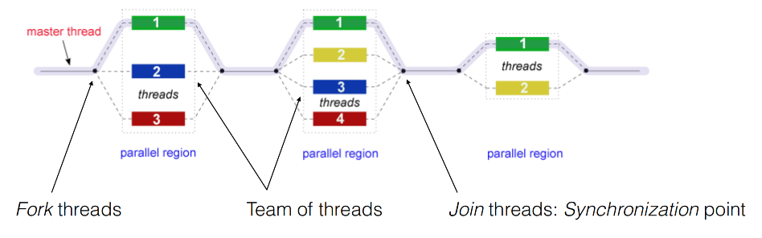
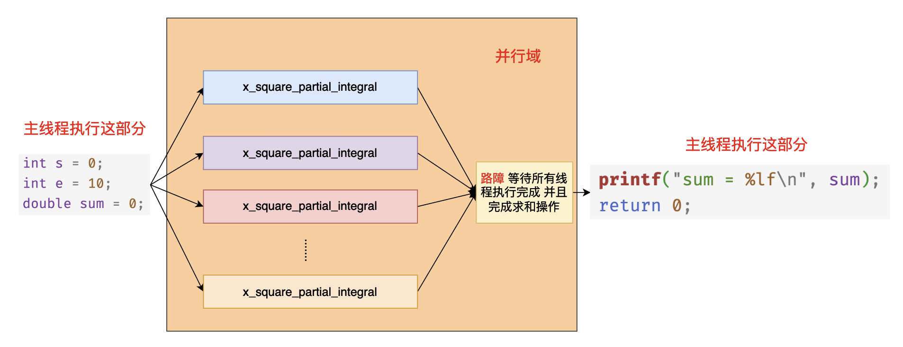
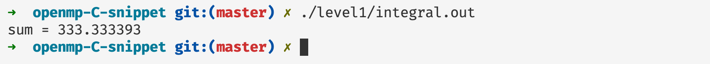

# OpenMP 入门

## 简介

Openmp 一个非常易用的共享内存的并行编程框架，它提供了一些非常简单易用的API，让编程人员从复杂的并发编程当中释放出来，专注于具体功能的实现。openmp 主要是通过编译指导语句以及他的动态运行时库实现，在本篇文章当中我们主要介绍 openmp 一些入门的简单指令的使用。

## 认识 openmp 的简单易用性

比如现在我们有一个任务，启动四个线程打印 `hello world`，我们看看下面 `C` 使用 `pthread` 的实现以及 `C++` 的实现，并对比他们和  `openmp` 的实现复杂性。

### C 语言实现

```c


#include <stdio.h>
#include <pthread.h>

void* func(void* args) {
  printf("hello world from tid = %ld\n", pthread_self());
  return NULL;
}

int main() {
  pthread_t threads[4];
  for(int i = 0; i < 4; i++) {
    pthread_create(&threads[i], NULL, func, NULL);
  }
  for(int i = 0; i < 4; i++) {
    pthread_join(threads[i], NULL);
  }
  return 0;
}
```

上面文件编译命令：`gcc 文件名 -lpthread` 。

### C++ 实现

```cpp

#include <thread>
#include <iostream>

void* func() {

  printf("hello world from %ld\n", std::this_thread::get_id());
  return 0;
}

int main() {

  std::thread threads[4];
  for(auto &t : threads) {
    t = std::thread(func);
  }
  for(auto &t : threads) {
    t.join();
  }

  return EXIT_SUCCESS;
}
```

上面文件编译命令：`g++ 文件名 lpthread` 。

### OpenMP 实现

```c

#include <stdio.h>
#include <omp.h>


int main() {
	
  // #pragma 表示这是编译指导语句 表示编译器需要对下面的并行域进行特殊处理 omp parallel 表示下面的代码区域 {} 是一个并行域 num_threads(4) 表示一共有 4 个线程执行 {} 内的代码 因此实现的效果和上面的效果是一致的
  #pragma omp parallel num_threads(4)
  {
    printf("hello world from tid = %d\n", omp_get_thread_num()); // omp_get_thread_num 表示得到线程的线程 id
  }
  return 0;
}
```

上面文件编译命令：`gcc 文件名 -fopenmp` ，如果你使用了 openmp 的编译指导语句的话需要在编译选项上加上 `-fopenmp`。

从上面的代码来看，确实 `openmp` 写并发程序的复杂度确实比 `pthread` 和 `C++` 低。`openmp` 相比起其他构建并行程序的方式来说，使用 `openmp` 你可以更加关注具体的业务实现，而不用太关心并发程序背后的启动与结束的过程。

## opnemp 基本原理

在上文当中我们写了一个非常简单的 openmp 程序，使用 4 个不同的线程分别打印 `hello world` 。我们仔细分析一下这个程序的执行流程：


在 openmp 的程序当中，你可以将程序用一个个的并行域分开，在并行域（parallel region）中，程序是有并发的，但是在并行域之外是没有并发的，只有主线程（master）在执行，整个过程如下图所示：



现在我们用一个程序去验证上面的过程：

```c

#include <stdio.h>
#include <omp.h>
#include <unistd.h>

int main() {

  #pragma omp parallel num_threads(4)
  {
    printf("parallel region 1 thread id = %d\n", omp_get_thread_num());
    sleep(1);
  }
  printf("after parallel region 1 thread id = %d\n", omp_get_thread_num());

  #pragma omp parallel num_threads(4)
  {
    printf("parallel region 2 thread id = %d\n", omp_get_thread_num());
    sleep(1);
  }
  printf("after parallel region 2 thread id = %d\n", omp_get_thread_num());

  #pragma omp parallel num_threads(4)
  {
    printf("parallel region 3 thread id = %d\n", omp_get_thread_num());
    sleep(1);
  }

  printf("after parallel region 3 thread id = %d\n", omp_get_thread_num());
  return 0;
}
```

程序的输入如下所示：

```shell
parallel region 1 thread id = 0
parallel region 1 thread id = 3
parallel region 1 thread id = 1
parallel region 1 thread id = 2
after parallel region 1 thread id = 0
parallel region 2 thread id = 0
parallel region 2 thread id = 2
parallel region 2 thread id = 3
parallel region 2 thread id = 1
after parallel region 2 thread id = 0
parallel region 3 thread id = 0
parallel region 3 thread id = 1
parallel region 3 thread id = 3
parallel region 3 thread id = 2
after parallel region 3 thread id = 0
```

从上面的输出我们可以了解到，在并行域内部程序的输出是没有顺序的，但是在并行域的外部是有序的，在并行域的开始部分程序会进行并发操作，但是在并行域的最后会有一个隐藏的同步点，等待所有线程到达这个同步点之后程序才会继续执行，现在再看上文当中 `openmp` 的执行流图的话就很清晰易懂了。

## 积分例子

现在我们使用一个简单的函数积分的例子去具体了解 `openmp` 在具体的使用场景下的并行。比如我们求函数  $x^2$ 的积分。


$$
\int_0^{x} x^2 = \frac{1}{3}x^3dx + C
$$
比如我们现在需要 x = 10 时，$x^2$ 的积分结果。我们在程序里面使用微元法去计算函数的微分结果，而不是直接使用公式进行计算，微元法对应的计算方式如下所示：
$$
\int_0^{10} x^2\mathrm{d}x =\sum_{ i= 0}^{1000000}(i * 0.00001) ^2 * 0.00001
$$
微元法的本质就是将曲线下方的面积分割成一个一个的非常小的长方形，然后将所有的长方形的面积累加起来，这样得到最终的结果。


如果你不懂上面所谈到的求解方法也没关系，只需要知道我们需要使用 openmp 去计算一个计算量比较大的任务即可。

`openmp` 具体的实现代码如下所示：

```c


#include <stdio.h>
#include <omp.h>
#include <math.h>

/// @brief 计算 x^2 一部分的面积
/// @param start 线程开始计算的位置
/// @param end   线程结束计算的位置
/// @param delta 长方形的边长
/// @return 计算出来的面积
double x_square_partial_integral(double start, double end, double delta) {

  double s = 0;
  for(double i = start; i < end; i += delta) {
    s += pow(i, 2) * delta;
  }
  return s;
}

int main() {

  int s = 0;
  int e = 10;
  double sum = 0;
  #pragma omp parallel num_threads(32) reduction(+:sum)
  {
    // 根据线程号进行计算区间的分配
    // omp_get_thread_num() 返回的线程 id 从 0 开始计数 ：0, 1, 2, 3, 4, ..., 31
    double start = (double)(e - s) / 32 * omp_get_thread_num();
    double end   = (double)(e - s) / 32 * (omp_get_thread_num() + 1);
    sum = x_square_partial_integral(start, end, 0.0000001);
  }
  printf("sum = %lf\n", sum);
  return 0;
}

```

在上面的代码当中 `#pragma omp parallel num_threads(4)` 表示启动 4 个线程执行 `{}` 中的代码，`reduction(+:sum)` 表示需要对 `sum` 这个变量进行一个规约操作，当 openmp 遇到这样的子句的时候首先会拷贝一份 `sum` 作为本地变量，然后在并行域当中使用的就是每一个线程的本地变量，因为有 reduction 的规约操作，因此在每个线程计算完成之后还需要将每个线程本地计算出来的值对操作符 + 进行规约操作，也就是将每个线程计算得到的结果求和，最终将得到的结果赋值给我们在 main 函数当中定义的变量 `sum` 。最终我们打印的变量 `sum` 就是各个线程求和之后的结果。上面的代码执行过程大致如下图所示：



注意事项：你在编译上述程序的时候需要加上编译选项 `-fopenmp` 启动`openmp` 编译选项和 `-lm` 链接数学库。

上面程序的执行结果如下所示：



## 总结

在本篇文章当中主要给大家介绍了 OpenMP 的基本使用和程序执行的基本原理，在后续的文章当中我们将仔细介绍各种 `OpenMP` 的子句和指令的使用方法，希望大家有所收获！

---

更多精彩内容合集可访问项目：<https://github.com/Chang-LeHung/CSCore>

关注公众号：一无是处的研究僧，了解更多计算机（Java、Python、计算机系统基础、算法与数据结构）知识。


