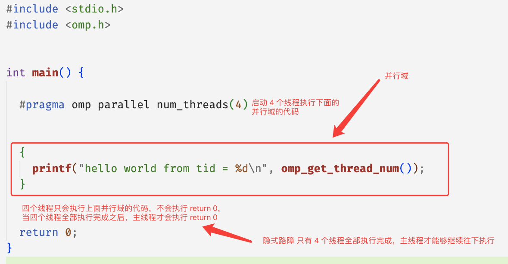

# openmp 入门

## 简介

Openmp 一个非常易用的共享内存的并行编程框架，它提供了一些非常简单易用的API，让编程人员从复杂的并发编程当中释放出来，专注于具体功能的实现。openmp 主要是通过编译指导语句以及他的动态运行时库实现，在本篇文章当中我们主要介绍 openmp 一些入门的简单指令的使用。

## 认识 openmp 的简单性

比如现在我们有一个任务，启动四个线程打印 `hello world`，我们看看下面 `C` 使用 `pthread` 的实现以及 `C++` 的实现，并对比他们和  `openmp` 的实现复杂性。

### C 语言实现

```c


#include <stdio.h>
#include <pthread.h>

void* func(void* args) {
  printf("hello world from tid = %ld\n", pthread_self());
  return NULL;
}

int main() {
  pthread_t threads[4];
  for(int i = 0; i < 4; i++) {
    pthread_create(&threads[i], NULL, func, NULL);
  }
  for(int i = 0; i < 4; i++) {
    pthread_join(threads[i], NULL);
  }
  return 0;
}
```

上面文件编译命令：`gcc 文件名 -lpthread` 。

### C++ 实现

```cpp

#include <thread>
#include <iostream>

void* func() {

  printf("hello world from %ld\n", std::this_thread::get_id());
  return 0;
}

int main() {

  std::thread threads[4];
  for(auto &t : threads) {
    t = std::thread(func);
  }
  for(auto &t : threads) {
    t.join();
  }

  return EXIT_SUCCESS;
}
```

上面文件编译命令：`g++ 文件名 lpthread` 。

### Openmp 实现

```c

#include <stdio.h>
#include <omp.h>


int main() {
	
  // #pragma 表示这是编译指导语句 表示编译器需要对下面的并行域进行特殊处理 omp parallel 表示下面的代码区域 {} 是一个并行域 num_threads(4) 表示一共有 4 个线程执行 {} 内的代码 因此实现的效果和上面的效果是一致的
  #pragma omp parallel num_threads(4)
  {
    printf("hello world from tid = %d\n", omp_get_thread_num()); // omp_get_thread_num 表示得到线程的线程 id
  }
  return 0;
}
```

上面文件编译命令：`gcc 文件名 -fopenmp` ，如果你使用了 openmp 的编译指导语句的话需要在编译选项上加上 `-fopenmp`。

从上面的代码来看，确实 `openmp` 写并发程序的复杂度确实比 `pthread` 和 `C++` 低。`openmp` 相比起其他构建并行程序的方式来说，使用 `openmp` 你可以更加关注具体的业务实现，而不用太关心并发程序背后的启动与结束的过程。

## opnemp 基本原理

在上文当中我们写了一个非常简单的 openmp 程序，使用 4 个不同的线程分别打印 `hello world` 。我们仔细分析一下这个程序的执行流程：



在 openmp 的程序当中，你可以将程序用一个个的并行域分开，在并行域（parallel region）中，程序是有并发的，但是在并行域之外是没有并发的，只有主线程在执行，整个过程如下图所示：


现在我们用一个程序去验证上面的过程：

```c

#include <stdio.h>
#include <omp.h>
#include <unistd.h>

int main() {

  #pragma omp parallel num_threads(4)
  {
    printf("parallel region 1 thread id = %d\n", omp_get_thread_num());
    sleep(1);
  }
  printf("after parallel region 1 thread id = %d\n", omp_get_thread_num());

  #pragma omp parallel num_threads(4)
  {
    printf("parallel region 2 thread id = %d\n", omp_get_thread_num());
    sleep(1);
  }
  printf("after parallel region 2 thread id = %d\n", omp_get_thread_num());

  #pragma omp parallel num_threads(4)
  {
    printf("parallel region 3 thread id = %d\n", omp_get_thread_num());
    sleep(1);
  }

  printf("after parallel region 3 thread id = %d\n", omp_get_thread_num());
  return 0;
}
```

程序的输入如下所示：

```shell
parallel region 1 thread id = 0
parallel region 1 thread id = 3
parallel region 1 thread id = 1
parallel region 1 thread id = 2
after parallel region 1 thread id = 0
parallel region 2 thread id = 0
parallel region 2 thread id = 2
parallel region 2 thread id = 3
parallel region 2 thread id = 1
after parallel region 2 thread id = 0
parallel region 3 thread id = 0
parallel region 3 thread id = 1
parallel region 3 thread id = 3
parallel region 3 thread id = 2
after parallel region 3 thread id = 0
```

