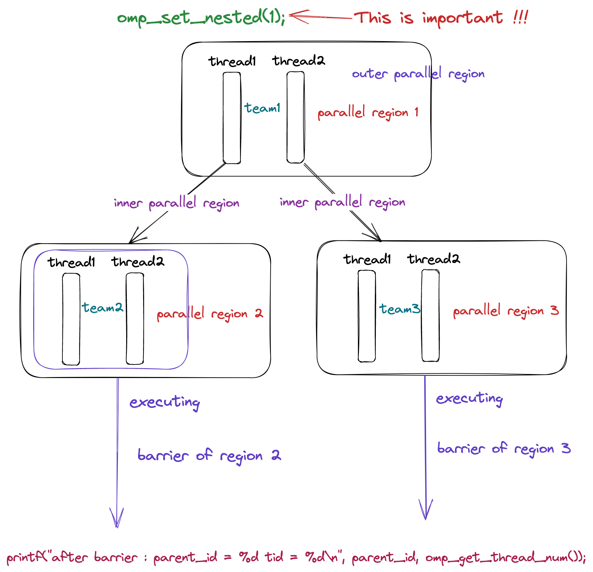

# 深入理解 OpenMP 线程同步机制

## 前言

在本篇文章当中主要给大家介绍 OpenMP 当中线程的同步和互斥机制，在 OpenMP 当中主要有三种不同的线程之间的互斥方式：

- 使用 critical 子句，使用这个子句主要是用于创建临界区和 OpenMP 提供的运行时库函数的作用是一致的，只不过这种方法是直接通过编译指导语句实现的，更加方便一点，加锁和解锁的过程编译器会帮我们实现。
- 使用 atomic 指令，这个主要是通过原子指令，主要是有处理器提供的一些原子指令实现的。
- OpenMP 给我们提供了 omp_lock_t 和 omp_nest_lock_t 两种数据结构实现简单锁和可重入锁。

在本篇文章当中主要讨论 OpenMP 当中的互斥操作，在下一篇文章当中主要讨论 OpenMP 当中原子操作的实现原理，并且查看程序编译之后的汇编指令。

## 自定义线程之间的同步 barrier

在实际的写程序的过程当中我们可能会有一种需求就是需要等待所有的线程都执行完成之才能够进行后面的操作，这个时候我们就可以自己使用 barrier 来实现这个需求了。

比如我们要实现下面的一个计算式：
$$
data = \frac{1! + 2! + ... + n!}{n}
$$
现在我们计算 n = 16 的时候上面的表达式的值：

```c

#include <stdio.h>
#include <omp.h>

int factorial(int n)
{
   int s = 1;
   for(int i = 1; i <= n; ++i)
   {
      s *= i;
   }
   return s;
}

int main()
{
   int data[16];
#pragma omp parallel num_threads(16) default(none) shared(data)
   {
      int id = omp_get_thread_num();
      data[id] = factorial(id + 1);
      // 等待上面所有的线程都完成的阶乘的计算
#pragma omp barrier
      long sum = 0;
#pragma omp single
      {
         for(int i = 0; i < 16; ++i)
         {
            sum += data[i];
         }
         printf("final value = %lf\n", (double) sum / 16);
      }
   }
   return 0;
}
```

在上面的代码当中我们首先让 16 个线程都计算完成对应的阶乘结果之后然后在求和进行除法操作，因此在进行除法操作之前就需要将所有的阶乘计算完成，在这里我们就可以使用 `#pragma omp barrier` 让所有的线程到达这个同步点之后才继续完成后执行，这样就保证了在进行后面的任务的时候所有线程计算阶乘的任务已经完成。

## 定义临界区 critical

在并发程序当中我们经常会有这样的需求，比如不同的线程需要对同一个数据进行求和操作，当然这个操作我们也可以通过 atomic constuct 来完成，但是在本篇文章当中我们使用临界区来完成，在下一篇完成当中我们将仔细分析 OpenMP 当中的原子操作。

比如我们现在有一个数据 data，然后每个线程需要对这个数据进行加操作。

```c

#include <stdio.h>
#include <omp.h>
#include <unistd.h>

int main() {
   int data = 0;
#pragma omp parallel num_threads(10) shared(data) default(none)
   {
#pragma omp critical
      {
         data++;
      }
   }
   printf("data = %d\n", data);
   return 0;
}
```

在上面的 critical 构造当中我们执行了 data ++ 这条语句，如果我们不使用 critical construct 的话，那么就可能两个线程同时操作 data++ 这条语句，那么就会造成结果的不正确性，因为如果两个线程同时读取 data 的值等于 0，然后两个线程同时进行++操作让 data 的值都变成 1，再写回，那么 data 的最终结果将会是 1，但是我们期望的结果是两个线程进行相加操作之后值变成 2，这就不对了，因此我们需要使用 critical construct 保证同一时刻只能够有一个线程进行 data++ 操作。

我们知道临界区的实现是使用锁实现的，当我们使用 `#pragma omp critical` 的时候，我们默认是使用的 OpenMP 内部的默认锁实现的，如果你在其他地方也使用 `#pragma omp critical` 的话使用的也是同一把锁，因此即使你用 `#pragma omp critical` 创建多个临界区你使用的也是同一把锁，也就是说这多个临界区在同一时刻也只会有一个线程在一个临界区执行，其余的临界区是没有线程在执行的，因为所有的临界区使用同一把锁，而一个时刻只能够有一个线程获得锁。

为了解决上面所谈到的问题，在 OpenMP 当中使用 critical 构造代码块的时候我们可以指定一个名字，以此用不同的锁在不同的临界区。

我们现在对上面的情况进行验证，在下面的程序当中一共有 4 个 section ，首先我们需要知道的是不同的 section 同一个时刻可以被不同的线程执行的，每一个线程只会被执行一次，如果有线程执行过了，那么它将不会再被执行。

```c
#include <stdio.h>
#include <omp.h>
#include <unistd.h>

int main()
{

#pragma omp parallel num_threads(4) default(none)
   {
#pragma omp sections
      {
#pragma omp section
         {
#pragma omp critical
            {
               printf("tid = %d time stamp = %lf\n", omp_get_thread_num(), omp_get_wtime());
               sleep(2);
            }
         }

#pragma omp section
         {
#pragma omp critical
            {
               printf("tid = %d time stamp = %lf\n", omp_get_thread_num(), omp_get_wtime());
               sleep(2);
            }
         }

#pragma omp section
         {
#pragma omp critical
            {
               printf("tid = %d time stamp = %lf\n", omp_get_thread_num(), omp_get_wtime());
               sleep(2);
            }
         }

#pragma omp section
         {
#pragma omp critical
            {
               printf("tid = %d time stamp = %lf\n", omp_get_thread_num(), omp_get_wtime());
               sleep(2);
            }
         }
      }
   }
   return 0;
}
```

上面的程序输出结果如下所示：

```shell
tid = 3 time stamp = 22875738.972305
tid = 0 time stamp = 22875740.972508
tid = 2 time stamp = 22875742.974888
tid = 1 time stamp = 22875744.975045
```

从上面程序的输出结果我们可以知道，每一次程序的输出都间隔了 2 秒，这就说明了，所有的打印都是在等之前的线程执行完成之后才执行的，这也就从侧面说明了，同一个时刻只能够有一个线程获取到锁，因为使用的是 `#pragma omp critical` 所有的临界区都是用同一个锁——默认锁。

现在我们修改上面的程序，每一个 critical construct 都使用一个名字进行修饰，让每一个临界区使用的锁不同：

```c
#include <stdio.h>
#include <omp.h>
#include <unistd.h>

int main()
{

#pragma omp parallel num_threads(4) default(none)
   {
#pragma omp sections
      {
#pragma omp section
         {
#pragma omp critical(A)
            {
               printf("tid = %d time stamp = %lf\n", omp_get_thread_num(), omp_get_wtime());
               sleep(2);
            }
         }
#pragma omp section
         {
#pragma omp critical(B)
            {
               printf("tid = %d time stamp = %lf\n", omp_get_thread_num(), omp_get_wtime());
               sleep(2);
            }
         }

#pragma omp section
         {
#pragma omp critical(C)
            {
               printf("tid = %d time stamp = %lf\n", omp_get_thread_num(), omp_get_wtime());
               sleep(2);
            }
         }

#pragma omp section
         {
#pragma omp critical(D)
            {
               printf("tid = %d time stamp = %lf\n", omp_get_thread_num(), omp_get_wtime());
               sleep(2);
            }
         }
      }
   }
   return 0;
}
```

上面的程序的输出结果如下所示：

```shell
tid = 1 time stamp = 22876121.253737
tid = 3 time stamp = 22876121.253737
tid = 0 time stamp = 22876121.253737
tid = 2 time stamp = 22876121.253754
```

从上面程序的输出结果来看，几乎在同一个时刻所有的 printf 语句被执行。也就是说这些临界区之间并不互斥，这也就说名了不同的临界区使用的锁是不同的。

## 深入理解 barrier

在上一小节当中我们提到了 critical 可以使用一个名字进行命名，那么就可以使得不同的临界区使用不同的锁，这样可以提高程序的执行效率。那么在 OpenMP 当中是否共享 barrier ，我们在前面介绍了 `#pragma omp barrier` 是否是全局所有的线程共享使用的呢？答案是不共享，因此 barrier 不需要指定名字，我们在使用 barrier 的时候每个并行域的线程组都有一个自己的 barrier 。我们可以通过下面的程序进行分析。

```c

#include <stdio.h>
#include <omp.h>
#include <unistd.h>

int main()
{
   omp_set_nested(1);
#pragma omp parallel num_threads(2) default(none)
   {
      int parent_id = omp_get_thread_num();
      printf("tid = %d\n", parent_id);
      sleep(1);
#pragma omp barrier
#pragma omp parallel num_threads(2) shared(parent_id) default(none)
      {
         sleep(parent_id + 1);
         printf("parent_id = %d tid = %d\n", parent_id, omp_get_thread_num());
#pragma omp barrier
         printf("after barrier : parent_id = %d tid = %d\n", parent_id, omp_get_thread_num());
      }
   }
   return 0;
}
```

上面的程序其中的一个输出如下所示：

```c
tid = 0
tid = 1
parent_id = 0 tid = 0
parent_id = 0 tid = 1
after barrier : parent_id = 0 tid = 0
after barrier : parent_id = 0 tid = 1
parent_id = 1 tid = 0
parent_id = 1 tid = 1
after barrier : parent_id = 1 tid = 0
after barrier : parent_id = 1 tid = 1
```

根据上面的程序输出结果我们可以知道，首先 `omp_set_nested(1)` 启动并行嵌套，外部并行域有两个线程，这两个线程回分别创建两个新的并行域，每个并行域里面都会有一个新的线程组，每个线程组都会有属于自己的 barrier 变量，也就是说和其他的线程组中的 barrier 是无关的，因此当并行域2中的两个线程都到达 barrier 之后就会立马执行最后一个 printf 语句，而不需要等待并行域3中的线程 sleep 完成，而上面的程序的输出结果也印证了这一点。在上面的代码当中并行域2中的线程只需要 sleep 1 秒，并行域3中的线程需要 sleep 2 秒，因此并行域2中的线程会先打印，并行域3中的线程会后打印。



根据上面的分析和图解大致说明了上面的关于 barrier 代码的执行流程，更多关于 barrier 的实现细节我们在后面进行 OpenMP 源码分析的时候再进行分析。

## master construct

在 OpenMP 当中还有一个比较实用的指令 master 这个指令的含义主要是代码块只有 master 线程才会执行，其余线程都不会执行。所谓 master 线程就是一个线程组当中线程号等于 0 的线程。

你可能会觉得这个和 single 比较相似，但是和 single 不同的是这个指令最后并没有一个同步点，而 single 会有一个隐藏的同步点，只有所有的线程到同步点之后线程才会继续往后执行，我们分析下面的代码。

```c
#include <stdio.h>
#include <omp.h>
#include <unistd.h>

int main()
{
#pragma omp parallel num_threads(4) default(none)
  {
#pragma omp master
    {
      sleep(1);
      printf("In master construct tid = %d timestamp = %lf\n", omp_get_thread_num(), omp_get_wtime());
    }
    printf("Out master construct tid = %d timestamp = %lf\n", omp_get_thread_num(), omp_get_wtime());
  }
  return 0;
}
```

上面的程序的输出结果如下所示：

```shell
Out master construct tid = 3 timestamp = 22892756.871450
Out master construct tid = 2 timestamp = 22892756.871457
Out master construct tid = 1 timestamp = 22892756.871494
In master construct tid = 0 timestamp = 22892757.871576
Out master construct tid = 0 timestamp = 22892757.871614
```

从上面的输出结果我们可以看到，非 master 线程的时间戳几乎是一样的也就是说他们几乎是同时运行的，而 master 线程则是 sleep 1 秒之后才进行输出的，而且 master 中的语句只有 master 线程执行，这也就印证了我们所谈到的内容。

## single construct

在使用 OpenMP 的时候，可能会有一部分代码我们只需要一个线程去执行，这个时候我们可以时候 single 指令，single 代码块只会有一个线程执行，并且在 single 代码块最后会有一个同步点，只有 single 代码块执行完成之后，所有的线程才会继续往后执行。我们现在来分析一下下面的程序：

```c

#include <stdio.h>
#include <omp.h>
#include <unistd.h>

int main()
{
#pragma omp parallel num_threads(4) default(none)
  {
    double start = omp_get_wtime();
#pragma omp single
    {
      printf("In single tid = %d ", omp_get_thread_num());
      sleep(5);
      printf("cost time = %lf\n", omp_get_wtime() - start);
    }

    printf("Out single tid = %d cost time = %lf\n", omp_get_thread_num(), omp_get_wtime() - start);
  }
  return 0;
}
```

上面的程序的输出结果如下所示：

```shell
In single tid = 3 cost time = 5.000174
Out single tid = 3 cost time = 5.000229
Out single tid = 0 cost time = 5.000223
Out single tid = 2 cost time = 5.002116
Out single tid = 1 cost time = 5.002282
```

从上面的程序的输出结果我们可以看到，所有的打印语句输出的时候和 start 都相差了差不多 5 秒钟的时间，这主要是因为在 single 代码块当中线程 sleep 了 5 秒中。虽然只有一个线程执行 single 代码块，但是我们可以看到所有的线程都话费了 5 秒钟，这正是因为在 single 代码块之后会有一个隐藏的同步点，只有并行域中所有的代码到达同步点之后，线程才能够继续往后执行。

## ordered construct

odered 指令主要是用于 for 循环当中的代码块必须按照循环的迭代次序来执行。因为在循环当中有些区域是可以并行处理的，但是我们的业务需要在某些代码串行执行（这里所谈到的串行执行的意思是按照循环的迭代次序，比如说 for(int i = 0; i < 10; ++i) 这个次序就是必须按照 i 从 0 到 9 的次序执行代码），这样才能够保证逻辑上的正确性。

比如下面的例子：

```c
#include <stdio.h>
#include <omp.h>

int main()
{

#pragma omp parallel num_threads(4) default(none)
  {
#pragma omp for ordered
    for(int i = 0; i < 8; ++i)
    {
#pragma omp ordered
      printf("i = %d ", i);
    }
  }
  return 0;
}
```

上面的程序的输出结果如下所示：

```shell
i = 0 i = 1 i = 2 i = 3 i = 4 i = 5 i = 6 i = 7 
```

上面的程序的输出结果一定是上面的样子，绝对不会发生任何顺序上的变化，这正是因为 ordered 的效果，他保证了线程的执行顺序必须按照循环迭代次序来。

## OpenMP 中的线程同步机制

在这一小节当中主要分析 OpenMP 当中的一些构造语句中的同步关系—— single, sections, for ，并且消除这些指令造成的线程之间的同步。

### Sections 使用 nowait 

在 OpenMP 当中 sections 主要是使不同的线程同时执行不同的代码块，但是在每个 `#pragma omp sections ` 区域之后有一个隐藏的同步代码块，也就是说只有所有的 section 被执行完成之后，并且所有的线程都到达同步点，线程才能够继续执行，比如在下面的代码当中，`printf("tid = %d finish sections\n", omp_get_thread_num())` 语句只有前面的 sections 块全部被执行完成，所有的线程才会开始执行这条语句，根据这一点在上面的 printf 语句执行之前所有的 section 当中的语句都会被执行。

```c
#include <omp.h>
#include <stdio.h>
#include <unistd.h>

int main()
{
#pragma omp parallel num_threads(4) default(none)
   {
#pragma omp sections
      {
#pragma omp section
         {
            int s = omp_get_thread_num() + 1;
            sleep(s);
            printf("tid = %d sleep %d seconds\n", s, s);
         }
#pragma omp section
         {
            int s = omp_get_thread_num() + 1;
            sleep(s);
            printf("tid = %d sleep %d seconds\n", s, s);
         }
#pragma omp section
         {
            int s = omp_get_thread_num() + 1;
            sleep(s);
            printf("tid = %d sleep %d seconds\n", s, s);
         }
#pragma omp section
         {
            int s = omp_get_thread_num() + 1;
            sleep(s);
            printf("tid = %d sleep %d seconds\n", s, s);
         }
      }

      printf("tid = %d finish sections\n", omp_get_thread_num());
   }
   return 0;
}

```

上面的代码其中的一种输出结果如下所示：

```shell
tid = 1 sleep 1 seconds
tid = 2 sleep 2 seconds
tid = 3 sleep 3 seconds
tid = 4 sleep 4 seconds
tid = 3 finish sections
tid = 2 finish sections
tid = 0 finish sections
tid = 1 finish sections
```

上面的输出结果是符合我们的预期的，所有的 section 中的 printf 语句打印在最后一个 printf前面，这是因为 sections 块之后又一个隐藏的同步点，只有所有的线程达到同步点之后程序才会继续往后执行。

从上面的分析来看，很多时候我们是不需要一个线程执行完成之后等待其他线程的，也就是说如果一个线程的 section 执行完成之后而且没有其他的 section 没有被执行，那么我们就不必让这个线程挂起继续执行后面的任务，在这种情况下我们就可以使用 nowait ，使用的编译指导语句是 `#pragma omp sections nowait` ，具体的代码如下所示：

```c
#include <omp.h>
#include <stdio.h>
#include <unistd.h>

int main()
{
#pragma omp parallel num_threads(4) default(none)
   {
#pragma omp sections nowait
      {
#pragma omp section
         {
            int s = omp_get_thread_num() + 1;
            sleep(s);
            printf("tid = %d sleep %d seconds\n", s, s);
         }
#pragma omp section
         {
            int s = omp_get_thread_num() + 1;
            sleep(s);
            printf("tid = %d sleep %d seconds\n", s, s);
         }
#pragma omp section
         {
            int s = omp_get_thread_num() + 1;
            sleep(s);
            printf("tid = %d sleep %d seconds\n", s, s);
         }
#pragma omp section
         {
            int s = omp_get_thread_num() + 1;
            sleep(s);
            printf("tid = %d sleep %d seconds\n", s, s);
         }
      }

      printf("tid = %d finish sections\n", omp_get_thread_num());
   }
   return 0;
}
```

上面的程序的输出结果如下所示：

```shell
tid = 1 sleep 1 seconds
tid = 0 finish sections
tid = 2 sleep 2 seconds
tid = 1 finish sections
tid = 3 sleep 3 seconds
tid = 2 finish sections
tid = 4 sleep 4 seconds
tid = 3 finish sections
```

从上面的输出结果我们可以看到，当一个线程的 section 代码执行完成之后，这个线程就立即执行最后的 printf 语句了，也就是说执行完成之后并没有等待其他的线程，这就是我们想要的效果。

### Single 使用 nowait

在 OpenMP 当中使用 single 指令表示只有一个线程执行 single 当中的代码，但是需要了解的是在 single 代码块最后 OpenMP 也会帮我们生成一个隐藏的同步点，只有执行 single 代码块的线程执行完成之后，所有的线程才能够继续往后执行。比如下面的示例程序：

```c
#include <stdio.h>
#include <omp.h>
#include <unistd.h>

int main()
{
   double start = omp_get_wtime();
#pragma omp parallel num_threads(4) default(none) shared(start)
   {
#pragma omp single
      sleep(5);
      printf("tid = %d spent %lf s\n", omp_get_thread_num(), omp_get_wtime() - start);
   }
   double end = omp_get_wtime();
   printf("execution time : %lf", end - start);
   return 0;
}
```

在上面的代码当中启动了 4 个线程，在 single 的代码块当中需要 sleep 5秒钟，因为上面的代码不带 nowait，因此虽然之后一个线程执行 sleep(5)，但是因为其他的线程需要等待这个线程执行完成，因此所有的线程都需要等待 5 秒。因此可以判断上面的代码输出就是每个线程输出的时间差都是 5 秒左右。具体的上面的代码执行结果如下所示：

```shell
tid = 2 spent 5.002628 s
tid = 3 spent 5.002631 s
tid = 0 spent 5.002628 s
tid = 1 spent 5.005032 s
execution time : 5.005076
```

从上面的输出结果来看正符合我们的预期，每个线程花费的时间都是 5 秒左右。

现在我们使用 nowait 那么当一个线程执行 single 代码块的时候，其他线程就不需要进行等待了，那么每个线程花费的时间就非常少。我们看下面的使用 nowait 的程序的输出结果：

```c
#include <stdio.h>
#include <omp.h>
#include <unistd.h>

int main()
{
   double start = omp_get_wtime();
#pragma omp parallel num_threads(4) default(none) shared(start)
   {
#pragma omp single nowait
      sleep(5);
      printf("tid = %d spent %lf s\n", omp_get_thread_num(), omp_get_wtime() - start);
   }
   double end = omp_get_wtime();
   printf("execution time : %lf", end - start);
   return 0;
}
```

上面的代码执行结果如下所示：

```shell
tid = 2 spent 0.002375 s
tid = 0 spent 0.003188 s
tid = 1 spent 0.003202 s
tid = 3 spent 5.002462 s
execution time : 5.002538
```

可以看到的是线程 3 执行了 single 代码块但是其他的线程并没有执行，而我们也使用了 nowait  因此每个线程花费的时间会非常少，这也是符合我们的预期。

### For 使用 nowait

for 的原理其实和上面两个使用方式也是一样的，都是不需要在同步点进行同步，然后直接执行后面的代码。话不多说直接看代码

```c
#include <stdio.h>
#include <omp.h>
#include <unistd.h>

int main()
{
   double start = omp_get_wtime();
#pragma omp parallel num_threads(4) default(none) shared(start)
   {
#pragma omp for
      for(int i = 0; i < 4; ++i)
      {
         sleep(i);
      }
      printf("tid = %d spent %lf s\n", omp_get_thread_num(), omp_get_wtime() - start);
   }
   double end = omp_get_wtime();
   printf("execution time : %lf", end - start);
   return 0;
}
```

在上面的程序当中启动的一个 for 循环，有四个线程去执行这个循环，按照默认的调度方式第 i 个线程对应的 i 的值就是等于 i 也就是说，最长的一个线程 sleep 的时间为 3 秒，但是  sleep 1 秒或者 2 秒和 3 秒的线程需要进行等待，因此上面的程序的输出结果大概都是 3 秒左右。具体的结果如下图所示：

```shell
tid = 0 spent 3.003546 s
tid = 1 spent 3.003549 s
tid = 2 spent 3.003558 s
tid = 3 spent 3.003584 s
execution time : 3.005994
```

现在如果我们使用 nowait 那么线程不需要进行等待，那么线程的话费时间大概是 0 秒 1 秒 2 秒 3 秒。

```c
#include <stdio.h>
#include <omp.h>
#include <unistd.h>

int main()
{
   double start = omp_get_wtime();
#pragma omp parallel num_threads(4) default(none) shared(start)
   {
#pragma omp for nowait
      for(int i = 0; i < 4; ++i)
      {
         sleep(i);
      }
      printf("tid = %d spent %lf s\n", omp_get_thread_num(), omp_get_wtime() - start);
   }
   double end = omp_get_wtime();
   printf("execution time : %lf", end - start);
   return 0;
}
```

查看下面的结果，也是符号我们的预期的，因为线程之间不需要进行等待了。

```shell
tid = 0 spent 0.002358 s
tid = 1 spent 1.004497 s
tid = 2 spent 2.002433 s
tid = 3 spent 3.002427 s
execution time : 3.002494
```

## 总结

在本篇文章当中主要给大家介绍了一些经常使用的 OpenMP 用于线程之间同步的指令，并且用实际例子分析它内部的工作机制，以及我们改如何使用 nowait 优化程序的性能，以上就是本篇文章的所有内容希望大家有所收获！

---

更多精彩内容合集可访问项目：<https://github.com/Chang-LeHung/CSCore>

关注公众号：一无是处的研究僧，了解更多计算机（Java、Python、计算机系统基础、算法与数据结构）知识。

