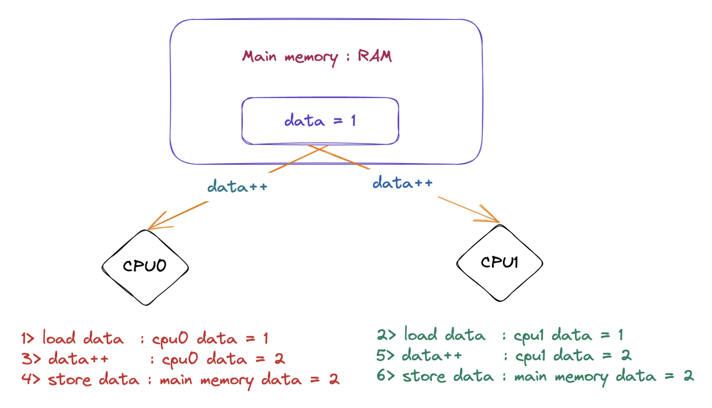

# OpenMP 原子指令设计与实现

## 前言

在本篇文章当中主要与大家分享一下 openmp 当中的原子指令 atomic，分析 `#pragma omp atomic` 在背后究竟做了什么，编译器是如何处理这条指令的。

## 为什么需要原子指令

加入现在有两个线程分别执行在 CPU0 和 CPU1，如果这两个线程都要对同一个共享变量进行更新操作，就会产生竞争条件。如果没有保护机制来避免这种竞争，可能会导致结果错误或者程序崩溃。原子指令就是解决这个问题的一种解决方案，它能够保证操作的原子性，即操作不会被打断或者更改。这样就能保证在多线程环境下更新共享变量的正确性。

比如在下面的图当中，两个线程分别在 CPU0 和 CPU1 执行 data++ 语句，如果目前主存当中的 data = 1 ，然后按照图中的顺序去执行，那么主存当中的 data 的最终值等于 2 ，但是这并不是我们想要的结果，因为有两次加法操作我们希望最终在内存当中的 data 的值等于 3 ，那么有什么方法能够保证一个线程在执行 data++ 操作的时候下面的三步操作是原子的嘛（不可以分割）：

- Load data : 从主存当中将 data 加载到 cpu 的缓存。
- data++ : 执行 data + 1 操作。
- Store data : 将 data 的值写回主存。

事实上硬件就给我们提供了这种机制，比如 x86 的 lock 指令，在这里我们先不去讨论这一点，我们将在后文当中对此进行仔细的分析。



## OpenMP 原子指令

在 openmp 当中 `#pragma omp atomic` 的表达式格式如下所示：

```c
#pragma omp atomic
表达式;
```

其中表达式可以是一下几种形式：

```c
x binop = 表达式;
x++;
x--;
++x;
--x;
```

二元运算符 binop 为++， --， +， -， *， /， &， ^， | ， >>， <<或 || ，x 是基本数据类型 int，short，long，float 等数据类型。

 我们现在来使用一个例子熟悉一下上面锁谈到的语法：

```c

#include <stdio.h>
#include <omp.h>

int main()
{
  int data = 1;
#pragma omp parallel num_threads(4) shared(data) default(none)
  {
#pragma omp atomic
    data += data * 2;
  }
  printf("data = %d\n", data);
  return 0;
}
```

上面的程序最终的输出结果如下：

```shell
data = 81
```

上面的 data += data * 2 ，相当于每次操作将 data 的值扩大三倍，因此最终的结果就是 81 。

## 原子操作和锁的区别

OpenMP 中的 atomic 指令允许执行无锁操作，而不会影响其他线程的并行执行。这是通过在硬件层面上实现原子性完成的。锁则是通过软件来实现的，它阻塞了其他线程对共享资源的访问。

在选择使用 atomic 或锁时，应该考虑操作的复杂性和频率。对于简单的操作和高频率的操作，atomic 更加高效，因为它不会影响其他线程的并行执行。但是，对于复杂的操作或者需要多个操作来完成一个任务，锁可能更加合适。

原子操作只能够进行一些简单的操作，如果操作复杂的是没有原子指令进行操作的，这一点我们在后文当中详细谈到，如果你想要原子性的是一个代码块的只能够使用锁，而使用不了原子指令。

## 深入剖析原子指令——从汇编角度

### 加法和减法原子操作

我们现在来仔细分析一下下面的代码的汇编指令，看看编译器在背后为我们做了些什么：

```c
#include <stdio.h>
#include <omp.h>

int main()
{
  int data = 0;
#pragma omp parallel num_threads(4) shared(data) default(none)
  {
#pragma omp atomic
    data += 1;
  }
  printf("data = %d\n", data);
  return 0;
}
```

首先我们需要了解一点编译器会将并行域的代码编译成一个函数，我们现在看看上面的 parallel 并行域的对应的函数的的汇编程序：

```asm
0000000000401193 <main._omp_fn.0>:
  401193:       55                      push   %rbp
  401194:       48 89 e5                mov    %rsp,%rbp
  401197:       48 89 7d f8             mov    %rdi,-0x8(%rbp)
  40119b:       48 8b 45 f8             mov    -0x8(%rbp),%rax
  40119f:       48 8b 00                mov    (%rax),%rax
  4011a2:       f0 83 00 01             lock addl $0x1,(%rax) # 这就是编译出来的原子指令——对应x86平台
  4011a6:       5d                      pop    %rbp
  4011a7:       c3                      retq   
  4011a8:       0f 1f 84 00 00 00 00    nopl   0x0(%rax,%rax,1)
  4011af:       00 
```

在上面的汇编代码当中最终的一条指令就是 `lock addl $0x1,(%rax)`，这条指令便是编译器在编译 `#pragma omp atomic` 的时候将 `data += 1` 转化成硬件的对应的指令。我们可以注意到和普通的加法指令的区别就是这条指令前面有一个 lock ，这是告诉硬件在指令 lock 后面的指令的时候需要保证指令的原子性。

以上就是在 x86 平台下加法操作对应的原子指令。我们现在将上面的 data += 1，改成 data -= 1，在来看一下它对应的汇编程序：

```asm
0000000000401193 <main._omp_fn.0>:
  401193:       55                      push   %rbp
  401194:       48 89 e5                mov    %rsp,%rbp
  401197:       48 89 7d f8             mov    %rdi,-0x8(%rbp)
  40119b:       48 8b 45 f8             mov    -0x8(%rbp),%rax
  40119f:       48 8b 00                mov    (%rax),%rax
  4011a2:       f0 83 28 01             lock subl $0x1,(%rax)
  4011a6:       5d                      pop    %rbp
  4011a7:       c3                      retq   
  4011a8:       0f 1f 84 00 00 00 00    nopl   0x0(%rax,%rax,1)
  4011af:       00 
```

可以看到它和加法指令的主要区别就是 addl 和 subl，其他的程序是一样的。

### 乘法和除法原子操作

我们现在将下面的程序进行编译：

```c

#include <stdio.h>
#include <omp.h>

int main()
{
  int data = 1;
#pragma omp parallel num_threads(4) shared(data) default(none)
  {
#pragma omp atomic
    data *= 2;
  }
  printf("data = %d\n", data);
  return 0;
}
```

上面代码的并行域被编译之后的汇编程序如下所示：

```asm
0000000000401193 <main._omp_fn.0>:
  401193:       55                      push   %rbp
  401194:       48 89 e5                mov    %rsp,%rbp
  401197:       48 89 7d f8             mov    %rdi,-0x8(%rbp)
  40119b:       48 8b 45 f8             mov    -0x8(%rbp),%rax
  40119f:       48 8b 08                mov    (%rax),%rcx
  4011a2:       8b 01                   mov    (%rcx),%eax
  4011a4:       89 c2                   mov    %eax,%edx
  4011a6:       8d 34 12                lea    (%rdx,%rdx,1),%esi # 这条语句的含义为 data *= 2
  4011a9:       89 d0                   mov    %edx,%eax
  4011ab:       f0 0f b1 31             lock cmpxchg %esi,(%rcx)
  4011af:       89 d6                   mov    %edx,%esi
  4011b1:       89 c2                   mov    %eax,%edx
  4011b3:       39 f0                   cmp    %esi,%eax
  4011b5:       75 ef                   jne    4011a6 <main._omp_fn.0+0x13>
  4011b7:       5d                      pop    %rbp
  4011b8:       c3                      retq   
  4011b9:       0f 1f 80 00 00 00 00    nopl   0x0(%rax)
```

我们先不仔细去分析上面的汇编程序，我们先来看一下上面程序的行为：

- 首先加载 data 的值，保存为 temp，这个 temp 的值保存在寄存器当中。
- 然后将 temp 的值乘以 2 保存在寄存器当中。
- 最后比较 temp 的值是否等于 data，如果等于那么就将 data 的值变成 temp ，如果不相等（也就是说有其他线程更改了 data 的值，此时不能赋值给 data）回到第一步，这个操作主要是基于指令 `cmpxchg` 。

上面的三个步骤当中第三步是一个原子操作对应上面的汇编指令 `lock cmpxchg %esi,(%rcx)` ，cmpxchg 指令前面加了 lock 主要是保存这条 cmpxchg 指令的原子性。

如果我们将上面的汇编程序使用 C 语言重写的话，那么就是下面的程序那样：

```c

#include <stdio.h>
#include <stdbool.h>
#include <stdatomic.h>

// 这个函数对应上面的汇编程序
void atomic_multiply(int* data)
{
  int oldval = *data;
  int write = oldval * 2;
  // __atomic_compare_exchange_n 这个函数的作用就是
  // 将 data 指向的值和 old 的值进行比较，如果相等就将 write 的值写入 data
  // 指向的内存地址 如果操作成功返回 true 否则返回 false
  while (!__atomic_compare_exchange_n (data, &oldval, write, false,
                                      __ATOMIC_ACQUIRE, __ATOMIC_RELAXED))
  {
    oldval = *data;
    write = oldval * 2;
  }
}

int main()
{
  int data = 2;
  atomic_multiply(&data);
  printf("data = %d\n", data);
  return 0;
}
```


现在我们在来仔细分析一下上面的汇编程序，首先我们需要仔细了解一下 [cmpxchg](https://www.felixcloutier.com/x86/cmpxchg) 指令，这个指令在上面的汇编程序当中的作用是比较 eax 寄存器和 rcx 寄存器指向的内存地址的数据，如果相等就将 esi 寄存器的值写入到 rcx 指向的内存地址，如果不想等就将 rcx 寄存器指向的内存的值写入到 eax 寄存器。

通过理解上面的指令，在 cmpxchg 指令之后的就是查看是否 esi 寄存器的值写入到了 rcx 寄存器指向的内存地址，如果是则不执行跳转语句，否则指令回到位置 4011a6 重新执行，这就是一个 while 循环。

我们在来看一下将乘法变成除法之后的汇编指令：

```asm
0000000000401193 <main._omp_fn.0>:
  401193:       55                      push   %rbp
  401194:       48 89 e5                mov    %rsp,%rbp
  401197:       48 89 7d f8             mov    %rdi,-0x8(%rbp)
  40119b:       48 8b 45 f8             mov    -0x8(%rbp),%rax
  40119f:       48 8b 08                mov    (%rax),%rcx
  4011a2:       8b 01                   mov    (%rcx),%eax
  4011a4:       89 c2                   mov    %eax,%edx
  4011a6:       89 d0                   mov    %edx,%eax
  4011a8:       c1 e8 1f                shr    $0x1f,%eax
  4011ab:       01 d0                   add    %edx,%eax
  4011ad:       d1 f8                   sar    %eax
  4011af:       89 c6                   mov    %eax,%esi
  4011b1:       89 d0                   mov    %edx,%eax
  4011b3:       f0 0f b1 31             lock cmpxchg %esi,(%rcx)
  4011b7:       89 d6                   mov    %edx,%esi
  4011b9:       89 c2                   mov    %eax,%edx
  4011bb:       39 f0                   cmp    %esi,%eax
  4011bd:       75 e7                   jne    4011a6 <main._omp_fn.0+0x13>
  4011bf:       5d                      pop    %rbp
  4011c0:       c3                      retq   
  4011c1:       66 2e 0f 1f 84 00 00    nopw   %cs:0x0(%rax,%rax,1)
  4011c8:       00 00 00 
  4011cb:       0f 1f 44 00 00          nopl   0x0(%rax,%rax,1)
```

从上面的汇编代码当中的 cmpxchg 和 jne 指令可以看出除法操作使用的还是比较并交换指令(CAS) cmpxchg，并且也是使用 while 循环。

其实复杂的表达式都是使用这个方式实现的：while 循环 + cmpxchg 指令，我们就不一一的将其他的使用方式也拿出来一一解释了。简单的表达式可以直接使用 lock + 具体的指令实现。

## 总结

在本篇文章当中主要是深入剖析了 OpenMP 当中各种原子指令的实现原理以及分析了他们对应的汇编程序，OpenMP 在处理 #pragma omp atomic 的时候如果能够使用原子指令完成需求那就直接使用原子指令，否则的话就使用 CAS cmpxchg 指令和 while 循环完成对应的需求。

---

更多精彩内容合集可访问项目：<https://github.com/Chang-LeHung/CSCore>

关注公众号：一无是处的研究僧，了解更多计算机（Java、Python、计算机系统基础、算法与数据结构）知识。

