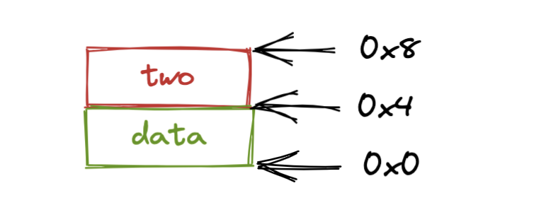
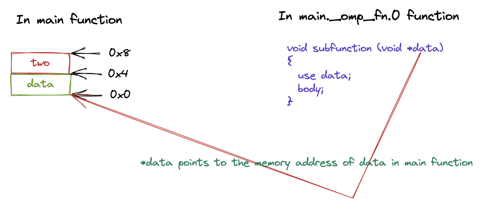
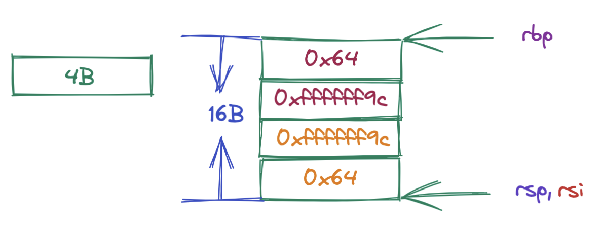

# OpenMP Parallel Construct 实现原理与源码分析

## 前言

在本篇文章当中我们将主要分析 OpenMP 当中的 parallel construct 具体时如何实现的，以及这个 construct 调用了哪些运行时库函数，并且详细分析这期间的参数传递！

## Parallel 分析——编译器角度

在本小节当中我们将从编译器的角度去分析该如何处理 parallel construct 。首先从词法分析和语法分析的角度来说这对编译器并不难，只需要加上一些处理规则，关键是编译器将一个 parallel construct 具体编译成了什么？

下面是一个非常简单的 parallel construct。

```c
#pragma omp parallel
{
  body;
}
```

编译器在遇到上面的 parallel construct 之后会将代码编译成下面的样子：

```c
void subfunction (void *data)
{
  use data;
  body;
}

setup data;
GOMP_parallel_start (subfunction, &data, num_threads);
subfunction (&data);
GOMP_parallel_end ();
```

首先 parallel construct 中的代码块会被编译成一个函数 sub function，当然了函数名不一定是这个，然后会在使用 `#pragma omp parallel` 的函数当中将一个 parallel construct 编译成 OpenMP 动态库函数的调用，在上面的伪代码当中也指出了，具体会调用 OpenMP 的两个库函数 GOMP_parallel_start 和 GOMP_parallel_end ，并且主线程也会调用函数 subfunction ，我们在后面的文章当中在仔细分析这两个动态库函数的源代码。

## 深入剖析 Parallel 动态库函数参数传递

### 动态库函数分析

在本小节当中，我们主要去分析一下在 OpenMP 当中共享参数是如何传递的，以及介绍函数 GOMP_parallel_start 的几个参数的含义。

首先我们分析函数 GOMP_parallel_start 的参数含义，这个函数的函数原型如下：

```c
void GOMP_parallel_start (void (*fn)(void *), void *data, unsigned num_threads)
```

上面这个函数一共有三个参数：

- 第一个参数 fn 是一个函数指针，主要是用于指向上面编译出来的 subfunction 这个函数的，因为需要多个线程同时执行这个函数，因此需要将这个函数传递过去，让不同的线程执行。
- 第二个参数是传递的数据，我们在并行域当中会使用到共享的或者私有的数据，这个指针主要是用于传递数据的，我们在后面会仔细分析这个参数的使用。
- 第三个参数是表示 num_threads 子句指定的线程个数，如果不指定这个子句默认的参数是 0 ，但是如果你使用了 IF 子句并且条件是 false 的话，那么这个参数的值就是 1 。
- 这个函数的主要作用是启动一个或者多个线程，并且执行函数 fn 。

```c
void GOMP_parallel_end (void)
```

- 这个函数的主要作用是进行线程的同步，因为一个 parallel 并行域需要等待所有的线程都执行完成之后才继续往后执行。除此之外还需要释放线程组的资源并行返回到之前的 omp_in_parallel() 表示的状态。

### 参数传递分析

我们现在使用下面的代码来具体分析参数传递过程：

```c
#include <stdio.h>
#include "omp.h"

int main()
{
  int data = 100;
  int two  = -100;
  printf("start\n");
#pragma omp parallel num_threads(4) default(none) shared(data, two)
  {
    printf("tid = %d data = %d two = %d\n", omp_get_thread_num(), data, two);
  }

  printf("finished\n");
  return 0;
}
```

我们首先来分析一下上面的两个变量 data 和 two 的是如何被传递的，我们首先用图的方式进行表示，然后分析一下汇编程序并且对图进行验证。

上面的代码当中两个变量 `data` 和 `two` 在内存当中的布局结构大致如下所示（假设 data 的初始位置时 0x0）：



那么在函数 GOMP_parallel_start 当中传递的参数 data 就是 0x0 也就是指向 data 的内存地址，如下图所示：



那么根据上面参数传递的情况，我们就可以在 subfunction 当中使用 \*(int\*)data 得到 data 的值，使用 \*((int\*) ((char\*)data + 4)) 得到 two 的值，如果是 private 传递的话我们就可以先拷贝这个数据再使用，如果是 shared 的话，那么我们就可以直接使用指针就行啦。

上面的程序我们用 pthread 大致描述一下，则 pthread 对应的代码如下所示：

```c

#include "pthread.h"
#include "stdio.h"
#include "stdint.h"

typedef struct data_in_main_function{
    int data;
    int two;
}data_in_main_function;

pthread_t threads[4];

void* subfunction(void* data)
{
  int two = ((data_in_main_function*)data)->two;
  int data_ = ((data_in_main_function*)data)->data;
  printf("tid = %ld data = %d two = %d\n", pthread_self(), data_, two);
  return NULL;
}

int main()
{
  // 在主函数申请 8 个字节的栈空间
  data_in_main_function data;
  data.data = 100;
  data.two = -100;
  for(int i = 0; i < 4; ++i)
  {
    pthread_create(&threads[i], NULL, subfunction, &data);
  }
  for(int i = 0; i < 4; ++i)
  {
    pthread_join(threads[i], NULL);
  }
  return 0;
}
```


## 汇编程序分析

在本节当中我们将仔细去分析上面的程序所产生的汇编程序，在本文当中的汇编程序基础 x86_64 平台。在分析汇编程序之前我们首先需要了解一下 x86函数的调用规约，具体来说就是在进行函数调用的时候哪些寄存器保存函数参数以及是第几个函数参数。具体的规则如下所示：

| 寄存器 | 含义       |
| ------ | ---------- |
| rdi    | 第一个参数 |
| rsi    | 第二个参数 |
| rdx    | 第三个参数 |
| rcx    | 第四个参数 |
| r8     | 第五个参数 |
| r9     | 第六个参数 |

我们现在仔细分析一下上面的程序的 main 函数的反汇编程序：

```asm
00000000004006cd <main>:
  4006cd:       55                      push   %rbp
  4006ce:       48 89 e5                mov    %rsp,%rbp
  4006d1:       48 83 ec 10             sub    $0x10,%rsp
  4006d5:       c7 45 fc 64 00 00 00    movl   $0x64,-0x4(%rbp)
  4006dc:       c7 45 f8 9c ff ff ff    movl   $0xffffff9c,-0x8(%rbp)
  4006e3:       bf f4 07 40 00          mov    $0x4007f4,%edi
  4006e8:       e8 93 fe ff ff          callq  400580 <puts@plt>
  4006ed:       8b 45 fc                mov    -0x4(%rbp),%eax
  4006f0:       89 45 f0                mov    %eax,-0x10(%rbp)
  4006f3:       8b 45 f8                mov    -0x8(%rbp),%eax
  4006f6:       89 45 f4                mov    %eax,-0xc(%rbp)
  4006f9:       48 8d 45 f0             lea    -0x10(%rbp),%rax
  4006fd:       ba 04 00 00 00          mov    $0x4,%edx
  400702:       48 89 c6                mov    %rax,%rsi
  400705:       bf 3d 07 40 00          mov    $0x40073d,%edi
  40070a:       e8 61 fe ff ff          callq  400570 <GOMP_parallel_start@plt>
  40070f:       48 8d 45 f0             lea    -0x10(%rbp),%rax
  400713:       48 89 c7                mov    %rax,%rdi
  400716:       e8 22 00 00 00          callq  40073d <main._omp_fn.0>
  40071b:       e8 70 fe ff ff          callq  400590 <GOMP_parallel_end@plt>
  400720:       8b 45 f0                mov    -0x10(%rbp),%eax
  400723:       89 45 fc                mov    %eax,-0x4(%rbp)
  400726:       8b 45 f4                mov    -0xc(%rbp),%eax
  400729:       89 45 f8                mov    %eax,-0x8(%rbp)
  40072c:       bf fa 07 40 00          mov    $0x4007fa,%edi
  400731:       e8 4a fe ff ff          callq  400580 <puts@plt>
  400736:       b8 00 00 00 00          mov    $0x0,%eax
  40073b:       c9                      leaveq 
  40073c:       c3                      retq   
```

从上面的反汇编程序我们可以看到在主函数的汇编代码当中确实调用了函数 GOMP_parallel_start 和 GOMP_parallel_end，并且 subfunction 为 main._omp_fn.0 ，它对应的汇编程序如下所示：

```asm
000000000040073d <main._omp_fn.0>:
  40073d:       55                      push   %rbp
  40073e:       48 89 e5                mov    %rsp,%rbp
  400741:       48 83 ec 10             sub    $0x10,%rsp
  400745:       48 89 7d f8             mov    %rdi,-0x8(%rbp)
  400749:       e8 52 fe ff ff          callq  4005a0 <omp_get_thread_num@plt>
  40074e:       48 8b 55 f8             mov    -0x8(%rbp),%rdx
  400752:       8b 4a 04                mov    0x4(%rdx),%ecx
  400755:       48 8b 55 f8             mov    -0x8(%rbp),%rdx
  400759:       8b 12                   mov    (%rdx),%edx
  40075b:       89 c6                   mov    %eax,%esi
  40075d:       bf 03 08 40 00          mov    $0x400803,%edi
  400762:       b8 00 00 00 00          mov    $0x0,%eax
  400767:       e8 44 fe ff ff          callq  4005b0 <printf@plt>
  40076c:       c9                      leaveq 
  40076d:       c3                      retq   
  40076e:       66 90                   xchg   %ax,%ax
```

### GOMP_parallel_start 详细参数分析

- `void (*fn)(void *)`， 我们现在来看一下函数 GOMP_parallel_start 的第一个参数，根据我们前面谈到的第一个参数应该保存在 rdi 寄存器，我们现在分析一下在 main 函数的反汇编程序当中在调用函数 GOMP_parallel_start 之前 rdi 寄存器的值。我们可以看到在 main 函数位置为 4006f8 的地方的指令  `mov $0x40073d,%edi` 可以看到 rdi 寄存器的值为 0x40073d （edi 寄存器是 rdi 寄存器的低 32 位），我们可以看到 函数 main._omp_fn.0 的起始地址就是 0x40073d ，因此我们就可以在函数 GOMP_parallel_start 使用这个函数指针了，最终在启动的线程当中调用这个函数。

- `void *data`，这是函数 GOMP_parallel_start 的第二个参数，根据前面的分析第二个参数保存在 rsi 寄存器当中，我现在将 main 数当中和 rsi 相关的指令选择出来：

```asm
00000000004006cd <main>:
  4006cd:       55                      push   %rbp
  4006ce:       48 89 e5                mov    %rsp,%rbp
  4006d1:       48 83 ec 10             sub    $0x10,%rsp
  4006d5:       c7 45 fc 64 00 00 00    movl   $0x64,-0x4(%rbp)
  4006dc:       c7 45 f8 9c ff ff ff    movl   $0xffffff9c,-0x8(%rbp)
  4006ed:       8b 45 fc                mov    -0x4(%rbp),%eax
  4006f0:       89 45 f0                mov    %eax,-0x10(%rbp)
  4006f3:       8b 45 f8                mov    -0x8(%rbp),%eax
  4006f6:       89 45 f4                mov    %eax,-0xc(%rbp)
  4006f9:       48 8d 45 f0             lea    -0x10(%rbp),%rax
  400702:       48 89 c6                mov    %rax,%rsi
```

上面的汇编程序的栈空间以及在调用函数之前 GOMP_parallel_start 部分寄存器的指向如下所示：



最终在调用函数 GOMP_parallel_start 之前 rsi 寄存器的指向如上图所示，上图当中 rsi 的指向的内存地址作为参数传递过去。根据上文谈到的 subfunction 中的参数可以知道，在函数 main._omp_fn.0 当中的 rdi 寄存器（也就是第一个参数 \*data）的值就是上图当中 rsi 寄存器指向的内存地址的值（事实上也就是 rsi 寄存器的值）。大家可以自行对照着函数 main._omp_fn.0  的汇编程序对 rdi 寄存器的使用就可以知道这其中的参数传递的过程了。

- `unsigned num_threads`，根据前文提到的保存第三个参数的寄存器是 rdx，在 main 函数的位置 4006fd 处，指令为 mov $0x4,%edx，这和我们自己写的程序是一致的都是 4 (0x4)。

## 动态库函数源码分析

### GOMP_parallel_start 源码分析

我们首先来看一下函数 GOMP_parallel_start 的源代码：

```c
void
GOMP_parallel_start (void (*fn) (void *), void *data, unsigned num_threads)
{
  num_threads = gomp_resolve_num_threads (num_threads, 0);
  gomp_team_start (fn, data, num_threads, gomp_new_team (num_threads));
}
```

在这里我们对函数 gomp_team_start 进行分析，其他两个函数 gomp_resolve_num_threads 和 gomp_new_team 只简单进行作用说明，太细致的源码分析其实是没有必要的，感兴趣的同学自行分析即可，我们只需要了解整个执行流程即可。

- gomp_resolve_num_threads，这个函数的主要作用是最终确定需要几个线程去执行任务，因为我们可能并没有使用 num_threads 子句，而且这个值和环境变量也有关系，因此需要对线程的个数进行确定。
- gomp_new_team，这个函数的主要作用是创建包含 num_threads 个线程数据的线程组，并且对数据进行初始化操作。
- gomp_team_start，这个函数的主要作用是启动 num_threads 个线程去执行函数 fn ，这其中涉及一些细节，比如说线程的亲和性（affinity）设置。

由于 gomp_team_start 的源代码太长了，这里只是节选部分源程序进行分析：

```c
  /* Launch new threads.  */
  for (; i < nthreads; ++i, ++start_data)
    {
      pthread_t pt;
      int err;

      start_data->fn = fn; // 这行代码就是将 subfunction 函数指针进行保存最终在函数  gomp_thread_start 当中进行调用
      start_data->fn_data = data; // 这里保存函数 subfunction 的函数参数
      start_data->ts.team = team; // 线程的所属组
      start_data->ts.work_share = &team->work_shares[0];
      start_data->ts.last_work_share = NULL;
      start_data->ts.team_id = i; // 线程的 id 我们可以使用函数 omp_get_thread_num 得到这个值
      start_data->ts.level = team->prev_ts.level + 1;
      start_data->ts.active_level = thr->ts.active_level;
#ifdef HAVE_SYNC_BUILTINS
      start_data->ts.single_count = 0;
#endif
      start_data->ts.static_trip = 0;
      start_data->task = &team->implicit_task[i];
      gomp_init_task (start_data->task, task, icv);
      team->implicit_task[i].icv.nthreads_var = nthreads_var;
      start_data->thread_pool = pool;
      start_data->nested = nested;
			// 如果使用了线程的亲和性那么还需要进行亲和性设置
      if (gomp_cpu_affinity != NULL)
	gomp_init_thread_affinity (attr);

      err = pthread_create (&pt, attr, gomp_thread_start, start_data);
      if (err != 0)
	gomp_fatal ("Thread creation failed: %s", strerror (err));
    }
```

上面的程序就是最终启动线程的源程序，可以看到这是一个 for 循环并且启动 nthreads 个线程，`pthread_create` 是真正创建了线程的代码，并且让线程执行函数 gomp_thread_start 可以看到线程不是直接执行 subfunction 而是将这个函数指针保存到 start_data 当中，并且在函数 gomp_thread_start 真正去调用这个函数，看到这里大家应该明白了整个 parallel construct 的整个流程了。

gomp_thread_start 的函数题也相对比较长，在这里我们选中其中的比较重要的几行代码，其余的代码进行省略。对比上面线程启动的 pthread_create 语句我们可以知道，下面的程序真正的调用了 subfunction，并且给这个函数传递了对应的参数。

```c
static void *
gomp_thread_start (void *xdata)
{
  struct gomp_thread_start_data *data = xdata;
  /* Extract what we need from data.  */
  local_fn = data->fn;
  local_data = data->fn_data;
  local_fn (local_data);
  return NULL;
}

```

### GOMP_parallel_end 分析

这个函数的主要作用就是一个同步点，保证所有的线程都执行完成之后再继续往后执行，这一部分的源代码比较杂，其核心原理就是使用路障 barrier 去实现的，这其中是 OpenMP 自己实现的一个 barrier 而不是直接使用 pthread 当中的 barrier ，这一部分的源程序就不进行仔细分析了，感兴趣的同学可以自行阅读，可以参考 [OpenMP 锁实现原理](https://mp.weixin.qq.com/s?__biz=Mzg3ODgyNDgwNg==&mid=2247487476&idx=1&sn=ed37c95595582b049f145576ce4c7060&chksm=cf0c93fdf87b1aeb1ce1aac1b1851b7cccb7cb1f0466b4715c8ec3eb7af27eb71dca1e2d9d1c&token=762829354&lang=zh_CN#rd) 。

## 总结

在本篇文章当中主要给大家介绍了 parallel construct 的实现原理，以及他的动态库函数的调用以及源代码分析，大家只需要了解整个流程不太需要死扣细节（这并无很大的用处）只有当我们自己需要去实现 OpenMP 的时候需要去了解这些细节，不然我们只需要了解整个动态库的设计原理即可！

---

更多精彩内容合集可访问项目：<https://github.com/Chang-LeHung/CSCore>

关注公众号：一无是处的研究僧，了解更多计算机（Java、Python、计算机系统基础、算法与数据结构）知识。

