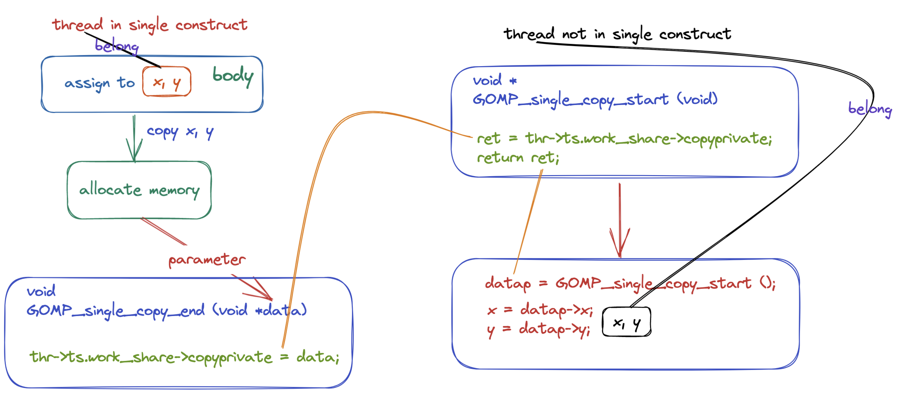

# OpenMP 线程同步 Construct 实现原理以及源码分析（下）

## 前言

在上面文章当中我们主要分析了 flush, critical, master 这三个 construct 的实现原理。在本篇文章当中我们将主要分析另外两个 construct : barrier 和 single 。

## Barrier Construct

### 编译器角度分析

在本小节当中我们主要介绍 `#pragma omp barrier` 的使用，事实上这个 construct 在编译器的处理上非常简单，只是将这条编译指导语句变成了一个函数调用。

```c
void GOMP_barrier (void)
```

每一条 `#pragma omp barrier` 都会变成调用函数 GOMP_barrier 。我们来看一个示例程序：

```c

#include <stdio.h>
#include <omp.h>

int main()
{
#pragma omp parallel num_threads(4) default(none)
  {
    printf("tid = %d start\n", omp_get_thread_num());
#pragma omp barrier
    printf("tid = %d end\n", omp_get_thread_num());
  }
  return 0;
}
```

在前面的文章当中我们已经提到了编译器会将一个 parallel construct 编译成一个函数，上面的 parallel construct 被编译的之后的结果如下所示，可以看到确实编译成了调用函数 GOMP_barrier 。

```asm
000000000040118a <main._omp_fn.0>:
  40118a:       55                      push   %rbp
  40118b:       48 89 e5                mov    %rsp,%rbp
  40118e:       48 83 ec 10             sub    $0x10,%rsp
  401192:       48 89 7d f8             mov    %rdi,-0x8(%rbp)
  401196:       e8 a5 fe ff ff          callq  401040 <omp_get_thread_num@plt>
  40119b:       89 c6                   mov    %eax,%esi
  40119d:       bf 10 20 40 00          mov    $0x402010,%edi
  4011a2:       b8 00 00 00 00          mov    $0x0,%eax
  4011a7:       e8 a4 fe ff ff          callq  401050 <printf@plt>
  4011ac:       e8 7f fe ff ff          callq  401030 <GOMP_barrier@plt>
  4011b1:       e8 8a fe ff ff          callq  401040 <omp_get_thread_num@plt>
  4011b6:       89 c6                   mov    %eax,%esi
  4011b8:       bf 20 20 40 00          mov    $0x402020,%edi
  4011bd:       b8 00 00 00 00          mov    $0x0,%eax
  4011c2:       e8 89 fe ff ff          callq  401050 <printf@plt>
  4011c7:       c9                      leaveq 
  4011c8:       c3                      retq   
  4011c9:       0f 1f 80 00 00 00 00    nopl   0x0(%rax)
```

### 源码分析

```c
void
GOMP_barrier (void)
{
  // 得到当前线程的相关数据
  struct gomp_thread *thr = gomp_thread ();
  // 得到当前线程的线程组
  struct gomp_team *team = thr->ts.team;

  /* It is legal to have orphaned barriers.  */
  if (team == NULL)
    return;
  // 使用线程组内部的 barrier 只有所有的线程都到达这个同步点之后才能够继续往后执行
  // 否则就需要进入内核挂起 
  gomp_team_barrier_wait (&team->barrier);
}
```

上面的代码就是使用当前线程线程组内部的 barrier ，让线程组当中的所有线程都到达同步点之后才继续往后执行，如果你使用过 pthread 中的线程同步工具路障 pthread_barrier_t 的话就很容易理解了。

在继续往后分析程序之前我们首先需要了解两个数据类型：

```c
typedef struct
{
  /* Make sure total/generation is in a mostly read cacheline, while
     awaited in a separate cacheline.  */
  unsigned total __attribute__((aligned (64)));
  unsigned generation;
  unsigned awaited __attribute__((aligned (64)));
} gomp_barrier_t;
typedef unsigned int gomp_barrier_state_t;
```

我们重点分析一下 gomp_barrier_t ，team->barrier 就是这个变量类型，在这个结构体当中一共有三个变量我们重点分析第一个和第三个变量的含义：

- total，这个变量表示一个需要等待多少个线程到达同步点之后才能够继续往后执行。
- awaited，这个变量表示还需要等待多少个线程。
- 初始化的时候 total 和 awaited 这两个变量是相等的，当有一个线程到达之后 awaited 就减去 1 。
- generation 这个变量与 OpenMP 当中的 task 有关，这个变量稍微有点复杂，由于我们的分析不涉及到 OpenMP 当中的任务，因此这类对这个变量不做分析，这个变量的初始值等于 0。

结构体 gomp_barrier_t 初始化函数如下所示：

```c
static inline void gomp_barrier_init (gomp_barrier_t *bar, unsigned count)
{
  bar->total = count;
  bar->awaited = count;
  bar->generation = 0;
}
```

现在我们来对函数 gomp_team_barrier_wait 进行分析，关于代码的详细都在代码的对应位置：

```c
void
gomp_team_barrier_wait (gomp_barrier_t *bar)
{
  gomp_team_barrier_wait_end (bar, gomp_barrier_wait_start (bar));
}

static inline gomp_barrier_state_t
gomp_barrier_wait_start (gomp_barrier_t *bar)
{
  // 因为我们不分析 OpenMP 当中的 task ,因此在这里可能认为 generation 始终等于 0 
  // 那么 ret 也等于 0
  unsigned int ret = __atomic_load_n (&bar->generation, MEMMODEL_ACQUIRE) & ~3;
  /* A memory barrier is needed before exiting from the various forms
     of gomp_barrier_wait, to satisfy OpenMP API version 3.1 section
     2.8.6 flush Construct, which says there is an implicit flush during
     a barrier region.  This is a convenient place to add the barrier,
     so we use MEMMODEL_ACQ_REL here rather than MEMMODEL_ACQUIRE.  */
  // 这里将 awaited 还需要等待的线程数 -1 并且判断 awaited 是否等于 0
  // 如果等于 0 则返回 1 反之则返回 0 如果不考虑 task 只有最后一个到达同步点的线程
  // 才会返回 1
  ret += __atomic_add_fetch (&bar->awaited, -1, MEMMODEL_ACQ_REL) == 0;
  return ret;
}


// 为了方便阅读下面的代码已经删除了与 task 相关的部分
void
gomp_team_barrier_wait_end (gomp_barrier_t *bar, gomp_barrier_state_t state)
{
  unsigned int generation, gen;
	// 如果 state 等于 1 将会进入下面的 if 语句
  if (__builtin_expect ((state & 1) != 0, 0))
    {
    	// 如果是最后一个线程到达这里，那么将会重新将 awaited 变成 total
      /* Next time we'll be awaiting TOTAL threads again.  */
      struct gomp_thread *thr = gomp_thread ();
      struct gomp_team *team = thr->ts.team;

      bar->awaited = bar->total;
    // 如果还有需要执行的任务 那么将进入 if 语句
      if (__builtin_expect (team->task_count, 0))
	{
	  gomp_barrier_handle_tasks (state);
	  state &= ~1;
	}
      else
	{
    // 如果没有需要执行的任务 那么则需要将之前被挂起的线程全部唤醒
	  __atomic_store_n (&bar->generation, state + 3, MEMMODEL_RELEASE);
	  futex_wake ((int *) &bar->generation, INT_MAX);
	  return;
	}
    }
  // 如果 if 条件不满足，也就是说到达 barrier 的线程不是最后一个线程
  // 那么将会执行到这里进行挂起
  
  // 这里省略了代码 如果程序执行到这里将会被继续挂起 直到上面的 futex_wake 被执行
}

```

### 技巧分析

- 在上面的结构体 gomp_barrier_t 当中有语句 `unsigned total __attribute__((aligned (64)));` 后面的 __attribute__((aligned (64))) 表示这个字段需要使用 64 字节对齐，那么这个字段也占 64 字节，一般来说一个缓存行有 64 个字节的数据，也就是说这三个字段的数据不会存储在同一个缓存行，这样的话多个线程在操作这三个数据的时候不会产生假共享 (false sharing) 的问题，这可以很提高程序的效率。

- 我们在前面讨论 critical construct 的时候谈到啦 critical 有匿名和命令两种方式：

```c
#pragma omp critical
#pragma omp critical(name)
```

那么按道理来说 barrier 也应该有两种方式啊，那么为什么会没有呢？根据前面的程序分析，我们可以知道，最重要的一行代码是 `gomp_team_barrier_wait (&team->barrier);` 因为每一个线程都属于一个线程组，每个线程组内部都有一个 barrier ，因此当进行同步的时候只需要使用线程组内部的 barrier 即可，因此不需要使用命名的 barrier。

## Single Construct

### #pragma omp single

在本小节当中我们主要分析 single construct ，他的一半形式如下所示：

```c
#pragma omp single
{
  body;
}
```

类似于上面的结构的代码会被编译器编译成如下形式：

```c
if (GOMP_single_start ())
  body;
GOMP_barrier ();
```

关于 GOMP_barrier 函数我们在前面的内容当中已经进行了详细的分析，他的功能就是使用一个线程组内部的 barrier 变量，当所有的线程都到达这个位置之后才放行所有线程，让他们继续执行，如果线程组的线程没有全部到达同步点，则到达同步点的线程会被挂起。

我们使用一个实际的例子进行分析，看一下最终被编译成的程序是什么样子：

```c
#include <stdio.h>
#include <omp.h>

int main()
{
#pragma omp parallel num_threads(4) default(none)
  {
#pragma omp single
    {
      printf("Hello World\n");
    }

    printf("tid = %d\n", omp_get_thread_num());
  }
  return 0;
}
```

上面的 parallel 代码块被编译之后的反汇编程序如下所示：

```asm
00000000004011aa <main._omp_fn.0>:
  4011aa:       55                      push   %rbp
  4011ab:       48 89 e5                mov    %rsp,%rbp
  4011ae:       48 83 ec 10             sub    $0x10,%rsp
  4011b2:       48 89 7d f8             mov    %rdi,-0x8(%rbp)
  4011b6:       e8 c5 fe ff ff          callq  401080 <GOMP_single_start@plt>
  4011bb:       3c 01                   cmp    $0x1,%al
  4011bd:       74 1d                   je     4011dc <main._omp_fn.0+0x32>
  4011bf:       e8 7c fe ff ff          callq  401040 <GOMP_barrier@plt>
  4011c4:       e8 87 fe ff ff          callq  401050 <omp_get_thread_num@plt>
  4011c9:       89 c6                   mov    %eax,%esi
  4011cb:       bf 10 20 40 00          mov    $0x402010,%edi
  4011d0:       b8 00 00 00 00          mov    $0x0,%eax
  4011d5:       e8 86 fe ff ff          callq  401060 <printf@plt>
  4011da:       eb 0c                   jmp    4011e8 <main._omp_fn.0+0x3e>
  4011dc:       bf 1a 20 40 00          mov    $0x40201a,%edi
  4011e1:       e8 4a fe ff ff          callq  401030 <puts@plt>
  4011e6:       eb d7                   jmp    4011bf <main._omp_fn.0+0x15>
  4011e8:       c9                      leaveq 
  4011e9:       c3                      retq   
  4011ea:       66 0f 1f 44 00 00       nopw   0x0(%rax,%rax,1)
```

从上面的汇编程序我们可以看到，被编译的程序确实调用了函数 GOMP_single_start，如果这个函数的返回值不等于 true 的时候就会执行函数 GOMP_barrier 。这和我们上面的分析是一样的。

现在最主要的函数就是 GOMP_single_start ，他的源代码如下所示：

```c
bool
GOMP_single_start (void)
{
  struct gomp_thread *thr = gomp_thread ();
  struct gomp_team *team = thr->ts.team;
  unsigned long single_count;
	
  if (__builtin_expect (team == NULL, 0))
    return true;
	// 首先获得线程本地保存的遇到的 single construct 数量
  // 并且将这个数量进行加一操作 因为又遇到了一次
  single_count = thr->ts.single_count++;
  // 如果下面的操作还没有完成 线程组中保存的 single_count 和 线程
  // 本地的 single_count 是相等的，因此才可以进行下面的比较并交换
  // 操作，当有一个线程成功之后 后面的线程执行下面的语句都会返回 false
  return __sync_bool_compare_and_swap (&team->single_count, single_count,
				       single_count + 1L);
}
```

上面函数只有一个线程会执行返回 true ，其他的线程执行都会返回 false，因此可以保证只有一个线程执行，single construct 代码块，上面的执行的主要原理就是依赖比较并交换指令 (compare and swap , CAS) 指令实现的。

在分析上面的代码的时候需要注意 team->single_count 和 thr->ts.single_count，这是两个不同的数据。__sync_bool_compare_and_swap 是编译器内置的一个函数，这个函数的主要作用是将 &team->single_count 指向的数据和 single_count 进行比较，如果这两个数据相等则进行交换操作，如果操作成功就返回 true，否则就返回 false 。

### #pragma omp single copyprivate(...)

在这一小节当中我们将介绍一个比较少用的子句 copyprivate，并且分析 single construct 在处理这个子句的时候是如何进行处理的。

我们首先来了解一下这个子句改如何使用，这个是用于在 single construct 当中，当一个变量在每个线程当中都有一个副本的时候，在执行完成 single construct 之后只有一个线程的数据会被修改，如果想让所有线程知道这个修改，那么就需要使用 copyprivate ，比如下面的例子：

```c
#include <stdio.h>
#include <omp.h>

int x = 100;
int y = -100;
#pragma omp threadprivate(x, y)

int main()
{
#pragma omp parallel num_threads(4) default(none) copyin(x)
  {
    x = omp_get_thread_num();
    printf("tid = %d x = %d\n", omp_get_thread_num(), x);
#pragma omp single copyprivate(x, y)
    {
      x = 200;
      y = -200;
    }
    printf("tid = %d x = %d y = %d\n", omp_get_thread_num(), x, y);
  }
  return 0;
}
```

在上面的程序当中 x 是一个全局变量，`#pragma omp threadprivate(x)` 会让每个线程都会有一个全局变量 x  的线程本地的副本，copyin(x) 是将全局变量 x 的值拷贝到每个线程本地的变量副本当中。我们知道只会有一个线程执行 single construct ，那么只会有执行 single 代码的线程当中的 x 会变成 200，但是因为有 copyprivate，在线程执行完 single 代码块之后会将修改之后的 x 值赋给其他的线程，这样的话其他线程的 x 的值也变成 200 啦。上面的代码执行结果如下：

```shell
tid = 2 x = 2
tid = 3 x = 3
tid = 0 x = 0
tid = 1 x = 1
tid = 3 x = 200 y = -200
tid = 0 x = 200 y = -200
tid = 2 x = 200 y = -200
tid = 1 x = 200 y = -200
```

如果我们写的代码如下所示：

```c
#pragma omp single copyprivate(x, y)
  body;
```

上面的代码会被编译器翻译成下面的样子：

```c
datap = GOMP_single_copy_start ();
if (datap == NULL)
  {
    body;
    data = allocate memory;
    data.x = x;
    data.y = y;
    GOMP_single_copy_end (&data);
  }
else
{
  x = datap->x;
  y = datap->y;
}
GOMP_barrier ();
```

首先我们来了解一下 GOMP_single_copy_start 的返回值：

- 如果这个线程的返回值是 NULL，那么就说明这个线程会执行 single construct 中的代码，反之线程就不会执行 single 中的代码。
- 如果线程没有获得 single 代码块的执行权的话，那么这个线程将会被阻塞在函数 GOMP_single_copy_start 当中，只有 single 中的代码被执行完成之后线程才会被唤醒，具体来说是执行 single 代码块的线程进入到 GOMP_single_copy_end 中之后才会唤醒其他的线程，之所以这么做的原因是首先要得到最终的 x 的值，然后将这个值通过线程组之间的共享变量让没有执行 single 代码块的线程能够获得执行 single 代码块的线程当中的 x 的值，因为在没有执行完成 single 代码块之后是不能够知道 x 的最终的值的，而不知道 x 的最终的值，是不能够执行 `x = datap->x;` 的，因此需要将线程阻塞在 GOMP_single_copy_start 当中。
- 如果线程的返回值不等于 NULL，那么就说明这个线程没有获取到 single 代码块的执行权，这个返回值 datap 是指向 threadprivate 数据的指针，比如上面的例子就是指向 x 的指针，因为可以做到申请 x, y 内存空间的时候是连续的，知道 x 的指针和 x 的大小就可以计算出线程私有变量 y 的地址，这是编译器可以做到的。

上面的两个动态库函数的源代码如下所示（详细的说明已经在注释当中）：

```c
/* This routine is called when first encountering a SINGLE construct that
   does have a COPYPRIVATE clause.  Returns NULL if this is the thread
   that should execute the clause; otherwise the return value is pointer
   given to GOMP_single_copy_end by the thread that did execute the clause.  */

void *
GOMP_single_copy_start (void)
{
  struct gomp_thread *thr = gomp_thread ();

  bool first;
  void *ret;
	
  // 这个函数可以返回 true 或者 false 如果线程需要执行 single 代码块
  // 则返回 true, 否则返回 false
  first = gomp_work_share_start (0);
  
  if (first)
    {
      gomp_work_share_init_done ();
      ret = NULL;
    }
  else
    {
    	// 我们在前面提到了 没有执行 single 代码块的线程会被阻塞在这个函数当中
    	// 实际就是在这个位置进行阻塞的，以保证 copyprivate 当中的变量的值已经被更新啦
      gomp_team_barrier_wait (&thr->ts.team->barrier);
			// 这里就是没执行 single 代码块的线程的函数返回值
    	// 执行 single 代码块的线程会将 x, y 拷贝一份并且将指向 x, y 内存地址的
    	// 指针赋值给变量 thr->ts.work_share->copyprivate; （在函数 GOMP_single_copy_end 当中可以看到具体的代码）
      ret = thr->ts.work_share->copyprivate;
      gomp_work_share_end_nowait ();
    }

  return ret;
}

/* This routine is called when the thread that entered a SINGLE construct
   with a COPYPRIVATE clause gets to the end of the construct.  */

void
GOMP_single_copy_end (void *data)
{
  struct gomp_thread *thr = gomp_thread ();
  struct gomp_team *team = thr->ts.team;

  if (team != NULL)
    {
    	// 这个函数只有执行了 single 代码块的线程才会执行
    	// 我们在前面已经提到了传给这个函数的参数是指向 x, y 
    	// 内存地址的指针，现在将这个指针赋值给 thr->ts.work_share->copyprivate
    	// 那么其他的线程就能够通过 thr->ts.work_share->copyprivate 获取到 x, y 
    	// 的值啦
      thr->ts.work_share->copyprivate = data;
    	// 因为前面线程都被阻塞了 需要等待所有的线程都到达之后才能够继续往后执行
    	// 因此这个线程需要进入 barrier ，当所有的线程都到达之后那么就能够继续往后执行了
      gomp_team_barrier_wait (&team->barrier);
    }

  gomp_work_share_end_nowait ();
}
```

上面的整个流程如下图所示：



我们在来看一下前面提到的使用 single copyprivate(x, y) 的程序

```c
#pragma omp parallel num_threads(4) default(none) copyin(x)
  {
    x = omp_get_thread_num();
    printf("tid = %d x = %d\n", omp_get_thread_num(), x);
#pragma omp single copyprivate(x, y)
    {
      x = 200;
      y = -200;
    }
    printf("tid = %d x = %d y = %d\n", omp_get_thread_num(), x, y);
  }
```

编译之后的汇编程序是怎么样的（重要的部分已在代码当中进行标出）：

```asm
00000000004011bb <main._omp_fn.0>:
  4011bb:       55                      push   %rbp
  4011bc:       48 89 e5                mov    %rsp,%rbp
  4011bf:       41 54                   push   %r12
  4011c1:       53                      push   %rbx
  4011c2:       48 83 ec 20             sub    $0x20,%rsp
  4011c6:       48 89 7d d8             mov    %rdi,-0x28(%rbp)
  4011ca:       e8 81 fe ff ff          callq  401050 <omp_get_thread_num@plt>
  4011cf:       85 c0                   test   %eax,%eax
  4011d1:       0f 85 c2 00 00 00       jne    401299 <main._omp_fn.0+0xde>
  4011d7:       e8 74 fe ff ff          callq  401050 <omp_get_thread_num@plt>
  4011dc:       64 89 04 25 f8 ff ff    mov    %eax,%fs:0xfffffffffffffff8
  4011e3:       ff 
  4011e4:       64 8b 1c 25 f8 ff ff    mov    %fs:0xfffffffffffffff8,%ebx
  4011eb:       ff 
  4011ec:       e8 5f fe ff ff          callq  401050 <omp_get_thread_num@plt>
  4011f1:       89 da                   mov    %ebx,%edx
  4011f3:       89 c6                   mov    %eax,%esi
  4011f5:       bf 10 20 40 00          mov    $0x402010,%edi
  4011fa:       b8 00 00 00 00          mov    $0x0,%eax
  4011ff:       e8 5c fe ff ff          callq  401060 <printf@plt>
  401204:       e8 87 fe ff ff          callq  401090 <GOMP_single_copy_start@plt>
  401209:       48 85 c0                test   %rax,%rax
  40120c:       74 4c                   je     40125a <main._omp_fn.0+0x9f>
  40120e:       eb 33                   jmp    401243 <main._omp_fn.0+0x88>
  401210:       e8 1b fe ff ff          callq  401030 <GOMP_barrier@plt>
  401215:       64 44 8b 24 25 fc ff    mov    %fs:0xfffffffffffffffc,%r12d
  40121c:       ff ff 
  40121e:       64 8b 1c 25 f8 ff ff    mov    %fs:0xfffffffffffffff8,%ebx
  401225:       ff 
  401226:       e8 25 fe ff ff          callq  401050 <omp_get_thread_num@plt>
  40122b:       44 89 e1                mov    %r12d,%ecx
  40122e:       89 da                   mov    %ebx,%edx
  401230:       89 c6                   mov    %eax,%esi
  401232:       bf 21 20 40 00          mov    $0x402021,%edi
  401237:       b8 00 00 00 00          mov    $0x0,%eax
  40123c:       e8 1f fe ff ff          callq  401060 <printf@plt>
  401241:       eb 69                   jmp    4012ac <main._omp_fn.0+0xf1>
  # //////////// 没有获得 single construct 执行权的线程将执行下面的代码 ///////////
  # 下面的 5 条汇编指令其实就是将 x, y 的数据拷贝到线程的私有数据 thread local storage
  401243:       8b 50 04                mov    0x4(%rax),%edx # 
  401246:       64 89 14 25 fc ff ff    mov    %edx,%fs:0xfffffffffffffffc
  40124d:       ff 
  40124e:       8b 00                   mov    (%rax),%eax
  401250:       64 89 04 25 f8 ff ff    mov    %eax,%fs:0xfffffffffffffff8
  401257:       ff 
  # ////////////////////////////////////////////////////////////////////////
  401258:       eb b6                   jmp    401210 <main._omp_fn.0+0x55>
  # //////////// 获得 single construct 执行权的线程将执行下面的代码 //////////////
  # 下面的代码就是 x = 200
  40125a:       64 c7 04 25 f8 ff ff    movl   $0xc8,%fs:0xfffffffffffffff8
  401261:       ff c8 00 00 00 
  # 下面的代码就是 y = -200
  401266:       64 c7 04 25 fc ff ff    movl   $0xffffff38,%fs:0xfffffffffffffffc
  40126d:       ff 38 ff ff ff 
  # 下面的代码就是将 y 的值保存到 eax 寄存器
  401272:       64 8b 04 25 fc ff ff    mov    %fs:0xfffffffffffffffc,%eax
  401279:       ff 
  # 将 eax 寄存器的值保存到栈上
  40127a:       89 45 ec                mov    %eax,-0x14(%rbp)
  # 将 x 的值保存到 eax 寄存器
  40127d:       64 8b 04 25 f8 ff ff    mov    %fs:0xfffffffffffffff8,%eax
  401284:       ff 
  # 将 eax 寄存器的值保存到栈上
  401285:       89 45 e8                mov    %eax,-0x18(%rbp)
  # 上面的几行代码就完成了线程私有数据的拷贝 下面的代码就是将栈上保存 x, y 的内存地址通过参数传递给函数 GOMP_single_copy_end 这样就可以保存在 thr->ts.work_share->copyprivate 上啦
  401288:       48 8d 45 e8             lea    -0x18(%rbp),%rax
  40128c:       48 89 c7                mov    %rax,%rdi
  40128f:       e8 ac fd ff ff          callq  401040 <GOMP_single_copy_end@plt>
  # ////////////////////////////////////////////////////////////////////////
  401294:       e9 77 ff ff ff          jmpq   401210 <main._omp_fn.0+0x55>
  401299:       48 8b 45 d8             mov    -0x28(%rbp),%rax
  40129d:       8b 00                   mov    (%rax),%eax
  40129f:       64 89 04 25 f8 ff ff    mov    %eax,%fs:0xfffffffffffffff8
  4012a6:       ff 
  4012a7:       e9 2b ff ff ff          jmpq   4011d7 <main._omp_fn.0+0x1c>
  4012ac:       48 83 c4 20             add    $0x20,%rsp
  4012b0:       5b                      pop    %rbx
  4012b1:       41 5c                   pop    %r12
  4012b3:       5d                      pop    %rbp
  4012b4:       c3                      retq   
  4012b5:       66 2e 0f 1f 84 00 00    nopw   %cs:0x0(%rax,%rax,1)
  4012bc:       00 00 00 
  4012bf:       90                      nop
```

## 总结

在本篇文章当中主要给大家深入分析了 barrier construct 的实现原理，以及 single construct 的两种使用方式并且深入分析了 copy private 的实现原理，具体的线程私有数据是如果通过 OpenMP 库函数进行传递的，整个过程还是有些复杂的，需要仔细的对整个流程进行思考才能够理解。以上就是本篇文章的所有内容希望大家有所收获！

---

更多精彩内容合集可访问项目：<https://github.com/Chang-LeHung/CSCore>

关注公众号：一无是处的研究僧，了解更多计算机（Java、Python、计算机系统基础、算法与数据结构）知识。


