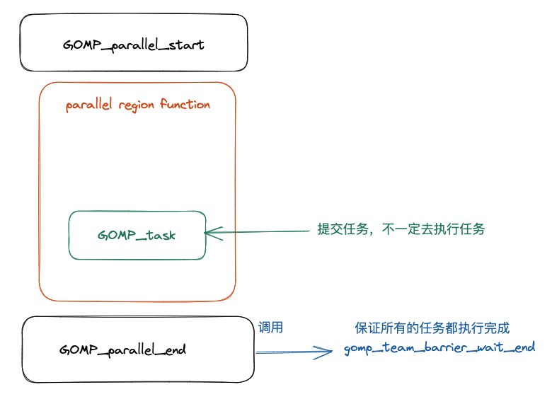
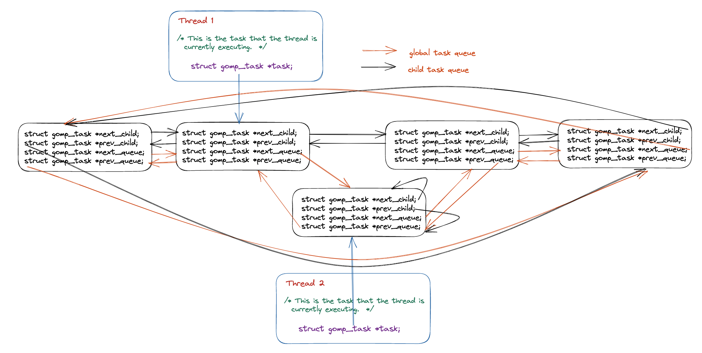

# OpenMP task construct 实现原理以及源码分析

## 前言

在本篇文章当中主要给大家介绍在 OpenMP 当中 task 的实现原理，以及他调用的相关的库函数的具体实现。在本篇文章当中最重要的就是理解整个 OpenMP 的运行机制。

## 从编译器角度看 task construct

在本小节当中主要给大家分析一下编译器将 openmp 的 task construct 编译成什么样子，下面是一个 OpenMP 的 task 程序例子：

```c
#include <stdio.h>
#include <omp.h>

int main()
{

#pragma omp parallel num_threads(4) default(none)
  {
#pragma omp task default(none)
    {
       printf("Hello World from tid = %d\n", omp_get_thread_num());
    }
  }
  return 0;
}
```

首先先捋一下整个程序被编译之后的执行流程，经过前面的文章的学习，我们已经知道了并行域当中的代码会被编译器编译成一个函数，关于这一点我们已经在前面的很多文章当中已经讨论过了，就不再进行复述。事实上 task construct 和 parallel construct 一样，task construct 也会被编译成一个函数，同样的这个函数也会被作为一个参数传递给 OpenMP 内部，被传递的这个函数可能被立即执行，也可能在函数 GOMP_parallel_end 被调用后，在到达同步点之前执行被执行（线程在到达并行域的同步点之前需要保证所有的任务都被执行完成）。整个过程大致如下图所示：



上面的 OpenMP task 程序对应的反汇编程序如下所示：

```asm
00000000004008ad <main>:
  4008ad:       55                      push   %rbp
  4008ae:       48 89 e5                mov    %rsp,%rbp
  4008b1:       ba 04 00 00 00          mov    $0x4,%edx
  4008b6:       be 00 00 00 00          mov    $0x0,%esi
  4008bb:       bf db 08 40 00          mov    $0x4008db,%edi
  4008c0:       e8 8b fe ff ff          callq  400750 <GOMP_parallel_start@plt>
  4008c5:       bf 00 00 00 00          mov    $0x0,%edi
  4008ca:       e8 0c 00 00 00          callq  4008db <main._omp_fn.0>
  4008cf:       e8 8c fe ff ff          callq  400760 <GOMP_parallel_end@plt>
  4008d4:       b8 00 00 00 00          mov    $0x0,%eax
  4008d9:       5d                      pop    %rbp
  4008da:       c3                      retq

00000000004008db <main._omp_fn.0>:
  4008db:       55                      push   %rbp
  4008dc:       48 89 e5                mov    %rsp,%rbp
  4008df:       48 83 ec 10             sub    $0x10,%rsp
  4008e3:       48 89 7d f8             mov    %rdi,-0x8(%rbp)
  4008e7:       c7 04 24 00 00 00 00    movl   $0x0,(%rsp)		# 参数 flags
  4008ee:       41 b9 01 00 00 00       mov    $0x1,%r9d			# 参数 if_clause
  4008f4:       41 b8 01 00 00 00       mov    $0x1,%r8d			# 参数 arg_align
  4008fa:       b9 00 00 00 00          mov    $0x0,%ecx			# 参数 arg_size
  4008ff:       ba 00 00 00 00          mov    $0x0,%edx			# 参数 cpyfn
  400904:       be 00 00 00 00          mov    $0x0,%esi			# 参数 data
  400909:       bf 15 09 40 00          mov    $0x400915,%edi # 这里就是调用函数 main._omp_fn.1
  40090e:       e8 9d fe ff ff          callq  4007b0 <GOMP_task@plt>
  400913:       c9                      leaveq
  400914:       c3                      retq

0000000000400915 <main._omp_fn.1>:
  400915:       55                      push   %rbp
  400916:       48 89 e5                mov    %rsp,%rbp
  400919:       48 83 ec 10             sub    $0x10,%rsp
  40091d:       48 89 7d f8             mov    %rdi,-0x8(%rbp)
  400921:       e8 4a fe ff ff          callq  400770 <omp_get_thread_num@plt>
  400926:       89 c6                   mov    %eax,%esi
  400928:       bf d0 09 40 00          mov    $0x4009d0,%edi
  40092d:       b8 00 00 00 00          mov    $0x0,%eax
  400932:       e8 49 fe ff ff          callq  400780 <printf@plt>
  400937:       c9                      leaveq
  400938:       c3                      retq
  400939:       0f 1f 80 00 00 00 00    nopl   0x0(%rax)
```

从上面程序反汇编的结果我们可以知道，在主函数当中仍然和之前一样在并行域前后分别调用了 GOMP_parallel_start 和 GOMP_parallel_end，然后在两个函数之间调用并行域的代码 main.\_omp\_fn.0 ，并行域当中的代码被编译成函数 main.\_omp\_fn.0 ，从上面的汇编代码我们可以看到在函数 main.\_omp\_fn.0 调用了函数 GOMP_task ，这个函数的函数声明如下所示：

```c
void
GOMP_task (void (*fn) (void *), void *data, void (*cpyfn) (void *, void *),
	   long arg_size, long arg_align, bool if_clause, unsigned flags);
```

在这里我们重要解释一下部分参数，首先我们需要了解的是在 x86 当中的函数调用规约，这一点我们在前面的文章当中已经讨论过了，这里只是说明一下：

| 寄存器 | 含义       |
| ------ | ---------- |
| rdi    | 第一个参数 |
| rsi    | 第二个参数 |
| rdx    | 第三个参数 |
| rcx    | 第四个参数 |
| r8     | 第五个参数 |
| r9     | 第六个参数 |

根据上面的寄存器和参数的对应关系，在上面的汇编代码当中已经标注了对应的参数。在这些参数当中最重要的一个参数就是第一个函数指针，对应的汇编语句为 mov $0x400915,%edi，可以看到的是传入的函数的地址为 0x400915，根据上面的汇编程序可以知道这个地址对应的函数就是 main.\_omp\_fn.1，这其实就是 task 区域之间被编译之后的对应的函数，从上面的 main.\_omp\_fn.1 汇编程序当中也可以看出来调用了函数 omp\_get\_thread\_num，这和前面的 task 区域当中代码是相对应的。

现在我们来解释一下其他的几个参数：

- fn，task 区域被编译之后的函数地址。
- data，函数 fn 的参数。
- cpyfn，参数拷贝函数，一般是 NULL，有时候需要 task 当中的数据不能是共享的，需要时私有的，这个时候可能就需要数据拷贝函数，如果有数据需要及进行拷贝而且这个参数还为 NULL 的话，那么在 OpenMP 内部就会使用 memcpy 进行内存拷贝。
- arg_size，参数的大小。
- arg_align，参数多少字节对齐。
- if_clause，if 子句当中的比较结果，如果没有 if 字句的话就是 true 。
- flags，用于表示 task construct 的特征或者属性，比如是否是最终任务。

我们现在使用另外一个例子，来看看参数传递的变化。

```c
#include <stdio.h>
#include <omp.h>

int main()
{

#pragma omp parallel num_threads(4) default(none)
  {
     int data = omp_get_thread_num();
#pragma omp task default(none) firstprivate(data) if(data > 100)
    {
       data = omp_get_thread_num();
       printf("data = %d Hello World from tid = %d\n", data, omp_get_thread_num());
    }
  }
  return 0;
}
```

上面的程序被编译之后对应的汇编程序如下所示：

```asm
00000000004008ad <main>:
  4008ad:       55                      push   %rbp
  4008ae:       48 89 e5                mov    %rsp,%rbp
  4008b1:       48 83 ec 10             sub    $0x10,%rsp
  4008b5:       ba 04 00 00 00          mov    $0x4,%edx
  4008ba:       be 00 00 00 00          mov    $0x0,%esi
  4008bf:       bf df 08 40 00          mov    $0x4008df,%edi
  4008c4:       e8 87 fe ff ff          callq  400750 <GOMP_parallel_start@plt>
  4008c9:       bf 00 00 00 00          mov    $0x0,%edi
  4008ce:       e8 0c 00 00 00          callq  4008df <main._omp_fn.0>
  4008d3:       e8 88 fe ff ff          callq  400760 <GOMP_parallel_end@plt>
  4008d8:       b8 00 00 00 00          mov    $0x0,%eax
  4008dd:       c9                      leaveq
  4008de:       c3                      retq
00000000004008df <main._omp_fn.0>:
  4008df:       55                      push   %rbp
  4008e0:       48 89 e5                mov    %rsp,%rbp
  4008e3:       48 83 ec 20             sub    $0x20,%rsp
  4008e7:       48 89 7d e8             mov    %rdi,-0x18(%rbp)
  4008eb:       e8 80 fe ff ff          callq  400770 <omp_get_thread_num@plt>
  4008f0:       89 45 fc                mov    %eax,-0x4(%rbp)
  4008f3:       83 7d fc 64             cmpl   $0x64,-0x4(%rbp)
  4008f7:       0f 9f c2                setg   %dl
  4008fa:       8b 45 fc                mov    -0x4(%rbp),%eax
  4008fd:       89 45 f0                mov    %eax,-0x10(%rbp)
  400900:       48 8d 45 f0             lea    -0x10(%rbp),%rax
  400904:       c7 04 24 00 00 00 00    movl   $0x0,(%rsp)	# 参数 flags
  40090b:       41 89 d1                mov    %edx,%r9d	# 参数 if_clause
  40090e:       41 b8 04 00 00 00       mov    $0x4,%r8d	# 参数 arg_align
  400914:       b9 04 00 00 00          mov    $0x4,%ecx	# 参数 arg_size
  400919:       ba 00 00 00 00          mov    $0x0,%edx	# 参数 cpyfn
  40091e:       48 89 c6                mov    %rax,%rsi	# 参数 data
  400921:       bf 2d 09 40 00          mov    $0x40092d,%edi	# 这里就是调用函数 main._omp_fn.1
  400926:       e8 85 fe ff ff          callq  4007b0 <GOMP_task@plt>
  40092b:       c9                      leaveq
  40092c:       c3                      retq
000000000040092d <main._omp_fn.1>:
  40092d:       55                      push   %rbp
  40092e:       48 89 e5                mov    %rsp,%rbp
  400931:       48 83 ec 20             sub    $0x20,%rsp
  400935:       48 89 7d e8             mov    %rdi,-0x18(%rbp)
  400939:       48 8b 45 e8             mov    -0x18(%rbp),%rax
  40093d:       8b 00                   mov    (%rax),%eax
  40093f:       89 45 fc                mov    %eax,-0x4(%rbp)
  400942:       e8 29 fe ff ff          callq  400770 <omp_get_thread_num@plt>
  400947:       89 c2                   mov    %eax,%edx
  400949:       8b 45 fc                mov    -0x4(%rbp),%eax
  40094c:       89 c6                   mov    %eax,%esi
  40094e:       bf f0 09 40 00          mov    $0x4009f0,%edi
  400953:       b8 00 00 00 00          mov    $0x0,%eax
  400958:       e8 23 fe ff ff          callq  400780 <printf@plt>
  40095d:       c9                      leaveq
  40095e:       c3                      retq
  40095f:       90                      nop
```

在上面的函数当中我们将 data 一个 4 字节的数据作为线程私有数据，可以看到给函数 GOMP_task 传递的参数参数的大小以及参数的内存对齐大小都发生来变化，从原来的 0 变成了 4，这因为 int 类型数据占 4 个字节。

## Task Construct 源码分析

在本小节当中主要谈论在 OpenMP 内部是如何实现 task 的，关于这一部分内容设计的内容还是比较庞杂，首先需要了解的是在 OpenMP 当中使用 task construct 的被称作显示任务（explicit task），这种任务在 OpenMP 当中会有两个任务队列（双向循环队列），将所有的任务都保存在这样一张列表当中，整体结构如下图所示：



在上图当中由同一个线程创建的任务为 child_task，他们之间使用 next_child 和 prev_child 两个指针进行连接，不同线程创建的任务之间可以使用 next_queue 和 prev_queue 两个指针进行连接。

任务的结构体描述如下所示：

```c
struct gomp_task
{
  struct gomp_task *parent;	// 任务的父亲任务
  struct gomp_task *children;	// 子任务
  struct gomp_task *next_child;	// 下一个子任务
  struct gomp_task *prev_child;	// 上一个子任务
  struct gomp_task *next_queue;	// 下一个任务 （不一定是同一个线程创建的子任务）
  struct gomp_task *prev_queue;	// 上一个任务 （不一定是同一个线程创建的子任务）
  struct gomp_task_icv icv; // openmp 当中内部全局设置使用变量的值（internal control variable）
  void (*fn) (void *);	// task construct 被编译之后的函数
  void *fn_data;	// 函数参数
  enum gomp_task_kind kind; // 任务类型 具体类型如下面的枚举类型
  bool in_taskwait;	// 是否处于 taskwait 状态
  bool in_tied_task; // 是不是在绑定任务当中
  bool final_task; // 是不是最终任务
  gomp_sem_t taskwait_sem; // 对象锁 用于保证线程操作这个数据的时候的线程安全
};

// openmp 当中的任务的状态
enum gomp_task_kind
{
  GOMP_TASK_IMPLICIT,
  GOMP_TASK_IFFALSE,
  GOMP_TASK_WAITING,
  GOMP_TASK_TIED
};

```

在了解完上面的数据结构之后我们来看一下前面的给 OpenMP 内部提交任务的函数 GOMP_task，其源代码如下所示：

```c

/* Called when encountering an explicit task directive.  If IF_CLAUSE is
   false, then we must not delay in executing the task.  If UNTIED is true,
   then the task may be executed by any member of the team.  */

void
GOMP_task (void (*fn) (void *), void *data, void (*cpyfn) (void *, void *),
	   long arg_size, long arg_align, bool if_clause, unsigned flags)
{
  struct gomp_thread *thr = gomp_thread ();
  // team 是 OpenMP 一个线程组当中共享的数据
  struct gomp_team *team = thr->ts.team;

#ifdef HAVE_BROKEN_POSIX_SEMAPHORES
  /* If pthread_mutex_* is used for omp_*lock*, then each task must be
     tied to one thread all the time.  This means UNTIED tasks must be
     tied and if CPYFN is non-NULL IF(0) must be forced, as CPYFN
     might be running on different thread than FN.  */
  if (cpyfn)
    if_clause = false;
  if (flags & 1)
    flags &= ~1;
#endif

  // 这里表示如果是 if 子句的条件为真的时候或者是孤立任务(team == NULL )或者是最终任务的时候或者任务队列当中的任务已经很多的时候
  // 提交的任务需要立即执行而不能够放入任务队列当中然后在 GOMP_parallel_end 函数当中进行任务的取出
  // 再执行
  if (!if_clause || team == NULL
      || (thr->task && thr->task->final_task)
      || team->task_count > 64 * team->nthreads)
    {
      struct gomp_task task;

      gomp_init_task (&task, thr->task, gomp_icv (false));
      task.kind = GOMP_TASK_IFFALSE;
      task.final_task = (thr->task && thr->task->final_task) || (flags & 2);
      if (thr->task)
	task.in_tied_task = thr->task->in_tied_task;
      thr->task = &task;
      if (__builtin_expect (cpyfn != NULL, 0))
	{
        // 这里是进行数据的拷贝
	  char buf[arg_size + arg_align - 1];
	  char *arg = (char *) (((uintptr_t) buf + arg_align - 1)
				& ~(uintptr_t) (arg_align - 1));
	  cpyfn (arg, data);
	  fn (arg);
	}
      else
        // 如果不需要进行数据拷贝则直接执行这个函数
	fn (data);
      /* Access to "children" is normally done inside a task_lock
	 mutex region, but the only way this particular task.children
	 can be set is if this thread's task work function (fn)
	 creates children.  So since the setter is *this* thread, we
	 need no barriers here when testing for non-NULL.  We can have
	 task.children set by the current thread then changed by a
	 child thread, but seeing a stale non-NULL value is not a
	 problem.  Once past the task_lock acquisition, this thread
	 will see the real value of task.children.  */
      if (task.children != NULL)
	{
	  gomp_mutex_lock (&team->task_lock);
	  gomp_clear_parent (task.children);
	  gomp_mutex_unlock (&team->task_lock);
	}
      gomp_end_task ();
    }
  else
    {
    // 下面就是将任务先提交到任务队列当中然后再取出执行
      struct gomp_task *task;
      struct gomp_task *parent = thr->task;
      char *arg;
      bool do_wake;

      task = gomp_malloc (sizeof (*task) + arg_size + arg_align - 1);
      arg = (char *) (((uintptr_t) (task + 1) + arg_align - 1)
		      & ~(uintptr_t) (arg_align - 1));
      gomp_init_task (task, parent, gomp_icv (false));
      task->kind = GOMP_TASK_IFFALSE;
      task->in_tied_task = parent->in_tied_task;
      thr->task = task;
    // 这里就是参数拷贝逻辑 如果存在拷贝函数就通过拷贝函数进行参数赋值 否则使用 memcpy 进行
    // 参数的拷贝
      if (cpyfn)
	cpyfn (arg, data);
      else
	memcpy (arg, data, arg_size);
      thr->task = parent;
      task->kind = GOMP_TASK_WAITING;
      task->fn = fn;
      task->fn_data = arg;
      task->in_tied_task = true;
      task->final_task = (flags & 2) >> 1;
    // 在这里获取全局队列锁 保证下面的代码在多线程条件下的线程安全
    // 因为在下面的代码当中会对全局的队列进行修改操作 下面的操作就是队列的一些基本操作啦
      gomp_mutex_lock (&team->task_lock);
      if (parent->children)
	{
	  task->next_child = parent->children;
	  task->prev_child = parent->children->prev_child;
	  task->next_child->prev_child = task;
	  task->prev_child->next_child = task;
	}
      else
	{
	  task->next_child = task;
	  task->prev_child = task;
	}
      parent->children = task;
      if (team->task_queue)
	{
	  task->next_queue = team->task_queue;
	  task->prev_queue = team->task_queue->prev_queue;
	  task->next_queue->prev_queue = task;
	  task->prev_queue->next_queue = task;
	}
      else
	{
	  task->next_queue = task;
	  task->prev_queue = task;
	  team->task_queue = task;
	}
      ++team->task_count;
      gomp_team_barrier_set_task_pending (&team->barrier);
      do_wake = team->task_running_count + !parent->in_tied_task
		< team->nthreads;
      gomp_mutex_unlock (&team->task_lock);
      if (do_wake)
	gomp_team_barrier_wake (&team->barrier, 1);
    }
}
```

对于上述所讨论的内容大家只需要了解相关的整体流程即可，细节除非你是 openmp 的开发人员，否则事实上没有多大用，大家只需要了解大致过程即可，帮助你进一步深入理解 OpenMP 内部的运行机制。

但是需要了解的是上面的整个过程还只是将任务提交到 OpenMP 内部的任务队列当中，还没有执行，我们在前面谈到过在线程执行完并行域的代码会执行函数 GOMP_parallel_end 在这个函数内部还会调用其他函数，最终会调用函数 gomp_barrier_handle_tasks  将内部的所有的任务执行完成。

```c
void
gomp_barrier_handle_tasks (gomp_barrier_state_t state)
{
  struct gomp_thread *thr = gomp_thread ();
  struct gomp_team *team = thr->ts.team;
  struct gomp_task *task = thr->task;
  struct gomp_task *child_task = NULL;
  struct gomp_task *to_free = NULL;

  // 首先对全局的队列结构进行加锁操作
  gomp_mutex_lock (&team->task_lock);
  if (gomp_barrier_last_thread (state))
    {
      if (team->task_count == 0)
	{
	  gomp_team_barrier_done (&team->barrier, state);
	  gomp_mutex_unlock (&team->task_lock);
	  gomp_team_barrier_wake (&team->barrier, 0);
	  return;
	}
      gomp_team_barrier_set_waiting_for_tasks (&team->barrier);
    }

  while (1)
    {
      if (team->task_queue != NULL)
	{
	  struct gomp_task *parent;
	// 从任务队列当中拿出一个任务
	  child_task = team->task_queue;
	  parent = child_task->parent;
	  if (parent && parent->children == child_task)
	    parent->children = child_task->next_child;
	  child_task->prev_queue->next_queue = child_task->next_queue;
	  child_task->next_queue->prev_queue = child_task->prev_queue;
	  if (child_task->next_queue != child_task)
	    team->task_queue = child_task->next_queue;
	  else
	    team->task_queue = NULL;
	  child_task->kind = GOMP_TASK_TIED;
	  team->task_running_count++;
	  if (team->task_count == team->task_running_count)
	    gomp_team_barrier_clear_task_pending (&team->barrier);
	}
      gomp_mutex_unlock (&team->task_lock);
      if (to_free) // 释放任务的内存空间 to_free 在后面会被赋值成 child_task
	{
	  gomp_finish_task (to_free);
	  free (to_free);
	  to_free = NULL;
	}
      if (child_task) // 调用任务对应的函数
	{
	  thr->task = child_task;
	  child_task->fn (child_task->fn_data);
	  thr->task = task;
	}
      else
	return; // 退出 while 循环
      gomp_mutex_lock (&team->task_lock);
      if (child_task)
	{
	  struct gomp_task *parent = child_task->parent;
	  if (parent)
	    {
	      child_task->prev_child->next_child = child_task->next_child;
	      child_task->next_child->prev_child = child_task->prev_child;
	      if (parent->children == child_task)
		{
		  if (child_task->next_child != child_task)
		    parent->children = child_task->next_child;
		  else
		    {
		      /* We access task->children in GOMP_taskwait
			 outside of the task lock mutex region, so
			 need a release barrier here to ensure memory
			 written by child_task->fn above is flushed
			 before the NULL is written.  */
		      __atomic_store_n (&parent->children, NULL,
					MEMMODEL_RELEASE);
		      if (parent->in_taskwait)
			gomp_sem_post (&parent->taskwait_sem);
		    }
		}
	    }
	  gomp_clear_parent (child_task->children);
	  to_free = child_task;
	  child_task = NULL;
	  team->task_running_count--;
	  if (--team->task_count == 0
	      && gomp_team_barrier_waiting_for_tasks (&team->barrier))
	    {
	      gomp_team_barrier_done (&team->barrier, state);
	      gomp_mutex_unlock (&team->task_lock);
	      gomp_team_barrier_wake (&team->barrier, 0);
	      gomp_mutex_lock (&team->task_lock);
	    }
	}
    }
}
```

## 总结

在本篇文章当中主要给大家介绍了，OpenMP 内部对于任务的处理流程，这其中的细节非常复杂，大家只需要了解它的整个工作流程即可，这已经能够帮助大家理清楚整个 OpenMP 内部是如何对任务进行处理的，如果大家感兴趣可以自行研读源程序。

更多精彩内容合集可访问项目：<https://github.com/Chang-LeHung/CSCore>

关注公众号：一无是处的研究僧，了解更多计算机（Java、Python、计算机系统基础、算法与数据结构）知识。

