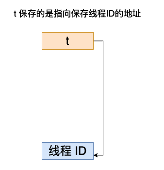
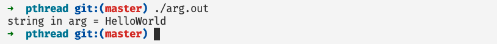
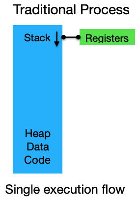
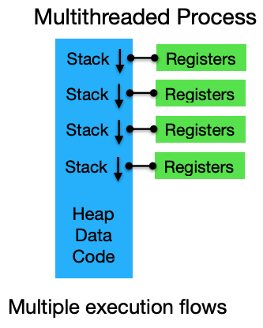

# Pthread 并发编程（一）——深入剖析线程基本元素和状态

## 前言

在本篇文章当中讲主要给大家介绍 `pthread` 并发编程当中关于线程的基础概念，并且深入剖析进程的相关属性和设置，以及线程在内存当中的布局形式，帮助大家深刻理解线程。

## 深入理解 pthread_create

### 基础例子介绍

在深入解析 `pthread_create` 之前，我们先用一个简单的例子简单的认识一下 pthread，我们使用 pthread 创建一个线程并且打印 Hello world 字符串。

```c


#include <stdio.h>
#include <pthread.h>

void* func(void* arg) {
  printf("Hello World from tid = %ld\n", pthread_self()); // pthread_self 返回当前调用这个函数的线程的线程 id
  return NULL;
}

int main() {

  pthread_t t; // 定义一个线程
  pthread_create(&t, NULL, func, NULL); // 创建线程并且执行函数 func 

  // wait unit thread t finished
  pthread_join(t, NULL); // 主线程等待线程 t 执行完成然后主线程才继续往下执行

  printf("thread t has finished\n");
  return 0;
}
```

编译上述程序：

```shell
clang helloworld.c -o helloworld.out -lpthread
或者
gcc helloworld.c -o helloworld.out -lpthread
```

在上面的代码当中主线程（可以认为是执行主函数的线程）首先定义一个线程，然后创建线程并且执行函数 func ，当创建完成之后，主线程使用 pthread_join 阻塞自己，直到等待线程 t 执行完成之后主线程才会继续往下执行。

我们现在仔细分析一下 `pthread_create` 的函数签名，并且对他的参数进行详细分析：

```c
int pthread_create(pthread_t *thread, const pthread_attr_t *attr,
                          void *(*start_routine) (void *), void *arg);
```

- 参数 thread 是一个类型为 pthread_t 的指针对象，将这个对象会在 pthread_create 内部会被赋值为存放线程 id 的地址，在后文当中我们将使用一个例子仔细的介绍这个参数的含义。
- 参数 attr 是一个类型为 pthread_attr_t 的指针对象，我们可以在这个对象当中设置线程的各种属性，比如说线程取消的状态和类别，线程使用的栈的大小以及栈的初始位置等等，在后文当中我们将详细介绍这个属性的使用方法，当这个属性为 NULL 的时候，使用默认的属性值。
- 参数 start_routine 是一个返回类型为 void* 参数类型为 void* 的函数指针，指向线程需要执行的函数，线程执行完成这个函数之后线程就会退出。
- 参数 arg ，传递给函数 start_routine 的一个参数，在上一条当中我们提到了 start_routine 有一个参数，是一个 void 类型的指针，这个参数也是一个 void 类型的指针，在后文当中我们使用一个例子说明这个参数的使用方法。

### 深入理解参数 thread

在下面的例子当中我们将使用 pthread_self 得到线程的 id ，并且通过保存线程 id 的地址的变量 t 得到线程的 id ，对两个得到的结果进行比较。

```c


#include <stdio.h>
#include <pthread.h>

void* func(void* arg) {

  printf("线程自己打印线程\tid = %ld\n", pthread_self());

  return NULL;
}

int main() {

  pthread_t t;
  pthread_create(&t, NULL, func, NULL);
  printf("主线程打印线程 t 的线程 id = %ld\n", *(long*)(&t));
  pthread_join(t, NULL);
  return 0;
}
```

上面程序的执行结果如下图所示：


根据上面程序打印的结果我们可以知道，变量 `pthread_t t` 保存的就是线程 id 的地址， 参数 t 和线程 id 之间的关系如下所示：



在上面的代码当中我们首先对 t 取地址，然后将其转化为一个 long 类型的指针，然后解引用就可以得到对应地址的值了，也就是线程的ID。

### 深入理解参数 arg

在下面的程序当中我们定义了一个结构体用于保存一些字符出的信息，然后创建一个这个结构体的对象，将这个对象的指针作为参数传递给线程要执行的函数，并且在线程内部打印字符串当中的内容。

```c


#include <stdio.h>
#include <pthread.h>
#include <malloc.h>
#include <stdlib.h>
#include <string.h>


typedef struct info {
  char s[1024]; // 保存字符信息
  int  size;    // 保存字符串的长度
}info_t;

static
void* func(void* arg) {
  info_t* in = (info_t*)arg;
  in->s[in->size] = '\0';
  printf("string in arg = %s\n", in->s);
  return NULL;
}

int main() {

  info_t* in = malloc(sizeof(info_t)); // 申请内存空间
  // 保存 HelloWorld 这个字符串 并且设置字符串的长度
  in->s[0] = 'H';
  in->s[1] = 'e';
  in->s[2] = 'l';
  in->s[3] = 'l';
  in->s[4] = 'o';
  in->s[5] = 'W';
  in->s[6] = 'o';
  in->s[7] = 'r';
  in->s[8] = 'l';
  in->s[9] = 'd';
  in->size = 10;
  pthread_t t;									// 将 in 作为参数传递给函数 func
  pthread_create(&t, NULL, func, (void*)in); 
  pthread_join(t, NULL);
  free(in); // 释放内存空间
  return 0;
}
```

上面程序的执行结果如下所示：



可以看到函数参数已经做到了正确传递。

### 深入理解参数 attr


单个线程的执行流和大致的内存布局如下所示：



多个线程的执行流和大致的内存布局如下图所示：

