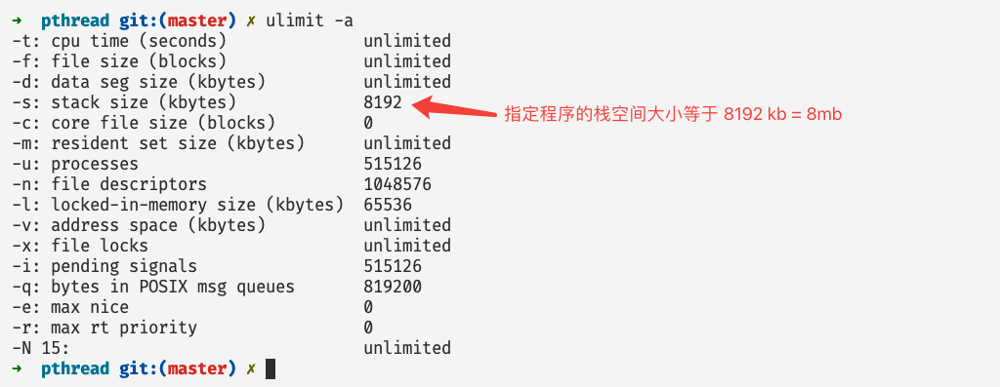
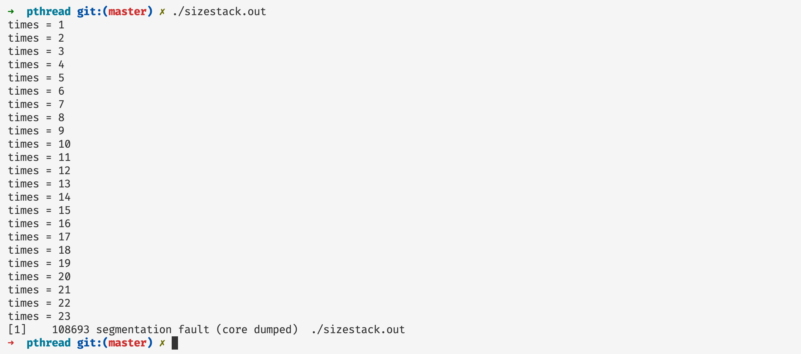
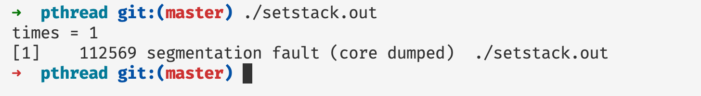
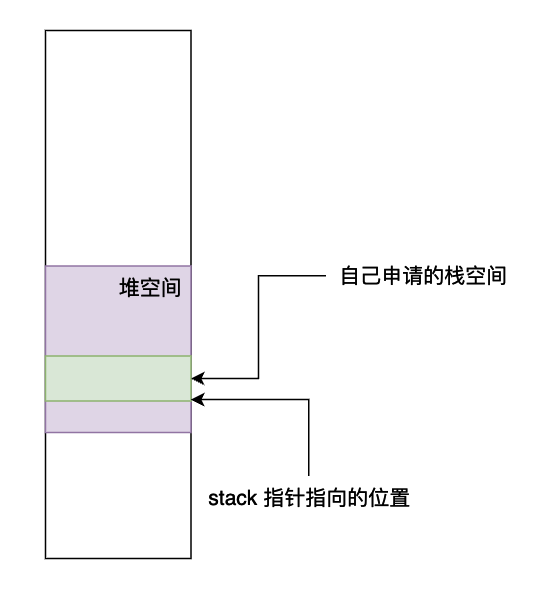

# Pthread 并发编程（一）——深入剖析线程基本元素和状态

## 前言

在本篇文章当中讲主要给大家介绍 `pthread` 并发编程当中关于线程的基础概念，并且深入剖析进程的相关属性和设置，以及线程在内存当中的布局形式，帮助大家深刻理解线程。

## 深入理解 pthread_create

### 基础例子介绍

在深入解析 `pthread_create` 之前，我们先用一个简单的例子简单的认识一下 pthread，我们使用 pthread 创建一个线程并且打印 Hello world 字符串。

```c


#include <stdio.h>
#include <pthread.h>

void* func(void* arg) {
  printf("Hello World from tid = %ld\n", pthread_self()); // pthread_self 返回当前调用这个函数的线程的线程 id
  return NULL;
}

int main() {

  pthread_t t; // 定义一个线程
  pthread_create(&t, NULL, func, NULL); // 创建线程并且执行函数 func 

  // wait unit thread t finished
  pthread_join(t, NULL); // 主线程等待线程 t 执行完成然后主线程才继续往下执行

  printf("thread t has finished\n");
  return 0;
}
```

编译上述程序：

```shell
clang helloworld.c -o helloworld.out -lpthread
或者
gcc helloworld.c -o helloworld.out -lpthread
```

在上面的代码当中主线程（可以认为是执行主函数的线程）首先定义一个线程，然后创建线程并且执行函数 func ，当创建完成之后，主线程使用 pthread_join 阻塞自己，直到等待线程 t 执行完成之后主线程才会继续往下执行。

我们现在仔细分析一下 `pthread_create` 的函数签名，并且对他的参数进行详细分析：

```c
int pthread_create(pthread_t *thread, const pthread_attr_t *attr,
                          void *(*start_routine) (void *), void *arg);
```

- 参数 thread 是一个类型为 pthread_t 的指针对象，将这个对象会在 pthread_create 内部会被赋值为存放线程 id 的地址，在后文当中我们将使用一个例子仔细的介绍这个参数的含义。
- 参数 attr 是一个类型为 pthread_attr_t 的指针对象，我们可以在这个对象当中设置线程的各种属性，比如说线程取消的状态和类别，线程使用的栈的大小以及栈的初始位置等等，在后文当中我们将详细介绍这个属性的使用方法，当这个属性为 NULL 的时候，使用默认的属性值。
- 参数 start_routine 是一个返回类型为 void* 参数类型为 void* 的函数指针，指向线程需要执行的函数，线程执行完成这个函数之后线程就会退出。
- 参数 arg ，传递给函数 start_routine 的一个参数，在上一条当中我们提到了 start_routine 有一个参数，是一个 void 类型的指针，这个参数也是一个 void 类型的指针，在后文当中我们使用一个例子说明这个参数的使用方法。

### 深入理解参数 thread

在下面的例子当中我们将使用 pthread_self 得到线程的 id ，并且通过保存线程 id 的地址的变量 t 得到线程的 id ，对两个得到的结果进行比较。

```c


#include <stdio.h>
#include <pthread.h>

void* func(void* arg) {

  printf("线程自己打印线程\tid = %ld\n", pthread_self());

  return NULL;
}

int main() {

  pthread_t t;
  pthread_create(&t, NULL, func, NULL);
  printf("主线程打印线程 t 的线程 id = %ld\n", *(long*)(&t));
  pthread_join(t, NULL);
  return 0;
}
```

上面程序的执行结果如下图所示：


根据上面程序打印的结果我们可以知道，变量 `pthread_t t` 保存的就是线程 id 的地址， 参数 t 和线程 id 之间的关系如下所示：


在上面的代码当中我们首先对 t 取地址，然后将其转化为一个 long 类型的指针，然后解引用就可以得到对应地址的值了，也就是线程的ID。

### 深入理解参数 arg

在下面的程序当中我们定义了一个结构体用于保存一些字符出的信息，然后创建一个这个结构体的对象，将这个对象的指针作为参数传递给线程要执行的函数，并且在线程内部打印字符串当中的内容。

```c


#include <stdio.h>
#include <pthread.h>
#include <malloc.h>
#include <stdlib.h>
#include <string.h>


typedef struct info {
  char s[1024]; // 保存字符信息
  int  size;    // 保存字符串的长度
}info_t;

static
void* func(void* arg) {
  info_t* in = (info_t*)arg;
  in->s[in->size] = '\0';
  printf("string in arg = %s\n", in->s);
  return NULL;
}

int main() {

  info_t* in = malloc(sizeof(info_t)); // 申请内存空间
  // 保存 HelloWorld 这个字符串 并且设置字符串的长度
  in->s[0] = 'H';
  in->s[1] = 'e';
  in->s[2] = 'l';
  in->s[3] = 'l';
  in->s[4] = 'o';
  in->s[5] = 'W';
  in->s[6] = 'o';
  in->s[7] = 'r';
  in->s[8] = 'l';
  in->s[9] = 'd';
  in->size = 10;
  pthread_t t;									// 将 in 作为参数传递给函数 func
  pthread_create(&t, NULL, func, (void*)in); 
  pthread_join(t, NULL);
  free(in); // 释放内存空间
  return 0;
}
```

上面程序的执行结果如下所示：


可以看到函数参数已经做到了正确传递。

### 深入理解参数 attr

在深入介绍参数 attr 前，我们首先需要了解一下程序的内存布局，在64位操作系统当中程序的虚拟内存布局大致如下所示，从下往上依次为：只读数据/代码区、可读可写数据段、堆区、共享库的映射区、程序栈区以及内核内存区域。我们程序执行的区域就是在栈区。


根据上面的虚拟内存布局示意图，我们将其简化一下得到单个线程的执行流和大致的内存布局如下所示（程序执行的时候有他的栈帧以及寄存器现场，图中将寄存器也做出了标识）：


程序执行的时候当我们进行函数调用的时候函数的栈帧就会从上往下生长，我们现在进行一下测试，看看程序的栈帧最大能够达到多少。

```c


#include <stdio.h>
#include <stdlib.h>
#include <sys/types.h>
#include <unistd.h>
int times = 1;

void* func(void* arg) {
  char s[1 << 20]; // 申请 1MB 内存空间（分配在栈空间上）
  printf("times = %d\n", times);
  times++;
  func(NULL);
  return NULL;
}

int main() {

  func(NULL);
  return 0;
}
```

上述程序的执行结果如下图所示：


从上面的程序我们可以看到在第 8 次申请栈内存的时候遇到了段错误，因此可以判断栈空间大小在 8MB 左右，事实上我们可以查看 linux 操作系统上，栈内存的指定大小：



事实上在 linux 操作系统当中程序的栈空间的大小默认最大为 8 MB。

现在我们来测试一下，当我们创建一个线程的时候，线程的栈的大小大概是多少：

```c


#include <stdio.h>
#include <pthread.h>
#include <stdlib.h>
#include <sys/types.h>
#include <unistd.h>
int times = 1;

void* func(void* arg) {
  printf("times = %d\n", times);
  times++;
  char s[1 << 20]; // 申请 1MB 内存空间（分配在栈空间上）
  func(NULL);
  return NULL;
}

int main() {

  pthread_t t;
  pthread_create(&t, NULL, func, NULL);
  pthread_join(t, NULL);
  return 0;
}
```

上面的程序执行结果如下图所示，可以看到当我们创建一个线程的时候栈的最大的大小也是 8MB。


#### 设置线程栈空间的大小

现在如果我们有一个需求，需要的栈空间大于 8MB，我们应该怎么办呢？这就是我们所需要谈到的 attr，这个变量是一个 **pthread_attr_t** 对象，这个对象的主要作用就是用于设置线程的各种属性的，其中就包括线程的栈的大小，在下面的程序当中我们将线程的栈空间的大小设置成 24MB，并且使用程序进行测试。

```c

#include <stdio.h>
#include <pthread.h>
#include <stdlib.h>

#define MiB * 1 << 20

int times = 0;
void* stack_overflow(void* args) {
  printf("times = %d\n", ++times);
  char s[1 << 20]; // 1 MiB
  stack_overflow(NULL);
  return NULL;
}

int main() {
  pthread_attr_t attr;
  pthread_attr_init(&attr); // 对变量 attr 进行初始化操作
  pthread_attr_setstacksize(&attr, 24 MiB); // 设置栈帧大小为 24 MiB 这里使用了一个小的 trick 大家可以看一下 MiB 的宏定义
  pthread_t t;
  pthread_create(&t, &attr, stack_overflow, NULL);
  pthread_join(t, NULL);
  pthread_attr_destroy(&attr); // 释放线程属性的相关资源
  return 0;
}
```

上面的程序执行结果如下图所示：



从上面程序的执行结果来看我们设置的 24 MB 的栈空间大小起到了效果，我们可以通过线程的递归次数可以看出来我们确实申请了那么大的空间。在上面的程序当中我们对属性的操作如下，这也是对属性操作的一般流程：

- 使用 `pthread_attr_init` 对属性变量进行初始化操作。
- 使用各种各样的函数对属性 attr 进行操作，比如 `pthread_attr_setstacksize`，这个函数的作用就是用于设置线程的栈空间的大小。
- 使用 `pthread_attr_destroy` 释放线程属性相关的系统资源。

#### 自己为线程的栈申请空间

在上一小节当中我们通过函数 `pthread_attr_setstacksize` 给栈空间设置了新的大小，并且使用程序检查验证了新设置的栈空间大小，在这一小节当中我们将介绍使用我们自己申请的内存空间也可以当作线程的栈使用。我们将使用两种方法取验证这一点：

- 使用 `malloc` 函数申请内存空间，这部分空间主要在堆当中。
- 使用 `mmap` 系统调用在共享库的映射区申请内存空间。

##### 使用 malloc 函数申请内存空间

```c

#include <stdio.h>
#include <pthread.h>
#include <stdlib.h>

#define MiB * 1 << 20

int times = 0;
static
void* stack_overflow(void* args) {
  printf("times = %d\n", ++times);
  char s[1 << 20]; // 1 MiB
  stack_overflow(NULL);
  return NULL;
}

int main() {
  pthread_attr_t attr;
  pthread_attr_init(&attr);
  void* stack = malloc(2 MiB); // 使用 malloc 函数申请内存空间 申请的空间大小为 2 MiB 
  pthread_t t;
  pthread_attr_setstack(&attr, stack, 2 MiB); // 使用属性设置函数设置栈的位置 栈的最低地址为 stack 栈的大小等于 2 MiB 
  pthread_create(&t, &attr, stack_overflow, NULL);
  pthread_join(t, NULL);
  pthread_attr_destroy(&attr); // 释放系统资源
  free(stack); // 释放堆空间
  return 0;
}
```

上述程序的执行结果如下图所示：



从上面的执行结果可以看出来我们设置的栈空间的大小为 2MB 成功了。在上面的程序当中我们主要使用 `pthread_attr_setstack` 函数设置栈的低地址和栈空间的大小。我们申请的内存空间内存布局大致如下图所示：



##### 使用 mmap 申请内存作为栈空间

```c
#define _GNU_SOURCE
#include <stdio.h>
#include <pthread.h>
#include <stdlib.h>
#include <sys/mman.h>

#define MiB * 1 << 20
#define STACK_SIZE 2 MiB

int times = 0;

static
void* stack_overflow(void* args) {
  printf("times = %d\n", ++times);
  char s[1 << 20]; // 1 MiB
  stack_overflow(NULL);
  return NULL;
}

int main() {
  pthread_attr_t attr;
  pthread_attr_init(&attr);
  void* stack = mmap(NULL, STACK_SIZE, PROT_READ | PROT_WRITE,
                MAP_PRIVATE | MAP_ANONYMOUS | MAP_STACK, -1, 0);
  if (stack == MAP_FAILED)
      perror("mapped error:");
  pthread_t t;
  pthread_attr_setstack(&attr, stack, STACK_SIZE);
  pthread_create(&t, &attr, stack_overflow, NULL);
  pthread_join(t, NULL);
  pthread_attr_destroy(&attr);
  free(stack);
  return 0;
}
```

在上面的程序当中我们使用 mmap 系统调用在共享库空间申请了一段内存空间，并且将其做为栈空间，我们在这里就不将程序执行的结果放出来了，上面整个程序和前面的程序相差不大，只是在申请内存方面发生了变化，总体的方向是不变的。

根据前面知识的学习，我们可以知道多个线程可以共享同一个进程虚拟地址空间，我们只需要给每个线程申请一个栈空间让线程执行起来就行，基于此我们可以知道多个线程的执行流和大致的内存布局如下图所示：


在上图当中不同的线程拥有不同的栈空间和每个线程自己的寄存器现场，正如上图所示，栈空间可以是在堆区也可以是在共享库的映射区域，只需要给线程提供栈空间即可。

## 深入理解线程的状态

在 `pthread` 当中给我们提供了一个函数 `pthread_cancel` 可以取消一个正在执行的线程，取消正在执行的线程之后会将线程的退出状态（返回值）设置成宏定义 `PTHREAD_CANCELED` 。我们使用下面的例子去理解一下线程取消的过程：

```c
#include <stdio.h>
#include <pthread.h>
#include <assert.h>

void* task(void* arg) {

	while(1) {
    pthread_testcancel(); // 测试是否被取消执行了
  }
  return NULL;
}

int main() {

  void* res;
  pthread_t t;
  pthread_create(&t, NULL, task, NULL);
  int s = pthread_cancel(t); // 取消函数的执行
  if(s != 0)
    fprintf(stderr, "cancel failed\n");
  pthread_join(t, &res);
  assert(res == PTHREAD_CANCELED);
  return 0;
}
```

在上面的程序当中我们在主线程当中使用函数 `pthread_cancel` 函数取消线程的执行，编译执行上面的程序是可以通过的，也就是说程序正确执行了，而且 assert 也通过了。我们先不仔细去分析上面的代码的执行流和函数的意义。我们先需要了解一个线程的基本特性。

与线程取消执行相关的一共有两个属性，分别是：

- 取消执行的状态，线程的取消执行的状态一共有两个：
  - PTHREAD_CANCEL_ENABLE：这个状态表示这个线程是可以取消的，也是线程创建时候的默认状态。
  - PTHREAD_CANCEL_DISABLE：这个状态表示线程是不能够取消的，如果有一个线程发送了一个取消请求，那么这个发送取消消息的线程将会被阻塞直到线程的取消状态变成 PTHREAD_CANCEL_ENABLE 。
- 取消执行的类型，取消线程执行的类型也有两种：
  - PTHREAD_CANCEL_DEFERRED：当一个线程的取消状态是这个的时候，线程的取消就会被延迟执行，知道线程调用一个是取消点的（cancellation point）函数，比如 sleep 和 pthread_testcancel ，所有的线程的默认取消执行的类型就是这个类型。
  - PTHREAD_CANCEL_ASYNCHRONOUS：如果线程使用的是这个取消类型那么线程可以在任何时候被取消执行，当他接收到了一个取消信号的时候，马上就会被取消执行，事实上这个信号的实现是使用 tgkill 这个系统调用实现的。

事实上我们很少回去使用 PTHREAD_CANCEL_ASYNCHRONOUS ，因为这样杀死一个线程会导致线程还有很多资源没有释放，会给系统带来很大的灾难，比如线程使用 malloc 申请的内存空间没有释放，申请的锁和信号量没有释放，尤其是锁和信号量没有释放，很容易造成死锁的现象。

有了以上的知识基础我们现在可以来谈一谈前面的两个函数了：

- pthread_cancel(t) ：是给线程 t 发送一个取消请求。
- pthread_testcancel()：这个函数是一个取消点，当执行这个函数的时候，程序就会取消执行。

现在我们使用默认的线程状态和类型创建一个线程执行死循环，看看线程是否能够被取消掉：

```c


#include <stdio.h>
#include <pthread.h>
#include <assert.h>
#include <unistd.h>

void* task(void* arg) {
  while(1) {
    
  }
  return NULL;
}

int main() {

  void* res;
  pthread_t t1;
  pthread_create(&t1, NULL, task, NULL);
  int s = pthread_cancel(t1);
  if(s != 0) // s == 0 mean call successfully
    fprintf(stderr, "cancel failed\n");
  pthread_join(t1, &res);
  assert(res == PTHREAD_CANCELED);
  return 0;
}
```

在上面的代码当中我们启动了一个线程不断的去进行进行死循环的操作，程序的执行结果为程序不会终止，因为主线程在等待线程的结束，但是线程在进行死循环，而且线程执行死循环的时候没有调用一个是取消点的函数，因此程序不会终止取消。

下面我们更改程序，将线程的取消类型设置为 **PTHREAD_CANCEL_ASYNCHRONOUS** ，在看看程序的执行结果：

```c


#include <stdio.h>
#include <pthread.h>
#include <assert.h>
#include <unistd.h>

void* task(void* arg) {
  pthread_setcanceltype(PTHREAD_CANCEL_ASYNCHRONOUS, NULL);
  while(1) {
    
  }
  return NULL;
}

int main() {

  void* res;
  pthread_t t1;
  pthread_create(&t1, NULL, task, NULL);
  int s = pthread_cancel(t1);
  if(s != 0) // s == 0 mean call successfully
    fprintf(stderr, "cancel failed\n");
  pthread_join(t1, &res);
  assert(res == PTHREAD_CANCELED);
  return 0;
}
```

在上面的程序当中我们在线程执行的函数当中使用 `pthread_setcanceltype` 将线程的取消类型设置成 PTHREAD_CANCEL_ASYNCHRONOUS 这样的话就能够在其他线程使用 pthread_cancel 的时候就能够立即取消线程的执行。

```c
int pthread_setcanceltype(int type, int *oldtype)
```

上方是 pthread_setcanceltype 的函数签名，在前面的使用当中我们只使用了第一个参数，第二个参数我们是设置成 NULL，第二个参数我们可以传入一个 int 类型的指针，然后会在将线程的取消类型设置成 type 之前将前一个 type 拷贝到 oldtype 所指向的内存当中。

type: 有两个参数：PTHREAD_CANCEL_ASYNCHRONOUS 和 PTHREAD_CANCEL_DEFERRED 。

```c
int pthread_setcancelstate(int state, int *oldstate);
```

设置取消状态的函数签名和上一个函数签名差不多，参数的含义也是差不多，type 表示需要设置的取消状态，有两个参数：PTHREAD_CANCEL_ENABLE 和 PTHREAD_CANCEL_DISABLE ，参数 oldstate 是指原来的线程的取消状态，如果你传入一个 int 类型的指针的话就会将原来的状态保存到指针指向的位置。

其实关于线程的一些细节还有比较多的内容限于篇幅，在本篇文章当中主要给大家介绍这些细节。

## 关于栈大小程序的一个小疑惑

在上文当中我们使用了一个小程序去测试线程的栈空间的大小，并且打印函数 `func` 的调用次数，每一次调用的时候我们都会申请 1MB 大小的栈空间变量。现在我们看下面两个程序，在下面两个程序只有 `func` 函数有区别，而在 `func` 函数当中主要的区别就是:

- 在第一个程序当中是先申请内存空间，然后再打印变量 `times` 的值。
- 在第二个程序当中是先打印变量 `times` 的值，然后再申请内存空间。

```c


#include <stdio.h>
#include <pthread.h>
#include <stdlib.h>
#include <sys/types.h>
#include <unistd.h>
int times = 1;

// 先申请内存空间再打印
void* func(void* arg) {
  char s[1 << 20]; // 申请 1MB 内存空间（分配在栈空间上）
  printf("times = %d\n", times);
  times++;
  func(NULL);
  return NULL;
}

int main() {

  pthread_t t;
  pthread_create(&t, NULL, func, NULL);
  pthread_join(t, NULL);
  return 0;
}
```

```c


#include <stdio.h>
#include <pthread.h>
#include <stdlib.h>
#include <sys/types.h>
#include <unistd.h>
int times = 1;

// 先打印再申请内存空间
void* func(void* arg) {
  printf("times = %d\n", times);
  times++;
  char s[1 << 20]; // 申请 1MB 内存空间（分配在栈空间上）
  func(NULL);
  return NULL;
}

int main() {

  pthread_t t;
  pthread_create(&t, NULL, func, NULL);
  pthread_join(t, NULL);
  return 0;
}
```

由于上面两个程序的输出结果是一样的，所以我就只放出一个程序的输出结果了：


但是不对呀！如果是后申请内存空间的话，程序的输出应该能够打印 `times = 8` 啊，因为之前只申请了 7MB 的空间，我们打印 `times = 8` 的时候还没有执行到语句 `char s[1 << 20];` ，那为什么也只打印到 7 呢？


出现上面问题的主要原因就需要看编译器给我们编译后的程序是如何申请内存空间的。我们将上面的函数 `func` 的汇编代码展示出来：

```assembly
00000000004005e0 <func>:
  4005e0:       55                      push   %rbp
  4005e1:       48 89 e5                mov    %rsp,%rbp
  4005e4:       48 81 ec 20 00 10 00    sub    $0x100020,%rsp
  4005eb:       48 8d 04 25 3c 07 40    lea    0x40073c,%rax
  4005f2:       00 
  4005f3:       48 89 7d f8             mov    %rdi,-0x8(%rbp)
  4005f7:       8b 34 25 40 10 60 00    mov    0x601040,%esi
  4005fe:       48 89 c7                mov    %rax,%rdi
  400601:       b0 00                   mov    $0x0,%al
  400603:       e8 c8 fe ff ff          callq  4004d0 <printf@plt>
  400608:       48 bf 00 00 00 00 00    movabs $0x0,%rdi
  40060f:       00 00 00 
  400612:       8b 34 25 40 10 60 00    mov    0x601040,%esi
  400619:       81 c6 01 00 00 00       add    $0x1,%esi
  40061f:       89 34 25 40 10 60 00    mov    %esi,0x601040
  400626:       89 85 ec ff ef ff       mov    %eax,-0x100014(%rbp)
  40062c:       e8 af ff ff ff          callq  4005e0 <func>
  400631:       48 bf 00 00 00 00 00    movabs $0x0,%rdi
  400638:       00 00 00 
  40063b:       48 89 85 e0 ff ef ff    mov    %rax,-0x100020(%rbp)
  400642:       48 89 f8                mov    %rdi,%rax
  400645:       48 81 c4 20 00 10 00    add    $0x100020,%rsp
  40064c:       5d                      pop    %rbp
  40064d:       c3                      retq
```

上面的汇编代码是上面的程序在 x86_64 平台下得到的，我们需要注意一行汇编指令 `sub    $0x100020,%rsp` ，这条指令的主要作用就是将栈顶往下扩展（栈是从上往下生长的）1 MB 字节（实际上稍微比 1MB 大一点，因为还有其他操作需要一些栈空间），事实上就是给变量 s 申请 1MB 的栈空间。

好了，看到这里就破案了，原来编译器申请栈空间的方式是将栈顶寄存器 rsp ，往虚拟地址空间往下移动，而编译器在函数执行刚开始的时候就申请了这么大的空间，因此不管是先申请空间再打印，还是先打印再申请空间，在程序被编译成汇编指令之后，函数 `func` 在函数刚开始就申请了对应的空间，因此才出现了都只打印到 `times = 7` 。

## 总结

在本篇文章当中主要给大家介绍了线程的基本元素和一些状态，还重点介绍了各种与线程相关属性的函数，主要使用的各种函数如下：

- pthread_create，用与创建线程
- pthread_attr_init，初始话线程的基本属性。
- pthread_attr_destroy，释放属性相关资源。
- pthread_join，用于等待线程执行完成。
- pthread_attr_setstacksize，用于设置线程执行栈的大小。
- pthread_attr_setstack，设置线程执行栈的栈顶和栈的大小。
- pthread_testcancel，用于检测线程是否被取消了，是一个取消点。
- pthread_cancel，取消一个线程的执行。

希望大家有所收获！

---

更多精彩内容合集可访问项目：<https://github.com/Chang-LeHung/CSCore>

关注公众号：一无是处的研究僧，了解更多计算机（Java、Python、计算机系统基础、算法与数据结构）知识。


