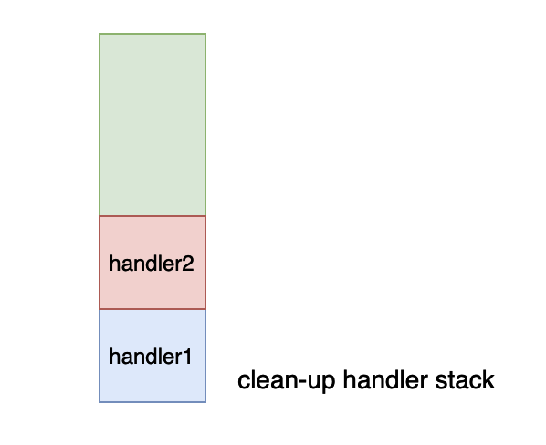
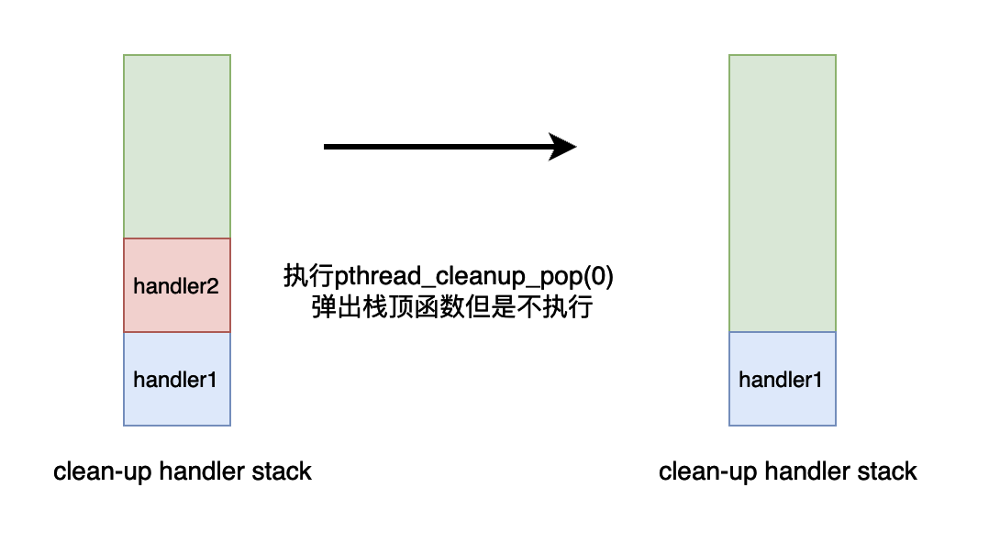
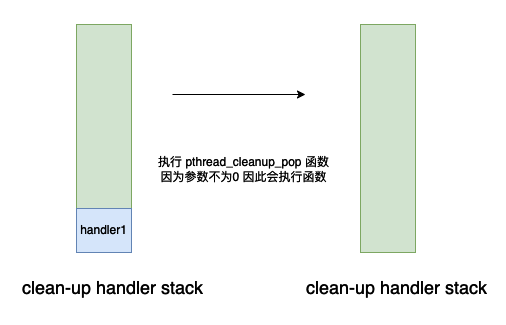
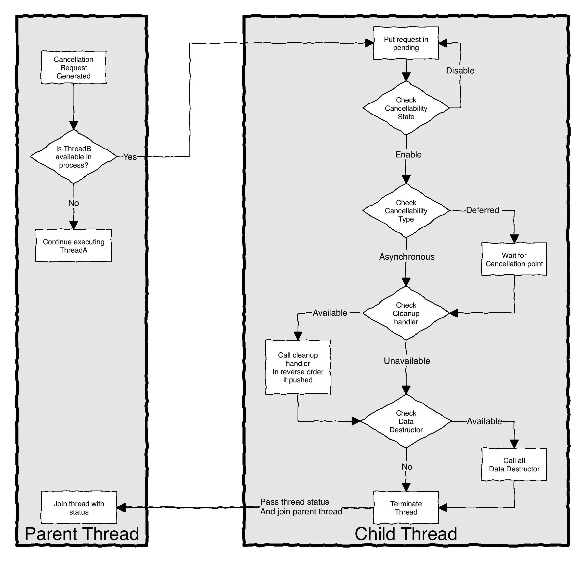

# Pthread 并发编程（三）——深入理解线程取消机制

## 基本介绍

线程取消机制是 pthread 给我们提供的一种用于取消线程执行的一种机制，这种机制是在线程内部实现的，仅仅能够在共享内存的多线程程序当中使用。

## 基本使用

```c


#include <stdio.h>
#include <pthread.h>
#include <assert.h>
#include <unistd.h>


void* task(void* arg) {
  usleep(10);
  printf("step1\n");
  printf("step2\n");
  printf("step3\n");
  return NULL;
}

int main() {

  void* res;
  pthread_t t1;
  pthread_create(&t1, NULL, task, NULL);
  int s = pthread_cancel(t1);
  if(s != 0) // s == 0 mean call successfully
    fprintf(stderr, "cancel failed\n");
  pthread_join(t1, &res);
  assert(res == PTHREAD_CANCELED);
  return 0;
}
```

上面的程序的输出结果如下：

```
step1
```

在上面的程序当中，我们使用一个线程去执行函数 task，然后主线程会执行函数 `pthread_cancel` 去取消线程的执行，从上面程序的输出结果我们可以知道，执行函数 task 的线程并没有执行完成，只打印出了 step1 ，这说明线程被取消执行了。

## 深入分析线程取消机制

在上文的一个例子当中我们简单的使用了一下线程取消机制，在本小节当中将深入分析线程的取消机制。在线程取消机制当中，如果一个线程被正常取消执行了，其他线程使用 pthread_join 去获取线程的退出状态的话，线程的退出状态为 PTHREAD_CANCELED 。比如在上面的例子当中，主线程取消了线程 t1 的执行，然后使用 pthread_join 函数等待线程执行完成，并且使用参数 res 去获取线程的退出状态，在上面的代码当中我们使用 assert 语句去判断 res 的结果是否等于 PTHREAD_CANCELED ，从程序执行的结果来看，assert 通过了，因此线程的退出状态验证正确。

我们来看一下 pthread_cancel 函数的签名：

```
int pthread_cancel(pthread_t thread);
```

函数的返回值：

- 0 	表示函数 pthread_cancel 执行成功。
- ESRCH   表示在系统当中没有 thread 这个线程。这个宏包含在头文件 <errno.h> 当中。

我们现在使用一个例子去测试一下返回值 ESRCH ：

```c
#include <stdio.h>
#include <pthread.h>
#include <errno.h>

int main() {

  pthread_t t;
  int s = pthread_cancel(t);
  if(s == ESRCH)
    printf("No thread with the ID thread could be found.\n");
  return 0;
}
```

上述程序的会执行打印字符串的语句，因为我们并没有使用变量 t 去创建一个线程，因此线程没有创建，返回对应的错误。

### pthread_cancel 的执行

pthread_cancel 函数会发送一个取消请求到指定的线程，线程是否响应这个线程取消请求取决于线程的取消状态和取消类型。

两种线程的取消状态：

- PTHREAD_CANCEL_ENABLE 线程默认是开启响应取消请求，这个状态是表示会响应其他线程发送过来的取消请求，但是具体是如何响应，取决于线程的取消类型，默认的线程状态就是这个值。

- PTHREAD_CANCEL_DISABLE 当开启这个选项的时候，调用这个方法的线程就不会响应其他线程发送过来的取消请求。

两种取消类型：

- PTHREAD_CANCEL_DEFERRED 如果线程的取消类型是这个，那么线程将会在下一次调用一个取消点的函数时候取消执行，取消点函数有 read, write, pread, pwrite, sleep 等函数，更多的可以网上搜索，线程的默认取消类型就是这个类型。
- PTHREAD_CANCEL_ASYNCHRONOUS 这个取消类型线程就会立即响应发送过来的请求，本质上在 pthread 实现的代码当中是会给线程发送一个信号，然后接受取消请求的线程在信号处理函数当中进行退出。

### 让线程取消机制无效

```c

#include <stdio.h>
#include <pthread.h>
#include <unistd.h>

void* func(void* arg)
{
  pthread_setcancelstate(PTHREAD_CANCEL_DISABLE, NULL);
  sleep(1);
  return NULL;
}

int main() {
  pthread_t t;
  pthread_create(&t, NULL, func, NULL);
  pthread_cancel(t);
  void* res;
  pthread_join(t, &res);
  if(res == PTHREAD_CANCELED)
  {
    printf("thread was canceled\n");
  }
  return 0;
}
```

上面的程序不会执行这句话 `printf("thread was canceled\n");` 因为在线程当中设置了线程的状态为不开启线程取消机制，因此主线程发送的取消请求无效。

在上面的代码当中使用的函数 pthread_setcancelstate 的函数签名如下：

```c
int pthread_setcancelstate(int state, int *oldstate)
```

其中第二个参数我们可以传入一个 int 类型的指针，然后会将旧的状态存储到这个值当中。

### 取消点测试

在前文当中我们谈到了，线程的取消机制是默认开启的，但是当一个线程发送取消请求之后，只有等到下一个是取消点的函数的时候，线程才会真正退出取消执行。

```c

#include <stdio.h>
#include <pthread.h>
#include <unistd.h>

void* func(void* arg)
{
  // 默认是 enable  线程的取消机制是开启的
  while(1);
  return NULL;
}

int main() {
  pthread_t t;
  pthread_create(&t, NULL, func, NULL);
  pthread_cancel(t);
  void* res;
  pthread_join(t, &res);
  if(res == PTHREAD_CANCELED)
  {
    printf("thread was canceled\n");
  }
  return 0;
}
```

如果我们去执行上面的代码我们会发现程序会进行循环，不会退出，因为虽然主线程给线程 t 发送了一个取消请求，但是线程 t 一直在进行死循环操作，并没有执行任何一个函数，更不用提是一个取消点函数了。

如果我们修改上面的代码成下面这样，那么线程就会正常执行退出：

```c

#include <stdio.h>
#include <pthread.h>
#include <unistd.h>

void* func(void* arg)
{
  // 默认是 enable  线程的取消机制是开启的
  // 线程的默认取消类型是 PTHREAD_CANCEL_DEFERRED
  while(1)
  {
    sleep(1);
  }
  return NULL;
}

int main() {
  pthread_t t;
  pthread_create(&t, NULL, func, NULL);
  pthread_cancel(t);
  void* res;
  pthread_join(t, &res);
  if(res == PTHREAD_CANCELED)
  {
    printf("thread was canceled\n");
  }
  return 0;
}
```

上面的代码唯一修改的地方就是在线程 t 当中的死循环处调用了 sleep 函数，而 sleep 函数是一个取消点函数，因此当主线程给线程 t 发送一个取消请求之后，线程 t 就会在下一次调用 sleep 函数彻底取消执行，退出，并且线程的退出状态为 PTHREAD_CANCELED ，因此主线程会执行代码 `printf("thread was canceled\n");`。

### 异步取消

现在我们来测试一下 PTHREAD_CANCEL_ASYNCHRONOUS 会出现什么情况：

```c

#include <stdio.h>
#include <pthread.h>
#include <unistd.h>

void* func(void* arg)
{
  // 默认是 enable  线程的取消机制是开启的
  // 设置取消机制为异步取消
  pthread_setcanceltype(PTHREAD_CANCEL_ASYNCHRONOUS, NULL);
  while(1);
  return NULL;
}

int main() {
  pthread_t t;
  pthread_create(&t, NULL, func, NULL);
  pthread_cancel(t);
  void* res;
  pthread_join(t, &res);
  if(res == PTHREAD_CANCELED)
  {
    printf("thread was canceled\n");
  }
  return 0;
}
```

上面的程序是可以正确输出字符串 `thread was canceled` 的，因为在线程执行的函数 func 当中，我们设置了线程的取消机制为异步机制，因为线程的默认取消类型是 PTHREAD_CANCEL_DEFERRED ，因此我们需要修改一下线程的默认取消类型，将其修改为 PTHREAD_CANCEL_ASYNCHRONOUS，即开始异步取消模式。

从上面的例子当中我们就可以体会到线程取消的两种类型的不同效果了。

## 线程取消的后续过程

当一个线程接受到其他线程发送过来的一个取消请求之后，如果线程响应这个取消请求，即线程退出，那么下面的几件事儿将会依次发生：

- clean-up handlers 将会倒序执行，我们在文章的后续当中将会举具体的例子对这一点进行说明。
- 线程私有数据的析构函数将会执行，如果有多个析构函数那么执行顺序不一定。
- 线程终止执行，即线程退出。

## clean-up handlers

首先我们需要了解一下什么是 clean-up handlers。clean-up handlers 是一个或多个函数当线程被取消的时候这个函数将会被执行。如果没有 clean-up handlers 函数被设置，那么将不会调用。

###  clean-up handlers 接口

在 pthread 当中，有两个函数与 clean-up handlers 相关：

```c
 void pthread_cleanup_push(void (*routine)(void *), void *arg);
 void pthread_cleanup_pop(int execute);
```

首先我们来看一下函数 pthread_cleanup_push 的作用：这个函数是将传进来的参数——一个函数指针 routine 放入线程取消的 clean-up handlers 的栈中，即将函数放到栈顶。

pthread_cleanup_pop 的作用是将 clean-up handlers 栈顶的函数弹出，如果 execute 是一个非 0 的值，那么将会执行栈顶的函数，如果 execute == 0 ，那么将不会执行弹出来的函数。

以下几点是与上面两个函数密切相关的特点：

- 如果线程被取消了：

  - clean-up handlers 将会倒序依次执行，因为存储 clean-up handlers 的是一个栈结构。

  - 线程私有数据的析构函数将会执行，如果有多个析构函数那么执行顺序不一定。

  - 线程终止执行，即线程退出。

- 如果线程调用 pthread_exit 函数进行退出：

  - clean-up handlers 同样的，将会倒序依次执行。
  - 线程私有数据的析构函数将会执行，如果有多个析构函数那么执行顺序不一定。
  - 线程终止执行，即线程退出。

- 需要注意的是，如果在线程被取消或者调用 pthread_exit 之前，线程调用 pthread_cleanup_pop 函数弹出一些 handler 那么这些 handler 将不会被执行，如果线程被取消或者调用 pthread_exit 退出，线程只会调用当前存在于栈中的 handler 。

- 你可以会问为什么 pthread 要给我提供这些机制，试想一下如果在我们的线程当中申请了一些资源，但是突然接收到了其他线程发送过来的取消执行的请求，那么这些资源改如何释放呢？clean-up handlers 就给我们提供了一种机制帮助我们去释放这些资源。

- 如果线程执行的函数使用 return 语句返回，那么 clean-up handlers 将不会被调用。

下面我们使用一个例子去了解上面的函数：

```c


#include <stdio.h>
#include <pthread.h>

void handler1(void* arg)
{
  printf("in handler1 i1 = %d\n", *(int*)arg);
}

void handler2(void* arg)
{
  printf("in handler2 i2 = %d\n", *(int*)arg);
}

void* func(void* arg)
{
  int i1 = 1, i2 = 2;
  pthread_cleanup_push(handler1, &i1); // 函数在栈底
  pthread_cleanup_push(handler2, &i2); // 函数在栈顶

  printf("In func\n");
  pthread_cleanup_pop(0); // 栈顶的函数 因为传入的参数等于 0 虽然栈顶的函数会被弹出 但是栈顶的函数 handler2 不会被调用 
  pthread_cleanup_pop(1); // 因为传入的参数等于 0 因此栈顶的函数 handler1 会被调用 
  return NULL;
}

int main() 
{
  pthread_t t;
  pthread_create(&t, NULL, func, NULL);
  pthread_join(t, NULL);
  return 0;
}
```

上面的函数的执行结果如下所示：

```
In func
in handler1 i1 = 1
```

在上面的程序当中我们首先创建了一个线程，让线程执行函数 func，然后加入了两个函数 handler1 和 handler2 作为 clean-up handler 。如果你使用了一个 pthread_cleanup_push 必须配套一个对应的 pthread_cleanup_pop 函数。

在函数 func 当中我们首先加入了两个 handler 到 clean-up handler 栈当中，现在栈当中的数据结结构如下所示：



随后我们会执行语句 `pthread_cleanup_pop(0)` ，因为参数 execute == 0 因此会从栈当中弹出这个函数，但是不会执行。



同样的道理，在执行语句 `pthread_cleanup_pop(1)` 的时候不仅会弹出函数并且还会执行这个函数。



### pthread_exit 与 clean-up handler

在前面的内容当中我们提到了，如果线程调用 pthread_exit 函数进行退出，clean-up handlers 将会倒序依次执行。我们使用下面的程序可以验证这一点：

```c
#include <stdio.h>
#include <pthread.h>

void handler1(void* arg)
{
  printf("in handler1 i1 = %d\n", *(int*)arg);
}

void handler2(void* arg)
{
  printf("in handler2 i2 = %d\n", *(int*)arg);
}


void* func(void* arg)
{
  int i1 = 1, i2 = 2;
  pthread_cleanup_push(handler1, &i1);
  pthread_cleanup_push(handler2, &i2);

  printf("In func\n");
  pthread_exit(NULL);
  pthread_cleanup_pop(0);
  pthread_cleanup_pop(1);
  return NULL;
}

int main() 
{
  pthread_t t;
  pthread_create(&t, NULL, func, NULL);
  pthread_join(t, NULL);
  return 0;
}
```

上面的程序的输出结果如下所示：

```
In func
in handler2 i2 = 2
in handler1 i1 = 1
```

从上面程序的输出结果来看确实 clean-up handler 被逆序调用了。

### pthread_cancel与 clean-up handler

在前面的内容当中我们提到了，如果线程调用 pthread_cancel 函数进行退出，clean-up handlers 将会倒序依次执行。我们使用下面的程序可以验证这一点：

```c


#include <stdio.h>
#include <pthread.h>
#include <unistd.h>

void handler1(void* arg)
{
  printf("in handler1 i1 = %d\n", *(int*)arg);
}

void handler2(void* arg)
{
  printf("in handler2 i2 = %d\n", *(int*)arg);
}


void* func(void* arg)
{
  int i1 = 1, i2 = 2;
  pthread_cleanup_push(handler1, &i1);
  pthread_cleanup_push(handler2, &i2);

  printf("In func\n");
  sleep(1);
  pthread_cleanup_pop(0);
  pthread_cleanup_pop(1);
  return NULL;
}

int main() 
{
  pthread_t t;
  pthread_create(&t, NULL, func, NULL);
  pthread_cancel(t);
  void* res;
  pthread_join(t, &res);
  if(res == PTHREAD_CANCELED)
  {
    printf("thread was cancelled\n");
  }
  return 0;
}
```

上面程序的数据结果如下所示：

```
In func
in handler2 i2 = 2
in handler1 i1 = 1
thread was cancelled
```

从上面的输出结果来看，线程确实被取消了，而且 clean-up handler 确实也被逆序调用了。

## 线程私有数据（thread local）

在 pthread 当中给我们提供了一种机制用于设置线程的私有数据，我们可以通过这个机制很方便的去处理一下线程私有的数据和场景。与这个机制有关的主要有四个函数：

```c
int pthread_key_create(pthread_key_t *key,void(*destructor)(void*));
int pthread_key_delete(pthread_key_t key);
int pthread_setspecific(pthread_key_t key, const void * value);
void * pthread_getspecific(pthread_key_t key);
```

- pthread_key_create : 这个函数的作用主要是创建一个全局的，所有线程可见的一个 key ，然后所有的线程可以通过这个 key 创建一个线程私有的数据，并且我们可以设置一个析构函数 destructor，当程序退出或者被取消的时候，如果这个析构函数不等于 NULL ，而且线程私有数据不等于 NULL，那么就会被调用，并且将线程私有私有数据作为参数传递给析构函数。
- pthread_key_delete : 删除使用 pthread_key_create 创建的 key 。
- pthread_setspecific : 通过这个函数设置对应 key 的具体的数据，传入的参数是一个指针 value，如果我们在后续的代码当中想要使用这个变量的话，那么就可以使用函数 pthread_getspecific 得到对应的指针。
- pthread_getspecific : 得到使用 pthread_setspecific 函数当中设置的指针 value 。

我们现在使用一个具体的例子深入理解线程私有数据：

```c


#include <stdio.h>
#include <pthread.h>
#include <stdlib.h>
#include <unistd.h>

pthread_key_t key;

void key_destructor1(void* arg) 
{
  printf("arg = %d thread id = %lu\n", *(int*)arg, pthread_self());
  free(arg);
}


void thread_local() 
{
  int* q = pthread_getspecific(key);
  printf("q == %d thread id = %lu\n", *q, pthread_self());
}


void* func1(void* arg)
{
  printf("In func1\n");
  int* s = malloc(sizeof(int));
  *s = 100;
  pthread_setspecific(key, s);
  thread_local();
  printf("Out func1\n");
  return NULL;
}

void* func2(void* arg)
{
  printf("In func2\n");
  int* s = malloc(sizeof(int));
  *s = -100;
  pthread_setspecific(key, s);
  thread_local();
  printf("Out func2\n");
  return NULL;
}

int main() {
  pthread_key_create(&key, key_destructor1);
  pthread_t t1, t2;
  pthread_create(&t1, NULL, func1, NULL);
  pthread_create(&t2, NULL, func2, NULL);

  pthread_join(t1, NULL);
  pthread_join(t2, NULL);
  pthread_key_delete(key);
  return 0;
}
```

上面的程序的执行的一种结果如下：

```
In func1
In func2
q == -100 thread id = 140082109499136
Out func2
arg = -100 thread id = 140082109499136
q == 100 thread id = 140082117891840
Out func1
arg = 100 thread id = 140082117891840
```

在上面的程序当中我们首先定一个全局变量 key，然后使用 pthread_key_create 函数进行创建，启动了两个线程分别执行函数 func1 和 func2 ，在两个函数当中都创建了一个线程私有变量（使用函数 pthread_setspecific 进行创建），然后这两个线程都调用了同一个函数 thread_local ，但是根据上面的输出结果我们可以知道，虽然是两个线程调用的函数都相同，但是不同的线程调用输出的结果是不同的（通过观察线程的 id 就可以知道了），而且结果是我们设置的线程局部变量，现在我们应该能够体会这线程私有数据的效果了。

在前面的内容当中我们提到了，当一个线程被取消的时候，第二步操作就是调用线程私有数据的析构函数。

```c


#include <stdio.h>
#include <pthread.h>
#include <stdlib.h>
#include <unistd.h>

pthread_key_t key;

void key_destructor1(void* arg) 
{
  printf("arg = %d thread id = %lu\n", *(int*)arg, pthread_self());
  free(arg);
}


void thread_local() 
{
  int* q = pthread_getspecific(key);
  printf("q == %d thread id = %lu\n", *q, pthread_self());
}

void* func1(void* arg)
{
  printf("In func1\n");
  int* s = malloc(sizeof(int));
  *s = 100;
  pthread_setspecific(key, s);
  thread_local();
  printf("Out func1\n");
  sleep(2);
  printf("func1 finished\n");
  return NULL;
}

void* func2(void* arg)
{
  printf("In func2\n");
  int* s = malloc(sizeof(int));
  *s = -100;
  pthread_setspecific(key, s);
  thread_local();
  printf("Out func2\n");
  sleep(2);
  printf("func2 finished\n");
  return NULL;
}


int main() {
  pthread_key_create(&key, key_destructor1);
  pthread_t t1, t2;
  pthread_create(&t1, NULL, func1, NULL);
  pthread_create(&t2, NULL, func2, NULL);
  sleep(1);
  pthread_cancel(t1);
  pthread_cancel(t2);
  void* res1, *res2;
  pthread_join(t1, &res1);
  pthread_join(t2, &res2);
  if(res1 == PTHREAD_CANCELED) 
  {
    printf("thread1 was canceled\n");
  }

  if(res2 == PTHREAD_CANCELED) 
  {
    printf("thread2 was canceled\n");
  }
  pthread_key_delete(key);
  return 0;
}
```

上面的程序的输出结果如下所示：

```
In func1
In func2
q == 100 thread id = 139947700033280
Out func1
q == -100 thread id = 139947691640576
Out func2
arg = 100 thread id = 139947700033280
arg = -100 thread id = 139947691640576
thread1 was canceled
thread2 was canceled
```

这一个程序和第一个线程私有的示例程序不一样的是，上面的程序在主线程当中取消了两个线程 t1 和 t2 的执行，从上面的程序的输出结果我们也可以产出两个线程的代码并没有完全执行成功，而且线程的退出状态确实是 PTHREAD_CANCELED 。我们可以看到的是两个线程的析构函数也被调用了，这就可以验证了我们在前面提到的，当一个线程退出或者被取消执行的时候，线程的线程本地数据的析构函数会被调用，而且传入个析构函数的参数是线程本地数据的指针，我们可以在析构函数当中释放对应的数据的空间，回收内存。

## 总结

在本篇文章当中主要给大家深入介绍了线程取消机制的各种细节，并且使用一些测试程序去一一验证了对应的具体现象，整个线程的取消机制总结起来并不复杂，具体如下：

- 线程可以设置是否响应其他线程发送过来的取消请求，默认是开启响应。
- 线程可以设置响应取消执行的类型，一种是异步执行，这种状态是通过信号实现的，线程接受到信号之后会立马退出执行，一种是 PTHREAD_CANCEL_DEFERRED 只有在下一次遇到是取消点的函数的时候才会退出线程的执行。
-  当线程被取消执行了，clean-up handlers 将会倒序依次执行。
- 当线程被取消执行了，线程私有数据的析构函数也会被执行。

我们可以使用下面的流程图来表示整个流程：（以下图片来源于网络）



在本篇文章当中主要介绍了一些基础了线程自己的特性，并且使用一些例子去验证了这些特性，帮助我们从根本上去理解线程，其实线程涉及的东西实在太多了，在本篇文章里面只是列举其中的部分例子进行使用说明，在后续的文章当中我们会继续深入的去谈这些机制，比如线程的调度，线程的取消，线程之间的同步等等。

更多精彩内容合集可访问项目：<https://github.com/Chang-LeHung/CSCore>

关注公众号：一无是处的研究僧，了解更多计算机（Java、Python、计算机系统基础、算法与数据结构）知识。


