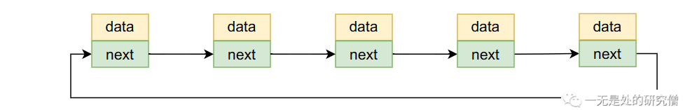
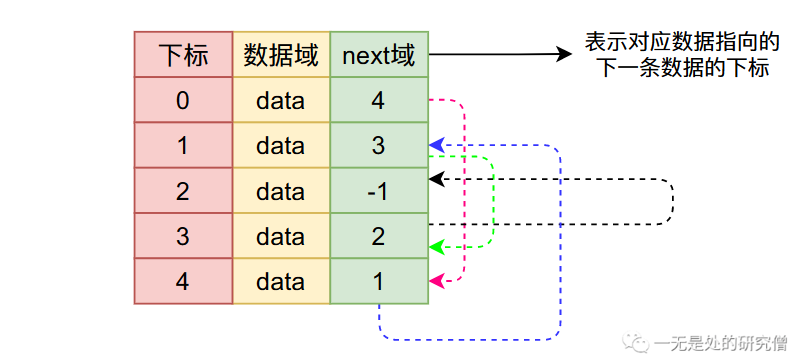
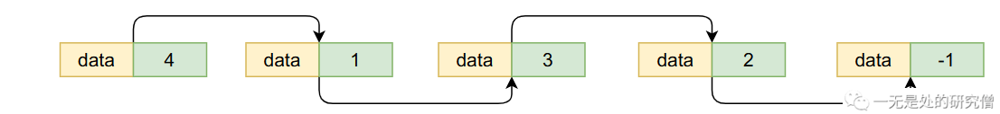
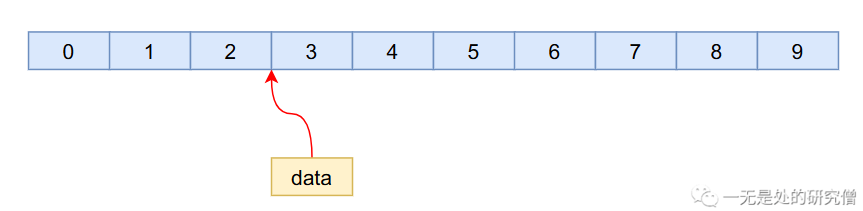
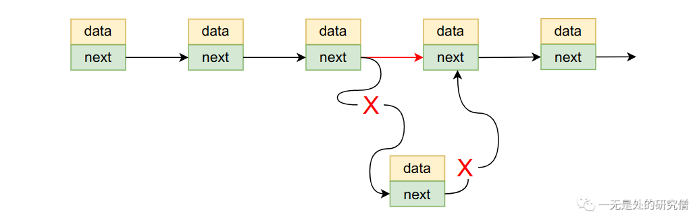

# 链表设计与实现

在谈链表之前，我们先谈谈我们平常编程会遇到的很常见的一个问题。如果在编程的时候，某个变量在后续编程中仍需使用，我们可以用一个局部变量来保存该值，除此之外一个更加常用的方法就是使用容器了。

那什么是**容器**呢？从字面上来说就是用来装某个东西的，比如我们的杯子，就是容器。在程序设计当中我们最常见的容器就是数组了，他可以存我们想保存的东西。在编程当中我们最常见的容器如下：

- 在Python当中有列表、字典、元组、集合等等。
- 在Java当中常见的容器有 `ArrayList`、`LinkedList`、`HashMap`、`HashSet`等等。
- 在C++当中有`vector`、`list`、`unordered_map`、`unordered_set`等等。

今天要谈到的链表在Java的`LinkedList`和C++的`list`当中就有使用到。

那什么是链表呢？链表是由一个一个的节点组成的，每个节点包含两个字段，其中一个字段data表示真实需要表示的数据，另外一个字段next表示指向下一个节点的指针（如果不了解指针也没有关系，就将其当做一个普通的变量既可，不影响我们的理解），data和next两者一起组成链表当中的节点(Node)。


其中`data`表示链表当中存储的真实的数据，而`next`表示指向下一个节点的指针（如果不了解指针也没有关系，就将其当做一个普通的变量既可，不影响我们的理解），`data`和`next`两者一起组成链表当中的节点(Node)。

`Java`代码：

```java
class Node<E> {
    E item;
    Node<E> next;
    public Node(E item, Node<E> next) {
      this.item = item;
      this.next = next;
    }
  }
```

### 单链表

所谓单链表就是只有一个指向其他节点的变量，比如下图当中只有一个next变量指向其他同样的节点。


### 双向链表

双向链表和单链表的区别就是他的指向有两个方向，而单链表只有一个方向，在双向链表的节点当中会有两个指向其他同样节点的变量，一个指向前一个节点，一个指向后一个节点，对应下图prev指向前一个节点，next指向后一个节点。


### 循环链表

这个概念也比较简单，就是链表首尾相连，形成一个环，比如单循环链表：



双向循环链表，第一个节点（头结点）的prev指向最后一个节点（尾节点），尾节点的next指向头结点：


### 静态链表

我们前面所提到的链表中的节点除了数据域（data）还有一个变量指向其他的节点，节点与节点之间的内存地址是不连续的，而静态链表和前面提到的链表不一样，它是使用**数组**来实现链表，只是将next变成一个`int`类型的数据，表示下一跳数据的下标，比如下图当中所表示的那样（其中-1表示链表的结尾，因为next域存储的是下一个节点的下标，下标肯定大于等于0，因此可以使用-1表示链表的结尾）：



在上图当中对应的链表如下（通过分析上图当中next域的指向分析得到下图）：



像这种使用数组实现的链表叫做静态链表，上面谈到的就是静态单链表，它对应的数据结构也很清楚：

```java
private static class StaticNode<E> {
    // 指向节点的真实存储的数据
    E item;
    // 指向下一个节点的下标
    int next;

    public StaticNode(E item, int next) {
      this.item = item;
      this.next = next;
    }
  }
```

### 为什么需要链表？

回答这个问题之前，首先需要搞清楚我们面临什么样的需求：

- 我们需要有一个容器可以保存我们的数据
- 我们的数据有一定的顺序性，比如我们现在容器当中的数据个数是10个，我们想在下标为3的地方插入一个数据



​	在数组长度够的情况下，我们需要将下标2之后的数据往后搬一个位置然后将新的数据放到下标为3的位置，这种插入的时间复杂度为 O(n)，至于为什么是O(n)我们在谈ArrayList时我们再进行证明。

- 但是如果我们采用的是链表的方法的话，我们的时间复杂度可以做到O(1)。

​	

​	对于上面这种插入情况，我们只需要稍微改变一下next的指向就可以了：


-  如果我们需要在数组当中删除一个元素，同样的原理，因为某个数据被删除之后它所在的那个位置就空了，因此需要将后续的数据往前搬一个位置：

  比如我们需要删除下标为三的数据：

  

  但是如果我们使用的是链表的话我们也只需要简单移动链表即可，比如要删除节点N，只需要将节点N的上一个节点的next指向节点N的下一个节点即可，同时将节点N的next设置为空。

  

​	因为我们在操作的时候只需要调整一下next指针的指向即可，这个操作的时间复杂度是常数级别的，因此时间复杂度为O(1)。

​	根据上面所谈到的内容，可以发现链表在这种需要频繁插入和删除的场景很适合。

### Java代码实现双向链表

#### 需求分析

在正式实现双向链表之前我们首先分析一下我们的需求：

- 需要有一个方法判断链表里面是否有数据，也就是链表是否为空。

- 需要有一个方法判断链表里面是否包含某个数据，这个包含的意思表示是否存在一个数据和当前的数据一样，并不是内存地址一致，相当于Java当中的equals方法。
- 需要有一个方法往链表当中添加数据
- 需要有一个方法往链表当中删除数据

我们的需求主要就是上面这些了，当然也可以增加一些其他的方法，比如说增加将链表变成数组的方法等等，为了简单我们只实现上述功能。

#### 具体实现

- 定义节点的数据结构

  根据前面的分析我们很容易可以设计出链表当中节点的结构，其代码如下所示：

  ```java
  /**
   * 自己实现链表
   * @param <E> 泛型，表示容器当中存储数据的数据类型
   */
  public class MyLinkedList<E> {
  
    private static class Node<E> {
      // 指向节点的真实存储的数据
      E item;
      // 前向指针：指向前一个数据
      Node<E> prev;
      // 后向指针：指向后一个数据
      Node<E> next;
      public Node(E item, Node<E> prev, Node<E> next) {
        this.item = item;
        this.prev = prev;
        this.next = next;
      }
    }
  }
  ```

  

- 为了符合设计模式，让我们的代码更加清晰和容易维护，我们可以设计一个接口（为了避免复杂的接口信息我们就用一个统一的接口表示）表示我们要实现的功能，其代码如下：

  ```java
  public interface MyCollection<E> {
  
    /**
     * 往链表尾部加入一个数据
     * @param o 加入到链表当中的数据
     * @return
     */
    boolean add(E o);
  
    /**
     * 表示在第 index 位置插入数据 o
     * @param index
     * @param o
     * @return
     */
    boolean add(int index, E o);
  
    /**
     * 从链表当中删除数据 o
     * @param o
     * @return
     */
    boolean remove(E o);
  
    /**
     * 从链表当中删除第 index 个数据
     * @param index
     * @return
     */
    boolean remove(int index);
    
    /**
     * 往链表尾部加入一个数据，功能和 add 一样
     * @param o
     * @return
     */
    boolean append(E o);
  
    /**
     * 返回链表当中数据的个数
     * @return
     */
    int size();
  
    /**
     * 表示链表是否为空
     * @return
     */
    boolean isEmpty();
  
    /**
     * 表示链表当中是否包含数据 o
     * @param o
     * @return
     */
    boolean contain(E o);
  }
  ```

- 链表当中应该有哪些变量?首先我们肯定需要知道链表当中有多少数据，其次因为我们是双向链表，需要能够从头或者从尾部进行链表的遍历，因此很自然我们需要变量指向链表当中的第一个节点和最后一个节点。

```java
  // 表示链表当中数据的个数
  private int size;

  // 链表当中第一个节点
  private Node<E> first;

  // 表示链表当中最后一个节点
  private Node<E> last;

```

- 往链表尾部加入一个节点

```java
  @Override
  public boolean append(E o) {
    final Node<E> l = last;
    // 新增的节点需要将 prev 指向上一个节点，上一个节点就是链表的 last 节点
    // 新增节点的下一个节点就 null
    final Node<E> newNode = new Node<>(o, last, null);
    last = newNode;
    if (first == null) {
      // 如果链表当中还没有节点，就将其作为第一个节点
      first = newNode;
    }else {
      // 如果链表当中已经有节点，需要将新增的节点连接到链表的尾部
      l.next = newNode;
    }
    size++;
    return true;
  }
```

- 根据下标找到链表当中对应下标的节点

```java
  /**
   * 根据下标找节点
   * @param index
   * @return
   */
   Node<E> findNodeByIndex(int index) {
     if (index >= size)
       throw new RuntimeException("输入 index 不合法链表中的数据个数为 " + size);
    Node<E> x;
    // 首先看看 index 和 size / 2 的关系
    // 这里主要是看链表的首和尾部谁距离 index 位置近，那头近就从哪头遍历
    // size >> 1 == size / 2
    if (index < (size >> 1)) {
      x = first;
      for (int i = 0; i < index; i++)
        x = x.next;
    } else {
      x = last;
      for (int i = size - 1; i > index; i--)
        x = x.prev;
    }
    return x;
  }

```

- 在链表当中删除某个节点

```java
  void removeNode(Node<E> node) {
     if (node == null)
       throw new NullPointerException();
     if (node.prev != null)
       node.prev.next = node.next;
     if (node.next != null)
       node.next.prev = node.prev;
  }

  /**
   * 根据下标删除某个节点
   * @param index
   * @return
   */
  @Override
  public boolean remove(int index) {
    // 首先找到第 index 个数据对应的节点
    Node<E> node = findNodeByIndex(index);
    // 删除节点
    removeNode(node);
    size--;
    return true;
  }

```

- toString方法重写

```java
  @Override
  public String toString() {

     if (first == null)
       return "[]";

    StringBuilder builder = new StringBuilder();
    builder.append("[");
    Node<E> start = first;
    builder.append(start.item.toString());
    start = start.next;
    while (start != null) {
      builder.append(", ").append(start.item.toString());
      start = start.next;
    }
    builder.append("]");
    return builder.toString();
  }
```

- 测试代码

```java
  public static void main(String[] args) {
    MyLinkedList<Integer> list = new MyLinkedList<>();
    System.out.println(list.contain(100));
    for (int i = 0; i < 10; i++) {
      list.add(i);
    }
    list.add(0, -9999);
    System.out.println(list.size() / 2);
    list.add(5, 9999);
    list.append(Integer.MAX_VALUE);
    System.out.println(list);

    list.remove(5);
    list.add(6, 6666);
    System.out.println(list);
    System.out.println(list.contain(6666));
  }
```

输出

```
false
5
[-9999, 0, 1, 2, 3, 9999, 4, 5, 6, 7, 8, 9, 2147483647]
[-9999, 0, 1, 2, 3, 4, 6666, 5, 6, 7, 8, 9, 2147483647]
true
```

双向链表实现完整代码：

```java
/**
 * 自己实现链表
 * @param <E> 泛型，表示容器当中存储数据的数据类型
 */
public class MyLinkedList<E> implements MyCollection<E> {

  // 表示链表当中数据的个数
  private int size = 0;

  // 链表当中第一个节点
  private Node<E> first;

  // 表示链表当中最后一个节点
  private Node<E> last;

  @Override
  public boolean add(E o) {
    return append(o);
  }

  @Override
  public boolean add(int index, E o) {
    Node<E> node = findNodeByIndex(index);
    insertBeforeNode(node, o);
    size++;
    return true;
  }

  /**
   * 在节点数据 node 之后插入数据 o
   * @param node
   * @param o
   */
  void insertAfterNode(Node<E> node, E o) {
    if (node == null)
      throw new NullPointerException();
    // newNode 前面的节点为 node 后面的节点是 node.next
    Node<E> newNode = new Node<>(o, node, node.next);
    if (node.next != null)
      node.next.prev = newNode;
    if (node == last)
      last = newNode;
    node.next = newNode;
  }


  /**
   * 在节点 node 之前插入数据 o
   * @param node
   * @param o
   */
  void insertBeforeNode(Node<E> node, E o) {
    if (node == null)
      throw new NullPointerException();
    // newNode 前面你的节点为 node.prev 后面的节点为 node
    Node<E> newNode = new Node<>(o, node.prev, node);
    if (node.prev != null)
      node.prev.next = newNode;
    else
      first = newNode;
    node.prev = newNode;
  }

  /**
   * 根据下标找节点
   * @param index
   * @return
   */
   Node<E> findNodeByIndex(int index) {
     if (index >= size)
       throw new RuntimeException("输入 index 不合法链表中的数据个数为 " + size);
    Node<E> x;
    // 首先看看 index 和 size / 2 的关系
    // 这里主要是看链表的首和尾部谁距离 index 位置近，那头近就从哪头遍历
    // size >> 1 == size / 2
    if (index < (size >> 1)) {
      x = first;
      for (int i = 0; i < index; i++)
        x = x.next;
    } else {
      x = last;
      for (int i = size - 1; i > index; i--)
        x = x.prev;
    }
    return x;
  }

  void removeNode(Node<E> node) {
     if (node == null)
       throw new NullPointerException();
     if (node.prev != null)
       node.prev.next = node.next;
     if (node.next != null)
       node.next.prev = node.prev;
  }

  @Override
  public boolean remove(E o) {
     Node<E> start = first;
     while (start != null) {
       if (start.item.equals(o))
         removeNode(start);
       start = start.next;
     }
     size--;
    return true;
  }

  /**
   * 根据下标删除某个节点
   * @param index
   * @return
   */
  @Override
  public boolean remove(int index) {
    // 首先找到第 index 个数据对应的节点
    Node<E> node = findNodeByIndex(index);
    // 删除节点
    removeNode(node);
    size--;
    return true;
  }

  @Override
  public boolean append(E o) {
    final Node<E> l = last;
    // 新增的节点需要将 prev 指向上一个节点，上一个节点就是链表的 last 节点
    // 新增节点的下一个节点就 null
    final Node<E> newNode = new Node<>(o, last, null);
    last = newNode;
    if (first == null) {
      // 如果链表当中还没有节点，就将其作为第一个节点
      first = newNode;
    }else {
      // 如果链表当中已经有节点，需要将新增的节点连接到链表的尾部
      l.next = newNode;
    }
    size++;
    return true;
  }

  @Override
  public int size() {
    return size;
  }

  @Override
  public boolean isEmpty() {
    return size == 0;
  }

  @Override
  public boolean contain(E o) {
     Node<E> start = first;
     while (start != null) {
       if (start.item.equals(o))
         return true;
       start = start.next;
     }
    return false;
  }

  private static class Node<E> {
    // 指向节点的真实存储的数据
    E item;
    // 前向指针：指向前一个数据
    Node<E> prev;
    // 后向指针：指向后一个数据
    Node<E> next;
    public Node(E item, Node<E> prev, Node<E> next) {
      this.item = item;
      this.prev = prev;
      this.next = next;
    }
  }

  @Override
  public String toString() {

     if (first == null)
       return "[]";

    StringBuilder builder = new StringBuilder();
    builder.append("[");
    Node<E> start = first;
    builder.append(start.item.toString());
    start = start.next;
    while (start != null) {
      builder.append(", ").append(start.item.toString());
      start = start.next;
    }
    builder.append("]");
    return builder.toString();
  }

  public static void main(String[] args) {
    MyLinkedList<Integer> list = new MyLinkedList<>();
    System.out.println(list.contain(100));
    for (int i = 0; i < 10; i++) {
      list.add(i);
    }
    list.add(0, -9999);
    System.out.println(list.size() / 2);
    list.add(5, 9999);
    list.append(Integer.MAX_VALUE);
    System.out.println(list);

    list.remove(5);
    list.add(6, 6666);
    System.out.println(list);
    System.out.println(list.contain(6666));
  }
}
```

关注公众号：一无是处的研究僧，了解更多计算机知识


下期我们仔细分析`JDK`内部`LinkedList`具体实现，我是LeHung，我们下期再见！！！

