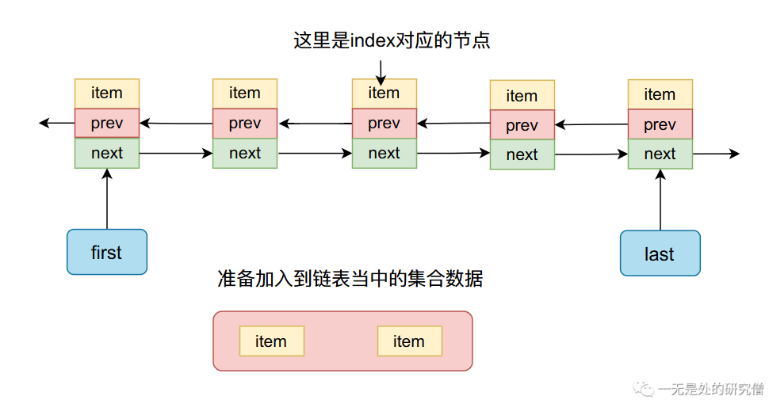
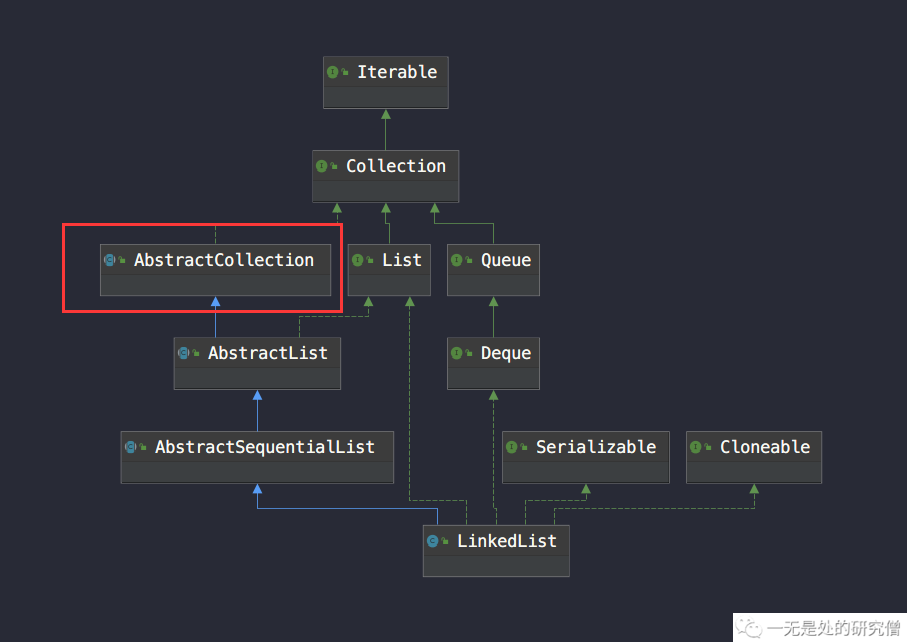

# LinkedList源码深度剖析

## LinkedList继承体系

首先先直观的看一下`LinedList`的继承体系和实现的接口


```java
public class LinkedList<E>
    extends AbstractSequentialList<E>
    implements List<E>, Deque<E>, Cloneable, java.io.Serializable
```

- 实现了`List`接口，这个接口定义了一些常见的容器的方法，比如`add`、`addAll`、`get`、`set`、`contains`、`sort`等等。
- 实现了`Deque`接口，这个接口你可以简单的认为是一个双端队列，两头都可以进可以出，它定义的方法有`getFirst`、`getLast`、`addFirst`、`addLast`、`removeFirst`、`removeLast`等等。
- 实现`Cloneable`和`Serializable`接口主要是为了能够进行深拷贝和序列化，这个问题我们后续再谈。
- `AbstractSequentialList`主要是给一些接口方法提供默认实现。

根据[上篇文章](https://mp.weixin.qq.com/s?__biz=Mzg3ODgyNDgwNg==&mid=2247483691&idx=1&sn=5f730f9ca5f84aa97a13a730ed6d85df&chksm=cf0c9d22f87b14347aed05fa3c0cd313f278618e43aef37cd4fc078fb124c9845b527ba55d3d&token=917021200&lang=zh_CN#rd)的分析，我们很容易知道链表作为一个容器肯定需要将数据加入到容器当中，也需要从容器当中得到某个数据，判断数据是否存在容器当中，因此有`add`、`addAll`、`get`、`set`、`contains`、`sort`这些方法是很自然的。此外`LinedList`实现的是双向链表，我们很容易在链表的任意位置进行插入和删除，当我们在链表的头部和尾部进行插入和删除的时候就可以满足`Deque`的需求了（双端队列需要能够在队列的头和尾进行出队和入队，就相当于插入和删除），因此`LinedList`实现`getFirst`、`getLast`、`addFirst`、`addLast`、`removeFirst`、`removeLast`也就很容易理解了。

## LinkedList整体结构

- `LinkedList`主要几个字段

```java

	transient int size = 0; // 用于记录链表当中节点的个数，也就是有几个数据

    /**
     * Pointer to first node.
     * Invariant: (first == null && last == null) ||
     *            (first.prev == null && first.item != null)
     */
    transient Node<E> first; // 指向双向链表的头结点

    /**
     * Pointer to last node.
     * Invariant: (first == null && last == null) ||
     *            (last.next == null && last.item != null)
     */
    transient Node<E> last; // 指向双向链表的尾节点

```

- `LinkedList`当中的内部节点的形式

```java
private static class Node<E> {
    E item;
    Node<E> next;
    Node<E> prev;

    Node(Node<E> prev, E element, Node<E> next) {
        this.item = element;
        this.next = next;
        this.prev = prev;
    }
}
```

根据上面的字段分析，`LinkedList`内部结构主要如下：


链表当中有`first`和`last`字段主要指向链表当中第一个节点和最后一个节点，如果链表当中没有节点，那么他们都是`null`，如果链表当中有一个节点他们指向同一个节点，如果链表中节点个数大于2，他们分别指向第一个节点和最后一个节点。

## LinkedList重要方法

- `add`方法，这个方法主要是向链表尾部增加一个元素，作用和 `linkLast `一致。

```java
    /**
     * Appends the specified element to the end of this list.
     *
     * <p>This method is equivalent to {@link #addLast}.
     *
     * @param e element to be appended to this list
     * @return {@code true} (as specified by {@link Collection#add})
     */
    public boolean add(E e) {
        // 这个方法主要是向链表尾部增加一个元素，作用和 linkLast 一致
        linkLast(e);
        return true;
    }

    /**
     * Links e as last element.
     */
    void linkLast(E e) {
        // 这个方法和我们上篇自己的写的方法基本一模一样
        final Node<E> l = last;
        // l 作为新节点的前驱节点，因为是在链表最后增加一个元素，因此它的下一个元素是 null
        final Node<E> newNode = new Node<>(l, e, null);
        // 新节点是最后一个节点，因为是往链表节点插入
        last = newNode;
        if (l == null) // 如果是第一个加入一个节点（初始是 first 和 last 节点都是空），给 first 赋值
            first = newNode;
        else
            l.next = newNode;
        size++; // 因为是往链表当中增加一个节点，因此链表中数据的个数+1
        modCount++; // 这个字段主要是用于 fast-fail 的，这个我们在后面将继续谈到
    }

```

- `linkBefore`和`linkLast`的作用相反，是在某个节点前面插入数据`e`，大体和前面的`linkLast`方法一致。

```java
    /**
     * Inserts element e before non-null Node succ.
     */
    void linkBefore(E e, Node<E> succ) {
        // assert succ != null;
        final Node<E> pred = succ.prev;
        final Node<E> newNode = new Node<>(pred, e, succ);
        succ.prev = newNode;
        if (pred == null)
            first = newNode;
        else
            pred.next = newNode;
        size++;
        modCount++;
    }

```

- `unlink`主要是用于删除某个节点。

```java
    /**
     * Unlinks non-null node x.
     */
    E unlink(Node<E> x) {
        // assert x != null;
        final E element = x.item;
        final Node<E> next = x.next;
        final Node<E> prev = x.prev;
		
        // 如果前一个节点为 null 说明被删除的就是首节点，因此需要跟新首节点为原来节点的下一个节点，也就是 next
        if (prev == null) {
            first = next;
        } else {
            prev.next = next;
            x.prev = null;
        }
		// 同样的，如果 next 为 null ，那么被删除的节点就是为节点，因此需要更新 last 为被删除节点的上一个节点
        if (next == null) {
            last = prev;
        } else {
            next.prev = prev;
            x.next = null;
        }

        x.item = null;
        size--;
        modCount++;
        return element;
    }

```

- `unlinkFirst`，删除链表当中第一个节点

```java
    private E unlinkFirst(Node<E> f) {
        // f 表示头结点，且 f 不等于 null
        final E element = f.item;
        final Node<E> next = f.next;
        f.item = null;
        f.next = null; // help GC
        first = next; // 头结点变成f的下一个节点
        if (next == null)
            last = null;
        else
            next.prev = null;
        size--; // 删除一个节点链表当中数据少了一个，因此size--
        modCount++;
        return element;
    }

```

- `unlinkLast`，删除链表当中最后一个节点

```java
    private E unlinkLast(Node<E> l) {
        // assert l == last && l != null;
        final E element = l.item;
        final Node<E> prev = l.prev;
        l.item = null;
        l.prev = null; // help GC
        last = prev;
        if (prev == null)
            first = null;
        else
            prev.next = null;
        size--;
        modCount++;
        return element;
    }

```

- `remove`方法，删除链表当中的某个元素

```java
    public boolean remove(Object o) {
        // 如果元素为 null，就删除链表当中第一个值为 null 的元素
        // 从这里也可以看出 LinkedList 支持值为 null 的对象
        if (o == null) {
            for (Node<E> x = first; x != null; x = x.next) {
                if (x.item == null) {
                    unlink(x);
                    return true;
                }
            }
        } else {
            for (Node<E> x = first; x != null; x = x.next) {
                if (o.equals(x.item)) {
                    unlink(x);
                    return true;
                }
            }
        }
        return false;
    }

```

- `node`方法，根据下标找到对应的元素

```java
    Node<E> node(int index) {
        // 找到第 index + 1 个元素
		// 判断对应位置的元素是离链表头部近还是离链表尾部近，哪头近就从哪头遍历
        if (index < (size >> 1)) {
            Node<E> x = first;
            for (int i = 0; i < index; i++)
                x = x.next;
            return x;
        } else {
            Node<E> x = last;
            for (int i = size - 1; i > index; i--)
                x = x.prev;
            return x;
        }
    }

```

- `get`方法，通过下标 `index`得到对应的元素

```java
    public E get(int index) {
        // 这个函数的主要目的是查看 index 是否合法，主要判断是否小于0或者大于等于链表当中元素的个数
        checkElementIndex(index);
        return node(index).item; // node函数在上面已经提到了
    }

    private void checkElementIndex(int index) {
        if (!isElementIndex(index))
            throw new IndexOutOfBoundsException(outOfBoundsMsg(index));
    }

    private boolean isElementIndex(int index) {
        return index >= 0 && index < size;
    }

```

- `addAll`方法，将一个集合中的所有元素加入到链表的指定位置当中

```java
    public boolean addAll(int index, Collection<? extends E> c) {
        checkPositionIndex(index); // 这个函数和checkElementIndex一样都是用于检测 index 是否合法的

        Object[] a = c.toArray();
        int numNew = a.length;
        if (numNew == 0)
            return false;

        Node<E> pred, succ;
        // 首先找到 index 对应位置的节点 succ 和他的前驱节点 pred
        if (index == size) {
            succ = null;
            pred = last;
        } else {
            succ = node(index);
            pred = succ.prev;
        }

        for (Object o : a) {
            // 遍历每个数据产生新的节点 节点的前驱节点为 pred 后驱节点为 null
            @SuppressWarnings("unchecked") E e = (E) o;
            Node<E> newNode = new Node<>(pred, e, null);
            if (pred == null)
                first = newNode;
            else
                pred.next = newNode;
            // 更新 pred 节点为 新加入的节点，然后继续插入
            pred = newNode;
        }
		
        // 将新插入的所有节点和原来的节点拼接上
        if (succ == null) {
            last = pred;
        } else {
            pred.next = succ;
            succ.prev = pred;
        }
		
        size += numNew;
        modCount++;
        return true;
    }

```

整个过程如下图所示：

进行插入之前：




插入之后：


- `set`方法，更新某个下标的数据`item`

```java
	public E set(int index, E element) {
        checkElementIndex(index); // 判断下标是否合法
        Node<E> x = node(index);
        E oldVal = x.item;
        x.item = element; // 更新数据
        return oldVal; // 返回旧数据
    }
```

- `get`方法，通过下标获取数据

```java
    public E get(int index) {
        checkElementIndex(index); // 判断下标是否合法
        return node(index).item; // 取出对应的数据
    }
```

以上主要介绍了`LinkedList`当中主要的一些方法和其主要的工作机制，其他的一下方法都比较简单，大家可以自行参考`LinkedList`源代码。

## LinkedList类杂谈

本小节主要介绍在`LinkedList`当中除了链表之外的其他的比较重要的知识点，帮助大家理解一些习以为常但是又可能没有仔细思考过的点！！！

### toString方法重写

我们首先来看一下下面代码的输出

```java
public class CodeTest {

  public static void main(String[] args) {
    LinkedList<Integer> list = new LinkedList<>();
    for (int i = 0; i < 10; i++) {
      list.add(i);
    }
    System.out.println(list);
  }
}
// 输出结果：
// [0, 1, 2, 3, 4, 5, 6, 7, 8, 9]
```

执行上面一段代码我们可以在控制台看见对应的输出，我们知道最终打印在屏幕上的是一个字符串，那这个字符串怎么来的呢，我们打印的是一个对象，它是怎么得到字符串的呢？我们可以查看`System.out.println`的源代码：

```java
    public void println(Object x) {
        String s = String.valueOf(x);
        synchronized (this) {
            print(s);
            newLine();
        }
    }
```

从上述代码当中我们可以看见通过`String s = String.valueOf(x);`这行代码得到了一个字符串，然后进行打印，我们在进入`String.valueOf`方法看看是如何得到字符串的：

```java
    public static String valueOf(Object obj) {
        return (obj == null) ? "null" : obj.toString();
    }

```

我们可以看到如果对象不为 `null` 最终是调用对象的`toString`方法得到的字符串。**因此当打印一个对象的时候，最终会打印这个对象的`toString`方法返回的字符串**。

我们在`LinkedList`类中搜索`toString`方法，发现这个方法是存在于`AbstractCollection`类当中，也就是下面这个类，`LinkedList`继承于它：



`toString`方法的源代码如下所示：

```java
    public String toString() {
        // 得到链表的迭代器
        Iterator<E> it = iterator();
        // 如果链表当中没有数据则返回空
        if (! it.hasNext())
            return "[]";
		// 额，写这个代码的工程师应该不懂中文 哈哈哈
        StringBuilder sb = new StringBuilder();
        sb.append('[');
        for (;;) {
            E e = it.next();
            // 将对象加入到 StringBuilder 当中，这里加入的也是一个对象
            // 但是在 append 源代码当中会同样会使用 String.ValueOf 
            // 得到对象的 toString 方法的结果
            sb.append(e == this ? "(this Collection)" : e);
            if (! it.hasNext())
                return sb.append(']').toString();
            sb.append(',').append(' ');
        }
    }

```

从上面的代码我们可以看出所有继承自`AbstractCollection`的类的`toString`方法都是在方括号里面填入集合中对象的`toString`结果。

### equlas方法重写

当我们去比较两个链表是否相等的时候我们通常去使用`equlas`方法。比如比较两个字符串对象是否相等：

```java
  public static void stringEqualsTest() {
    String s1 = new String("一无是处的研究僧");
    String s2 = new String("一无是处的研究僧");
    System.out.println(s1 == s2);
    System.out.println(s1.equals(s2));
  }
// 输出
// false
// true
```

其中 `==` 比较的是两个对象的内存地址（也就是`s1`和`s2`指向的两个对象）是否相同，也就是`s1`和`s2`是否是同一个对象，`equals`比较的是两个字符串对象的内容是否相同（不同的类实现方式不一样可能有差异，字符串`String`实现方式是只要内容相同`equlas`方法就返回`true`，否则返回`false`），上述代码在内存当中的布局大致如下：


`==`比较的是两个箭头指向的内容的内存地址是否一致，`equlas`根据具体的类的实现有所差异。

现在我们来看一下`LinkedList`类是如何实现`equlas`方法的，和`toString`方法一样，`equlas`方法也是在类`AbstractCollection`当中实现的。

```java
    public boolean equals(Object o) {
        if (o == this)
            return true;
        if (!(o instanceof List))
            return false;

        ListIterator<E> e1 = listIterator();
        ListIterator<?> e2 = ((List<?>) o).listIterator();
        while (e1.hasNext() && e2.hasNext()) {
            E o1 = e1.next();
            Object o2 = e2.next();
            if (!(o1==null ? o2==null : o1.equals(o2)))
                return false;
        }
        return !(e1.hasNext() || e2.hasNext());
    }

```

上面代码的主要流程：

- 首先判断`o`和`this`是否是同一个对象，如果是则返回`true`，比如下面这种情况：

```java
LinkedList<Object> list = new LinkedList<>();
list.equals(list);
```

- 如果对象没有实现`List`接口返回`false`。
- 逐个判断链表里面的对象是否相等（调用链表当中存储的对象的`equals`方法），如果两个链表当中节点数目一样而且都相等则返回`true`否则返回`false`。

通过上面的分析我们可以发现`LinkedList`方法并没有让比较的对象是`LinkedList`对象，只需要实现`List`接口并且数据数目和内容都相同，这样`equals`方法返回的结果就是`true`，比如下面代码就验证的这个结果：

```java
    LinkedList<Integer> list = new LinkedList<>();
    ArrayList<Integer> arrayList = new ArrayList<>();
    for (int i = 0; i < 10; i++) {
      list.add(i);
      arrayList.add(i);
    }
    System.out.println(list.equals(arrayList)); // 结果为 true
```

### 克隆(clone)方法重写

当我们想要克隆一个对象的时候我们通常会使用到这个方法，这个方法通常是将被克隆的对象复制一份，我们来看一下`LinkedList`的`clone`方法。

```java
	@SuppressWarnings("unchecked")
    private LinkedList<E> superClone() {
        try {
            // 这里返回一个新的 LinkedList 空对象
            return (LinkedList<E>) super.clone(); // 这里的super.clone() 是 protected native Object clone() throws CloneNotSupportedException; 本地方法
        } catch (CloneNotSupportedException e) {
            throw new InternalError(e);
        }
    }

	public Object clone() {
        // 这里得到一个新的 LinkedList 空对象
        LinkedList<E> clone = superClone();
		
        // 空对象初始化
        clone.first = clone.last = null;
        clone.size = 0;
        clone.modCount = 0;

        // 将所有的元素加入到新的 LinkedList 对象
        for (Node<E> x = first; x != null; x = x.next)
            clone.add(x.item);

        return clone;
    }

```

通过上面的代码我们可以知道`LinkedList`的克隆方法创建了一个新的链表但是没有改变里面的数据，因此如果你修改克隆链表中的数据的话，原来的链表里面的数据也会改，比如：

```java
import java.util.LinkedList;

class Person {

  String name;

  public String getName() {
    return name;
  }

  public void setName(String name) {
    this.name = name;
  }

  @Override
  public String toString() {
    return "Person{" +
        "name='" + name + '\'' +
        '}';
  }
}

public class LinkedListTest {

  public static void main(String[] args) {
    LinkedList<Person> list = new LinkedList<>();
    Person person = new Person();
    person.setName("一无是处的研究僧");
    list.add(person);
    LinkedList<Person> o = (LinkedList) list.clone();
    System.out.println(o.get(0) == list.get(0));
    System.out.println(o.get(0));
    System.out.println(list.get(0));
    o.get(0).setName("LeHung");
    System.out.println(o.get(0) == list.get(0));
    System.out.println(o.get(0));
    System.out.println(list.get(0));
  }
}
// 输出结果：
true
Person{name='一无是处的研究僧'}
Person{name='一无是处的研究僧'}
true
Person{name='LeHung'}
Person{name='LeHung'}
```

以上就是对`LinkedList`的源码分析，我是LeHung，我们下期再见！！！

关注公众号：一无是处的研究僧，了解更多计算机知识


