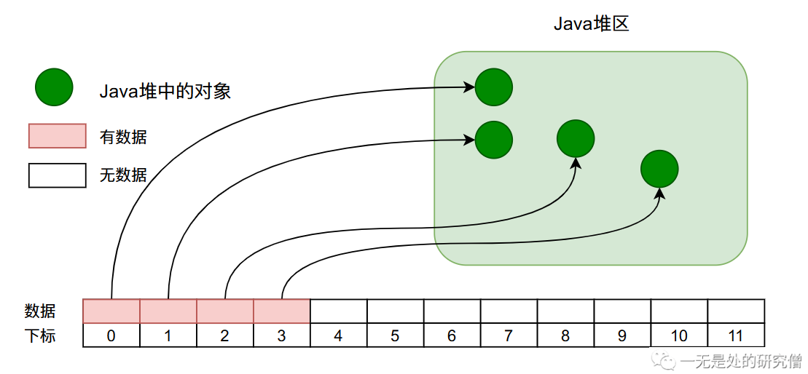
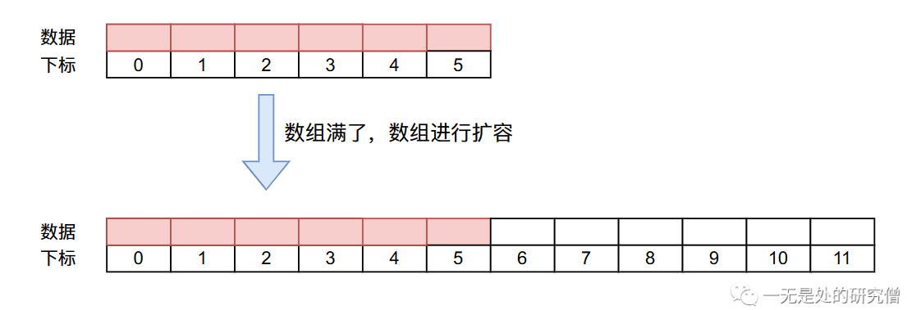
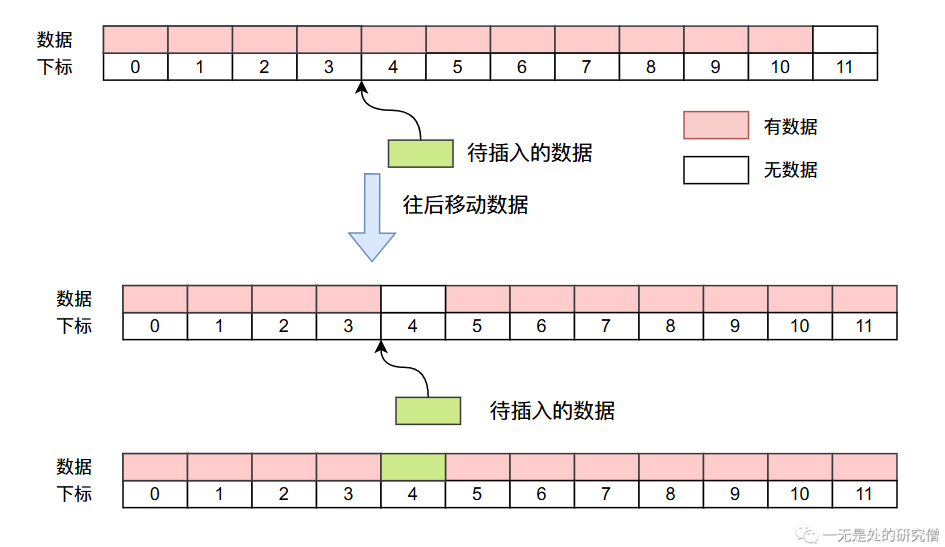
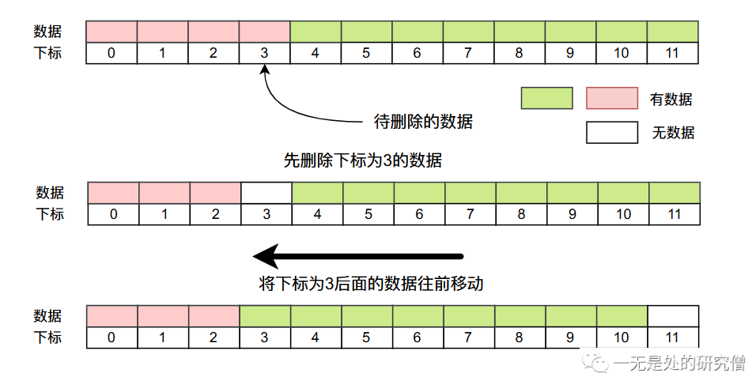

# 数组容器(ArrayList)设计与Java实现

本篇文章主要跟大家介绍我们最常使用的一种容器`ArrayList`、`Vector`的原理，并且自己使用`Java`实现自己的数组容器`MyArrayList`，让自己写的容器能像`ArrayList`那样工作。在本篇文章当中首先介绍`ArrayList`的一些基本功能，然后去分析我们自己的容器`MyArrayList`应该如何进行设计，同时分析我们自己的具体实现方法，最后进行代码介绍！！！

## ArrayList为我们提供了哪些功能？

我们来看一个简单的代码，随机生成100个随机数，查看生成随机数当中是否存在50这个数。

```java
public class MyArrayList {

  public static void main(String[] args) {
    Random random = new Random();
    ArrayList<Integer> list = new ArrayList<>();
    for (int i = 0; i < 100; i++) {
      list.add(random.nextInt(5000));
    }
    for (int i = 0; i < 100; i++) {
      if (list.get(i) == 50) {
        System.out.println("包含数据 50");
      }
    }
    list.set(5, 1000);// 设置下标为5的数据为100
    list.remove(5);// 删除下标为5的数据
    list.remove(new Integer(888));// 删除容器当中的第一个值为5的数据
  }
}

```

上述代码包含了`ArrayList`最基本的一个功能，一个是`add`方法，向数组容器当中加入数据，另外一个方法是`get`从容器当中拿出数据，`set`方法改变容器里的数据，`remove`方法删除容器当中的数据。`ArrayList`的很多其他的方法都是围绕这四个最基本的方法展开的，因此我们在这里不仔细介绍其他的方法了，后面我们自己实现的时候遇到问题的时候自然会需要设计相应的方法，然后我们进行解决即可。

现在我们就需要去设计一个数组容器实现“增删改查”这四个基本功能。

## 设计原理分析

首先明白一点我们需要使用什么工具去实现这样一个容器。我们手里有的工具就是`Java`提供给我们的最基本的功能——数组（这个好像是废话，我们的标题就是**数组容器**🤣）。

当我们在`Java`当中使用数组去存储数据时，数据在`Java`当中的内存布局大致如下图所示。



我们在设计数组容器这样一个数据结构的时候主要会遇到两个问题：

- 我们申请数组的长度是多少。
- 当数组满了之后怎么办，也就是我们的扩容机制。

对于这两个问题，首先我们数组的初始大小可以有默认值，在我们自己实现的`MyArrayList`当中设置为10，我们在使用类时也可以传递一个参数指定初始大小。第二个问题当我们的数组满的时候我们需要对数组进行扩容，在我们实现的`MyArrayList`当中我们采取的方式是，新数组的长度是原数组的两倍（这个跟`JDK`的`ArrayList`方式不一样，`ArrayList`扩容为原来的1.5倍）。



## 代码实现

为了让我们的类实现的更加简单我们在代码当中就不做很多非必要的逻辑判断并且抛出异常，我们的代码只要能表现出我们的思想即可。

- 首先定义一个接口`MyCollection`，表示我们要实现哪些方法！

```java
public interface MyCollection<E> {

  /**
   * 往链表尾部加入一个数据
   * @param o 加入到链表当中的数据
   * @return
   */
  boolean add(E o);

  /**
   * 表示在第 index 位置插入数据 o
   * @param index
   * @param o
   * @return
   */
  boolean add(int index, E o);

  /**
   * 从链表当中删除数据 o
   * @param o
   * @return
   */
  boolean remove(E o);

  /**
   * 从链表当中删除第 index 个数据
   * @param index
   * @return
   */
  boolean remove(int index);

  /**
   * 往链表尾部加入一个数据，功能和 add 一样
   * @param o
   * @return
   */
  boolean append(E o);

  /**
   * 返回链表当中数据的个数
   * @return
   */
  int size();

  /**
   * 表示链表是否为空
   * @return
   */
  boolean isEmpty();

  /**
   * 表示链表当中是否包含数据 o
   * @param o
   * @return
   */
  boolean contain(E o);

  /**
   * 设置下标为 index 的数据为 o
   * @param index
   * @param o
   * @return
   */
  boolean set(int index, E o);
}
```

- 我们的构造函数，初始化过程。

```java
  public MyArrayList(int initialCapacity) {
    this();
    // 增长数组的空间为 initialCapacity，即申请一个数组
    // 且数组的长度为 initialCapacity
    grow(initialCapacity); 
  }

  public MyArrayList() {
    this.size = 0; // 容器当中的数据个数在开始时为 0
    this.elementData = EMPTY_INSTANCE; // 将数组设置为空数组
  }

```

- 我们需要实现的最复杂的方法就是`add`了，这个方法是四个方法当中最复杂的，其余的方法都相对比较简单。
  - 进入`add`方法之后，我们需要找到符合要求的最小数组长度，这个值通常是容器当中元素的个数`size + 1` ，也就是图中的`minCapacity`首先先比较这个值和现在数组的长度，如果长度不够的话则需要进行扩容，将数组的长度扩大到原来的两倍。
  - 如果不需要扩容，则直接讲元素放入到数组当中即可。


```java
  @Override
  public boolean add(E o) {
    // 这个函数的主要作用就是确保数组的长度至少为 size + 1
    ensureCapacity(size + 1);
    // 新增加了一个数据，容器的大小需要 + 1
    elementData[++size] = o;
    return true;
  }

  /**
   * 这个函数的主要作用就是确保数组的长度至少为 capacity
   * @param capacity
   */
  public void ensureCapacity(int capacity) {
    int candidateCapacity = findCapacity(capacity);
    if (elementData.length < candidateCapacity)
      grow(candidateCapacity);
  }

  /**
   * 这个函数的主要目的就是找到最终数组长度需求的容量
   * @param minCapacity
   * @return
   */
  private int findCapacity(int minCapacity) {
    /**
     * 如果 if 条件为 true 即 elementData 还是初始化时设置的空数组
     * 那么返回默认大小和需要大小的最大值 
     * 否则直接返回 minCapacity
     */
    if (elementData == EMPTY_INSTANCE){
      return Math.max(DEFAULT_CAPACITY, minCapacity);
    }
    return minCapacity;
  }
```

- 我们为什么需要将`ensureCapacity`的访问限制权限设置为`public`？因为我们想让用户尽量去使用这个函数，因为如果我们如果写出下面这样的代码我们会一直申请内存空间，然后也需要将前面的数组释放掉，会给垃圾回收器造成更大的压力。

```java
    ArrayList<Integer> list = new ArrayList<>();
    for (int i = 0; i < 1000000; i++) {
      list.add(i);
    }
```

下面我们对`ArrayList`的方法进行测试：

```java

import java.util.ArrayList;

class Person {

  String name;

  public String getName() {
    return name;
  }

  public void setName(String name) {
    this.name = name;
  }

  @Override
  public String toString() {
    return "Person{" +
        "name='" + name + '\'' +
        '}';
  }
}


public class ArrayListTest {

  public static void main(String[] args) {
    ArrayList<Person> o1 = new ArrayList<>();
    o1.ensureCapacity(10000000);
    long start = System.currentTimeMillis();
    for (int i = 0; i < 10000000; i++) {
      o1.add(new Person());
    }
    long end = System.currentTimeMillis();
    System.out.println("end - start: " + (end - start));
    ArrayList<Person> o2 = new ArrayList<>();
    start = System.currentTimeMillis();
    for (int i = 0; i < 10000000; i++) {
      o2.add(new Person());
    }
    end = System.currentTimeMillis();
    System.out.println("end - start: " + (end - start));
  }
}
// 输出结果
end - start: 1345
end - start: 4730
```

从上面的测试结果我们可以看出提前使用`ensureCapacity`方法之后，程序执行的时间更加短。

- 插入数据的`add`方法。

```java

  @Override
  public boolean add(E o) {
    // 这个函数的主要作用就是确保数组的长度至少为 size + 1
    ensureCapacity(size + 1);
    // 新增加了一个数据，容器的大小需要 + 1
    elementData[size] = o;
    size++;
    return true;
  }

```

- `add`在指定下标插入数据。
  - 首先将插入下标后的数据往后移动一个位置
  - 然后在将数据放在指定下标的位置。



```java
  /**
   * 在下标 index 位置插入数据 o
   * 首先先将 index 位置之后的数据往后移动一个位置
   * 然后将 index 赋值为 o
   * @param index
   * @param o
   * @return
   */
  @Override
  public boolean add(int index, E o) {
    // 确保容器当中的数组长度至少为 size + 1
    ensureCapacity(size + 1);
    // 将 elementData index位置之后的数据往后移动一个位置
    // 做一个原地拷贝
    System.arraycopy(elementData, index, elementData, index + 1,
        size - index); // 移动的数据个数为 size - index
    elementData[index] = o;
    size++;
    return true;
  }

```

- 删除数据的方法`remove`。
  - 首先先删除指定下标的数据。
  - 然后将指定下标后的数据往前移动一个位置
  - 在实际的操作过程中我们可以不删除，直接移动，这样也覆盖被插入位置的数据了。



```java
  /**
   * 移除下标为 index 的数据
   * @param index
   * @return
   */
  @Override
  public boolean remove(int index) {
    // 需要被移动的数据个数
    int numMoved = size - index - 1;
    if (numMoved > 0)
      System.arraycopy(elementData, index+1, elementData, index,
          numMoved);
    elementData[--size] = null;

    return true;
  }
```

- 移除容器当中具体的某个对象。

```java
  /**
   * 这个方法主要是用于溢出容器当中具体的某个数据
   * 首先先通过 for 循环遍历容器当中的每个数据，
   * 比较找到相同的数据对应的下标，然后通过下标移除方法
   * @param o
   * @return
   */
  @Override
  public boolean remove(E o) {
    if (o == null) {
      for (int index = 0; index < size; index++)
        if (elementData[index] == null) {
          remove(index);
          return true;
        }
    } else {
      for (int index = 0; index < size; index++)
        if (o.equals(elementData[index])) {
          remove(index);
          return true;
        }
    }
    return false;
  }

```

- `set`方法，这个方法就很简单了。

```java
  @Override
  public boolean set(int index, E o) {
    elementData[index] = o;
    return true;
  }
```


- 重写`toString`方法。

```java
  @Override
  public String toString() {

    if (size <= 0)
      return "[]";

    StringBuilder builder = new StringBuilder();
    builder.append("[");
    for (int index = 0; index < size; index++) {
      builder.append(elementData[index].toString() + ", ");
    }
    builder.delete(builder.length() - 2, builder.length());
    builder.append("]");
    return builder.toString();
  }

```

- 测试代码

```java
public static void main(String[] args) {
    MyArrayList<Integer> list = new MyArrayList<>();
    for (int i = 0; i < 15; i++) {
      list.add(-i);
    }
    System.out.println(list.contain(5));
    System.out.println(list);
    list.remove(new Integer(-6));
    System.out.println(list);
    System.out.println(list.elementData.length); // 容器会扩容两倍，而默认容器长度为10，因此这里是 20 
    list.add(5, 99999);
    System.out.println(list);
    System.out.println(list.contain(99999));
  }
// 代码输出
false
[0, -1, -2, -3, -4, -5, -6, -7, -8, -9, -10, -11, -12, -13, -14]
[0, -1, -2, -3, -4, -5, -7, -8, -9, -10, -11, -12, -13, -14]
20
[0, -1, -2, -3, -4, 99999, -5, -7, -8, -9, -10, -11, -12, -13, -14]
true

```

## 完整代码

```java
import java.util.ArrayList;
import java.util.Arrays;


public class MyArrayList<E> implements MyCollection<E> {

  /**
   * 容器当中存储数据的个数
   */
  private int size;

  /**
   * 容器中数组的默认长度
   */
  private static final int DEFAULT_CAPACITY = 10;

  /**
   * 存放具体数据的数组，也就是我们容器当中真正存储数据的地方
   */
  Object[] elementData;

  /**
   * 当容器当中没有数据将 elementData 设置为这个值，这个值是所有实例一起共享的
   */
  private static final Object[] EMPTY_INSTANCE = {};


  public MyArrayList(int initialCapacity) {
    this();
    // 增长数组的空间为 initialCapacity，即申请一个数组
    // 且数组的长度为 initialCapacity
    grow(initialCapacity);
  }

  public MyArrayList() {
    this.size = 0; // 容器当中的数据个数在开始时为 0
    this.elementData = EMPTY_INSTANCE; // 将数组设置为空数组
  }

  /**
   * 这个函数的主要作用就是确保数组的长度至少为 capacity
   * @param capacity
   */
  public void ensureCapacity(int capacity) {
    int candidateCapacity = findCapacity(capacity);
    if (elementData.length < candidateCapacity)
      grow(candidateCapacity);
  }

  /**
   * 这个函数的主要目的就是找到最终数组长度需求的容量
   * @param minCapacity
   * @return
   */
  private int findCapacity(int minCapacity) {
    /**
     * 如果 if 条件为 true 即 elementData 还是初始化时设置的空数组
     * 那么返回默认大小和需要大小的最大值
     * 否则直接返回 minCapacity
     */
    if (elementData == EMPTY_INSTANCE){
      return Math.max(DEFAULT_CAPACITY, minCapacity);
    }
    return minCapacity;
  }

  /**
   * 该函数主要保证 elementData 的长度至少为 minCapacity
   * 如果数组的长度小于 minCapacity 则需要进行扩容，反之
   * @param minCapacity 数组的最短长度
   */
  private void grow(int minCapacity) {
    int oldCapacity = elementData.length;
    // 新的数组长度为原来数组长度的两倍
    int newCapacity = oldCapacity << 1;

    // 如果数组新数组的长度 newCapacity 小于所需要的长度 minCapacity
    // 新申请的长度应该为 minCapacity
    if (newCapacity < minCapacity) {
      newCapacity = minCapacity;
    }
    // 申请一个长度为 newCapacity 的数组，在将原来数组
    // elementData 的数据拷贝到新数组当中
    elementData = Arrays.copyOf(elementData, newCapacity);
  }

  @Override
  public boolean add(E o) {
    // 这个函数的主要作用就是确保数组的长度至少为 size + 1
    ensureCapacity(size + 1);
    // 新增加了一个数据，容器的大小需要 + 1
    elementData[size] = o;
    size++;
    return true;
  }

  /**
   * 在下标 index 位置插入数据 o
   * 首先先将 index 位置之后的数据往后移动一个位置
   * 然后将 index 赋值为 o
   * @param index
   * @param o
   * @return
   */
  @Override
  public boolean add(int index, E o) {
    // 确保容器当中的数组长度至少为 size + 1
    ensureCapacity(size + 1);
    // 将 elementData index位置之后的数据往后移动一个位置
    // 做一个原地拷贝
    System.arraycopy(elementData, index, elementData, index + 1,
        size - index); // 移动的数据个数为 size - index
    elementData[index] = o;
    size++;
    return true;
  }

  /**
   * 这个方法主要是用于溢出容器当中具体的某个数据
   * 首先先通过 for 循环遍历容器当中的每个数据，
   * 比较找到相同的数据对应的下标，然后通过下标移除方法
   * @param o
   * @return
   */
  @Override
  public boolean remove(E o) {
    if (o == null) {
      for (int index = 0; index < size; index++)
        if (elementData[index] == null) {
          remove(index);
          return true;
        }
    } else {
      for (int index = 0; index < size; index++)
        if (o.equals(elementData[index])) {
          remove(index);
          return true;
        }
    }
    return false;
  }

  /**
   * 移除下标为 index 的数据
   * @param index
   * @return
   */
  @Override
  public boolean remove(int index) {
    // 需要被移动的数据个数
    int numMoved = size - index - 1;
    if (numMoved > 0)
      System.arraycopy(elementData, index+1, elementData, index,
          numMoved);
    elementData[--size] = null;

    return true;
  }

  @Override
  public boolean append(E o) {
    return add(o);
  }

  @Override
  public int size() {
    return size;
  }

  @Override
  public boolean isEmpty() {
    return size == 0;
  }

  @Override
  public boolean contain(E o) {
    if (o == null) {
      for (int index = 0; index < size; index++)
        if (elementData[index] == null) {
          return true;
        }
    } else {
      for (int index = 0; index < size; index++)
        if (o.equals(elementData[index])) {
          return true;
        }
    }
    return false;
  }

  @Override
  public String toString() {

    if (size <= 0)
      return "[]";

    StringBuilder builder = new StringBuilder();
    builder.append("[");
    for (int index = 0; index < size; index++) {
      builder.append(elementData[index].toString() + ", ");
    }
    builder.delete(builder.length() - 2, builder.length());
    builder.append("]");
    return builder.toString();
  }
    
  @Override
  public boolean set(int index, E o) {
    elementData[index] = o;
    return true;
  }


  public static void main(String[] args) {
    MyArrayList<Integer> list = new MyArrayList<>();
    for (int i = 0; i < 15; i++) {
      list.add(-i);
    }
    System.out.println(list.contain(5));
    System.out.println(list);
    list.remove(new Integer(-6));
    System.out.println(list);
    System.out.println(list.elementData.length);
    list.add(5, 99999);
    System.out.println(list);
    System.out.println(list.contain(99999));
  }
}

```

本篇文章我们介绍了`ArrayList`的内部原理，并且我们实现了一个自己的简单数组容器`MyArrayList`，但是我们还有一些内容没有涉及，比如`clone`、`equals`和迭代器，这些内容我们下期分析`ArrayList`源码再进行分析，我是LeHung，我们下期再见！！！

关注公众号：一无是处的研究僧，了解更多计算机知识。


