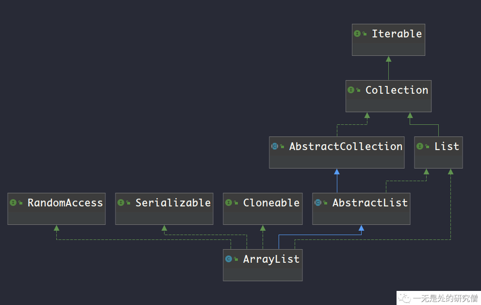
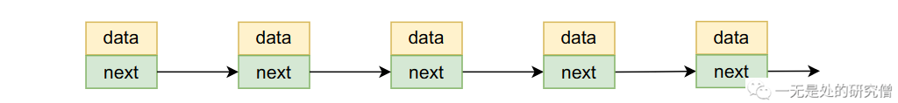
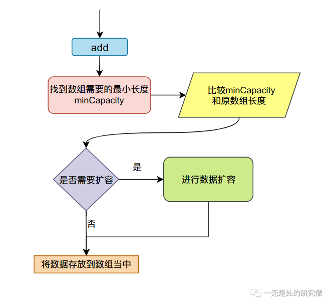
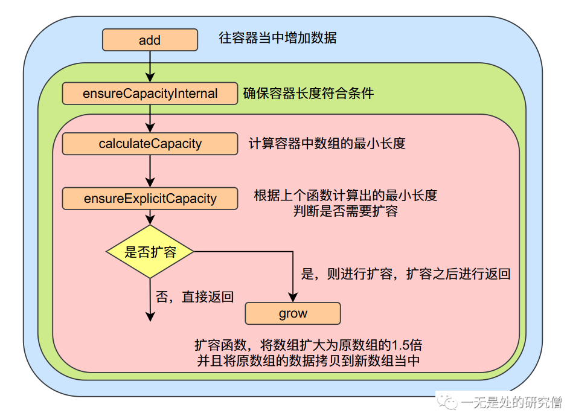
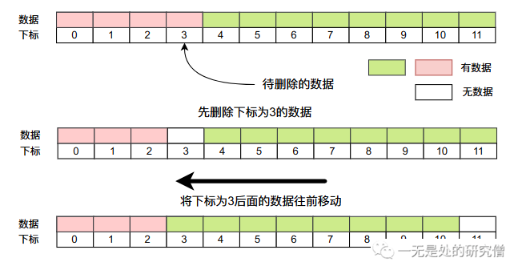
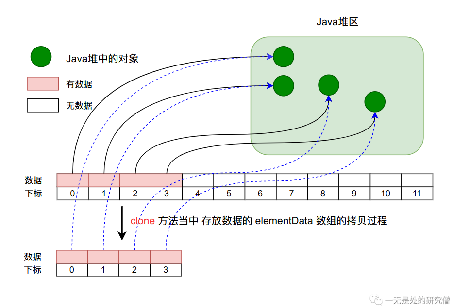
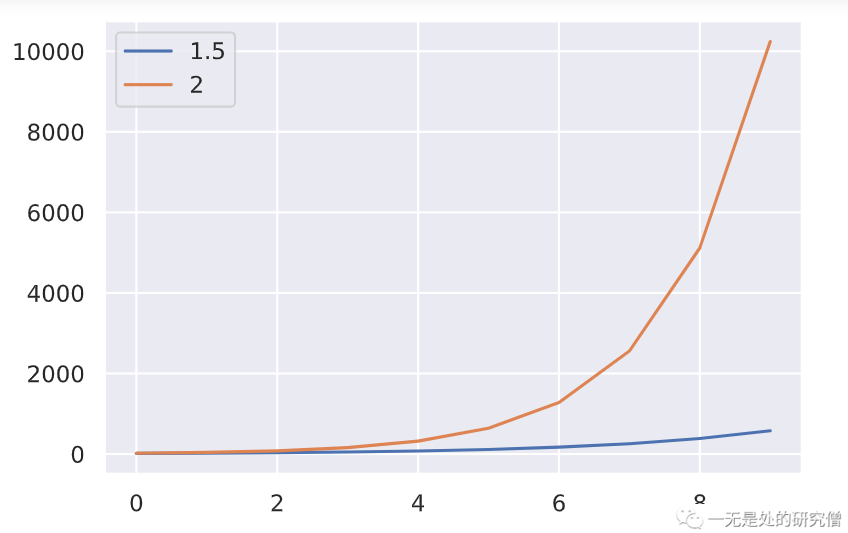

# ArrayList源码深度剖析

本篇文章主要跟大家分析一下`ArrayList`的源代码。阅读本文你首先得对`ArrayList`有一些基本的了解，至少使用过它。如果你对`ArrayList`的一些基本使用还不太熟悉或者在阅读本文的时候感觉有点困难，你可以先阅读这篇文章[ArrayList设计与实现，自己动手写ArrayList](https://mp.weixin.qq.com/s?__biz=Mzg3ODgyNDgwNg==&mid=2247483954&idx=1&sn=0671552fd0d33e0b07eab22f698ffaea&chksm=cf0c9e3bf87b172d1e336d7533a79c536600518c085a4104f30667469992e797ff526c732563&mpshare=1&scene=23&srcid=0706NTX8kMWtQryLVoqdqEYC&sharer_sharetime=1657120181327&sharer_shareid=236a49567847c05f78e6b440ce6dabff#rd)。

## ArrayList继承体系分析




- `RandomAccess`，这个接口的含义表示可以随机访问`ArrayList`当中的数据，拿什么是随机访问呢？随机访问就是表示我们可以在常量时间复杂度内访问数据，也就是时间复杂度是`O(1)`。因为在`ArrayList`当中我们使用的最基本的数据类型是`数组`，而数组是可以随机访问的，比如像下面这样。

```java
  public static void main(String[] args) {
    int[] data = new int[10];

    for (int i = 0; i < 10; i++)
      data[i] = i;

    System.out.println("data[5] = " + data[5]);
  }
```

而链表是不可以随机访问的，比如说我们想通过下标访问链表当中的某个数据，需要从头结点或者尾节点开始遍历，直到遍历到下标对应的数据，比如下图中的单链表找到第3个数据，需要从头开始遍历，而这个时间复杂度为`O(n)`。



- `Serializable`，这个接口主要用于序列化，所谓序列化就是能将对象写入磁盘，反序列化就是能够将对象从磁盘当中读取出来，如果想序列化和反序列化`ArrayList`的实例对象就必须实现这个接口，如果没有实现这个接口，在实例化的时候程序执行会报错，比如下面就是一个序列化的例子。

```java
import java.io.*;
import java.util.Objects;

class TestPerson implements Serializable{
  String name;

  Integer age;

  private static final long serialVersionUID = 9999L;

  @Override
  public String toString() {
    return "TestPerson{" +
        "name='" + name + '\'' +
        ", age=" + age +
        '}';
  }

  @Override
  public boolean equals(Object o) {
    if (this == o) return true;
    if (o == null || getClass() != o.getClass()) return false;
    TestPerson that = (TestPerson) o;
    return that.age.equals(this.age) && that.name.equals(this.name);
  }

  @Override
  public int hashCode() {
    return Objects.hash(name, age);
  }

  public TestPerson(String name, Integer age) {
    this.name = name;
    this.age = age;
  }

}

public class SerialTest {
  public static void main(String[] args) throws IOException, ClassNotFoundException {
    TestPerson leHung = new TestPerson("LeHung", 18);
    FileOutputStream os = new FileOutputStream("objtest");
    ObjectOutputStream outputStream = new ObjectOutputStream(os);
    // 序列化数据
    outputStream.writeObject(leHung);
    FileInputStream is = new FileInputStream("objtest");
    ObjectInputStream stream = new ObjectInputStream(is);
    // 反序列化数据
    TestPerson object = (TestPerson) stream.readObject();
    System.out.println(object);
    System.out.println(object == leHung);
    System.out.println(object.equals(leHung));
  }
}

```

如果上面程序当中的`TestPerson`没有`implements Serializable`，则上述代码会报异常`java.io.NotSerializableException:`。

- `Cloneable`，实现`Cloneable`接口那么实现`Cloneable`的类就能够调用`clone`这个方法，如果没有实现`Cloneable`接口就调用方法，则会抛出异常`java.lang.CloneNotSupportedException`。

- `List`，这个接口主要定义了一些集合常用的方法让`ArrayList`进行实现，比如`add`，`addAll`，`contains`，`remove`，`set`，`size`，`indexOf`等等方法。
- `AbstractList`，这个抽象类也实现了`List`接口里面的方法，并且为其提供了默认代码实现，比如说`AbstractList`中对`indexOf`的实现如下：

```java
// 这个方法的作用就是返回对象 o 在容器当中的下标
public int indexOf(Object o) {
    // 通过迭代器去遍历数据
    ListIterator<E> it = listIterator();
    if (o==null) {
        while (it.hasNext())
            if (it.next()==null)
                // 返回数据 o 的下标
                return it.previousIndex();
    } else {
        while (it.hasNext())
            if (o.equals(it.next()))
                // 返回数据 o 的下标
                return it.previousIndex();
    }
    return -1;
}
```

集合的`addAll`方法实现如下：

```java
// 这个函数的作用就是在 index 的位置插入集合 c 当中所有的元素
public boolean addAll(int index, Collection<? extends E> c) {
    rangeCheckForAdd(index);
    boolean modified = false;
    for (E e : c) {
        add(index++, e);
        modified = true;
    }
    return modified;
}

```

## ArrayList关键字段分析

在`ArrayList`当中主要有以下这些字段：

```java
// ArrayList 当中默认初始化容量，也就是初始化数组的大小
private static final int DEFAULT_CAPACITY = 10;
// 存放具体数据的数组 ArrayList 底层就是使用数组进行存储的
transient Object[] elementData; 
// size 表示容器当中数据的个数 注意和容器的长度区分开来
private int size;
// 当容器当中没有元素的时候将 elementData 赋值为以下数据（不同情况不一样）
private static final Object[] EMPTY_ELEMENTDATA = {};
private static final Object[] DEFAULTCAPACITY_EMPTY_ELEMENTDATA = {};

// 下面两个函数是 ArrayList 的构造函数，从下面两个函数当中
// 我们可以看出 EMPTY_ELEMENTDATA 和 DEFAULTCAPACITY_EMPTY_ELEMENTDATA 使用区别
// EMPTY_ELEMENTDATA 是容器当中没有元素时使用，DEFAULTCAPACITY_EMPTY_ELEMENTDATA
// 是默认构造的时候使用
public ArrayList(int initialCapacity) {
    if (initialCapacity > 0) {
        this.elementData = new Object[initialCapacity];
    } else if (initialCapacity == 0) {
        this.elementData = EMPTY_ELEMENTDATA;
    } else {
        throw new IllegalArgumentException("Illegal Capacity: "+
                                           initialCapacity);
    }
}

public ArrayList() {
    this.elementData = DEFAULTCAPACITY_EMPTY_ELEMENTDATA;
}

```

## ArrayList主要方法分析

- `add`方法，这个方法用于往容器的末尾增加数据，也是`ArrayList`当中最核心的方法。他的主要工作流程如下图所示：



他首先调用函数`ensureCapacityInternal`确保`ArrayList`当中的数组长度能够满足需求，不然数组会报数组下标越界异常，`add`函数调用过程当中所涉及到的函数如下。

```java
public boolean add(E e) {
    // 这个函数的主要目的是确保 elementData 的容量有 size + 1
    // 否则存储数据的时候数组就会越界
    ensureCapacityInternal(size + 1);
    // size 表示容器当中数据的个数 注意和容器的长度区分开来
    // 加入数据之后 容器当中数据的个数也要 + 1
    elementData[size++] = e;
    return true;
}

// minCapacity 表示 ArrayList 中的数组最小的长度
private void ensureCapacityInternal(int minCapacity) {
    ensureExplicitCapacity(
        // 这个函数计算数组的最小长度
        calculateCapacity(elementData, minCapacity)
    );
}

private static int calculateCapacity(Object[] elementData, int minCapacity) {
    // 如果是无参构造的话，取默认长度和需求长度 minCapacity 中比较大的值
    if (elementData == DEFAULTCAPACITY_EMPTY_ELEMENTDATA) {
        return Math.max(DEFAULT_CAPACITY, minCapacity);
    }
    return minCapacity;
}

private void ensureExplicitCapacity(int minCapacity) {
    // 这个表示容器发生改变的次数，我们在后续分析迭代器的时候进行分析
    // 它跟容器扩容没关系，现在可以不用管他
    modCount++;

    // 如果最小的需求容量 minCapacity 大于现在容器当中数组的长度，则需要进行扩容
    if (minCapacity - elementData.length > 0)
        grow(minCapacity);
}

private void grow(int minCapacity) {
    int oldCapacity = elementData.length;
    // 新数组的长度为原数组的长度的1.5倍，右移一位相当于除以2
    int newCapacity = oldCapacity + (oldCapacity >> 1);
    // 如果新数组的长度，小于需要的最小的容量，则更新数组的长度为 minCapacity
    if (newCapacity - minCapacity < 0)
        newCapacity = minCapacity;
    if (newCapacity - MAX_ARRAY_SIZE > 0)
        // 这个函数的主要目的是判断整数是否发生溢出
        newCapacity = hugeCapacity(minCapacity);
    // minCapacity is usually close to size, so this is a win:
    elementData = Arrays.copyOf(elementData, newCapacity);
}

private static int hugeCapacity(int minCapacity) {
    if (minCapacity < 0) // overflow
        throw new OutOfMemoryError();
    return (minCapacity > MAX_ARRAY_SIZE) ?
        Integer.MAX_VALUE :
    MAX_ARRAY_SIZE;
}

```

上述代码的调用流程如下：



- `get`函数，获取对应下标的数据。

```java
public E get(int index) {
    // 进行数组下标的检查，如果下标超过 ArrayList 中数据的个数，则抛出异常
    // 注意这里是容器当中数据的个数 不是数组的长度
    rangeCheck(index);

    return elementData(index);
}

private void rangeCheck(int index) {
    if (index >= size)
        throw new IndexOutOfBoundsException(outOfBoundsMsg(index));
}

E elementData(int index) {
    // 返回对应下标的数据
    return (E) elementData[index];
}
```

- `remove`函数，删除`ArrayList`当中的数据。

```java
// 通过下标删除数据，这个函数的意义是删除下标为 index 的数据
public E remove(int index) {
    // 首先检查下标是否合法，如果不合法，抛出下标越界异常
    rangeCheck(index);

    modCount++;
    E oldValue = elementData(index);
	// 因为删除某个数据，需要将该数据后面的数据往数组前面移动
    // 这里需要计算需要移动的数据的个数
    int numMoved = size - index - 1;
    if (numMoved > 0)
        // 通过拷贝移动数据
        // 这个函数的意义是将 index + 1和其之后的数据整体移动到 index
        // 的位置
        System.arraycopy(elementData, index+1, elementData, index,
                         numMoved);
    // 因为最后一个数据已经拷贝到前一个位置了，所以可以设置为 null
    // 可以做垃圾回收了
    elementData[--size] = null; 

    return oldValue;
}

// 这个函数的意义是删除容器当中的第一个等于 o 的数据
public boolean remove(Object o) {
    if (o == null) {
        for (int index = 0; index < size; index++)
            if (elementData[index] == null) {
                fastRemove(index);
                return true;
            }
    } else {
        for (int index = 0; index < size; index++)
            if (o.equals(elementData[index])) {
                fastRemove(index);
                return true;
            }
    }
    return false;
}

// 这个方法和第一个 remove 方法原理一致
private void fastRemove(int index) {
    modCount++;
    int numMoved = size - index - 1;
    if (numMoved > 0)
        System.arraycopy(elementData, index+1, elementData, index,
                         numMoved);
    elementData[--size] = null; // clear to let GC do its work
}
```



- `set`方法，这个方法主要是用于设置指定下标的数据，这个方法比较简单。

```java
public E set(int index, E element) {
    rangeCheck(index);

    E oldValue = elementData(index);
    elementData[index] = element;
    return oldValue;
}

```

## ArrayList中那些不为人知的方法

### `ensureCapacity`方法

```java
public void ensureCapacity(int minCapacity) {
    int minExpand = (elementData != DEFAULTCAPACITY_EMPTY_ELEMENTDATA)
        // any size if not default element table
        ? 0
        // larger than default for default empty table. It's already
        // supposed to be at default size.
        : DEFAULT_CAPACITY;

    if (minCapacity > minExpand) {
        ensureExplicitCapacity(minCapacity);
    }
}
```

这个方法我们在前面已经提到过了，不知道大家有没有观察到他的访问修饰符是`public`，为什么要设置为`public`呢？这个意思很明显，我们可以在使用`ArrayList`的时候自己调用这个方法，防止当我们在往容器中加入数据的时候频繁因为数组长度不够重新申请内存，而原来的数组需要从新释放，这会给垃圾回收器造成压力。我们在[ArrayList设计与实现，自己动手写ArrayList](https://mp.weixin.qq.com/s?__biz=Mzg3ODgyNDgwNg==&mid=2247483954&idx=1&sn=0671552fd0d33e0b07eab22f698ffaea&chksm=cf0c9e3bf87b172d1e336d7533a79c536600518c085a4104f30667469992e797ff526c732563&mpshare=1&scene=23&srcid=0706NTX8kMWtQryLVoqdqEYC&sharer_sharetime=1657120181327&sharer_shareid=236a49567847c05f78e6b440ce6dabff#rd)这篇文章当中写过一段测试程序去测试这个方法，感兴趣的同学可以去看看！！！

### `toString`方法

我们首先来看一下下面代码的输出

```java
public class CodeTest {

  public static void main(String[] args) {
    LinkedList<Integer> list = new LinkedList<>();
    for (int i = 0; i < 10; i++) {
      list.add(i);
    }
    System.out.println(list);
  }
}
// 输出结果：
// [0, 1, 2, 3, 4, 5, 6, 7, 8, 9]
```

执行上面一段代码我们可以在控制台看见对应的输出，我们知道最终打印在屏幕上的是一个字符串，那这个字符串怎么来的呢，我们打印的是一个对象，它是怎么得到字符串的呢？我们可以查看`System.out.println`的源代码：

```java
public void println(Object x) {
    String s = String.valueOf(x);
    synchronized (this) {
        print(s);
        newLine();
    }
}
```

从上述代码当中我们可以看见通过`String s = String.valueOf(x);`这行代码得到了一个字符串，然后进行打印，我们在进入`String.valueOf`方法看看是如何得到字符串的：

```java
public static String valueOf(Object obj) {
    return (obj == null) ? "null" : obj.toString();
}

```

我们可以看到如果对象不为 `null` 最终是调用对象的`toString`方法得到的字符串。**因此当打印一个对象的时候，最终会打印这个对象的`toString`方法返回的字符串**。

`toString`方法没有直接在`ArrayList`当中实现，而是在它继承的类`AbstractList`当中实现的，`toString`的源代码如下所示：

```java
public String toString() {
    // 得到 ArrayList 的迭代器 这个迭代器我们稍后细说
    Iterator<E> it = iterator();
    // 如果容器当中没有数据则返回空
    if (! it.hasNext())
        return "[]";
    // 额，写这个代码的工程师应该不懂中文 哈哈哈
    StringBuilder sb = new StringBuilder();
    sb.append('[');
    for (;;) {
        E e = it.next();
        // 将对象加入到 StringBuilder 当中，这里加入的也是一个对象
        // 但是在 append 源代码当中会同样会使用 String.ValueOf 
        // 得到对象的 toString 方法的结果
        sb.append(e == this ? "(this Collection)" : e);
        if (! it.hasNext())
            return sb.append(']').toString();
        sb.append(',').append(' ');
    }
}
```

上述代码的整个过程还是比较清晰的，大致过程如下：

- 如果容器当中没有数据，直接返回[]。
- 如果容器当中有数据的话，那么通过迭代每个数据，调用`StringBuilder`的`append`方法，将数据加入到输出的`StringBuilder`对象当中，下面是`append`的源代码。

```java
// StringBuilder 的 append 方法
@Override
public StringBuilder append(Object obj) {
    return append(String.valueOf(obj));
}

// StringBuilder 的 append 方法的重载方法
@Override
public StringBuilder append(String str) {
    super.append(str);
    return this;
}


// String 类中的 valueOf方法
public static String valueOf(Object obj) {
    return (obj == null) ? "null" : obj.toString();
}

```

我们可以发现最终`append`到`StringBuilder`当中的字符串仍然是`ArrayList`当中数据对象的`toString`方法返回的数据。

### `equals`方法

在`ArrayList`当中的`equals`方法和`toString`方法一样，`equlas`方法也是在类`AbstractCollection`当中实现的，其源代码如下：

```java
public boolean equals(Object o) {
    if (o == this)
        return true;
    if (!(o instanceof List))
        return false;

    ListIterator<E> e1 = listIterator();
    ListIterator<?> e2 = ((List<?>) o).listIterator();
    while (e1.hasNext() && e2.hasNext()) {
        E o1 = e1.next();
        Object o2 = e2.next();
        if (!(o1==null ? o2==null : o1.equals(o2)))
            return false;
    }
    return !(e1.hasNext() || e2.hasNext());
}
```

上面代码的主要流程：

- 首先判断`o`和`this`是否是同一个对象，如果是则返回`true`，比如下面这种情况：

```java
ArrayList<Object> list = new ArrayList<>();
list.equals(ArrayList);
```

- 如果对象没有实现`List`接口返回`false`。
- 逐个判断链表里面的对象是否相等（调用链表当中存储的对象的`equals`方法），如果两个链表当中节点数目一样而且都相等则返回`true`否则返回`false`。

通过上面的分析我们可以发现`ArrayList`方法并没有让比较的对象是`ArrayList`对象，只需要实现`List`接口并且数据数目和内容都相同，这样`equals`方法返回的结果就是`true`，比如下面代码就验证的这个结果：

```java
LinkedList<Integer> list = new LinkedList<>();
ArrayList<Integer> arrayList = new ArrayList<>();
for (int i = 0; i < 10; i++) {
    list.add(i);
    arrayList.add(i);
}
System.out.println(arrayList.equals(list)); // 结果为 true
```

### `clone`方法

`ArrayList`的方法比较简单，就是拷贝了原`ArrayList`当中的数组中的数据。

```java
public Object clone() {
    try {
        ArrayList<?> v = (ArrayList<?>) super.clone();
        v.elementData = Arrays.copyOf(elementData, size);
        v.modCount = 0;
        return v;
    } catch (CloneNotSupportedException e) {
        // this shouldn't happen, since we are Cloneable
        throw new InternalError(e);
    }
}
```

整个拷贝过程如下如所示：



虽然发生了数组的拷贝，但是拷贝之后的数组中数据的指向并没有发生变化，也就是说两个数组指向的内容是一样的，如果一个数组改变了所指向的数据，另外一个数组当中的数据也会发生变化。比如下面的代码：

```java
package makeyourowncontainer.test;

import java.util.ArrayList;

class Person {

  String name;

  public String getName() {
    return name;
  }

  public void setName(String name) {
    this.name = name;
  }

  @Override
  public String toString() {
    return "Person{" +
        "name='" + name + '\'' +
        '}';
  }
}


public class ArrayListTest {

  public static void main(String[] args) {

    ArrayList<Person> o1 = new ArrayList<>();
    Person person = new Person();
    person.setName("一无是处的研究僧");
    o1.add(person);
    Object o2 = o1.clone();
    System.out.println("o1 = " + o1);
    System.out.println("o2 = " + o2);
    ((ArrayList<Person>) o2).get(0).setName("LeHung");
    System.out.println("改变数据之后");
    System.out.println("o1 = " + o1);
    System.out.println("o2 = " + o2);
  }
}
// 输出结果
o1 = [Person{name='一无是处的研究僧'}]
o2 = [Person{name='一无是处的研究僧'}]
改变数据之后
o1 = [Person{name='LeHung'}]
o2 = [Person{name='LeHung'}]
```

## 神秘的迭代器`Iterator`

### `Iterator`介绍

我们在分析`toString`方法的时候，有下面这样一行代码：

```java
Iterator<E> it = iterator();
```

然后不断通过迭代器的`hasNext`和`next`方法对数据进行迭代，比如下面这个例子：

```java
public void testArrayList() {
    ArrayList<Integer> list = new ArrayList<>();
    for (int i = 0; i < 10; i++)
        list.add(i);
    Iterator<Integer> iterator = list.iterator();
    while (iterator.hasNext()) {
        System.out.println(iterator.next());
    }
}

// iterator 方法返回的对象
public Iterator<E> iterator() {
    return new Itr();
}
```

`Iterator`字段分析

`Itr`类是`ArrayList`的内部类，接下来我们仔细分析`Itr`类的实现。

在`Itr`类当中主要有一下几个字段：

```java
int cursor;       // 下一个元素的下标 当我们 new 这个对象的时候这个值默认初始化为0
				  // 我们使用的时候也是0这个值，因此不用显示初始化
int lastRet = -1; // 上一个通过 next 方法返回的元素的下标
int expectedModCount = modCount; 
// modCount 表示数组当中数据改变的次数 modCount 是
// ArrayList 当中的类变量 expectedModCount 是 ArrayList
// 内部类 Itr 中的类变量 然后将这个变量保存到 expectedModCount当中
// 使用 expectedModCount 主要用于 fast-fail 机制这个我们后面会分析
```

我们现在来花点时间好好谈一下`modCount`（英文全称为：modifications count，修改次数）这个字段。当`ArrayList`当中发生一次**结构修改**(`Structural modifications`)时，`modCount`就++。所谓**结构修改**就是那些让`ArrayList`当中数组的数据个数`size`发生变化的操作，比如说`add`、`remove`方法，因为这两个方法一个是增加数据，一个是删除数据，都会导致容器当中数据个数发生变化。而`set`方法就不会是的`modCount`发生变化，因为没有改变容器当中数据的个数。

### `Iterator`的初始化方法：

```java
private class Itr implements Iterator<E> {
    int cursor;       // index of next element to return
    int lastRet = -1; // index of last element returned; -1 if no such
    int expectedModCount = modCount;

    Itr() {}
}
```

在初始化方法当中，没有任何操作也就印证了我们前面在分析字段的时候说的 `cursor`的初始化的值为0。

### `Iterator`重要方法

接下来分析迭代器当中比较重要的两个方法`next`和`hasNext`。

```java
public boolean hasNext() {
    // 这个 size 是外部类 ArrayList 当中的 size 表示的是 ArrayList
    // 当中数据元素的个数，cursor 的初始值为 0 每调用一个 next cursor
    // 的值就+1，当等于 size 是容器当中的数据已经遍历完成了 hasNext 就返回 false 了
    return cursor != size;
}

@SuppressWarnings("unchecked")
public E next() {
    // 这个方法主要是用于检测在数据迭代的过程当中 ArrayList 是否发生 `结构修改`
    // 如果发生结构修改就抛出 ConcurrentModificationException 异常
    checkForComodification();
    int i = cursor;
    if (i >= size)
        throw new NoSuchElementException();
    Object[] elementData = ArrayList.this.elementData;
    if (i >= elementData.length)
        throw new ConcurrentModificationException();
    // 更改 cursor 的值 并将其设置为下一个返回元素的下标 这一点我们在
    // 字段分析的时候已经谈到过了
    cursor = i + 1;
    // 返回数据 表达式 lastRet = i 的返回值为 i 
    // 这个表达式不仅将 lastRet 的值赋值为 i 同时返回 i
    // 因此可以返回下标为 i 的数据
    return (E) elementData[lastRet = i];
}

// 这个方法主要是用于检测在数据迭代的过程当中 ArrayList 是否发生 `结构修改`
// 如果发生结构修改就抛出 ConcurrentModificationException 异常
final void checkForComodification() {
    // 如果发生 `结构修改` 那么 modCount 的值会++ 那么就和 expectedModCount 不相等了
    // expectedModCount 初始化的时候令其等于 expectedModCount
    if (modCount != expectedModCount)
        throw new ConcurrentModificationException();
}
```

为什么要抛出`ConcurrentModificationException`异常呢，我们先想想是什么导致`modCount`发生变化。肯定迭代器在进行遍历的同时，修改了`modCount`的值，通常这种现象的发生出现在并发的情况下，因此抛出`ConcurrentModificationException`异常。像这种通过迭代器遍历过程进行检查并且当发生不符合条件的情况下抛出异常的现象就称作`Fast-fail`。

其实我们也可以在不使用并发的情况让迭代器抛出这个异常，我们只需要在迭代器迭代的时候我们对`ArrayList`进行`add`和`remove`操作即可。比如像下面这样就会抛出`ConcurrentModificationException`：

```java
public void testArrayList() {
    ArrayList<Integer> list = new ArrayList<>();
    for (int i = 0; i < 10; i++)
        list.add(i);
    Iterator<Integer> iterator = list.iterator();
    while (iterator.hasNext()) {
        System.out.println(iterator.next());
        list.add(55);
    }
}

```

### `Iterator`中的`remove`方法

```java
public void remove() {
    if (lastRet < 0)
        throw new IllegalStateException();
    // 进行合法性检查，看是否需要抛出异常
    checkForComodification();

    try {
        // 调用 ArrayList 的remove方法实现
        ArrayList.this.remove(lastRet);
        cursor = lastRet;
        lastRet = -1;
        // 因为 remove 会改变 modCount 的值，因此需要将 expectedModCount 重新赋值
        expectedModCount = modCount;
    } catch (IndexOutOfBoundsException ex) {
        throw new ConcurrentModificationException();
    }
}

```

## ArrayList杂谈

### 时间复杂度分析

- 因为`ArrayList`是随机存取的，因此我们通过下标查找数据的时间复杂度是`O(1)`。
- 插入数据的时间复杂度是`O(n)`。

证明（插入时间复杂度）：

假设数组的长度为`n`，我们可以在`0~n-1`的位置都可以插入数据，假设每个位置插入数据的概率都相同，即均为$\frac{1}{n}$，我们在第`i`个位置插入数据，需要移动的数据个数为`n - i`。

那么我们平均移动次数为：
$$
m = \frac{1}{n}\sum_{i = 0}^{n - 1}(n - i) \\
=  \frac{1}{n}(n + n - 1 + \cdots + 1) \\
 = \frac{1}{n}\dot {\frac{n(n + 1)}{2}} \\
 = \frac{n + 1}{2}
$$
根据上面的分析我们知道，时间复杂度为$O(\frac{n + 1}{2})$ = $O(n)$。

### 扩容机制

还记的我们在[ArrayList设计与实现，自己动手写ArrayList](https://mp.weixin.qq.com/s?__biz=Mzg3ODgyNDgwNg==&mid=2247483954&idx=1&sn=0671552fd0d33e0b07eab22f698ffaea&chksm=cf0c9e3bf87b172d1e336d7533a79c536600518c085a4104f30667469992e797ff526c732563&mpshare=1&scene=23&srcid=0706NTX8kMWtQryLVoqdqEYC&sharer_sharetime=1657120181327&sharer_shareid=236a49567847c05f78e6b440ce6dabff#rd)当中自己实现`ArrayList`使用的扩容机制吗？我们自己的扩容机制为扩容为原来长度的两倍，而`ArrayList`当中的扩容机制为扩容为原来的1.5倍。



假设我们在使用`ArrayList`的时候没有指定初始化的时候数组的长度，也就是说初始长度为`ArrayList`的默认长度也就是10。那么当我们不停地往容器当中增加数据，扩容导致的数组长度的变化如上图所示，横轴表示扩容次数，纵轴表示数组长度，蓝色的扩容为原数组长度的1.5倍，另外一条是2倍。我们很清晰的发现扩容为原来的`2倍`在后期的数组长度将会远大于扩容`1.5倍`。这很可能会导致我们会浪费很大的数组空间，比如说刚好加入最后一个数据的时候导致`ArrayList`进行扩容操作，这可能是`ArrayList`在设计时候的考量。

本篇文章我们仔细分析介绍了`ArrayList`的源码，希望大家有所收获，我是LeHung，我们下期再见！！！

关注公众号：一无是处的研究僧，了解更多计算机知识。


