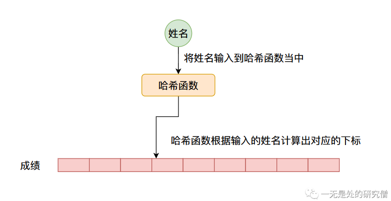

# HashMap（Python字典）设计原理与实现（上篇）——哈希表的原理

在此前的[四篇长文](https://github.com/Chang-LeHung/CSCore)当中我们已经实现了我们自己的`ArrayList`和`LinkedList`，并且分析了`ArrayList`和`LinkedList`的`JDK`源代码。 本篇文章主要跟大家介绍我们非常常用的一种数据结构`HashMap`，在本篇文章当中主要介绍他的实现原理，下篇我们自己动手实现我们自己的`HashMap`，让他可以像`JDK`的`HashMap`一样工作。

## HashMap初识

如果你使用过`HashMap`的话，那你肯定很熟悉`HashMap`给我们提供了一个非常方便的功能就是`键值(key, value)`查找。比如我们通过学生的姓名查找分数。

```java
  public static void main(String[] args) {
    HashMap<String, Integer> map = new HashMap<>();
    map.put("学生A", 60);
    map.put("学生B", 70);
    map.put("学生C", 20);
    map.put("学生D", 85);
    map.put("学生E", 99);
    System.out.println("学生B的分数是：" + map.get("学生B"));
  }
```

我们知道`HashMap`给我们提供查询`get函数`功能的时间复杂度为`O(1)`，他在常数级别的时间复杂度就可以查询到结果。那它是如何做到的呢？

我们知道在计算机当中一个最基本也是唯一的，能够实现常数级别的查询的类型就是数组，数组的查询时间复杂度为`O(1)`，我们只需要通过下标就能访问对应的数据。比如我们想访问下标为`6`的数据，就可以这样：

```java
String[] strs = new String[10];
strs[6] = "一无是处的研究僧";
System.out.println(strs[6]);
```

因此我们要想实现`HashMap`给我们提供的`O(1)`级别查询的时间复杂度的话，就必须使用到数组，而在具体的`HashMap`实现当中，比如说`JDK`底层也是采用数组实现的。

## HashMap整体设计

我们实现的`HashMap`需要满足的最重要的功能是根据`键(key)`查询到对应的`值(value)`，比如上面提到的根据学生姓名查询成绩。

因此我们可以有一个这样的设计，我们可以根据数据的`键值`计算出一个数字（像这种可以将一个数据转化成一个数字的叫做`哈希函数`我们后续将会仔细说明），这个数字对应数组的下标，而数组当中对应的位置存储的就是具体的数据，比如上面谈到的`成绩`，整个流程如下图所示：



但是像这种哈希函数计算出来的数值一般是没有范围的，因此我们通常通过哈希函数计算出来的数值通常会经过一个求余数操作(`%`)，对数组的长度进行求余数，否则求出来的数值将超过数组的长度。

### 如何设计一个哈希函数？

首先我们需要了解一个知识，那就是在计算机世界当中我们所含有的两种最基本的数据类型就是，整型(`short`, `int`, `long`)和字符串(`String`)，其他的数据类型可以由这些数据类型组合起来，下面我们来分析一下常见的数据类型的哈希函数设计。

- 整型的哈希函数

对于整型数据，他本来就是一个数组因此我们

