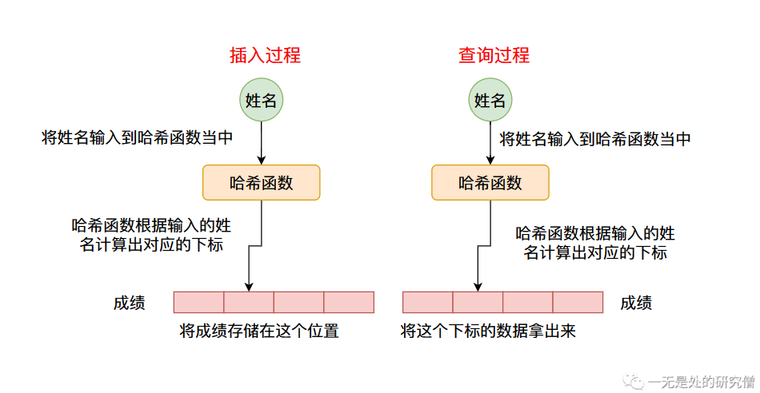

# HashMap（Python字典）设计原理与实现（上篇）——哈希表的原理

在此前的[四篇长文](https://github.com/Chang-LeHung/CSCore)当中我们已经实现了我们自己的`ArrayList`和`LinkedList`，并且分析了`ArrayList`和`LinkedList`的`JDK`源代码。 本篇文章主要跟大家介绍我们非常常用的一种数据结构`HashMap`，在本篇文章当中主要介绍他的实现原理，下篇我们自己动手实现我们自己的`HashMap`，让他可以像`JDK`的`HashMap`一样工作。

## HashMap初识

如果你使用过`HashMap`的话，那你肯定很熟悉`HashMap`给我们提供了一个非常方便的功能就是`键值(key, value)`查找。比如我们通过学生的姓名查找分数。

```java
  public static void main(String[] args) {
    HashMap<String, Integer> map = new HashMap<>();
    map.put("学生A", 60);
    map.put("学生B", 70);
    map.put("学生C", 20);
    map.put("学生D", 85);
    map.put("学生E", 99);
    System.out.println("学生B的分数是：" + map.get("学生B"));
  }
```

我们知道`HashMap`给我们提供查询`get函数`功能的时间复杂度为`O(1)`，他在常数级别的时间复杂度就可以查询到结果。那它是如何做到的呢？

我们知道在计算机当中一个最基本也是唯一的，能够实现常数级别的查询的类型就是数组，数组的查询时间复杂度为`O(1)`，我们只需要通过下标就能访问对应的数据。比如我们想访问下标为`6`的数据，就可以这样：

```java
String[] strs = new String[10];
strs[6] = "一无是处的研究僧";
System.out.println(strs[6]);
```

因此我们要想实现`HashMap`给我们提供的`O(1)`级别查询的时间复杂度的话，就必须使用到数组，而在具体的`HashMap`实现当中，比如说`JDK`底层也是采用数组实现的。

## HashMap整体设计

我们实现的`HashMap`需要满足的最重要的功能是根据`键(key)`查询到对应的`值(value)`，比如上面提到的根据学生姓名查询成绩。

因此我们可以有一个这样的设计，我们可以根据数据的`键值`计算出一个数字（像这种可以将一个数据转化成一个数字的叫做`哈希函数`，计算出来的值叫做`哈希值`我们后续将会仔细说明），将这个哈希值作为数组的下标，这样的话`键值`和下标就有了对应关系了，我们可以在数组对应的哈希值为下标的位置存储具体的数据，比如上面谈到的`成绩`，整个流程如下图所示：


但是像这种哈希函数计算出来的数值一般是没有范围的，因此我们通常通过哈希函数计算出来的数值通常会经过一个求余数操作(`%`)，对数组的长度进行求余数，否则求出来的数值将超过数组的长度。比如数组的长度是16，计算出来的哈希值为186，那么求余数之后的结果为`186%16=10`，那么我们可以将数据存储在数组当中下标为10的位置，下次我们来取的时候就取出下标为10位置的数据即可。



## 如何设计一个哈希函数？

首先我们需要了解一个知识，那就是在计算机世界当中我们所含有的两种最基本的数据类型就是，整型(`short`, `int`, `long`)和字符串(`String`)，其他的数据类型可以由这些数据类型组合起来，下面我们来分析一下常见的数据类型的哈希函数设计。

### 整型的哈希函数

对于整型数据，他本来就是一个数值，因此我们可以直接将这个值返回作为他的哈希值，而`JDK`中也是这么实现的！`JDK`中实现整型的哈希函数的方法：

```java
    /**
     * Returns a hash code for a {@code int} value; compatible with
     * {@code Integer.hashCode()}.
     *
     * @param value the value to hash
     * @since 1.8
     *
     * @return a hash code value for a {@code int} value.
     */
    public static int hashCode(int value) {
        return value;
    }

```

### 字符串的哈希函数

我们知道字符串底层存储的还是用整型数据存储的，比说说字符串`hello world`，就可以使用字符数组`['h', 'e', 'l', 'l', 'o' , 'w', 'o', 'r', 'l', 'd']`进行存储，因为我们计算出来的这个哈希值需要尽量不和别的数据计算出来的哈希值冲突（这种现象叫做`哈希冲突`，我们后面会仔细讨论这个问题），因此我们要尽可能的充分利用字符串里面的每个字符信息。我们来看一下`JDK`当中是怎么实现字符串的哈希函数的

```java
public int hashCode() {
    // hash 是 String 类当中一个私有的 int 变量，主要作用即存储计算出来的哈希值
    // 避免哈希值重复计算 节约时间
    int h = hash; // 如果是第一次调用 hashCode 这个函数 hash 的值为0，也就是说 h 值为 0
    // value 就是存储字符的字符数组
    if (h == 0 && value.length > 0) {
        char val[] = value;

        for (int i = 0; i < value.length; i++) {
            h = 31 * h + val[i];
        }
        // 更新 hash 的值
        hash = h;
    }
    return h;
}
```

上面的计算`hashCode`的代码，可以用下面这个公式表示：

- 其中`s`，表示存储字符串的字符数组
- `n`表示字符数组当中字符的个数

$$
s[0]*31^{(n-1)} + s[1]*31^{(n-2)} + ... + s[n-1]
$$

### 自定义类型的哈希函数

比如我们自己定义了一个学生类，我们改设计他的哈希函数，并且计算他的哈希值呢？

```java
class Student {
  String name;
  int grade;
}
```

我们可以根据上面提到的两种哈希函数，仿照他们的设计，设计我们自己的哈希函数，比如像下面这样。

```java
@Override
public int hashCode() {
    return name.hashCode() * 31 + grade;
}
```

事实上`JDK`也贴心的为我们实现了一个类，去计算我们自定义类的哈希函数。

```java
// 下面这个函数是我们自己设计的类 Student 的哈希函数
@Override
public int hashCode() {
    return Objects.hash(name, grade);
}

// 下面这个函数为  Objects.hash 函数
public static int hash(Object... values) {
    return Arrays.hashCode(values);
}

// 下面这个函数为  Arrays.hashCode 函数
public static int hashCode(Object a[]) {
    if (a == null)
        return 0;

    int result = 1;

    for (Object element : a)
        result = 31 * result + (element == null ? 0 : element.hashCode());

    return result;
}

```

`JDK`帮助我们实现的哈希函数，本质上就是将类当中所有的字段封装成一个数组，然后像计算字符串的哈希值那样去计算我们自定义类的哈希值。

### 集合类型的哈希函数

