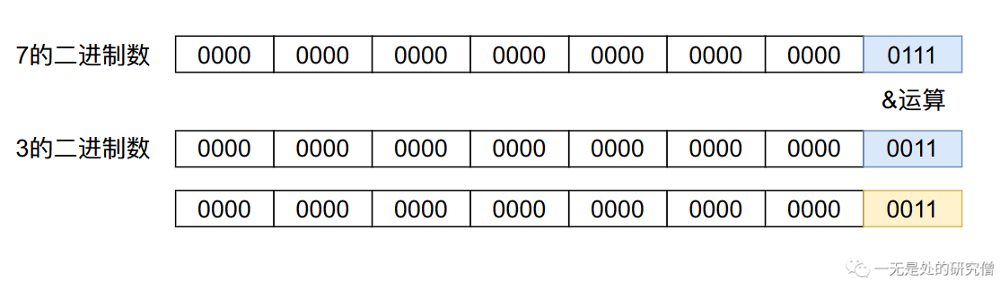
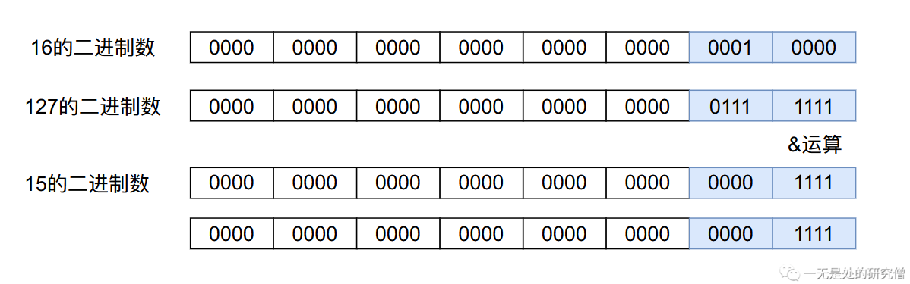
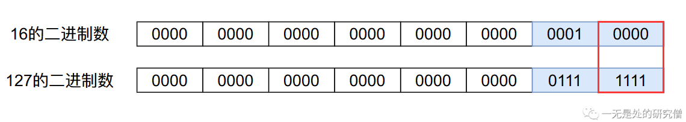
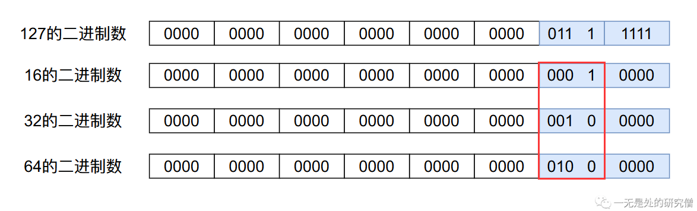
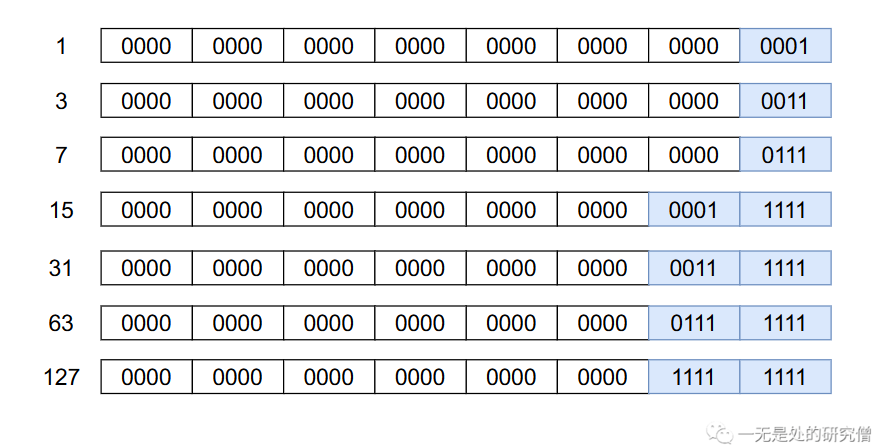
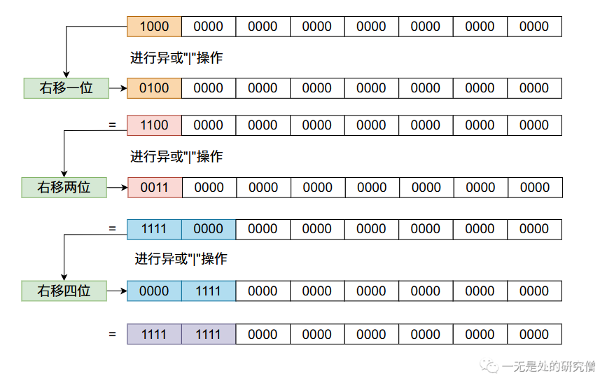
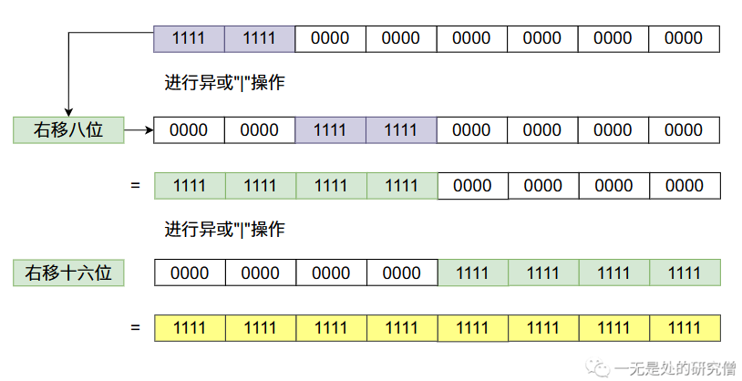
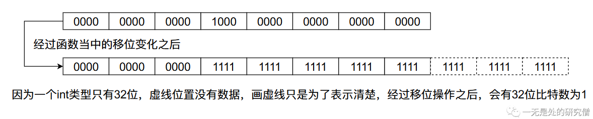

# HashMap设计原理与实现（下篇）200行带你写HashMap

我们在上篇文章[哈希表的设计原理](https://mp.weixin.qq.com/s?__biz=Mzg3ODgyNDgwNg==&mid=2247484145&idx=1&sn=362cf64866ace02ac95c0c1a970393e4&chksm=cf0c9ef8f87b17eebb61ea422f58e9e439632783e9faa5a3b2ce55712c1582b140904b60cb17&token=1155116583&lang=zh_CN#rd)当中已经大体说明了哈希表的实现原理，在这篇文章当中我们将自己动手实现我们自己的`HashMap`。

在本篇文章当中主要通过线性探测法，从最基本的数组再到`HashMap`当中节点的设计，一步一步的实现一个能够实现`Key`、`Value`映射的容器，写出我们自己的哈希表`MyHashMap`，让可以具备`HashMap`最常见的两个功能，`put`和`get`方法。

## 我们的数组当中应该存储什么样数据？

在上篇[哈希表的设计原理](https://mp.weixin.qq.com/s?__biz=Mzg3ODgyNDgwNg==&mid=2247484145&idx=1&sn=362cf64866ace02ac95c0c1a970393e4&chksm=cf0c9ef8f87b17eebb61ea422f58e9e439632783e9faa5a3b2ce55712c1582b140904b60cb17&token=1155116583&lang=zh_CN#rd)当中我们已经仔细说明，在`HashMap`当中我们是使用数组去存储具体的数据的，那么在我们的数组当中应该存储什么样的数据呢？假设在`HashMap`的数组当中存储的数据类型为`Node`，那么这个类需要有哪些字段呢？

- 首先一点我们肯定需要存储`Value`值，因为我们最终需要通过`get`方法从`HashMap`当中取出我们所需要的值。
- 第二点当我们通过`get`方法去取值的时候是通过`Key`（键值）去取的，当哈希值产生冲突的时候，我们不仅需要通过哈希值确定位置，还需要通过比较通过函数`get`传递的`Key`和数组当当中存储的数据的`key`是否相等，因此

- 第三点为了避免重复计算哈希值（因为有的对象的哈希值计算还是比较费时间），我们可以使用一个字段去存储计算好的哈希值。

根据以上三点我们的`Node`类的设计如下：

```java
  private static class Node<K, V> {
    /**
     * 用于存储我们计算好的 key 的哈希值
     */
    final int hash;

    /**
     * Key Value 中的 Key 对象
     */
    final K key;

    /**
     * Key Value 中的 Value 对象
     */
    V value;

    /**
     * hash 是键值 key 的哈希值  key 是键 value 是值
     * @param hash
     * @param key
     * @param value
     */
    public Node(int hash, K key, V value) {
      this.hash = hash;
      this.key = key;
      this.value = value;
    }

    public V setValue(V newValue) {
      V oldValue = newValue;
      value = newValue;
      return oldValue;
    }

    @Override
    public String toString() {
      return key + "=" + value;
    }
  }

```

## 我们的数组长度应该怎么设置？

在讨论这个问题之前我们首先来回归一下位运算的操作。在计算机当中数据都是二进制存储那么二进制运算是如何操作的呢？

```java
int a = 7;
int b = 3;
System.out.println(a & b); // 输出结果为3
```

上述代码的位运算操作如下：



进行位运算是，二进制数的对应位置进行相应的操作，`&`运算的结果只有两个比特位的数据都是`1`时，运算结果才等于`1`，其余的情况都为0，因此`3 & 7 = 3`。

通过`put`函数放入`HashMap`当中的数据首先需要将`key`的哈希值与数组的长度进行取余运算得到对应的下标，再将数据放入到数组对应的下标当中。但是在实际的操作当中我们将底层数组的长度设置为`2`的整数次幂，并且使用位运算`&`去进行取余数操作，而这样操作主要有一下三点原因：

- 位运算`&`的程序执行效率，比取余`%`操作更加高效，需要的时间越短。
- 当数组的长度为`2`的整数次幂的时候，得到的下标越均匀，造成的哈希冲突更少。
- 任何一个数`a`对$2^n$取余数得到的结果与`a`跟$2^n - 1$进行`&`操作结果是相等的，即：

$$
a \% 2^n = a \& (2^n - 1)
$$

我们现在先来解释一下第三点，令`a = 127`，`n = 4`，那么：`127%16 = 15`，`127 & 15 = 15`。

首先我们需要明白求余数的意义是什么？`127`对`16`取余，就是用`127`一直减去`16`，直到某个结果小于`16`为止，得到的值为求余数结果。



上图当中红框当中包括的位置就是小于`16`的部分



上图当中红框框住的部分是`16`的倍数，因此在求余数的时候上图当中红框框住的部分就没有了，都为0，只会剩下小于`16`的部分，这跟`15`进行`&`操作得到的结果是一致的。这也就解释了上面提到的第三条。

在第二条中我们提到了使用数组长度为`2`的整数次幂可以在一定程度上减少哈希冲突，因为进行下标运算的时候是与$2^n - 1$进行`&`操作，而$2^n - 1$的二进制表示最后一部分位置上的数都是`1`。

比如下图中的数据都是`2`的整数次幂减一之后的结果：



## RoundUp函数

因为我们需要数组的长度是`2`的整数次幂，而我们之后在初始化函数当中会允许用户输入一个数组长度的大小，但是用户输入的数字可能不是`2`的整数次幂，因此我们需要将用户输入的数据变成`2`的整数次幂，我们可以将用户输入的数据变成大于等于这个数的最小的`2`的整数次幂。

比如说如果用户输入的是`12`我们需要将其变成`16`，如果输入的是`28`我们需要将其变成`32`。我们可以通过下面这个函数做到这一点：

```java
  /**
   * 返回第一个大于或者等于 capacity 且为 2 的整数次幂的那个数
   * @param capacity
   * @return
   */
  static int roundUp(int capacity) {
    int n = capacity - 1;
    n |= n >>> 1;
    n |= n >>> 2;
    n |= n >>> 4;
    n |= n >>> 8;
    n |= n >>> 16;
    // 如果最终得到的数据小于 0 则初始长度为 1 
    // 如果长度大于我们所允许的最大的容量 则将初始长度设置为我们
    // 所允许的最大的容量
    return (n < 0) ? 1 : (n >= MAXIMUM_CAPACITY) ? MAXIMUM_CAPACITY : n + 1;
  }
```

上面的代码还是很难理解的，让我们一点一点的来分析。首先我们使用一个`2`的整数次幂的数进行上面`移位操作`的操作！





从上图当中我们会发现，我们咋一个数的二进制数的32位放一个`1`，经过移位之后最终`32`位的比特数字全部变成了`1`。根据上面数字变化的规律我们可以发现，任何一个比特经过上面移位的变化，这个比特后面的`31`个比特位都会变成`1`，像下图那样：



## 扩容机制

当我们一直往`HashMap`加入数据的话，数组迟早会被用完，当数组用完之后我们就需要进行扩容，我们要记住一点扩容之后的数组长度也需要满足`2`的整数次幂，因为上面我们已经提到数组的长度需要是`2`的整数次幂，因此扩容之后的长度也需要保持是`2`的整数次幂。

但是在实际情况当中我们并不是当数组完全被使用完之后才进行扩容，因为如果数组快被使用完之后，再加入数据产生哈希冲突的可能性就会很大，因此我们通常会设置一个负载因子`(load factor)`，当数组的使用率超过这个值的时候就进行扩容，即当(数组长度为`L`，数组当中数据个数为`S`，负载因子为`F`)：
$$
S \ge L \times F
$$

## Java代码实现HashMap

先看一下我们需要的字段

```java
public class MyHashMap<K, V> {

  /**
   * 默认数组的容量
   */
  static final int DEFAULT_CAPACITY = 16;

  /**
   * 默认负载因子
   */
  static final float DEFAULT_LOAD_FACTOR = 0.75f;

  /**
   * 哈希表中数组的最大长度
   */
  static final int MAXIMUM_CAPACITY = 1 << 30;

  /**
   * 真正存储数据的数组
   */
  Node<K, V>[] hashTable;

  /**
   * 哈希表数组当中存储的数据的个数
   */
  int size;

  /**
   * 哈希表当中的负载因子
   */
  float loadFactor = 0.75f;

  /**
   * 哈希表扩容的阈值 = 哈希表的长度 x 负载因子
   * 当超过这个值的时候进行扩容
   */
  int threshold;
}
```

