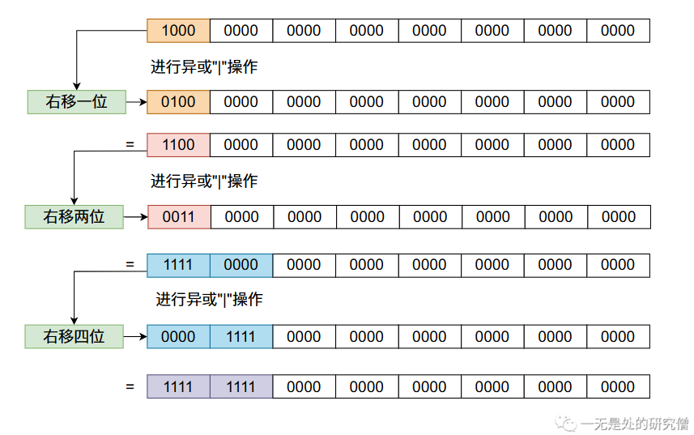

# `HashMap`源码深度剖析，手把手带你分析每一行代码！

在前面的两篇文章[哈希表的原理](https://mp.weixin.qq.com/s?__biz=Mzg3ODgyNDgwNg==&mid=2247484235&idx=1&sn=e4fda2cd7520d2d68d7a3c179c8845b3&chksm=cf0c9f42f87b1654e49e21d043fed104ce5fd4839f2eae13cd95c7630fd547e208a1318fd8d3&token=1155116583&lang=zh_CN#rd)和[200行代码带你写自己的`HashMap`](https://mp.weixin.qq.com/s?__biz=Mzg3ODgyNDgwNg==&mid=2247484235&idx=1&sn=e4fda2cd7520d2d68d7a3c179c8845b3&chksm=cf0c9f42f87b1654e49e21d043fed104ce5fd4839f2eae13cd95c7630fd547e208a1318fd8d3&token=1155116583&lang=zh_CN#rd)（如果你阅读这篇文章感觉有点困难，可以先阅读这两篇文章）当中我们仔细谈到了哈希表的原理并且自己动手使用线性探测法实现了我们自己的哈希表`MyHashMap`。在本篇文章当中我们将仔细分析`JDK`当中`HashMap`的源代码。

首先我们需要了解的是一个容器最重要的四个功能 `增删改查` ，而我们也是主要根据这四个功能进行展开一步一步的剖析`HashMap`的源代码。在正式进行源码分析之前，先提一下：在`JDK`当中实现的`HashMap`解决哈希冲突的办法是使用`链地址法`，而我们自己之前在文章[200行代码带你写自己的`HashMap`](https://mp.weixin.qq.com/s?__biz=Mzg3ODgyNDgwNg==&mid=2247484235&idx=1&sn=e4fda2cd7520d2d68d7a3c179c8845b3&chksm=cf0c9f42f87b1654e49e21d043fed104ce5fd4839f2eae13cd95c7630fd547e208a1318fd8d3&token=1155116583&lang=zh_CN#rd)当中实现的`MyHashMap`解决哈希冲突的办法是线性探测法，大家注意一下这两种方法的不同。

## `HashMap`源码类中关键字段分析

- 下面字段表示默认的哈希表的长度，也就是`HashMap`底层使用数组的默认长度，在`HashMap`当中底层所使用的的数组的长度必须是`2`的整数次幂，这一点我们在文章[200行代码带你写自己的`HashMap`](https://mp.weixin.qq.com/s?__biz=Mzg3ODgyNDgwNg==&mid=2247484235&idx=1&sn=e4fda2cd7520d2d68d7a3c179c8845b3&chksm=cf0c9f42f87b1654e49e21d043fed104ce5fd4839f2eae13cd95c7630fd547e208a1318fd8d3&token=1155116583&lang=zh_CN#rd)已经仔细做出了说明。

```java
    /**
     * The default initial capacity - MUST be a power of two.
     */
    static final int DEFAULT_INITIAL_CAPACITY = 1 << 4; // aka 16
```

- 这个字段表示哈希表当中数组的最大长度，`HashMap`底层使用的数组长度不能超过这个值。

```java
    /**
     * The maximum capacity, used if a higher value is implicitly specified
     * by either of the constructors with arguments.
     * MUST be a power of two <= 1<<30.
     */
    static final int MAXIMUM_CAPACITY = 1 << 30;
```

- 字段`DEFAULT_LOAD_FACTOR`的作用表示在`HashMap`当中默认的负载因子的值。

```java
    /**
     * The load factor used when none specified in constructor.
     */
    static final float DEFAULT_LOAD_FACTOR = 0.75f;
```

在实际情况当中我们并不是当`HashMap`当中的数组完全被使用完之后才进行扩容，因为如果数组快被使用完之后，再加入数据产生哈希冲突的可能性就会很大，因此我们通常会设置一个负载因子`(load factor)`，当数组的使用率超过这个值的时候就进行扩容，即当(数组长度为`L`，数组当中数据个数为`S`，负载因子为`F`)：
$$
S \ge L \times F
$$

- `TREEIFY_THRESHOLD` 这个字段主要表示将链表（在`JDK`当中是采用链地址法去解决哈希冲突的问题）变成一个红黑树（如果你不了解红黑树，可以将其认为是一种平衡二叉树）的条件，在`JDK1.8`之后`JDK`中实现`HashMap`不仅采用链地址法去解决哈希冲突，而且链表满足一定条件之后会将链表变成一颗红黑树。而将链表变成一颗红黑树的`必要条件`是链表当中数据的个数要大于等于`TREEIFY_THRESHOLD`，请大家注意是`必要条件`不是`充分条件`，也就是说满足这个条件还不行，它还需要满足另外一个条件，就是哈希表中数组的长度要大于等于`MIN_TREEIFY_CAPACITY`，`MIN_TREEIFY_CAPACITY`在`JDK`当中的默认值是64。

```java
    /**
     * The bin count threshold for using a tree rather than list for a
     * bin.  Bins are converted to trees when adding an element to a
     * bin with at least this many nodes. The value must be greater
     * than 2 and should be at least 8 to mesh with assumptions in
     * tree removal about conversion back to plain bins upon
     * shrinkage.
     */
    static final int TREEIFY_THRESHOLD = 8;

    /**
     * The smallest table capacity for which bins may be treeified.
     * (Otherwise the table is resized if too many nodes in a bin.)
     * Should be at least 4 * TREEIFY_THRESHOLD to avoid conflicts
     * between resizing and treeification thresholds.
     */
    static final int MIN_TREEIFY_CAPACITY = 64;

```

- `UNTREEIFY_THRESHOLD`表示当在进行`resize`操作的过程当中，红黑树当中的节点个数小于`UNTREEIFY_THRESHOLD`时，就需要将一颗红黑树重新恢复成链表。

```java
    /**
     * The bin count threshold for untreeifying a (split) bin during a
     * resize operation. Should be less than TREEIFY_THRESHOLD, and at
     * most 6 to mesh with shrinkage detection under removal.
     */
    static final int UNTREEIFY_THRESHOLD = 6;
```

- 下列代码单重的`table`数组对象就是`HashMap`底层当中真正用于存储数据的数组。

```java
    /**
     * The table, initialized on first use, and resized as
     * necessary. When allocated, length is always a power of two.
     * (We also tolerate length zero in some operations to allow
     * bootstrapping mechanics that are currently not needed.)
     */
    transient Node<K,V>[] table;
```

- `size`表示哈希表中存储的`key-value`对象的个数，也就是放入了多少个键值对象。

```java
    /**
     * The number of key-value mappings contained in this map.
     */
    transient int size;

```

- `threshold`表示容器当中能够存储的数据个数的阈值，当`HashMap`当中存储的数据的个数超过这个值的时候，`HashMap`底层使用的数组就需要进行扩容。下列公式中`Capacity`表示底层数组的长度（`2`的整数次幂，注意与`size`进行区分）。

$$
threshold = loadFactor * Capacity
$$


```java
    int threshold;

    /**
     * The load factor for the hash table.
     *
     * @serial
     */
    final float loadFactor;
```


## `HashMap`底层数组当中的节点类

在上篇[哈希表的设计原理](https://mp.weixin.qq.com/s?__biz=Mzg3ODgyNDgwNg==&mid=2247484145&idx=1&sn=362cf64866ace02ac95c0c1a970393e4&chksm=cf0c9ef8f87b17eebb61ea422f58e9e439632783e9faa5a3b2ce55712c1582b140904b60cb17&token=1155116583&lang=zh_CN#rd)当中我们已经仔细说明，在`HashMap`当中我们是使用数组去存储具体的数据的，那么在我们的数组当中应该存储什么样的数据呢？假设在`HashMap`的数组当中存储的数据类型为`Node`，那么这个类需要有哪些字段呢？

- 首先一点我们肯定需要存储`Value`值，因为我们最终需要通过`get`方法从`HashMap`当中取出我们所需要的值。
- 第二点当我们通过`get`方法去取值的时候是通过`Key`（键值）去取的，当哈希值产生冲突的时候，我们不仅需要通过哈希值确定位置，还需要通过比较通过函数`get`传递的`Key`和数组当当中存储的数据的`key`是否相等，因此我们需要存储键值`Key`。

- 第三点为了避免重复计算哈希值（因为有的对象的哈希值计算还是比较费时间），我们可以使用一个字段去存储计算好的哈希值。

基于以上三点，在`JDK`当中的`HashMap`内部的节点类主要结构如下。

```java
static class Node<K,V> implements Map.Entry<K,V> {
    final int hash;
    final K key;
    V value;
    Node<K,V> next;

    Node(int hash, K key, V value, Node<K,V> next) {
        this.hash = hash;
        this.key = key;
        this.value = value;
        this.next = next;
    }

    public final K getKey()        { return key; }
    public final V getValue()      { return value; }
    public final String toString() { return key + "=" + value; }

    public final int hashCode() {
        return Objects.hashCode(key) ^ Objects.hashCode(value);
    }

    public final V setValue(V newValue) {
        V oldValue = value;
        value = newValue;
        return oldValue;
    }

    public final boolean equals(Object o) {
        if (o == this)
            return true;
        if (o instanceof Map.Entry) {
            Map.Entry<?,?> e = (Map.Entry<?,?>)o;
            if (Objects.equals(key, e.getKey()) &&
                Objects.equals(value, e.getValue()))
                return true;
        }
        return false;
    }
}

```

我们用下面两行代码说明上面类的结构：

```java
HashMap<String, Integer> map = new HashMap<>();
map.put("一无是处的研究僧", 888);
```

在上面的代码当中`put`函数的参数`"一无是处的研究僧"`就是上面`Node`类当中的`key`，`888`就是`Node`类当中的`value`对象，上面的类当中的`hash`对象就是字符串`"一无是处的研究僧"`的哈希值，但是事实上他还需要经过一段代码的处理：

```java
  /**
   * 这个 key 是 put 函数传进来的 key
   * @param key
   * @return
   */
  static int hash(Object key) {
    int h;
    // 调用对象自己实现的 hashCode 方法
    // key.hashCode() =  "一无是处的研究僧".hashCode
    return (key == null) ? 0 : (h = key.hashCode()) ^ (h >>> 16);
  }
```

上面的函数之所以要将对象的哈希值右移`16`，是因为我们的数组的长度一般不会超过$2^{16}$，因为$2^{16}$已经是一个比较大的值了，因此当哈希值与$2^n - 1$进行`&`操作的时候，高位通常没有使用到，这样做的原理是可以充分利用数据哈希值当中的信息。

## `tableSizeFor`函深入剖析

```java
/**
 * Returns a power of two size for the given target capacity.
 */
/**
 * 返回第一个大于或者等于 capacity 且为 2 的整数次幂的那个数
 * @param capacity
 * @return
 */
static final int tableSizeFor(int cap) {
    int n = cap - 1;
    n |= n >>> 1;
    n |= n >>> 2;
    n |= n >>> 4;
    n |= n >>> 8;
    n |= n >>> 16;
    // 如果最终得到的数据小于 0 则初始长度为 1
    // 如果长度大于我们所允许的最大的容量 则将初始长度设置为我们
    // 所允许的最大的容量
    // MAXIMUM_CAPACITY = 1 << 30;
    return (n < 0) ? 1 : (n >= MAXIMUM_CAPACITY) ? MAXIMUM_CAPACITY : n + 1;
}
```

因为我们需要底层使用的数组`table`的长度是`2`的整数次幂，而我们之后在初始化函数当中会允许用户输入一个数组长度的大小，但是用户输入的数字可能不是`2`的整数次幂，因此我们需要将用户输入的数据变成`2`的整数次幂，我们可以将用户输入的数据变成大于等于这个数的最小的`2`的整数次幂。

比如说如果用户输入的是`12`我们需要将其变成`16`，如果输入的是`28`我们需要将其变成`32`。我们可以通过上面的函数做到这一点。

上面的代码还是很难理解的，让我们一点一点的来分析。首先我们使用一个`2`的整数次幂的数进行上面`移位操作`的操作！




从上图当中我们会发现，我们咋一个数的二进制数的32位放一个`1`，经过移位之后最终`32`位的比特数字全部变成了`1`。根据上面数字变化的规律我们可以发现，任何一个比特经过上面移位的变化，这个比特后面的`31`个比特位都会变成`1`，像下图那样：


因此上述的移位操作的结果只取决于最高一位的比特值为`1`，移位操作后它后面的所有比特位的值全为`1`，而在上面函数的最后，如果最终的容量没有大于我们设置的最大容量`MAXIMUM_CAPACITY`，我们返回的结果就是上面移位之后的结果 `+1`。又因为移位之后最高位的`1`到最低位的`1`之间的比特值全为`1`，当我们`+1`之后他会不断的进位，最终只有一个比特位置是`1`，因此它是`2`的整数倍。


在`tableSizeFor`函数当中，给初始容量减了个`1`，这样做的原因是让这个函数的返回值大于等于传入的参数`capacity`：

```java
tableSizeFor(4) == 4 // 就是当传入的数据已经是 2 的整数次幂的时候也返回传入的值
tableSizeFor(3) == 4
tableSizeFor(5) == 8
```

## `HashMap`构造函数分析

首先我们先看一下几个构造函数的代码：

```java
public HashMap(int initialCapacity) {
    // 指定初始容量的构造函数
    this(initialCapacity, DEFAULT_LOAD_FACTOR);
}

public HashMap() {
    this.loadFactor = DEFAULT_LOAD_FACTOR; // all other fields defaulted
}

public HashMap(int initialCapacity, float loadFactor) {
    if (initialCapacity < 0)
        throw new IllegalArgumentException("Illegal initial capacity: " +
                                           initialCapacity);
    // 如果大于允许的最大容量，就将数组的长度这是为最大容量
    if (initialCapacity > MAXIMUM_CAPACITY)
        initialCapacity = MAXIMUM_CAPACITY;
    if (loadFactor <= 0 || Float.isNaN(loadFactor))
        throw new IllegalArgumentException("Illegal load factor: " +
                                           loadFactor);
    this.loadFactor = loadFactor;
    // 这里本来应该将 threshold 的值设置为数组长度的 * load factor，
    // 但是在 HashMap 的源代码当中
    // 并没有一个变量存储数组的长度，因为数组的长度直接 array.length
    // 就可以得到，因此也没必要，而在 HashMap 当中，使用懒加载
    // 只有在使用 put 函数的时候才申请数组 因此需要一个变量存储数组的长度
    // 而此时 threshold 并没有使用，因此可以临时用于存储 数组的长度
    // 在后面申请数组是，将 threshold 更新为 数组长度 * load factor
    this.threshold = tableSizeFor(initialCapacity);
}
```

`HashMap`的构造函数整体来说比较简单，但是上面代码当中最后一行很容易让人迷惑，具体原因在上面的注释当中已经说明了，大家可以阅读一下。

## `HashMap`的增删改查函数分析

### `put`函数分析——“增改”

```java
public V put(K key, V value) {
    return putVal(hash(key), key, value, false, true);
}

static final int hash(Object key) {
    int h;
    return (key == null) ? 0 : (h = key.hashCode()) ^ (h >>> 16);
}
```

在`put`函数当中首先计算参数`key`的哈希值，然后调用`putVal`函数真正的将输入插入到数据当中，为了方便大家于都代码，代码解释在代码当中对应的位置。

在正式阅读这个代码之前我们先分析这个函数的流程：


```java
final V putVal(int hash, K key, V value, boolean onlyIfAbsent,
               boolean evict) {
    // 我们先只管前面三个参数，后的参数可以先不管
    Node<K,V>[] tab; Node<K,V> p; int n, i;
    
    // 这里是首次调用函数 putVal 的时候这个 if 条件会通过
    // 因为第一次调用这个函数的时候还没有申请数组 所以 table == null 
    if ((tab = table) == null || (n = tab.length) == 0)
        // 进行扩容
        n = (tab = resize()).length;
    // 如果计算出的下标对应数据还没有村数据直接将数据加入到数组
    // 当中即可
    // 这行代码不仅会将tab[i = (n - 1) & hash] 的结果赋值给 p 
    // (p = tab[i = (n - 1) & hash]) 这行代码的返回值也是 tab[i = (n - 1) & hash]
    if ((p = tab[i = (n - 1) & hash]) == null)
        tab[i] = newNode(hash, key, value, null);
    else {
        // 如果对应位置当中已经存在数据了
        // 即产生了哈希冲突，要采用链地址法进行解决
        Node<K,V> e; K k;
        // 如果传入的哈希值和对应下标的数据的哈希值相等
        // 而且两个 key 相等，这个 if 语句的条件就满足了
        // 然后将对应下标的数据赋值给 e 然后在后续的代码当中
        // 更新 e 当中的 value 为 putVal 函数传入的 value
        // 即 e.value = value;
        if (p.hash == hash &&
            ((k = p.key) == key || (key != null && key.equals(k))))
            e = p;
        else if (p instanceof TreeNode)
            // 如果 p 是一个红黑树节点，就在红黑树当中放入数据
            // 在本篇文章当中我们不仔细去讨论这个函数，因为红黑树
            // 的操作比较复杂，我们之后再专门写一篇关于红黑树的文章来讲解这个问题
            e = ((TreeNode<K,V>)p).putTreeVal(this, tab, hash, key, value);
        else {
            // 这里就是链表的操作了
            for (int binCount = 0; ; ++binCount) {
                // 如果 e.next == null 说明已经遍历到最后一个节点了
                // 需要将新加入的
                if ((e = p.next) == null) {
                    p.next = newNode(hash, key, value, null);
                    // 如果节点数超过 TREEIFY_THRESHOLD 就需要进行后续的操作
                    // 在 treeifyBin 函数当中会有一个判断，如果数组的长度大于
                    // MIN_TREEIFY_CAPACITY 就将链表变成红黑树，否则直接进行扩容
                    if (binCount >= TREEIFY_THRESHOLD - 1) // -1 for 1st
                        treeifyBin(tab, hash);
                    break;
                }
                // 如果找到相同的 key 就跳出去
                if (e.hash == hash &&
                    ((k = e.key) == key || (key != null && key.equals(k))))
                    break;
                p = e;
            }
        }
        // 当存在一个对象的 key 和传进这个函数的 key 相同的话
        // 就需要进行 value 的更新，相当于将新的 value 替换掉旧的
        // value
        if (e != null) { // existing mapping for key
            V oldValue = e.value;
            if (!onlyIfAbsent || oldValue == null)
                e.value = value;
            afterNodeAccess(e);
            return oldValue;
        }
    }
    ++modCount;
    // 如果容器当中数据的数量大于阈值的话就进行扩容
    if (++size > threshold)
        resize();
    afterNodeInsertion(evict); // 这个函数在 HashMap 没啥用，他的函数体为空 
    return null;
}
```

### `resize`扩容函数分析

```java
final Node<K,V>[] resize() {
    Node<K,V>[] oldTab = table;
    // 旧数组的数组长度
    int oldCap = (oldTab == null) ? 0 : oldTab.length;
    // 旧的扩容的阈值
    int oldThr = threshold;
    int newCap, newThr = 0;
    if (oldCap > 0) {
        if (oldCap >= MAXIMUM_CAPACITY) {
            threshold = Integer.MAX_VALUE;
            return oldTab;
        }
        else if ((newCap = oldCap << 1) < MAXIMUM_CAPACITY &&
                 oldCap >= DEFAULT_INITIAL_CAPACITY)
            newThr = oldThr << 1; // double threshold
    }
    else if (oldThr > 0) // initial capacity was placed in threshold
        newCap = oldThr;
    else {               // zero initial threshold signifies using defaults
        newCap = DEFAULT_INITIAL_CAPACITY;
        newThr = (int)(DEFAULT_LOAD_FACTOR * DEFAULT_INITIAL_CAPACITY);
    }
    if (newThr == 0) {
        float ft = (float)newCap * loadFactor;
        newThr = (newCap < MAXIMUM_CAPACITY && ft < (float)MAXIMUM_CAPACITY ?
                  (int)ft : Integer.MAX_VALUE);
    }
    
    // 上面的代码主要是计算得到新的阈值 newThr 和数组长度 newCap
    
    threshold = newThr;
    @SuppressWarnings({"rawtypes","unchecked"})
    Node<K,V>[] newTab = (Node<K,V>[])new Node[newCap];
    table = newTab;
    // 现在需要将旧数组当中的数据加入到新数组
    if (oldTab != null) {
        for (int j = 0; j < oldCap; ++j) {
            Node<K,V> e;
            if ((e = oldTab[j]) != null) {
                oldTab[j] = null;
                // e.next == null 表示只有一个数据，并没有形成 2 个
                // 数据以上的链表，因此可以直接加入到心得数组 当中
                if (e.next == null)
                    newTab[e.hash & (newCap - 1)] = e;
                else if (e instanceof TreeNode)
                    // 如果节点是红黑树节点，则在将红黑树当中的节点加入到新数组当中
                    ((TreeNode<K,V>)e).split(this, newTab, j, oldCap);
                else { // preserve order
                    // 链表的代码比较复杂，大家可以看下面的分析
                    Node<K,V> loHead = null, loTail = null;
                    Node<K,V> hiHead = null, hiTail = null;
                    Node<K,V> next;
                    do {
                        next = e.next;
                        if ((e.hash & oldCap) == 0) {
                            if (loTail == null)
                                loHead = e;
                            else
                                loTail.next = e;
                            loTail = e;
                        }
                        else {
                            if (hiTail == null)
                                hiHead = e;
                            else
                                hiTail.next = e;
                            hiTail = e;
                        }
                    } while ((e = next) != null);
                    if (loTail != null) {
                        loTail.next = null;
                        newTab[j] = loHead;
                    }
                    if (hiTail != null) {
                        hiTail.next = null;
                        newTab[j + oldCap] = hiHead;
                    }
                }
            }
        }
    }
    return newTab;
}
```

