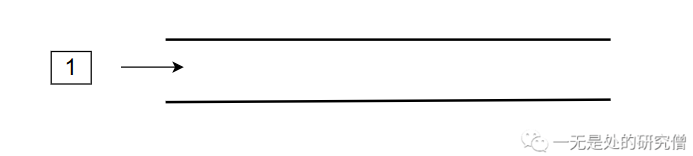
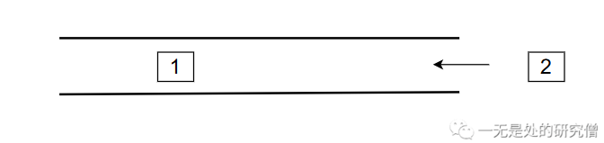
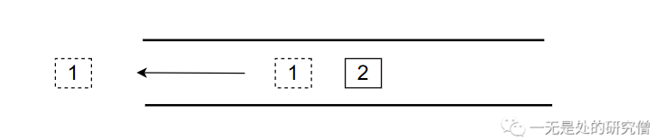
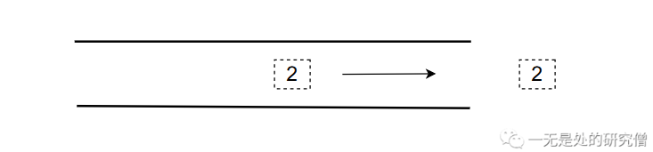
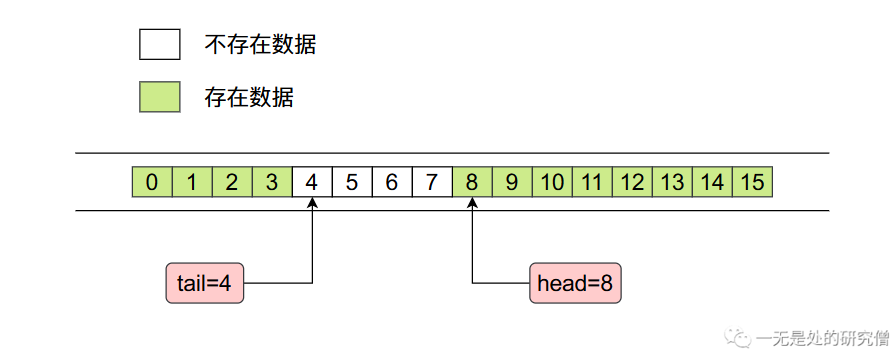
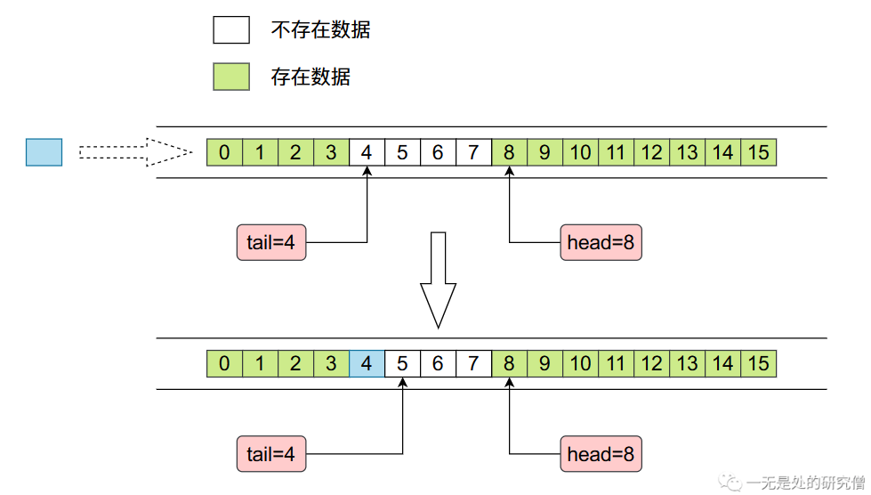

# ArrayDeque（JDK双端队列）源码深度剖析

## 前言

在本篇文章当中主要跟大家介绍`JDK`给我们提供的一种用数组实现的**双端队列**，在之前的文章[LinkedList源码剖析当中](https://mp.weixin.qq.com/s?__biz=Mzg3ODgyNDgwNg==&mid=2247483907&idx=1&sn=6281a11e6ed1917ecb3a10319474193d&chksm=cf0c9e0af87b171c7193949b5b7eb0b8f813b05b3d3b96ea784df86a3dde4286ad03908122da&token=883596793&lang=zh_CN#rd)我们已经介绍了一种**双端队列**，不过与`ArrayDeque`不同的是，`LinkedList`的双端队列使用双向链表实现的。

## 双端队列整体分析

我们通常所谈论到的队列都是一端进一端出，而双端队列的两端则都是可进可出。下面是双端队列的几个操作：

- 数据从双端队列左侧进入。



- 数据从双端队列右侧进入。



- 数据从双端队列左侧弹出。



- 数据从双端队列右侧弹出。



而在`ArrayDeque`当中也给我们提供了对应的方法去实现，比如下面这个例子就是上图对应的代码操作：

```java
public void test() {
    ArrayDeque<Integer> deque = new ArrayDeque<>();
    deque.addLast(100);
    System.out.println(deque);
    deque.addFirst(55);
    System.out.println(deque);
    deque.addLast(-55);
    System.out.println(deque);
    deque.removeFirst();
    System.out.println(deque);
    deque.removeLast();
    System.out.println(deque);
}
// 输出结果
[100]
[55, 100]
[55, 100, -55]
[100, -55]
[100]
```


## 数组实现ArrayDeque(双端队列)的原理

`ArrayDeque`底层是使用数组实现的。在`ArrayDeque`当中有两个整形变量`head`和`tail`，分别指向右侧的第一个进入队列的数据和左侧第一个进行队列的数据，整个内存布局如下图所示：



其中`tail`指的位置没有数据，`head`指的位置存在数据。

- 当我们需要从左往右增加数据时，内存当中数据变化情况如下：

