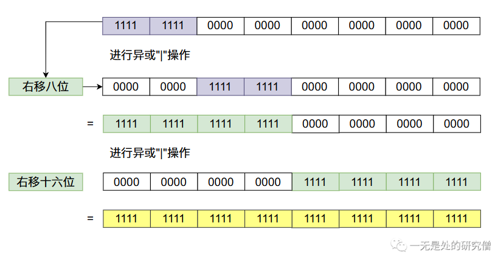

# ArrayDeque（JDK双端队列）源码深度剖析

## 前言

在本篇文章当中主要跟大家介绍`JDK`给我们提供的一种用数组实现的**双端队列**，在之前的文章[LinkedList源码剖析当中](https://mp.weixin.qq.com/s?__biz=Mzg3ODgyNDgwNg==&mid=2247483907&idx=1&sn=6281a11e6ed1917ecb3a10319474193d&chksm=cf0c9e0af87b171c7193949b5b7eb0b8f813b05b3d3b96ea784df86a3dde4286ad03908122da&token=883596793&lang=zh_CN#rd)我们已经介绍了一种**双端队列**，不过与`ArrayDeque`不同的是，`LinkedList`的双端队列使用双向链表实现的。

## 双端队列整体分析

我们通常所谈论到的队列都是一端进一端出，而双端队列的两端则都是可进可出。下面是双端队列的几个操作：

- 数据从双端队列左侧进入。


- 数据从双端队列右侧进入。


- 数据从双端队列左侧弹出。


- 数据从双端队列右侧弹出。


而在`ArrayDeque`当中也给我们提供了对应的方法去实现，比如下面这个例子就是上图对应的代码操作：

```java
public void test() {
    ArrayDeque<Integer> deque = new ArrayDeque<>();
    deque.addLast(100);
    System.out.println(deque);
    deque.addFirst(55);
    System.out.println(deque);
    deque.addLast(-55);
    System.out.println(deque);
    deque.removeFirst();
    System.out.println(deque);
    deque.removeLast();
    System.out.println(deque);
}
// 输出结果
[100]
[55, 100]
[55, 100, -55]
[100, -55]
[100]
```


## 数组实现ArrayDeque(双端队列)的原理

`ArrayDeque`底层是使用数组实现的，而且数组的长度必须是`2`的整数次幂，这么操作的原因是为了后面位运算好操作。在`ArrayDeque`当中有两个整形变量`head`和`tail`，分别指向右侧的第一个进入队列的数据和左侧第一个进行队列的数据，整个内存布局如下图所示：


其中`tail`指的位置没有数据，`head`指的位置存在数据。

- 当我们需要从左往右增加数据时（入队），内存当中数据变化情况如下：


- 当我们需要从右往做左增加数据时（入队），内存当中数据变化情况如下：


- 当我们需要从右往左删除数据时（出队），内存当中数据变化情况如下：


- 当我们需要从左往右删除数据时（出队），内存当中数据变化情况如下：


## 底层数据遍历顺序和逻辑顺序

上面主要谈论到的数组在内存当中的布局，但是他是具体的物理存储数据的顺序，这个顺序和我们的逻辑上的顺序是不一样的，根据上面的插入顺序，我们可以画出下面的图，大家可以仔细分析一下这个图的顺序问题。


上图当中队列左侧的如队顺序是0, 1, 2, 3，右侧入队的顺序为15, 14, 13, 12, 11, 10, 9, 8，因此在逻辑上我们的队列当中的数据布局如下图所示：


根据前面一小节谈到的输入在入队的时候数组当中数据的变化我们可以知道，数据在数组当中的布局为：


## ArrayDeque类关键字段分析

```java
// 底层用于存储具体数据的数组
transient Object[] elements;
// 这就是前面谈到的 head
transient int head;
// 与上文谈到的 tail 含义一样
transient int tail;
// MIN_INITIAL_CAPACITY 表示数组 elements 的最短长度
private static final int MIN_INITIAL_CAPACITY = 8;
```

以上就是`ArrayDeque`当中的最主要的字段，其含义还是比较容易理解的！

## ArrayDeque构造函数分析

- 默认构造函数，数组默认申请的长度为`16`。

```java
public ArrayDeque() {
    elements = new Object[16];
}
```

- 指定数组长度的初始化长度，下面列出了改构造函数涉及的所有函数。

```java
public ArrayDeque(int numElements) {
    allocateElements(numElements);
}

private void allocateElements(int numElements) {
    elements = new Object[calculateSize(numElements)];
}
private static int calculateSize(int numElements) {
    int initialCapacity = MIN_INITIAL_CAPACITY;
    // Find the best power of two to hold elements.
    // Tests "<=" because arrays aren't kept full.
    if (numElements >= initialCapacity) {
        initialCapacity = numElements;
        initialCapacity |= (initialCapacity >>>  1);
        initialCapacity |= (initialCapacity >>>  2);
        initialCapacity |= (initialCapacity >>>  4);
        initialCapacity |= (initialCapacity >>>  8);
        initialCapacity |= (initialCapacity >>> 16);
        initialCapacity++;

        if (initialCapacity < 0)   // Too many elements, must back off
            initialCapacity >>>= 1;// Good luck allocating 2 ^ 30 elements
    }
    return initialCapacity;
}
```

上面的最难理解的就是函数`calculateSize`了，他的主要作用是如果用户输入的长度小于`MIN_INITIAL_CAPACITY`时，返回`MIN_INITIAL_CAPACITY`。否则返回比`initialCapacity`大的第一个是`2`的整数幂的整数，比如说如果输入的是`9`返回的`16`，输入`4`返回`8`。

`calculateSize`的代码还是很难理解的，让我们一点一点的来分析。首先我们使用一个`2`的整数次幂的数进行上面`移位操作`的操作！




从上图当中我们会发现，我们在一个数的二进制数的32位放一个`1`，经过移位之后最终`32`位的比特数字全部变成了`1`。根据上面数字变化的规律我们可以发现，任何一个比特经过上面移位的变化，这个比特后面的`31`个比特位都会变成`1`，像下图那样：


因此上述的移位操作的结果只取决于最高一位的比特值为`1`，移位操作后它后面的所有比特位的值全为`1`，而在上面函数的最后，我们返回的结果就是上面移位之后的结果 `+1`。又因为移位之后最高位的`1`到最低位的`1`之间的比特值全为`1`，当我们`+1`之后他会不断的进位，最终只有一个比特位置是`1`，因此它是`2`的整数倍。


经过上述过程分析，我们就可以立即函数`calculateSize`了。

## ArrayDeque关键函数分析

### addLast函数分析

```java
// tail 的初始值为 0 
public void addLast(E e) {
    if (e == null)
        throw new NullPointerException();
    elements[tail] = e;
    // 这里进行的 & 位运算 相当于取余数操作
    // (tail + 1) & (elements.length - 1) == (tail + 1) % elements.length
    // 这个操作主要是用于判断数组是否满了，如果满了则需要扩容
    // 同时这个操作将 tail + 1，即 tail = tail + 1
    if ( (tail = (tail + 1) & (elements.length - 1)) == head)
        doubleCapacity();
}
```

代码`(tail + 1) & (elements.length - 1) == (tail + 1) % elements.length`成立的原因是任意一个数$a$对$2^n$进行取余数操作和$a$跟$2^n - 1$进行`&`运算的结果相等，即：
$$
a\% 2^n = a \& (2^n - 1)
$$
从上面的代码来看下标为`tail`的位置是没有数据的，是一个空位置。

### addFirst函数分析

```java
// head 的初始值为 0 
public void addFirst(E e) {
    if (e == null)
        throw new NullPointerException();
    // 若此时数组长度elements.length = 16
    // 那么下面代码执行过后 head = 15
    // 下面代码的操作结果和下面两行代码含义一致
    // elements[(head - 1 + elements.length) % elements.length] = e
    // head = (head - 1 + elements.length) % elements.length
    elements[head = (head - 1) & (elements.length - 1)] = e;
    if (head == tail)
        doubleCapacity();
}
```

上面代码操作结果和上文当中我们提到的，在队列当中从右向左加入数据一样。从上面的代码看，我们可以发现下标为`head`的位置是存在数据的。

### doubleCapacity函数分析

```java
private void doubleCapacity() {
    assert head == tail;
    int p = head;
    int n = elements.length;
    int r = n - p; // number of elements to the right of p
    int newCapacity = n << 1;
    if (newCapacity < 0)
        throw new IllegalStateException("Sorry, deque too big");
    Object[] a = new Object[newCapacity];
    // arraycopy(Object src,  int  srcPos,
                                        Object dest, int destPos,
                                        int length)
    // 上面是函数 System.arraycopy 的函数参数列表
    // 大家可以参考上面理解下面的拷贝代码
    System.arraycopy(elements, p, a, 0, r);
    System.arraycopy(elements, 0, a, r, p);
    elements = a;
    head = 0;
    tail = n;
}

```

上面的代码还是比较简单的，这里给大家一个图示，大家就更加容易理解了：


扩容之后将原来数组的数据拷贝到了新数组当中，虽然数据在旧数组和新数组当中的顺序发生变化了，但是他们的相对顺序却没有发生变化，他们的逻辑顺序也是一样的，这里的逻辑可能有点绕，大家在这里可以好好思考一下。

#### pollLast和pollFirst函数分析

这两个函数的代码就比较简单了，大家可以根据前文所谈到的内容和图示去理解下面的代码。

```java
public E pollLast() {
    // 计算出待删除的数据的下标
    int t = (tail - 1) & (elements.length - 1);
    @SuppressWarnings("unchecked")
    E result = (E) elements[t];
    if (result == null)
        return null;
    // 将需要删除的数据的下标值设置为 null 这样这块内存就
    // 可以被回收了
    elements[t] = null;
    tail = t;
    return result;
}

public E pollFirst() {
    int h = head;
    @SuppressWarnings("unchecked")
    E result = (E) elements[h];
    // Element is null if deque empty
    if (result == null)
        return null;
    elements[h] = null;     // Must null out slot
    head = (h + 1) & (elements.length - 1);
    return result;
}

```

## 总结

在本篇文章当中，主要跟大家分享了`ArrayDeque`的设计原理，和他的底层实现过程

以上就是本篇文章的所有内容了，希望大家有所收获，我是LeHung，我们下期再见！！！都看到这里了，给孩子一个赞（start）吧，免费的哦！！！

---

更多精彩内容合集可访问项目：<https://github.com/Chang-LeHung/CSCore>

关注公众号：一无是处的研究僧，了解更多计算机（Java、Python、计算机系统基础、算法与数据结构）知识。


