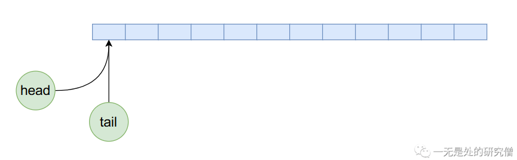
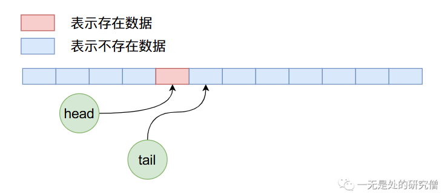
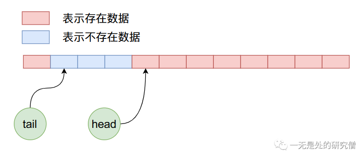
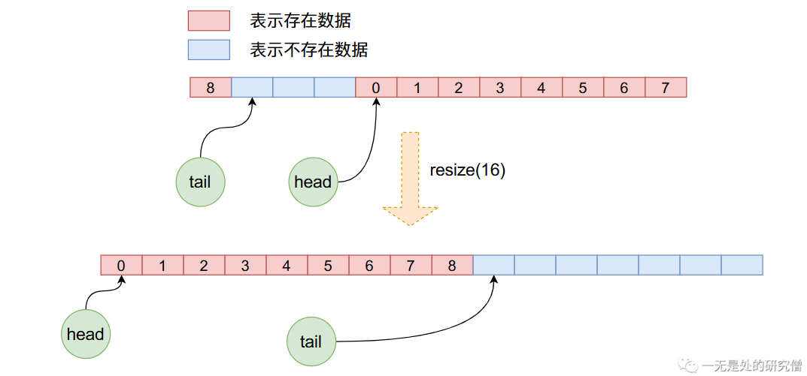

## 深入剖析（JDK）ArrayQueue源码

## 前言

在本篇文章当中主要给大家介绍一个比较简单的`JDK`为我们提供的容器`ArrayQueue`，这个容器主要是用数组实现的一个单向队列，整体的结构相对其他容器来说就比较简单了。

## ArrayQueue内部实现

在谈`ArrayQueue`的内部实现之前我们先来看一个`ArrayQueue`的使用例子：

```java
public void testQueue() {
    ArrayQueue<Integer> queue = new ArrayQueue<>(10);
    queue.add(1);
    queue.add(2);
    queue.add(3);
    queue.add(4);
    System.out.println(queue);
    queue.remove(0); // 这个参数只能为0 表示删除队列当中第一个元素，也就是队头元素
    System.out.println(queue);
    queue.remove(0);
    System.out.println(queue);
}
// 输出结果
[1, 2, 3, 4]
[2, 3, 4]
[3, 4]
```


首先`ArrayQueue`内部是由循环数组实现的，可能保证增加和删除数据的时间复杂度都是$O(1)$，不像`ArrayList`删除数据的时间复杂度为$O(n)$。在`ArrayQueue`内部有两个整型数据`head`和`tail`，这两个的作用主要是指向队列的头部和尾部，它的初始状态在内存当中的布局如下图所示：



因为是初始状态`head`和`tail`的值都等于0，指向数组当中第一个数据。现在我们向`ArrayQueue`内部加入5个数据，那么他的内存布局将如下图所示：


现在我们删除4个数据，那么上图经过4次删除操作之后，`ArrayQueue`内部数据布局如下：



在上面的状态下，我们继续加入8个数据，那么布局情况如下：



我们知道上图在加入数据的时候不仅将数组后半部分的空间使用完了，而且可以继续使用前半部分没有使用过的空间，也就是说在`ArrayQueue`内部实现了一个循环使用的过程。

## ArrayQueue源码剖析

### 构造函数

```java
public ArrayQueue(int capacity) {
    this.capacity = capacity + 1;
    this.queue = newArray(capacity + 1);
    this.head = 0;
    this.tail = 0;
}

@SuppressWarnings("unchecked")
private T[] newArray(int size) {
    return (T[]) new Object[size];
}
```

上面的构造函数的代码比较容易理解，主要就是根据用户输入的数组空间长度去申请数组，不过他具体在申请数组的时候会多申请一个空间。

### add函数

```java
public boolean add(T o) {
    queue[tail] = o;
    // 循环使用数组
    int newtail = (tail + 1) % capacity;
    if (newtail == head)
        throw new IndexOutOfBoundsException("Queue full");
    tail = newtail;
    return true; // we did add something
}
```

上面的代码也相对比较容易看懂，在上文当中我们已经提到了`ArrayQueue`可以循环将数据加入到数组当中去，这一点在上面的代码当中也有所体现。

### remove函数

```java
public T remove(int i) {
    if (i != 0)
        throw new IllegalArgumentException("Can only remove head of queue");
    if (head == tail)
        throw new IndexOutOfBoundsException("Queue empty");
    T removed = queue[head];
    queue[head] = null;
    head = (head + 1) % capacity;
    return removed;
}
```

从上面的代码当中可以看出，在`remove`函数当中我们必须传递参数0，否则会抛出异常。而在这个函数当中我们只会删除当前`head`下标所在位置的数据，然后将`head`的值进行循环加1操作。

### get函数

```java
public T get(int i) {
    int size = size();
    if (i < 0 || i >= size) {
        final String msg = "Index " + i + ", queue size " + size;
        throw new IndexOutOfBoundsException(msg);
    }
    int index = (head + i) % capacity;
    return queue[index];
}
```

`get`函数的参数表示得到第`i`个数据，这个第`i`个数据并不是数组位置的第`i`个数据，而是距离`head`位置为`i`的位置的数据，了解这一点，上面的代码是很容易理解的。

### resize函数

```java
public void resize(int newcapacity) {
    int size = size();
    if (newcapacity < size)
        throw new IndexOutOfBoundsException("Resizing would lose data");
    newcapacity++;
    if (newcapacity == this.capacity)
        return;
    T[] newqueue = newArray(newcapacity);
    for (int i = 0; i < size; i++)
        newqueue[i] = get(i);
    this.capacity = newcapacity;
    this.queue = newqueue;
    this.head = 0;
    this.tail = size;
}
```

在`resize`函数当中首先申请新长度的数组空间，然后将原数组的数据一个一个的拷贝到新的数组当中，注意在这个拷贝的过程当中，重新更新了`head`与`tail`，而且并不是简单的数组拷贝，因为在之前的操作当中`head`可能已经不是了0，因此新的拷贝需要我们一个一个的从就数组拿出来，让后放到新数组当中。下图可以很直观的看出这个过程：



## 总结
