# 庖丁解牛斐波拉契数列和背包问题——详细解析两个问题优化过程，带你从最基本的问题看懂动态规划！！！

动态规划作为一种非常经典的一类算法，不仅在解决实际问题当中有很多实际的应用，同时通常也是面试的一个重点。本篇文章一步步剖析动态规划的基本原理，通过`斐波拉契数列问题`（优化时间复杂度从$O(2^n)$到`O(n)`再到`O(log(n))`）和经典的`01背包问题`一步一步带你从最基本的原理弄懂动态规划。我们首先分析斐波拉契数列问题，然后在分析问题的时候慢慢的深入动态规划。

本篇文章的篇章结构：

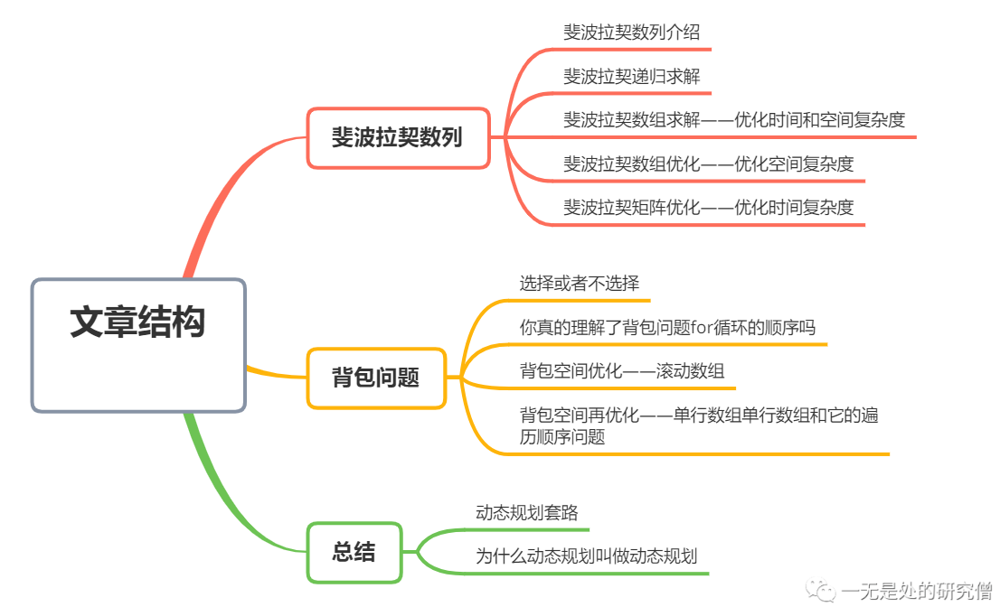

## 斐波拉契数列

斐波拉契数列的定义如下：
$$
F_0 = 0
$$

$$
F_1 = 1
$$

$$
F_n = F_{n - 1} + F_{n- 2}
$$


就是斐波那契数列由0和1开始，之后的斐波那契数就是由之前的两数相加而得出。比如说在斐波拉契数列当中第一个数为0，第二个数为1，因此第三个数为前面两个数之和，因此第三个数为1，同理第四个数是第二个数和第三个数之和，因此第四个数为2，下面就是斐波拉契数的变化：

`0, 1, 1, 2, 3, 5, 8, 13, 21, 34, 55, 89, 144, 233, 377, 610, ....`

## 斐波拉契数列——递归法

**现在我们的问题是要你求第`n`个斐波拉契数**，这个问题还是比较简单的，很容易想到这就是一个可以递归解决的问题，在公式$F_n = F_{n - 1} + F_{n-2}$当中也容易看出应该使用递归。现在要确定的就是递归终止条件。

- 如果`n == 0`则返回0，如果`n == 1`则返回1，这就是递归终止条件。

确定完递归终止条件之后我们很容易写出下面这样的代码：

```java
public class Fibonacci {

  public static int fibonacci(int n) {
    if (n <= 1)
      return n;
    return fibonacci(n - 1) + fibonacci(n - 2);
  }

  public static void main(String[] args) {
    System.out.println(fibonacci(6));
  }
}

```

当我们求第`6`个斐波拉契数的时候，函数`fibonacci`的调用过程如下所示：

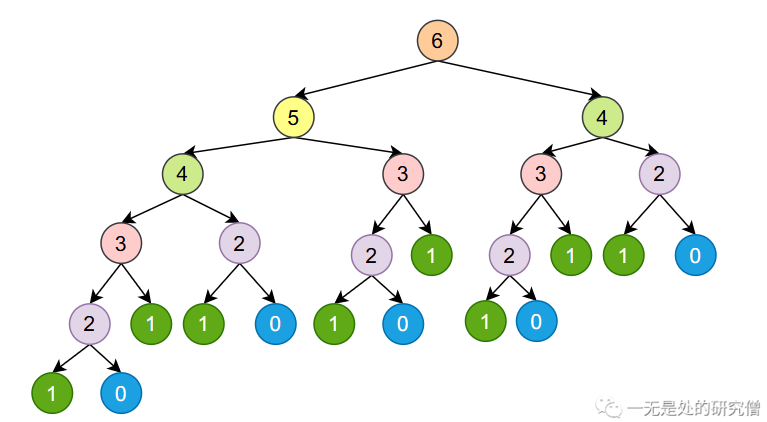

我们在调用`fibonacci(6)`的时候他会调用：`[fibonacci(5)和fibonacci(4)]`，然后`fibonacci(5)`会调用`[fibonacci(4)和fibonacci(3)]`，`fibonacci(4)`会调用`[fibonacci(3)和fibonacci(2)]`......

我们容易发现我们在函数调用的过程当中存在重复，比如下图两个相同的部分表示对`fibonacci(4)`重新计算，因为他们的调用树都是一样的：

这种使用递归的方式计算斐波拉契数列的时间和空间复杂度都是$O(2^n)$。

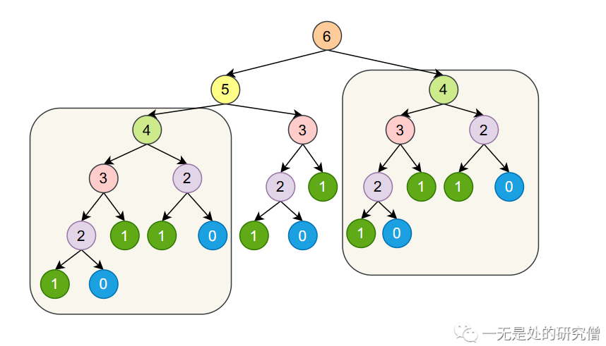

## 斐波拉契数列——数组法优化时间复杂度

既然是重复计算那么我们是否可用避免`重复计算`呢？在计算机一种常见的做法就是`空间换时间`，我们可以将之前计算的数据存下来，比如我们用数组`fib[]`存储我们计算得到的结果，`fib[i] = fibonacci(i) `，那么根据斐波拉契数列的公式我们可以知道：
$$
fib[i] = fib[i - 1] + fib[i - 2], i \ge 2
$$
当我们通过数组存储中间计算的数据的时候，我们应该使用什么样的算法进行计算呢？

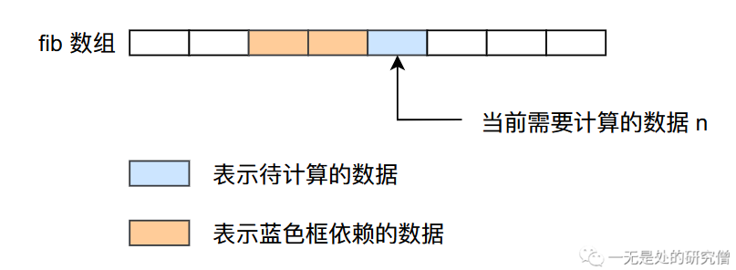

在上面的图片当中比如我们要计算`绿色框`对应的数据，根据公式：
$$
fib[i] = fib[i - 1] + fib[i - 2], i \ge 2
$$
我们知道`绿色框`依赖它前面的两个数据，因此我们在计算`fib[i]`的时候，需要提前将前面两个它依赖的数据计算好，因此我们可以从左至右计算`fib`数组，这样的话我们在计算第`n`个`fib`数的时候前面`n - 1`个`fib`数已经计算好了。

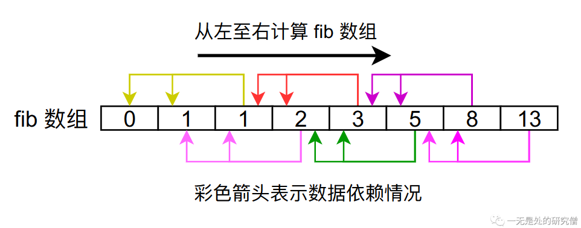

因此我们的代码可以像下面这样：

```java
public static int fibonacci(int n) {
    if (n <= 1)
        return n;
    int[] fib = new int[n + 1];
    // 进行初始化操作
    fib[0] = 0;
    fib[1] = 1;
    // 从前往后遍历得到 fib 数组的结果
    for (int i = 2; i <= n; i++) {
        fib[i] = fib[i - 1] + fib[i - 2];
    }
    return fib[n];
}

```

这种方式我们得到的时间和空间复杂度都降为了`O(n)`。

## 斐波拉契数列——数组法优化空间复杂度

根据上面的分析我们可以知道，我们在计算第`n`个斐波拉契数的时候仅仅依赖它前面的两个数据，因此我们无需用一个数据将所有的数据都保存下来，我们可以只用两个变量保存他前面的两个值即可，然后在进行`for循环`的时候不断进行更新就行了。

```java
public static int fibonacci(int n) {
    if (n <= 1)
        return n;
    // 进行初始化操作
    int a = 0;
    int b = 1;
    int fib = 0;
    // 从前往后遍历得到 fib 的结果
    for (int i = 2; i <= n; i++) {
        fib = a + b;
        a = b;
        b = fib;
    }
    return fib;
}
```

这样我们的时间复杂度为`O(n)`空间复杂度就降低到了`O(1)`。

## 斐波拉契数列——矩阵乘法优化时间复杂度

我们已经知道斐波拉契数列的公式为：
$$
fib[i] = fib[i - 1] + fib[i - 2], i \ge 2
$$

$$
fib[n + 2] = fib[i + 1] + fib[i]
$$

又因为：
$$
fib[n + 1] = fib[n + 1]
$$
根据上面的公式，我们根据矩阵乘法原理可以得到：

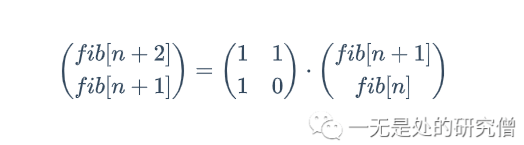

我们将`n - 1`得到：

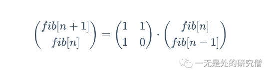

我们不停的对上式最右侧公式进行展开可以得到

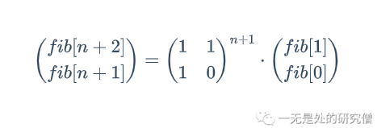

从上式看，我们如果想求`fib[n]`的值，需要计算矩阵的幂，如果我们直接计算的话，时间复杂度为达到`O(n)`，但是我们希望能够将时间复杂度降低到`O(log(n))`。在正式求解矩阵幂之前，我们先思考一个问题，如何在计算$a^n$时将时间复杂度降低到`O(log(n))`。

### 快速计算整数幂

首先我们先明确我们的目标：在计算$a^n$时将时间复杂度降低到`O(log(n))`。这个问题我们可以直接使用一个循环就可以解决，但是时间复杂度为`O(n)`：

```java
  /**
   * 这个函数的目的是求解 base 的 n 次方
   * @param base
   * @param n
   * @return
   */
    public static int pow(int base, int n) {
        int ans = 1;
        for (int i = 0; i < n; i++)
            ans *= base;
        return ans;
    }
```


我们知道计算机在进行运算的时候都是采用`2进制`进行运算，所有的正整数如果是2的整数次幂的话，数据的二进制当中只有一个为为`1`，其余位置为`0`。

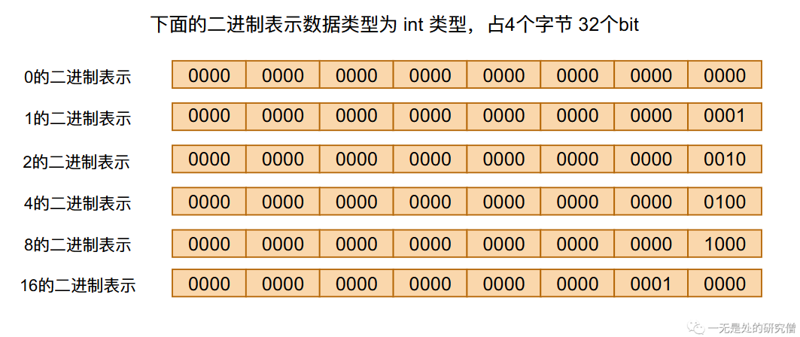

我们知道一个数据用二进制表示只有某些位置为0，某些位置为1，那么一个整数一定可以用若干个整数相加得到，而且这些整数满足2的整数次幂，比如下图中的`7 = 1 + 2 + 4`：

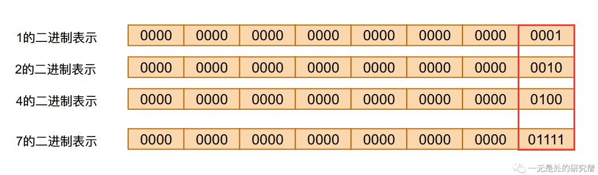

同样的我们需要求解的$2^n$上的`n`也是可以通过加法得到，比如说$2^7 = 2^1 * 2^2 * 2^4 = 2^{(1 + 2 + 4)}$，因此我们可以使用下面的代码进行快速幂的求解：

```java
  /**
   * 这个函数的目的是求解 base 的 n 次方
   * @param base
   * @param n
   * @return
   */
  public static int power(int base, int n) {
    if (n == 0) return 1;
    int ans = 1;
    for (int i = 0; i < n; i++) {
      // 这个右移的目的是查看 n 第i个比特位置上是否为 1 如果为 1 就需要进行乘法运算
      // 这就相当于 ans *= base^i
      if (((n >> i) & 1) == 1) {
        ans *= base; // 这就相当于 幂相加 可以仔细分析上面的 2^7 的运算方式
      }
      // base 的变化情况为 base^1, base^2, base^3, base^4, ...
      // 比如说当 base 为 2 时，base 的变化情况为 1, 2, 4, 8, 16, 32, 64, ...
      base *= base;
    }
    return ans;
  }

```

### 斐波拉契数据列矩阵乘法的快速幂

首先在我们计算当中需要进行一个`2x2`的矩阵乘法运算，首先我们先定义一个简单的`2x2`矩阵乘法运算。


```java
  /**
   * 这里为了简单期间，因为我们的矩阵乘法是 2x2 的
   * 所以可以直接做这样的简单的乘法
   * @param a
   * @param b
   * @return
   */
  public static int[][] matrixMultiply(int[][] a, int[][] b) {
    int[][] ans = new int[2][2];
    ans[0][0] = b[0][0] * a[0][0] + b[0][1] * a[1][0];
    ans[0][1] = b[0][0] * a[0][1] + b[0][1] * a[1][1];
    ans[1][0] = b[1][0] * a[0][0] + b[1][1] * a[1][0];
    ans[1][1] = b[1][0] * a[0][1] + b[1][1] * a[1][1];
    return ans;
  }

```

我们现在来看我们使用矩阵快速幂得到斐波拉契数列的结果：

```java
public static int fibonacci(int n) {
    if (n <= 1) return n;
    // 这个函数的作用是得到前面提到的矩阵的 n 次幂的结果
    int[][] mm = fibMatrixPower(n); // 这个函数的具体实现在下面
    // 根据下图当中的公式容易知道我们最终返回的结果就是 mm[1][0] 因为 fib[1] = 1 fib[0] = 0
    return mm[1][0];
}
```


```java
public static int[][] fibMatrixPower(int n) {
    // 这个矩阵是根据上图我们的公式得到的
    int[][] baseMatrix = \{\}1, 1}, {1, 0}};
    if (n == 1)
        return baseMatrix;
    // 初始化为单位矩阵 如果是整数幂 初始化为 1
    // 这里初始化为单位矩阵的目的是因为单位矩阵和任何矩阵
    // 相乘结果都为原矩阵
    int[][] ans = \{\}1, 0}, {0, 1}};

    for (int i = 0; i < n; i++) {
        // 这个右移的目的是查看 n 对应的位置上是否为 1 如果为 1 就需要进行矩阵乘法运算
        if (((n >> i) & 1) == 1) {
            // 进行矩阵乘法运算 相当于整数幂的时候数值乘法
            ans = matrixMultiply(ans, baseMatrix);
        }
        // 进行矩阵乘法运算求矩阵频发 相当于整数幂的时候数值乘法 求数值的平方
        baseMatrix = matrixMultiply(baseMatrix, baseMatrix);
    }
    return ans;
}

```

以上就是本文关于求解斐波拉契数列的各种方法，完整代码如下：

```java
public class Fibonacci {

  public static int fibonacci1(int n) {
    if (n <= 1)
      return n;
    return fibonacci1(n - 1) + fibonacci1(n - 2);
  }

  public static int fibonacci2(int n) {
    if (n <= 1)
      return n;
    int[] fib = new int[n + 1];
    // 进行初始化操作
    fib[0] = 0;
    fib[1] = 1;
    // 从前往后遍历得到 fib 数组的结果
    for (int i = 2; i <= n; i++) {
      fib[i] = fib[i - 1] + fib[i - 2];
    }
    return fib[n];
  }

  public static int fibonacci3(int n) {
    if (n <= 1)
      return n;
    // 进行初始化操作
    int a = 0;
    int b = 1;
    int fib = 0;
    // 从前往后遍历得到 fib 的结果
    for (int i = 2; i <= n; i++) {
      fib = a + b;
      a = b;
      b = fib;
    }
    return fib;
  }

  /**
   * 这个函数的目的是求解 base 的 n 次方
   * @param base
   * @param n
   * @return
   */
  public static int power(int base, int n) {
    if (n == 0) return 1;
    int ans = 1;
    for (int i = 0; i < n; i++) {
      // 这个右移的目的是查看 n 对应的位置上是否为 1 如果为 1 就需要进行乘法运算
      // 这就相当于 ans *= base^i
      if (((n >> i) & 1) == 1) {
        ans *= base;
      }
      // base 的变化情况为 base^1 base^2 base^3 ...
      // 比如说当 base 为 2 时，base 的变化情况为 1, 2, 4, 8, 16, 32, 64, ...
      base *= base;
    }
    return ans;
  }

  public static int pow(int base, int n) {
    int ans = 1;
    for (int i = 0; i < n; i++)
      ans *= base;
    return ans;
  }

  /**
   * 这里为了简单期间，因为我们的矩阵乘法是 2x2 的
   * 所以可以直接做这样的简单的乘法
   * @param a
   * @param b
   * @return
   */
  public static int[][] matrixMultiply(int[][] a, int[][] b) {
    int[][] ans = new int[2][2];
    ans[0][0] = b[0][0] * a[0][0] + b[0][1] * a[1][0];
    ans[0][1] = b[0][0] * a[0][1] + b[0][1] * a[1][1];
    ans[1][0] = b[1][0] * a[0][0] + b[1][1] * a[1][0];
    ans[1][1] = b[1][0] * a[0][1] + b[1][1] * a[1][1];
    return ans;
  }

  public static int[][] fibMatrixPower(int n) {
    int[][] baseMatrix = \{\}1, 1}, {1, 0}};
    if (n == 1)
      return baseMatrix;
    // 初始化为单位矩阵 如果是整数幂 初始化为 1
    int[][] ans = \{\}1, 0}, {0, 1}};

    for (int i = 0; i < n; i++) {
      // 这个右移的目的是查看 n 对应的位置上是否为 1 如果为 1 就需要进行矩阵乘法运算
      if (((n >> i) & 1) == 1) {
        ans = matrixMultiply(ans, baseMatrix);
      }

      baseMatrix = matrixMultiply(baseMatrix, baseMatrix);
    }

    return ans;
  }

  public static int fibonacci(int n) {
    if (n <= 1) return n;
    int[][] mm = fibMatrixPower(n);
    return mm[1][0];
  }

  public static void main(String[] args) {
    System.out.println(fibonacci1(1));
//    System.out.println(power(2, 8));
//    System.out.println(power(2, 8));
    System.out.println(fibonacci(1));
  }
}
```

## 我们从斐波拉契数列得到了什么

我们现在来重新捋一下我们在上面学习斐波拉契数列的思路：

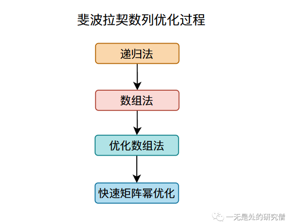

首先我们用于解决斐波拉契数列的方法是`递归法`但是这个方法有一个很大的问题，就是计算某个斐波拉契数的时候它依赖于它前面的斐波拉契数（这个过程相当于将一个大问题划分成若干个小问题），这个依赖会导致我们进行很多重复的运算，为了解决这个问题我们用到了`数组法`，这其实就是一个用空间换时间的方法，用数组将前面计算你的结果存储下来，避免重复计算。

通过分析我们公式，我们发现我们的数据依赖关系，我们在计算某个斐波拉契数的时候只需要依赖它前面的两个斐波拉契数，因此我们不用存储我们计算的每一个斐波拉契数，只需要保存两个值即可，这就是我们`优化数组法`的原理。

最后我们通过`快速矩阵幂`的方法将我们的时间复杂度从`O(n)`降低到了`O(long(n))`，这个方法其实带有一定的技巧性，在大多数动态规划的算法当中我们用不到它，也就是说它的普适性并不强。

从上面的分析我们可以总结我们在使用动态规划时的大致思路：

- 将大问题划分成小问题，小问题继续划分......，学术一点的话说就是重叠子问题。
- **是否存在重复计算，如果存在使用空间换时间的方法进行优化，这是动态规划一个非常重要的点**。
- 是否能够对数组的空间复杂度进行优化。

## 01背包问题

背包问题：有 $N$件物品和一个能够承受重量为 $V$ 的背包。每件物品只能使用一次。第 $i$ 件物品的价值是 $v_i$，重量是 $w_i$。求解将哪些物品装入背包，可使这些物品的总体积不超过背包能够承受的重量，且总价值最大。

比如下面的4个物品，背包能够承受的最大重量为5，我们应该如何选择，使得我们获得的总价值最大：

| 物品 | 重量 | 价值 |
| ---- | ---- | ---- |
| A    | 1    | 2    |
| B    | 2    | 4    |
| C    | 3    | 4    |
| D    | 4    | 5    |

这个问题还是比较简单，我们直接看就知道选择物品B和物品C得到的价值最大。那么我们如何设计一个算法去实现这个问题呢？首先对于每一个物品都有两种情况，选择和不选择，我们需要选择两种情况当中能够获取最大价值的那种情况。

### 选择或者不选择

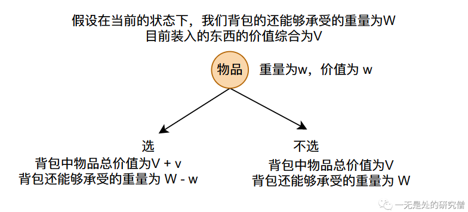

在动态规划当中我们通常通过数组进行求解，在01背包问题当中，我们设置一个数组`dp[i][j]`，表示当我们只使用前`i`个物品（物品编号从0开始，第一个物品的下标为0）且当前剩余能够承受的重量为`j`时，能够获取的最大的价值，那么我们要求解的值为`dp[N - 1][V]`，物品下标从`0`开始。

比如说：`dp[2][3]`表示在本题当中的四个物品`A,B,C,D`当中只选择前面两个物品`A,B`，且背包还能够承受`3`de 重量。

根据上面的分析我们可以得到下面一个动态规划公式：

`dp[i][j] = max(dp[i - 1][j - w] + v, dp[i - 1][j])`，其中`w`和`v`分别表示第`i`个物品的重量和价值。

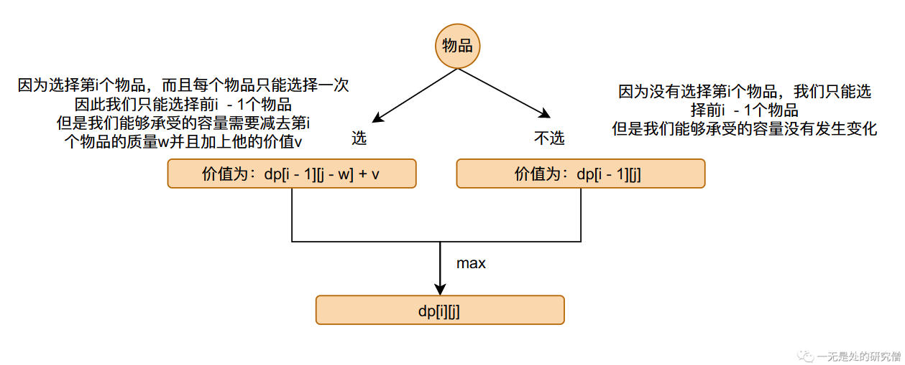

### 你真的理解了背包问题for循环的顺序吗

我们已经得到了我们的动态转移公式`dp[i][j] = max(dp[i - 1][j - w] + v, dp[i - 1][j])`，我们现在了来好好分析这个公式：

我们可以很清楚的看到要想求解`dp[i][j]`的值，我们首先需要知道`dp[i - 1][j - w]`和`dp[i - 1][j]`的值，他们之间的依赖关系可以用下图来表示。


我们在求解`dp[i][j]`的值的时候，首先的需要求出它依赖的数据，当我们在求解第动态规划数组`dp`的第`i`行时，我们首先需要求出第`i - 1`行的值。但是我们在求第`0`行的时候并没有`-1`行，因此我们首先需要进行初始化。`dp[i][j]`的含义是只使用前`i`个物品且承受重量只有`j`时，我们能过获取的最大的价值！！！

那么初始化`dp[0][j]`的含义就是当我们只有第`1`个物品可选择而且背包能够承受的重量为`j`时能够获取的最大的价值，那么我们很容易进行初始化（当`j`大于等于物品的重量的时候可以获取第一个物品的价值，否则获取价值为0，因为只有一个物品，但是背包承受不了它的重量）：

`Java代码实现动态规划`：

```java

import java.util.Scanner;

public class Main {


  public static int backpack(int[] w, int[] v, int V) {
    int N = w.length;
    int[][] dp = new int[N][V + 1];

    // 我们一共有 N 个物品，背包能够承受的重量为 V
    // dp数组就是我们上面提到的动态规划的数组
    // w[i] 就是第 i 个物品的重量
    // v[i] 就是第 i 个物品的价值
    // 进行数组的初始化
    for (int i = w[0]; i < V; ++i) {
      dp[0][i] = v[0];
    }
    for (int i = 1; i < N; ++i) {
      for (int j = 0; j <= V; ++j) {
        if (j >= w[i]) // 只有能够承受物品的重量才能进行选择
          dp[i][j] = Math.max(dp[i - 1][j], dp[i - 1][j - w[i]] + v[i]);
        else
          dp[i][j] = dp[i - 1][j];
      }
    }
    // 返回能够获得的最大的价值
    // 这个式子表明前 N - 1个可选择且我们的背包承受重量为 V 时最大收益
    return dp[N - 1][V];
  }


  public static void main(String[] args) {
    Scanner scanner = new Scanner(System.in);
    int N = scanner.nextInt();
    int V = scanner.nextInt();
    int[] w = new int[N];
    int[] v = new int[N];
    for (int i = 0; i < N; i++) {
      w[i] = scanner.nextInt();
      v[i] = scanner.nextInt();
    }
    System.out.println(backpack(w, v, V));
  }
}

```

`C++代码实现动态规划`

```C++
#include <iostream>
using namespace std;

#define LENTGH 1005
int N, V;
int v[LENTGH];
int w[LENTGH];
int dp[LENTGH][LENTGH];

int backpack() {
	// 我们一共有 N 个物品，背包能够承受的重量为 V
	// dp数组就是我们上面提到的动态规划的数组
	// w[i] 就是第 i 个物品的重量
	// v[i] 就是第 i 个物品的价值
	// 进行数组的初始化
	for (int i = w[0]; i < V; ++i) {
		dp[0][i] = v[0];
	}
	for (int i = 1; i < N; ++i) {
		for (int j = 0; j <= V; ++j) {
			if (j >= w[i]) // 只有能够承受物品的重量才能进行选择
				dp[i][j] = max(dp[i - 1][j], dp[i - 1][j - w[i]] + v[i]);
			else
				dp[i][j] = dp[i - 1][j];
		}
	}
	// 返回能够获得的最大的价值
	// 这个式子表明前 N - 1个可选择且我们的背包承受重量为 V 时最大收益
	return dp[N - 1][V];
}

int main() {
	cin >> N >> V;
	for (int i = 0; i < N; ++i) {
		cin >> w[i] >> v[i];
	}
	cout << backpack();
	return 0;
}
```

我们在上述两份代码当中的`for`循环顺序是遍历所有的物品，然后背包容量从`0`变化到`V`，那么我们背包容量变化能不能从`V`变化到`0`呢？答案是可以的：


从上图看我们在计算第`i`的数据的时候我们只依赖第`i - 1`行，我们在第`i`行从后往前遍历并不会破坏动态转移公式的要求。

下面的代码同样可以是正确的：

```java
public static int backpack(int[] w, int[] v, int V) {
    int N = w.length;
    int[][] dp = new int[N][V + 1];

    // 我们一共有 N 个物品，背包能够承受的重量为 V
    // dp数组就是我们上面提到的动态规划的数组
    // w[i] 就是第 i 个物品的重量
    // v[i] 就是第 i 个物品的价值
    // 进行数组的初始化
    for (int i = w[0]; i < V; ++i) {
        dp[0][i] = v[0];
    }
    for (int i = 1; i < N; ++i) {
        for (int j = V; j >= 0; --j) {
            if (j >= w[i]) // 只有能够承受物品的重量才能进行选择
                dp[i][j] = Math.max(dp[i - 1][j], dp[i - 1][j - w[i]] + v[i]);
            else
                dp[i][j] = dp[i - 1][j];
        }
    }
    // 返回能够获得的最大的价值
    // 这个式子表明前 N - 1个
    return dp[N - 1][V];
}

```

### 背包问题的空间优化——滚动数组

我们在解决背包问的时候我们是开辟了一个二维数组`dp`，那么我们能不能想斐波拉契数列那样降低算法的空间复杂度呢？我们已经很清楚了我们在计算`dp`数据的时候进行计算的时候只使用了两行数据，那么我们只需要申请两行的空间即可，不需要申请那么大的数组空间，计算的时候反复在两行数据当中交替计算既可。比如说我们已经计算好第一行的数据了（初始化），那么我们可以根据第一行得到的结果得到第二行，然后根据第二行，将计算的结结果重新存储到第一行，如此交替反复，像这种方法叫做`滚动数组`。

```java
  public static int backpack(int[] w, int[] v, int V) {
    int N = w.length;
    int[][] dp = new int[2][V + 1];

    // 我们一共有 N 个物品，背包能够承受的重量为 V
    // dp数组就是我们上面提到的动态规划的数组
    // w[i] 就是第 i 个物品的重量
    // v[i] 就是第 i 个物品的价值
    // 进行数组的初始化
    for (int i = w[0]; i < V; ++i) {
      dp[0][i] = v[0];
    }
    for (int i = 1; i < N; ++i) {
      for (int j = V; j >= 0; --j) {
        if (j >= w[i]) // 只有能够承受物品的重量才能进行选择
          dp[i % 2][j] = Math.max(dp[(i - 1) % 2][j],
              dp[(i - 1) % 2][j - w[i]] + v[i]);
        else
          dp[i % 2][j] = dp[(i - 1) % 2][j];
      }
    }
    // 返回能够获得的最大的价值
    // 这个式子表明前 N - 1个
    return dp[(N - 1) % 2][V];
  }

```

### 背包空间再优化——单行数组和它的遍历顺序问题

我们还能继续压缩空间吗🤣？我们在进行空间问题的优化的时候只要不破坏动态转移公式，只需要我们进行的优化能够满足`dp[i][j]`的计算在它所依赖的数据之后计算即可。

```java
public static int backpack(int[] w, int[] v, int V) {
    int N = w.length;
    int[] dp = new int[V + 1];
    // 我们一共有 N 个物品，背包能够承受的重量为 V
    // dp数组就是我们上面提到的动态规划的数组
    // w[i] 就是第 i 个物品的重量
    // v[i] 就是第 i 个物品的价值
    // 进行数组的初始化
    for (int i = w[0]; i < V; ++i) {
        dp[i] = v[0];
    }
    for (int i = 1; i < N; ++i) {
        for (int j = V; j >= w[i]; --j) {
            dp[j] = Math.max(dp[j - w[i]] + v[i], dp[j]);
        }
    }
    return dp[V];
}

```

我们现在来好好分析一下上面的代码：

- 根据动态转移公式`dp[i][j] = max(dp[i - 1][j - w] + v, dp[i - 1][j])`我们知道，第`i`行的数据只依赖第`i - 1`行的前`j`个数据，跟第`j`个数据之后的数据没有关系。因此我们在使用一维数组的时候可以从后往前计算（且只能从后往前计算，如果从前往后计算会破话动态转移公式，因为第`j`个数据跟他前面的数据有依赖关系，跟他后面的数据没有依赖关系）就能够满足我们的动态转移公式。


- 如果我们从在使用单行数组的时候从前往后计算，那么会使得一维数据前面部分数据的状态从`i - 1`行的状态变成第`i`行的状态，像下面这样。


但是一维数组当中后部分的数据还是`i - 1`行的状态，当我们去更新他们的时候他们依赖前面部分数据的`i - 1`行的状态，但是他们已经更新到第`i`的状态了，因此破坏了动态规划的转移方程，但是如果我们从后往前进行遍历那么前面的状态始终是第`i - 1`行的状态，因此没有破坏动态规划的转移方程，因此我们需要从后往前遍历。


## 动态规划总结

### 动态规划的套路

通过仔细分析上面两个算法题，我们可以得到下面的一些心得：

- 动态规划有着时间换空间的特点，这样可以降低算法的时间复杂度。

- 动态规划一般都有重叠子问题，我们需要分析重叠子问题，得到动态转移方程，比如在斐波拉契数列当中的转移方程为`f(i) = f(i - 1) + f(2)`，背包问题的动态转移方程为`dp[i][j] = max(dp[i - 1][j - w] + v, dp[i - 1][j])`。
- 得到转移方程之后，我们需要进行数组的初始化，比如在斐波拉契数列当中我们需要初始化下标为`0`和`1`的数据，在背包问题当中我们要初始化第一行的数据。
- 根据上面得到的信息进行`for`循环操作，运算得到最终的结果。
- 分析是否能够优化空间复杂度。

### 动态规划为什么叫动态规划

学习完以上两个问题之后我们可以通过动态规划的特点去找到这个答案。首先我们需要明白什么是`规划`所谓的`规划 `就是寻找最优值的过程，比如说我们在旅行的时候做规划就是为了又更好旅行体验，而我们在做算法题的时候需要找到最好的结果，比如在背包问题当中我们要找到价值最大的一种选择，这也是一种规划，那为什么是动态的呢？所谓动态就是我们在寻找最优值的过程当中，选择是变化的。比如说对于背包问题的公式`dp[i][j] = max(dp[i - 1][j - w] + v, dp[i - 1][j])`我们在计算出结果之前并不知道那种选择好，因为我们要选择两者中间值较大的哪个选择，这就是动态选择的过程！！！

以上就是本篇文章的所有内容了，希望大家有所收获，我是LeHung，我们下期再见！！！

更多容器设计的内容在项目<https://github.com/Chang-LeHung/CSCore>!!!

关注公众号：一无是处的研究僧，了解更多计算机知识。


