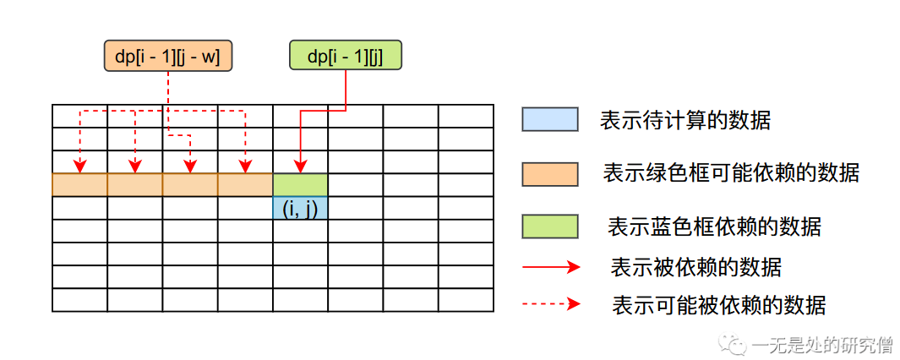
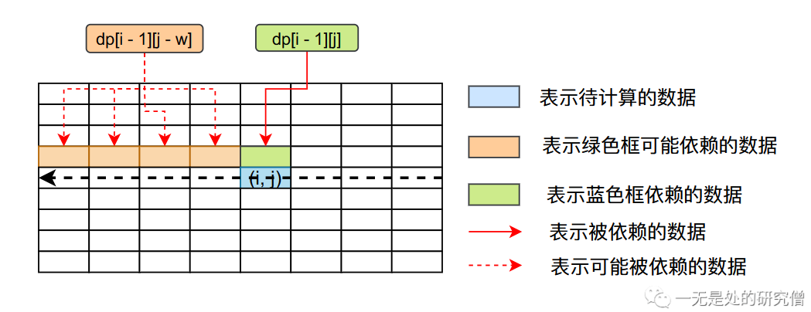
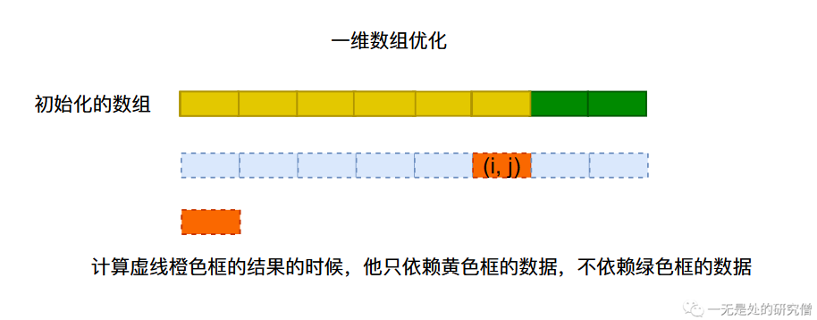
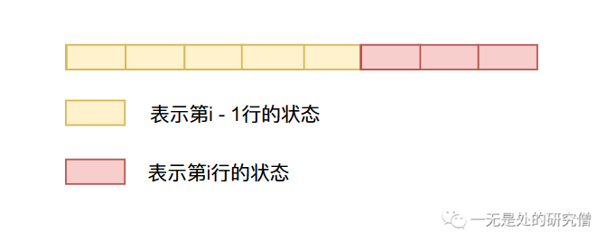

# 你真的懂01背包问题吗？01背包的这几问你能答出来吗？

## 关于01背包的几个问题

- 背包问题的动态转移方程是怎么来的？

- 你能解释背包问题的两个`for`循环的意义嘛？
- 为什么需要两个`for`循环，一个循环行不行？
- 01背包问题的`for`循环一定要从0开始吗？
- 01背包滚动数组的优化原理是什么？
- 01背包只用不用二维数组只用一位数组的依据是什么？

这些问题在阅读完本文之后你将会得到答案！

## 01背包问题介绍

>有 $N$件物品和一个容量是 $V$ 的背包。每件物品只能使用`一次`。第$i$件物品的体积是$v_i$，价值是 $w_i$。求解将哪些物品装入背包，可使这些物品的总体积不超过背包容量，且总价值最大。

比如下面的4个物品，背包能够承受的最大重量为5，我们应该如何选择，使得我们获得的总价值最大：

| 物品 | 重量 | 价值 |
| ---- | ---- | ---- |
| A    | 1    | 2    |
| B    | 2    | 4    |
| C    | 3    | 4    |
| D    | 4    | 5    |

这个问题还是比较简单，我们直接看就知道选择物品B和物品C得到的价值最大。那么我们如何设计一个算法去实现这个问题呢？首先对于每一个物品都有两种情况，选择和不选择，我们需要选择两种情况当中能够获取最大价值的那种情况。

## 01背包问题动态转移方程

首先我么先要确定一个信息就是没件物品只有一件，选完就没有了。如果我们的背包当中还有剩余容量可以放下某个物品，那么对于这个物品我们就有两种选择：`选`或者`不选`。

我们定义数组`dp[i][j]`，其含义是对于前`i`件物品，在我们的背包容量为`j`的情况下我们能够获得的最大的收益，如果我们有`N`件物品，背包容量为`V`，那么我们能够获得的最大价值为`dp[N][V]`，因为他表示的是对于前`N`个物品，在背包容量为`V`的情况下我们能够获取到的最大的价值。我们可以得到下面的公式：
$$
dp[i][j]=max(dp[i - 1][j - v[i]] + w[i], dp[i - 1][j])，如果背包的容量大于等于物品 i 占的体积
$$

$$
dp[i][j]=dp[i - 1][j]，如果背包的容量小于物品 i 占的体积
$$

- 第一种情况（背包容量大于等于第`i`件物品的体积`v[i]`时）：
  -  在这种情况下我们对于第`i`件物品有两种选择，一种是将其放入背包当中，另外一种就是不选他，那么我们就可以使用容量为`j`的背包在前`i-1`件物品进行选择。
  - 如果我们选第`i`件物品，那么我们背包剩下的容量就为`j - v[i]`，我们还能选择的物品就是前`i - 1`个物品，这个情况下能够获得的最大的收益为$dp[i - 1][j - v[i]]$，再加上我们选择的第`i`件物品的价值，我们选择第`i`件物品能够获得的总收益为`dp[i - 1][j - v[i]] + w[i]`。
  - 如果我们不选择第`i`件物品，那么我们背包剩余容量仍然为`j`，而且我们只能从前`i - 1` 个商品当中进行选择，那么我们最大的收益就为`dp[i - 1][j]`。
- 第二种情况（背包容量小于第`i`件物品的体积`v[i]`时）：
  - 这种情况下我们只能够选择前`i - 1`个商品，因此我们能够获取的最大收益为`dp[i - 1][j]`。

## 01背包数据依赖问题分析

在上文当中我们已经分析出来了我们的动态转移方程：
$$
dp[i][j]=max(dp[i - 1][j - v[i]] + w[i], dp[i - 1][j])，如果背包的容量大于等于物品 i 占的体积
$$

$$
dp[i][j]=dp[i - 1][j]，如果背包的容量小于物品 i 占的体积
$$

根据上面两个公式分析，我们知道要想解出`dp[i][j]`的值，我们首先需要知道`dp[i - 1][j - v[i]]`的值和`dp[i - 1][j]`的值，他们之间的依赖关系如下图所示：



基于上面的数据依赖关系，我们知道我们如果想求`dp[N][V]`的值，首先要求出`dp`数组第`N - 1`行的所有的值，因为`dp[N][V]`依赖`dp[N - 1][V]`，而且可能依赖`dp[N - 1][i]`的值（`i`大于等于`0`，小于`V`），而`dp[N - 1][V]`又依赖`dp[N - 2][]V`......

根据上面的分析过程，如果我们想计算出`dp[N][V]`的结果，那就需要从第`1`行开始往后计算，一直算到第`N`行，因此我们可以写出下面的代码：

`Java`版本：

```java

import java.util.Scanner;

public class Main {

  public static int backpack(int[] w, int[] v, int N, int V) {
    int[][] dp = new int[N + 1][V + 1];
    // 初始化
    for (int i = v[1]; i <= V; ++i) {
      dp[1][i] = w[1];
    }
    // 第一行已经初始化 从第二行开始
    for (int i = 2; i <= N; ++i) {
      for (int j = 0; j <= V; ++j) {
        if (j >= v[i])
          dp[i][j] = Math.max(dp[i - 1][j - v[i]] + w[i], dp[i - 1][j]);
        else
          dp[i][j] = dp[i - 1][j];
      }
    }
    return dp[N][V];
  }

  public static void main(String[] args) {
    Scanner scanner = new Scanner(System.in);
    int N = scanner.nextInt();
    int V = scanner.nextInt();
    int[] w = new int[N + 1];
    int[] v = new int[N + 1];
    for (int i = 1; i <= N; i++) {
      v[i] = scanner.nextInt();
      w[i] = scanner.nextInt();
    }
    System.out.println(backpack(w, v, N, V));
  }
}

```

`C++`版本：

```c++

#include <iostream>
using namespace std;

#define L 20000
int w[L]; // 物品价值
int v[L]; // 物品体积
int dp[L][L];

int N; // 物品数量
int V; // 背包的体积

int backpack() {

	// 初始化
	for (int i = v[1]; i <= V; ++i) {
		dp[1][i] = w[1];
	}
	// 第一行已经初始化 从第二行开始
	for (int i = 2; i <= N; ++i) {
		for (int j = 0; j <= V; ++j) {
			if (j >= v[i])
				dp[i][j] = max(dp[i - 1][j - v[i]] + w[i], dp[i - 1][j]);
			else
				dp[i][j] = dp[i - 1][j];
		}
	}
	return dp[N][V];
}

int main() {
	cin >> N >> V;
	for (int i = 1; i <= N; ++i) {
		cin >> v[i] >> w[i];
	}
	cout << backpack();
	return 0;
}

```



从上图看我们在计算第`i`的数据的时候我们只依赖第`i - 1`行，我们在第`i`行从后往前遍历并不会破坏动态转移公式的要求。

因此下面的代码也是正确的：

```java
public static int backpack(int[] w, int[] v, int N, int V) {
    int[][] dp = new int[N + 1][V + 1];
    // 初始化
    for (int i = v[1]; i <= V; ++i) {
        dp[1][i] = w[1];
    }
    // 第一行已经初始化 从第二行开始
    for (int i = 2; i <= N; ++i) {
        // 这里是从末尾到0
        // 前面是从0遍历到末尾
        for (int j = V; j >= 0; --j) {
            if (j >= v[i])
                dp[i][j] = Math.max(dp[i - 1][j - v[i]] + w[i], dp[i - 1][j]);
            else
                dp[i][j] = dp[i - 1][j];
        }
    }
    return dp[N][V];
}
```

## 01背包问题优化——滚动数组

我们在解决背包问的时候我们是开辟了一个二维数组`dp`，那么我们能不能想斐波拉契数列那样降低算法的空间复杂度呢？我们已经很清楚了我们在计算`dp`数据的时候进行计算的时候只使用了两行数据，那么我们只需要申请两行的空间即可，不需要申请那么大的数组空间，计算的时候反复在两行数据当中交替计算既可。比如说我们已经计算好第一行的数据了（初始化），那么我们可以根据第一行得到的结果得到第二行，然后根据第二行，将计算的结结果重新存储到第一行，如此交替反复，像这种方法叫做`滚动数组`。

下面的代码当中`dp`数组是从第0行开始使用的，前面的代码是从第一行开始的。

```java
import java.util.Scanner;

public class Main {


    public static int backpack(int[] v, int[] w, int V) {
      int N = w.length;
      int[][] dp = new int[2][V + 1];
      for (int i = v[0]; i < V; ++i) {
        dp[0][i] = w[0];
      }
      for (int i = 1; i < N; ++i) {
        for (int j = V; j >= 0; --j) {
          if (j >= v[i])
            dp[i % 2][j] = Math.max(dp[(i - 1) % 2][j],
                dp[(i - 1) % 2][j - v[i]] + w[i]);
          else
            dp[i % 2][j] = dp[(i - 1) % 2][j];
        }
      }
      return dp[(N - 1) % 2][V];
  }


  public static void main(String[] args) {
    Scanner scanner = new Scanner(System.in);
    int N = scanner.nextInt();
    int V = scanner.nextInt();
    int[] w = new int[N];
    int[] v = new int[N];
    for (int i = 0; i < N; i++) {
      v[i] = scanner.nextInt();
      w[i] = scanner.nextInt();
    }
    System.out.println(backpack(v, w, V));
  }
}
```

## 背包空间再优化——单行数组和它的遍历顺序问题

我们还能继续压缩空间吗🤣？我们在进行空间问题的优化的时候只要不破坏动态转移公式，只需要我们进行的优化能够满足`dp[i][j]`的计算在它所依赖的数据之后计算即可。

```java
import java.util.Scanner;

public class Main {

  public static int backpack(int[] v, int[] w, int V) {
    int N = w.length;
    int[] dp = new int[V + 1];
    for (int i = v[0]; i < V; ++i) {
      dp[i] = w[0];
    }
    for (int i = 1; i < N; ++i) {
      for (int j = V; j >= v[i]; --j) {
        dp[j] = Math.max(dp[j - v[i]] + w[i], dp[j]);
      }
    }
    return dp[V];
  }

  public static void main(String[] args) {
    Scanner scanner = new Scanner(System.in);
    int N = scanner.nextInt();
    int V = scanner.nextInt();
    int[] w = new int[N];
    int[] v = new int[N];
    for (int i = 0; i < N; i++) {
      v[i] = scanner.nextInt();
      w[i] = scanner.nextInt();
    }
    System.out.println(backpack(v, w, V));
  }
}

```

我们现在来好好分析一下上面的代码：

- 根据动态转移公式`dp[i][j] = max(dp[i - 1][j - v[i]] + w[i], dp[i - 1][j])`我们知道，第`i`行的第`j`个数据只依赖第`i - 1`行的前`j`个数据，跟第`j`个数据之后的数据没有关系。因此我们在使用一维数组的时候可以从后往前计算（且只能从后往前计算，如果从前往后计算会破坏动态转移公式，因为第`j`个数据跟他前面的数据有依赖关系，跟他后面的数据没有依赖关系）就能够满足我们的动态转移公式。



- 如果我们从在使用单行数组的时候从前往后计算，那么会使得一维数据前面部分数据的状态从`i - 1`行的状态变成第`i`行的状态，像下面这样。


但是一维数组当中后部分的数据还是`i - 1`行的状态，当我们去更新他们的时候他们依赖前面部分数据的`i - 1`行的状态，但是他们已经更新到第`i`的状态了，因此破坏了动态规划的转移方程，但是如果我们从后往前进行遍历那么前面的状态始终是第`i - 1`行的状态，因此没有破坏动态规划的转移方程，因此我们需要从后往前遍历。



## 问题答案

如果你已经看懂上面所谈论到的内容的话，关于前面的几个问题相信你已经有了答案。上面那些问题最终涉及到的就是01背包问题的动态转移方程了，我们在写代码的时候一定不能破坏动态转移方程，也就是要满足动态转移方程的依赖关系，即第`i`行的第`j`个数据只依赖第`i - 1`行的前`j`个数据，跟第`j`个数据之后的数据没有关系。

- 背包问题的两个`for`循环的意义：
  - 因为我们需要解出`dp`数组当中第`N`行第`V`列的数据，所以我们需要解出二维数组当中所有的数据，因此我们需要进行二维数组的遍历，进行一维遍历不行。
- 01背包问题的`for`循环一定要从0开始吗？
  - 不一定，我们只需要满足动态转移方程的数据依赖要求就行，不管是从前往后还是从后往前我们在使用二维`dp`数组的遍历的时候都可以满足数据依赖的要求。但是我们如果使用一维数组的时候就一定要从后往前遍历，因为如果从前往后遍历，第`i`行状态会覆盖第`i - 1`行的状态，而数组后面的数据需要`i - 1`行状态的数据，而它有被覆盖了因此不行。
- 其余问题的答案在阅读完本文之后相信你心里已经很清楚了！！！

## 动态规划为什么叫动态规划

首先我们需要明白什么是`规划`所谓的`规划 `就是寻找最优值的过程，比如说我们在旅行的时候做规划就是为了又更好旅行体验，而我们在做算法题的时候需要找到最好的结果，比如在背包问题当中我们要找到价值最大的一种选择，这也是一种规划，那为什么是动态的呢？所谓动态就是我们在寻找最优值的过程当中，选择是变化的。比如说对于背包问题的公式`dp[i][j] = max(dp[i - 1][j - v[i] + w[i], dp[i - 1][j])`我们在计算出结果之前并不知道那种选择好，因为我们要选择两者中间值较大的哪个选择，这就是动态选择的过程！所以动态规划被称作动态规划！

---

以上就是本篇文章的所有内容了，希望大家有所收获，我是LeHung，我们下期再见！！！

更多精彩内容合集课访问项目：<https://github.com/Chang-LeHung/CSCore>

关注公众号：一无是处的研究僧，了解更多计算机（Java、Python、计算机系统基础、算法与数据结构）知识。


