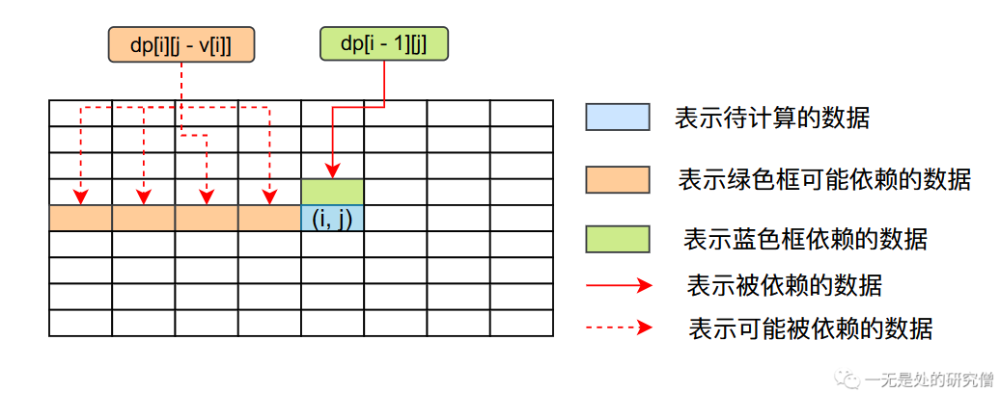

# 面试官：完全背包都不会，是你自己走还是我送你？

## 完全背包问题

>有$N$种物品和一个容量是 $V$的背包，每种物品都有**无限件可用**。第$i$ 种物品的体积是 $v_i$，价值是$w_i$。求解将哪些物品装入背包，可使这些物品的总体积不超过背包容量，且总价值最大。

完全背包问题和01背包的唯一区别就在于物品的个数，在01背包当中所有的物品只有一件，也就只能使用一次。而在完全背包当中物品可以使用无限多次。

## 完全背包问题分析

### 01背包动态转移方程分析

在01背包问题当中，我们是使用一个二维数组`dp[i][j]`进行计算，`dp[i][j]`表示在只使用前`i`个物品且背包容量为`j`的情况下，我们能够获得的最大的收益。在这个情况下，我们根据当前背包容量`j`判断是否能装入第`i`个物品可以得到下面两个方程（下面公式字母的含义与上文完全背包问题所提到的一致）。
$$
dp[i][j] = \begin{cases}
max(dp[i - 1][j - v[i]] + w[i], dp[i - 1][j]), j \ge v[i]\\
dp[i - 1][j] , j \lt v[i]
\end{cases}
$$
上面01背包的公式的第二条比较简单，如果背包容量不足以容纳第`i`件物品，那么只能从前`i - 1`物品当中选择了。我们来仔细分析一下第一条公式。

如果当前背包容量可以容纳第`i`个物品，那么我们就可以选择第`i`件物品或者不选择，我们应该选择两种选择当中收益更大的那个。

- 如果我们不选择第`i`个物品，那么我们就能够使用容量为`j`的背包去选择前`i - 1`个物品，这种情况下我们的最大收益为`dp[i - 1][j]`。
- 如果选择第`i`个物品，那么我们背包容量还剩下`j - v[i]`，还可以选择剩下的`i - 1`个物品，而且我们的收益需要加上`w[i]`，因此我们的收益为`dp[i - 1][j - v[i]] + w[i], dp[i - 1][j])`。

### 完全背包动态转移方程分析

和01背包问题一样首先对于第`i`个物品，首先需要判断背包是否能够容纳：

- 如果背包的容量大于等于第`i`个物品的体积，那我们就有两种选择：
  - 将第`i`个物品放入背包当中，但是在这里需要注意的一点是完全背包的物品有无数件，因此当我们选择之后我们的转移方程为`dp[i][j - v[i]] + w[i]`，这里不是`i-1`而是`i`，因为第`i`件物品有无数件。
  - 不将第`i`个物品放入背包当中，那么我们就能够使用容量为`j`的背包去选择前`i - 1`个物品，这种情况下我们的最大收益为`dp[i - 1][j]`。
- 如果背包容量小于第`i`件物品的体积，我们就不能够选择第`i`件物品了，这种情况下我们的最大收益为`dp[i - 1][j]`。

基于上面的分析我们可以知道完全背包问题的动态转移方程为：
$$
dp[i][j] = \begin{cases}
max(dp[i][j - v[i]] + w[i], dp[i - 1][j]), j \ge v[i]\\
dp[i - 1][j] , j \lt v[i]
\end{cases}
$$

## 代码分析

根据对动态转移方程的分析，我们可以知道，我们在计算`dp[i][j]`这个数据的值的时候，我们首先需要将`dp[i][j - v[i]]`和`dp[i - 1][j])`的结果计算出来，因为`dp[i][j]`依赖这两个数据。

