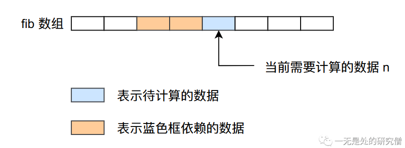
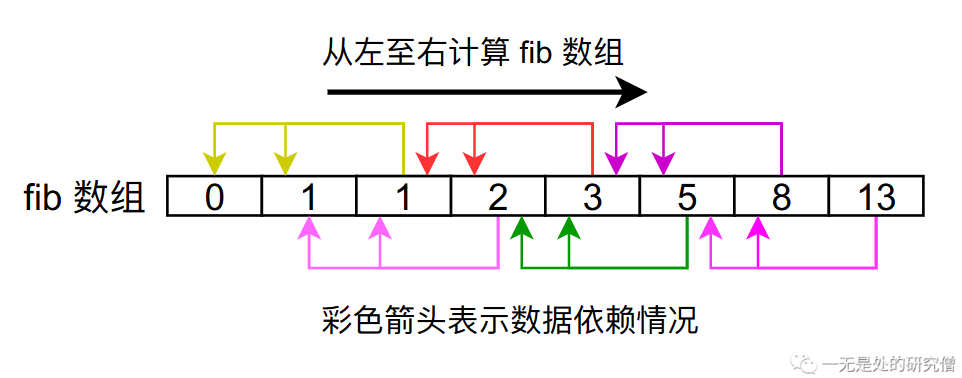
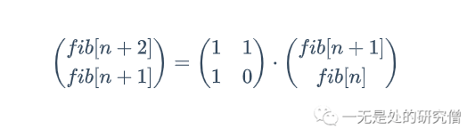
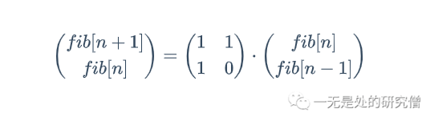
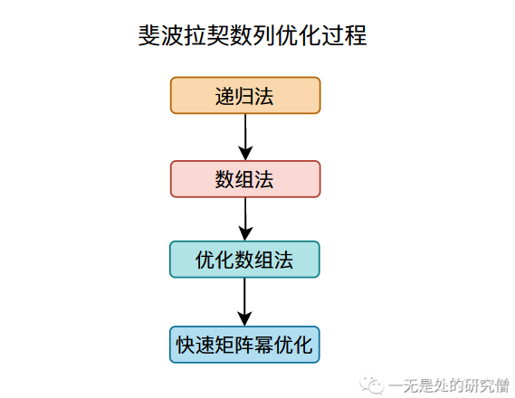

# 深入剖析斐波拉契数列

## 前言

动态规划作为一种非常经典的一类算法，不仅在解决实际问题当中有很多实际的应用，同时通常也是面试的一个重点。本篇文章一步步剖析动态规划的基本原理，通过`斐波拉契数列问题`（优化时间复杂度从$O(2^n)$到`O(n)`再到`O(log(n))`）一步一步带你从最基本的原理弄懂动态规划。我们首先分析斐波拉契数列问题，然后在分析问题的时候慢慢的深入动态规划。

## 斐波拉契数列

斐波拉契数列的定义如下：
$$
F_0 = 0
$$

$$
F_1 = 1
$$

$$
F_n = F_{n - 1} + F_{n- 2}
$$


就是斐波那契数列由0和1开始，之后的斐波那契数就是由之前的两数相加而得出。比如说在斐波拉契数列当中第一个数为0，第二个数为1，因此第三个数为前面两个数之和，因此第三个数为1，同理第四个数是第二个数和第三个数之和，因此第四个数为2，下面就是斐波拉契数的变化：

`0, 1, 1, 2, 3, 5, 8, 13, 21, 34, 55, 89, 144, 233, 377, 610, ....`

## 斐波拉契数列——递归法

**现在我们的问题是要你求第`n`个斐波拉契数**，这个问题还是比较简单的，很容易想到这就是一个可以递归解决的问题，在公式$F_n = F_{n - 1} + F_{n-2}$当中也容易看出应该使用递归。现在要确定的就是递归终止条件。

- 如果`n == 0`则返回0，如果`n == 1`则返回1，这就是递归终止条件。

确定完递归终止条件之后我们很容易写出下面这样的代码：

```java
public class Fibonacci {

  public static int fibonacci(int n) {
    if (n <= 1)
      return n;
    return fibonacci(n - 1) + fibonacci(n - 2);
  }

  public static void main(String[] args) {
    System.out.println(fibonacci(6));
  }
}

```

当我们求第`6`个斐波拉契数的时候，函数`fibonacci`的调用过程如下所示：


我们在调用`fibonacci(6)`的时候他会调用：`[fibonacci(5)和fibonacci(4)]`，然后`fibonacci(5)`会调用`[fibonacci(4)和fibonacci(3)]`，`fibonacci(4)`会调用`[fibonacci(3)和fibonacci(2)]`......

我们容易发现我们在函数调用的过程当中存在重复，比如下图两个相同的部分表示对`fibonacci(4)`重新计算，因为他们的调用树都是一样的：

这种使用递归的方式计算斐波拉契数列的时间和空间复杂度都是$O(2^n)$。


## 斐波拉契数列——数组法优化时间复杂度

既然是重复计算那么我们是否可用避免`重复计算`呢？在计算机一种常见的做法就是`空间换时间`，我们可以将之前计算的数据存下来，比如我们用数组`fib[]`存储我们计算得到的结果，`fib[i] = fibonacci(i) `，那么根据斐波拉契数列的公式我们可以知道：
$$
fib[i] = fib[i - 1] + fib[i - 2], i \ge 2
$$
当我们通过数组存储中间计算的数据的时候，我们应该使用什么样的算法进行计算呢？



在上面的图片当中比如我们要计算`绿色框`对应的数据，根据公式：
$$
fib[i] = fib[i - 1] + fib[i - 2], i \ge 2
$$
我们知道`绿色框`依赖它前面的两个数据，因此我们在计算`fib[i]`的时候，需要提前将前面两个它依赖的数据计算好，因此我们可以从左至右计算`fib`数组，这样的话我们在计算第`n`个`fib`数的时候前面`n - 1`个`fib`数已经计算好了。



因此我们的代码可以像下面这样：

```java
public static int fibonacci(int n) {
    if (n <= 1)
        return n;
    int[] fib = new int[n + 1];
    // 进行初始化操作
    fib[0] = 0;
    fib[1] = 1;
    // 从前往后遍历得到 fib 数组的结果
    for (int i = 2; i <= n; i++) {
        fib[i] = fib[i - 1] + fib[i - 2];
    }
    return fib[n];
}

```

这种方式我们得到的时间和空间复杂度都降为了`O(n)`。

## 斐波拉契数列——数组法优化空间复杂度

根据上面的分析我们可以知道，我们在计算第`n`个斐波拉契数的时候仅仅依赖它前面的两个数据，因此我们无需用一个数据将所有的数据都保存下来，我们可以只用两个变量保存他前面的两个值即可，然后在进行`for循环`的时候不断进行更新就行了。

```java
public static int fibonacci(int n) {
    if (n <= 1)
        return n;
    // 进行初始化操作
    int a = 0;
    int b = 1;
    int fib = 0;
    // 从前往后遍历得到 fib 的结果
    for (int i = 2; i <= n; i++) {
        fib = a + b;
        a = b;
        b = fib;
    }
    return fib;
}
```

这样我们的时间复杂度为`O(n)`空间复杂度就降低到了`O(1)`。

## 斐波拉契数列——矩阵乘法优化时间复杂度

我们已经知道斐波拉契数列的公式为：
$$
fib[i] = fib[i - 1] + fib[i - 2], i \ge 2
$$

$$
fib[n + 2] = fib[i + 1] + fib[i]
$$

又因为：
$$
fib[n + 1] = fib[n + 1]
$$
根据上面的公式，我们根据矩阵乘法原理可以得到：



我们将`n - 1`得到：



我们不停的对上式最右侧公式进行展开可以得到


从上式看，我们如果想求`fib[n]`的值，需要计算矩阵的幂，如果我们直接计算的话，时间复杂度为达到`O(n)`，但是我们希望能够将时间复杂度降低到`O(log(n))`。在正式求解矩阵幂之前，我们先思考一个问题，如何在计算$a^n$时将时间复杂度降低到`O(log(n))`。

### 快速计算整数幂

首先我们先明确我们的目标：在计算$a^n$时将时间复杂度降低到`O(log(n))`。这个问题我们可以直接使用一个循环就可以解决，但是时间复杂度为`O(n)`：

```java
  /**
   * 这个函数的目的是求解 base 的 n 次方
   * @param base
   * @param n
   * @return
   */
    public static int pow(int base, int n) {
        int ans = 1;
        for (int i = 0; i < n; i++)
            ans *= base;
        return ans;
    }
```


我们知道计算机在进行运算的时候都是采用`2进制`进行运算，所有的正整数如果是2的整数次幂的话，数据的二进制当中只有一个为为`1`，其余位置为`0`。


我们知道一个数据用二进制表示只有某些位置为0，某些位置为1，那么一个整数一定可以用若干个整数相加得到，而且这些整数满足2的整数次幂，比如下图中的`7 = 1 + 2 + 4`：


同样的我们需要求解的$2^n$上的`n`也是可以通过加法得到，比如说$2^7 = 2^1 * 2^2 * 2^4 = 2^{(1 + 2 + 4)}$，因此我们可以使用下面的代码进行快速幂的求解：

```java
  /**
   * 这个函数的目的是求解 base 的 n 次方
   * @param base
   * @param n
   * @return
   */
  public static int power(int base, int n) {
    if (n == 0) return 1;
    int ans = 1;
    for (int i = 0; i < n; i++) {
      // 这个右移的目的是查看 n 第i个比特位置上是否为 1 如果为 1 就需要进行乘法运算
      // 这就相当于 ans *= base^i
      if (((n >> i) & 1) == 1) {
        ans *= base; // 这就相当于 幂相加 可以仔细分析上面的 2^7 的运算方式
      }
      // base 的变化情况为 base^1, base^2, base^3, base^4, ...
      // 比如说当 base 为 2 时，base 的变化情况为 1, 2, 4, 8, 16, 32, 64, ...
      base *= base;
    }
    return ans;
  }

```

### 斐波拉契数据列矩阵乘法的快速幂

首先在我们计算当中需要进行一个`2x2`的矩阵乘法运算，首先我们先定义一个简单的`2x2`矩阵乘法运算。


```java
  /**
   * 这里为了简单期间，因为我们的矩阵乘法是 2x2 的
   * 所以可以直接做这样的简单的乘法
   * @param a
   * @param b
   * @return
   */
  public static int[][] matrixMultiply(int[][] a, int[][] b) {
    int[][] ans = new int[2][2];
    ans[0][0] = b[0][0] * a[0][0] + b[0][1] * a[1][0];
    ans[0][1] = b[0][0] * a[0][1] + b[0][1] * a[1][1];
    ans[1][0] = b[1][0] * a[0][0] + b[1][1] * a[1][0];
    ans[1][1] = b[1][0] * a[0][1] + b[1][1] * a[1][1];
    return ans;
  }

```

我们现在来看我们使用矩阵快速幂得到斐波拉契数列的结果：

```java
public static int fibonacci(int n) {
    if (n <= 1) return n;
    // 这个函数的作用是得到前面提到的矩阵的 n 次幂的结果
    int[][] mm = fibMatrixPower(n); // 这个函数的具体实现在下面
    // 根据下图当中的公式容易知道我们最终返回的结果就是 mm[1][0] 因为 fib[1] = 1 fib[0] = 0
    return mm[1][0];
}
```


```java
public static int[][] fibMatrixPower(int n) {
    // 这个矩阵是根据上图我们的公式得到的
    int[][] baseMatrix = {{1, 1}, {1, 0}};
    if (n == 1)
        return baseMatrix;
    // 初始化为单位矩阵 如果是整数幂 初始化为 1
    // 这里初始化为单位矩阵的目的是因为单位矩阵和任何矩阵
    // 相乘结果都为原矩阵
    int[][] ans = {{1, 0}, {0, 1}};

    for (int i = 0; i < n; i++) {
        // 这个右移的目的是查看 n 对应的位置上是否为 1 如果为 1 就需要进行矩阵乘法运算
        if (((n >> i) & 1) == 1) {
            // 进行矩阵乘法运算 相当于整数幂的时候数值乘法
            ans = matrixMultiply(ans, baseMatrix);
        }
        // 进行矩阵乘法运算求矩阵频发 相当于整数幂的时候数值乘法 求数值的平方
        baseMatrix = matrixMultiply(baseMatrix, baseMatrix);
    }
    return ans;
}

```

以上就是本文关于求解斐波拉契数列的各种方法，完整代码如下：

```java
public class Fibonacci {

  public static int fibonacci1(int n) {
    if (n <= 1)
      return n;
    return fibonacci1(n - 1) + fibonacci1(n - 2);
  }

  public static int fibonacci2(int n) {
    if (n <= 1)
      return n;
    int[] fib = new int[n + 1];
    // 进行初始化操作
    fib[0] = 0;
    fib[1] = 1;
    // 从前往后遍历得到 fib 数组的结果
    for (int i = 2; i <= n; i++) {
      fib[i] = fib[i - 1] + fib[i - 2];
    }
    return fib[n];
  }

  public static int fibonacci3(int n) {
    if (n <= 1)
      return n;
    // 进行初始化操作
    int a = 0;
    int b = 1;
    int fib = 0;
    // 从前往后遍历得到 fib 的结果
    for (int i = 2; i <= n; i++) {
      fib = a + b;
      a = b;
      b = fib;
    }
    return fib;
  }

  /**
   * 这个函数的目的是求解 base 的 n 次方
   * @param base
   * @param n
   * @return
   */
  public static int power(int base, int n) {
    if (n == 0) return 1;
    int ans = 1;
    for (int i = 0; i < n; i++) {
      // 这个右移的目的是查看 n 对应的位置上是否为 1 如果为 1 就需要进行乘法运算
      // 这就相当于 ans *= base^i
      if (((n >> i) & 1) == 1) {
        ans *= base;
      }
      // base 的变化情况为 base^1 base^2 base^3 ...
      // 比如说当 base 为 2 时，base 的变化情况为 1, 2, 4, 8, 16, 32, 64, ...
      base *= base;
    }
    return ans;
  }

  public static int pow(int base, int n) {
    int ans = 1;
    for (int i = 0; i < n; i++)
      ans *= base;
    return ans;
  }

  /**
   * 这里为了简单期间，因为我们的矩阵乘法是 2x2 的
   * 所以可以直接做这样的简单的乘法
   * @param a
   * @param b
   * @return
   */
  public static int[][] matrixMultiply(int[][] a, int[][] b) {
    int[][] ans = new int[2][2];
    ans[0][0] = b[0][0] * a[0][0] + b[0][1] * a[1][0];
    ans[0][1] = b[0][0] * a[0][1] + b[0][1] * a[1][1];
    ans[1][0] = b[1][0] * a[0][0] + b[1][1] * a[1][0];
    ans[1][1] = b[1][0] * a[0][1] + b[1][1] * a[1][1];
    return ans;
  }

  public static int[][] fibMatrixPower(int n) {
    int[][] baseMatrix = {{1, 1}, {1, 0}};
    if (n == 1)
      return baseMatrix;
    // 初始化为单位矩阵 如果是整数幂 初始化为 1
    int[][] ans = {{1, 0}, {0, 1}};

    for (int i = 0; i < n; i++) {
      // 这个右移的目的是查看 n 对应的位置上是否为 1 如果为 1 就需要进行矩阵乘法运算
      if (((n >> i) & 1) == 1) {
        ans = matrixMultiply(ans, baseMatrix);
      }

      baseMatrix = matrixMultiply(baseMatrix, baseMatrix);
    }

    return ans;
  }

  public static int fibonacci(int n) {
    if (n <= 1) return n;
    int[][] mm = fibMatrixPower(n);
    return mm[1][0];
  }

  public static void main(String[] args) {
    System.out.println(fibonacci1(1));
//    System.out.println(power(2, 8));
//    System.out.println(power(2, 8));
    System.out.println(fibonacci(1));
  }
}
```

## 我们从斐波拉契数列得到了什么

我们现在来重新捋一下我们在上面学习斐波拉契数列的思路：



首先我们用于解决斐波拉契数列的方法是`递归法`但是这个方法有一个很大的问题，就是计算某个斐波拉契数的时候它依赖于它前面的斐波拉契数（这个过程相当于将一个大问题划分成若干个小问题），这个依赖会导致我们进行很多重复的运算，为了解决这个问题我们用到了`数组法`，这其实就是一个用空间换时间的方法，用数组将前面计算你的结果存储下来，避免重复计算。

通过分析我们公式，我们发现我们的数据依赖关系，我们在计算某个斐波拉契数的时候只需要依赖它前面的两个斐波拉契数，因此我们不用存储我们计算的每一个斐波拉契数，只需要保存两个值即可，这就是我们`优化数组法`的原理。

最后我们通过`快速矩阵幂`的方法将我们的时间复杂度从`O(n)`降低到了`O(long(n))`，这个方法其实带有一定的技巧性，在大多数动态规划的算法当中我们用不到它，也就是说它的普适性并不强。

从上面的分析我们可以总结我们在使用动态规划时的大致思路：

- 将大问题划分成小问题，小问题继续划分......，学术一点的话说就是重叠子问题。
- **是否存在重复计算，如果存在使用空间换时间的方法进行优化，这是动态规划一个非常重要的点**。
- 是否能够对数组的空间复杂度进行优化。

## 总结

本篇文章主要给大家介绍的**多重背包问题**的二进制优化，里面的逻辑还是稍微有点复杂的，可能需要大家仔细去体会，大家在看文字的时候可以参考代码仔细分析，可以理解的更好一点。

以上就是本篇文章的所有内容了，希望大家有所收获，我是LeHung，我们下期再见！！！（记得**点赞**收藏哦！）

---

更多精彩内容合集可访问项目：<https://github.com/Chang-LeHung/CSCore>

关注公众号：一无是处的研究僧，了解更多计算机（Java、Python、计算机系统基础、算法与数据结构）知识。


