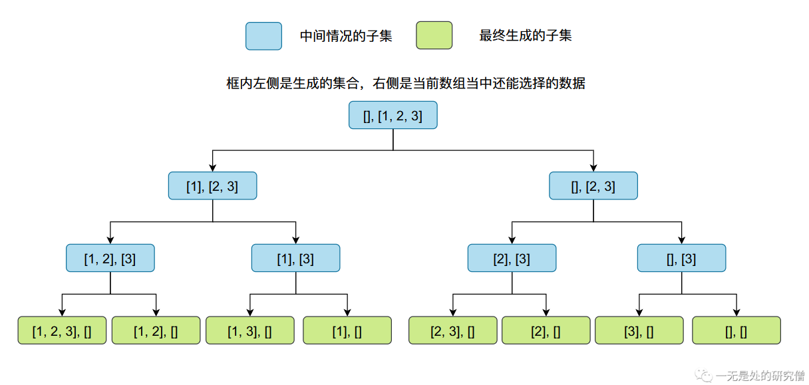
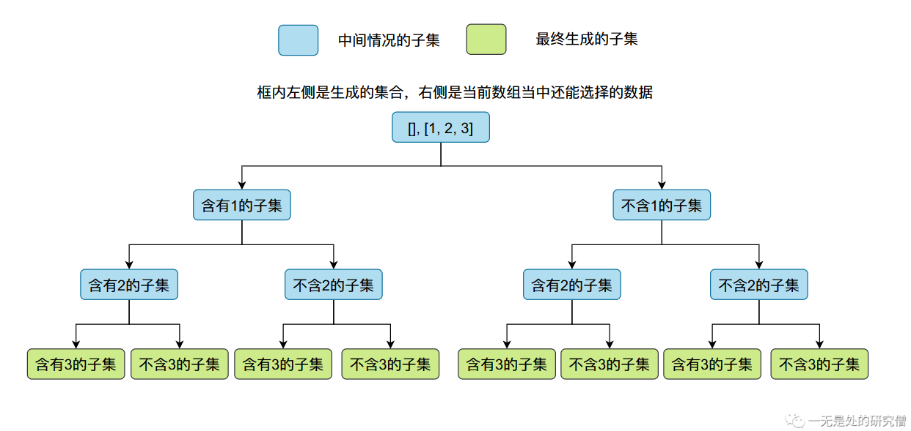

# 01背包面试题系列（一）

## 题目描述——[分割等和子集](https://leetcode.cn/problems/partition-equal-subset-sum/)

>给你一个 **只包含正整数** 的 **非空** 数组 `nums` 。请你判断是否可以将这个数组分割成两个子集，使得两个子集的元素和相等。
>
>**示例 1：**
>
>```java
>输入：nums = [1,5,11,5]
>输出：true
>解释：数组可以分割成 [1, 5, 5] 和 [11] 。
>```
>
>**示例 2：**
>
>```
>输入：nums = [1,2,3,5]
>输出：false
>解释：数组不能分割成两个元素和相等的子集。
>```

## 01背包动态规划求解

上面的问题乍一看好像是一个子集划分的问题，我们可能根据数据`nums`得到它的所有的子集，然后将所有的自己加起来看看是否存在一个子集的数据的和等于`nums`数组所有数据的和的一半，其实我们确实可以这样做，我们将在后文当中仔细探讨这个方法。

那么我们改如何使用**01背包**去解决这个问题呢？我们首先先回顾一下**01背包**解决了什么问题：

>有 $N$件物品和一个容量是 $V$ 的背包。每件物品只能使用`一次`。第$i$件物品的体积是$v_i$，价值是 $w_i$。求解将哪些物品装入背包，可使这些物品的总体积不超过背包容量，且总价值最大。

**01背包**就是给定一定容量的背包，看他能够装入物品的最大的价值。那么我们该如何将上述问题转化成**01背包**呢？

我们可以这样，将`nums`数组当中的数值变成物品对应的价值和体积，比如说`nums = [1, 2, 3]`，我们就可以分成三个物品，这三个物品的体积和价值分别是`1和1`、`2和2`和`3和3`，我们背包的容量为`V = (1 + 2 + 3) / 2`。我们将`nums`数组当中所有数据和的一半作为背包的容量，`nums`当中的数值就表示每一个物品的价值和体积，而且价值和体积都相等，如果我们能够恰好装满背包就说明，存在一种物品的组合他的和为`nums`数组当中数据的和的一半。

那么我们该如何判断背包被恰好装满呢？我们知道背包问题求解的只是在背包容量一定的情况下，我们能够获取的最大的价值是多少，因此好像不能够判断背包是否装满！但是在上面转化的过程当中物品的体积和价值是相等的，因为我们可以根据我们获得的最大价值判断，如果我们最终得到的收益等于背包的容量，那么说明背包被填满了，也就是存在一种物品的组合我们能够获取的最大的价值等于数组当中数据和的一半。因为物品的价值和体积相等，因此把背包填满和获取最大价值是等价的。

因此根据上面的分析，如果我们想用01背包去解决这个问题，我们可以将背包容量设置为`nums`数组当中数据和的一半，物品的个数为数组的长度，物品的价值和体积为数组当中对应位置的值，然后进行01背包求解即可。

如果你还不是很了解01背包的话，可以先看[这篇文章](https://mp.weixin.qq.com/s?__biz=Mzg3ODgyNDgwNg==&mid=2247484416&idx=1&sn=d8aa70bc642c94a127ea67409808980f&chksm=cf0c9809f87b111f2fb092adba83da7e5463a8f5eaa92914ddb975065428a1a80a7d6bc53f3a&token=883596793&lang=zh_CN#rd)，该文章主要从0开始介绍了01背包问题，从二维数组到滚动数组再到一维数组，优化过程层层递进，带你从原理到实战完全掌握01背包问题。

因此我们的代码如下（一维数组优化）：

```java
class Solution {
  public boolean canPartition(int[] nums) {
    int sum = 0;
    for (int num : nums) {
      sum += num;
    }
    if ((sum & 1) == 1) return false;
    int t = sum / 2;
    int[] dp = new int[t + 1];
    for (int i = 0; i < nums.length; i++) {
      for (int j = t; j >= nums[i]; j--) {
        dp[j] = Math.max(dp[j], dp[j - nums[i]] + nums[i]);
      }
    }
    return dp[t] == t;
  }
}
```

## 子集划分求解

我们知道任何一个集合的子集个数为$2^n$，其中$n$表示集合当中数据的个数，比如说集合${1, 2}$有如下子集（4个）：
$$
\{空集\}, \{1\}, \{2\}, \{1, 2\}
$$
我们先思考一下$2^n$是怎么计算出来的！我们在生成子集的时候对于每一个数据都有选择和不选择两种情况，这其实就变成了一个排列组合问题。在上面的例子当中1可选可不选（2），2可选可不选（2），因此总的集合个数为4，那么如果有n个数据的集合那么自己个数就等于：
$$
2\times2\times2 \cdots = 2^n
$$
这个选择情况的划分如下图所示：





而我们使用程序去计算一个集合的子集其实就是一个回溯的问题，分割等和子集的子集划分的代码如下：

```java
public class Solution {
    private int target;
    public boolean canPartition(int[] nums) {

        int sum = 0;
        for (int num : nums) {
            sum += num;
        }
        if ((sum & 1) == 1 ) return false;
        // 我们最终的目标就是找到一个自己的和等于这个数
        target = sum / 2;
        return backTrace(-1, 0, nums);
    }

    /**
   * @param curIndex 表示当前遍历的数组的位置
   * @param curSum   当前集合所有数据的和
   * @param nums     待遍历的数组
   * @return
   */
    public boolean backTrace(int curIndex, int curSum, int[] nums) {
        if (curSum == target) return true;
        // 这里是剪枝操作 如果当前的和已经大于目标值或者
        // 遍历的下标超过数组的长度了就返回 false 表示
        // 这个分支没有找到一个集合，集合当中的数据之和等于 target
        else if (curSum > target || curIndex >= nums.length - 1) return false;
        // 选择某个数据
        curSum += nums[curIndex + 1];
        if (backTrace(curIndex + 1, curSum, nums))
            return true;
        // 不选择某个数据 对应这回溯的操作
        curSum -= nums[curIndex + 1];
        return backTrace(curIndex + 1, curSum, nums);
    }
}

```

我们知道动态规划的时间复杂度为$O(nm)$，其中$m$表示`nums`数组的和的一半，$n$表示数组当中数据的个数，而这个使用生成子集的方法的话时间复杂度为$O(2^n)$。因此如果你再**LeetCode**上提交这个代码会超时。

## 总结

本文主要给大家介绍**分割等和子集**这个题目，这个题目的即可以使用动态规划进行求解也能使用回溯法进行求解，但是回溯法求解问题的时间复杂度太高。使用动态规划求解的方法还是比较抽象，可能需要大家花时间好好琢磨一下，希望大家有所收获，我是LeHung，我们下期再见！！！（记得**点赞**收藏哦！）

---

更多精彩内容合集可访问项目：<https://github.com/Chang-LeHung/CSCore>

关注公众号：一无是处的研究僧，了解更多计算机（Java、Python、计算机系统基础、算法与数据结构）知识。


