# 深入剖析前缀、中缀、后缀表达式以及表达式求值

## 前言

在本篇文章当中主要跟大家介绍中缀和后缀表达式以及他们在表达式求值当中的应用，这一个比较经典的计算机系统基础问题，但是整个过程比较抽象，本文主要通过图解的方法帮助大家理解这个问题。

## 表达式介绍

后缀表达式也称作逆波兰表达式，前缀表达式也称作波兰表达式，这个是因为这是由波兰数学家**杨-武卡谢维奇**提出来的，用于简化命题逻辑的一种方法。

### 中缀表达式

我们常见的数学表达式就是中缀表达式，比如说：$1 + 2$，像这种我们从小到大经常见到的表达式就叫做中缀表达式，这个表达式的特点就是将**运算符**（加减乘除）放在两个操作数（数字）中间，将**操作数**放在**运算符**的两边。

### 后缀表达式

后缀表达式和中缀表达式的最大区别就是，他不是将**运算符**放在**操作数**中间，而是将**运算符**放在**操作数**后面，比如上面的中缀表达式$1 + 2$转化成后缀表达式就为$12+$。

### 前缀表达式

前缀表达式就是将**运算符**放在**操作数**的前面，比如上面的中缀表达式$1 + 2$转化成前缀表达式之后为$+12$。

### 表达式之间转化的例子

上面的表达式还是比较简单，可能不足以帮助大家好好理解表达式之间的转化过程。

中缀表达式：$A + B * (C - D) - E / F$

现在我们来将上面的中缀表达式转化成后缀表达式，我们的第一个计算的部分如下：

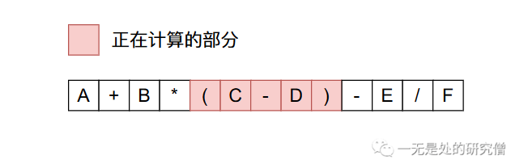

根据我们的转化原理：将**运算符**放在**操作数**后面，

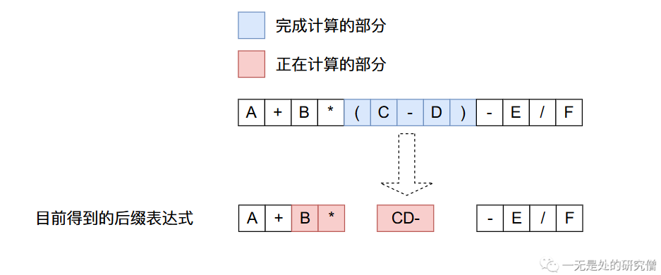

上面的得到的后缀表达式继续进行转化：

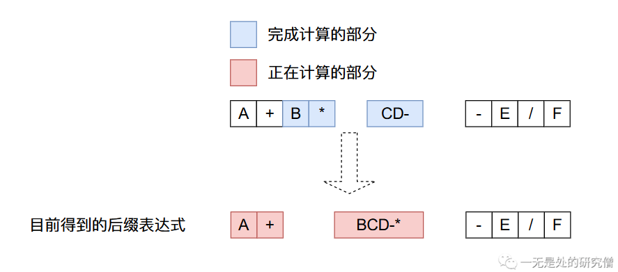

继续进行转化：

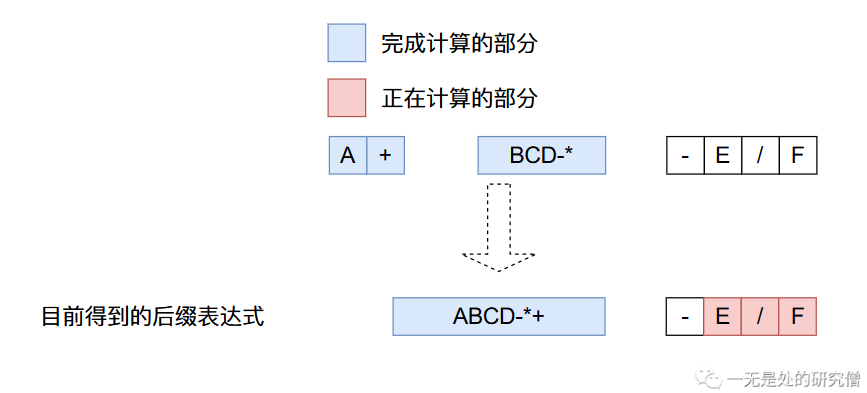

继续进行转化：

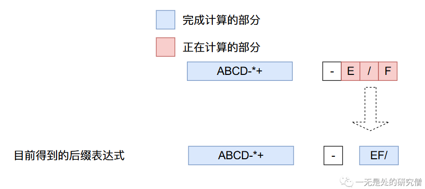

得到最终的结果：

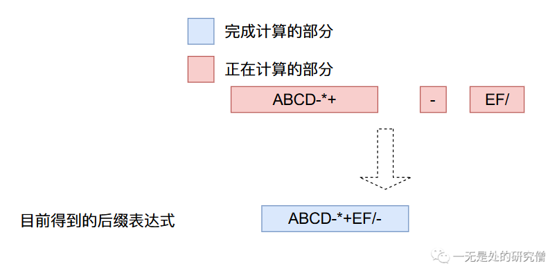

## 程序如何将中缀表达式转化成后缀表达式

将中缀表达式转化成后缀表达式有一下几条规则（下面的栈是存储操作符的栈）：

- 从左到右进行遍历。
- 遇到操作数，直接加入到后缀表达式当中。
- 遇到界限符。遇到“(”直接入栈，遇到“)”则依次弹出栈内运算符并加入后缀表达式，直到弹出“(” 为止，注意:“(” 不加入后缀表达式。
- 遇到运算符。依次弹出栈中优先级高于或等于当前运算符的所有运算符，并加入后缀表达式，若碰到“(”或栈空则停止。之后再把当前运算符入栈。

现在我们根据上面的规则来将上文当中的中缀表达式转化成后缀表达式。

- 遍历到$A$，根据第二条规则，将$A$加入到后缀表达式当中，当前的后缀表达式为：$A$。

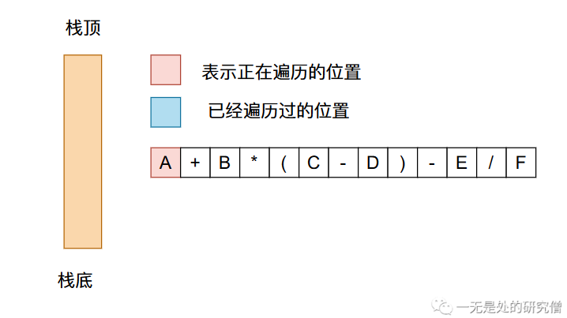

- 现在遍历到加号，根据前面的规则需要弹出栈里面优先级大的运算符，再将加号加入到栈中，当前的后缀表达式为$A$。

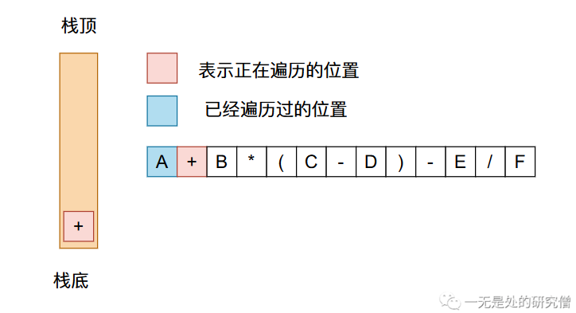

- 遍历到$B$，直接加入到后缀表达式当中，目前的后缀表达式为$AB$。

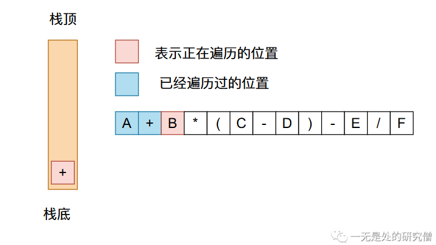

- 遍历到$*$，根据规则直接将其加入到栈中，当前后缀表达式为$AB$。

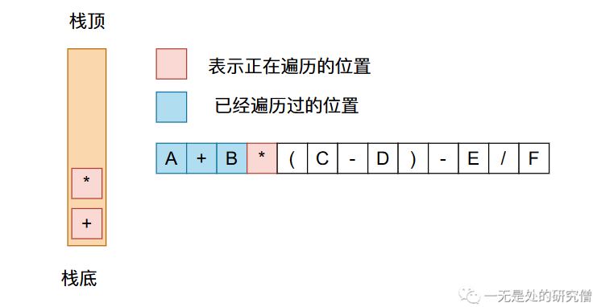

- 遍历到$($，根据规则直接将其加入到栈中，当前后缀表达式为$AB$。

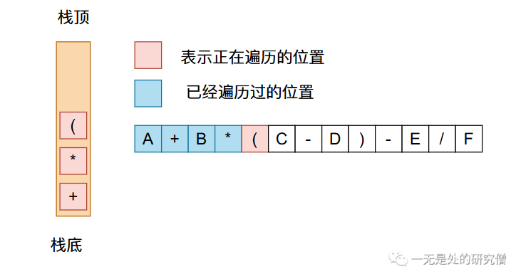

- 遍历到$C$，则直接将其加入到后缀表达式当中，当前后缀表达式为$ABC$。

- 遍历到$-$，根据规则将其加入到栈中，当前后缀表达式为$ABC$。

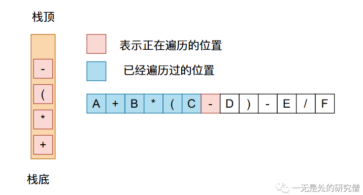

- 遍历到$D$，则将其直接加入到后缀表达式当中，当前的后缀表达式为$ABCD$。

- 遍历到$)$，则需要将栈中的符号弹出，直到遇到$($，当前的后缀表达式为$ABCD-$。

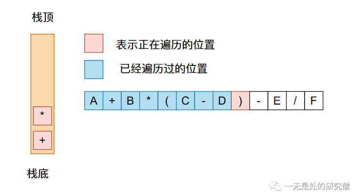

- 遍历到$-$，需要将占中优先级大于等于$-$的运算符弹出，则当前的后缀表达式为$ABCD-*+$，再将$-$压入栈中。

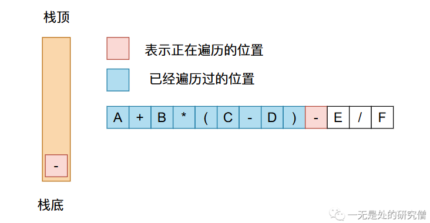

- 遍历到$E$，直接将数字加入到后缀表达式当中，则当前的后缀表达式为$ABCD-*+E$。

- 遍历到$/$，将栈中优先级大于等于$/$的运算符，再将$/$压入到栈中，当前的后缀表达式为$ABCD-*+E$。

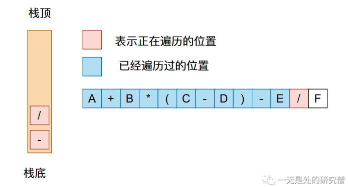

- 遍历到$F$，直接将其加入到后缀表达式当中，则当前的后缀表达式为$ABCD-*+EF$。
- 最终将栈中所有的运算符都弹出，得到的后缀表达式为$ABCD-*+EF/-$。

经过上面的过程就可以将一个中缀表达式转成后缀表达式了，大家如果想要代码实现，只需要在遍历数据的时候根据上面四个规则一个个进行判断即可。

## 后缀表达式求值

在前文当中我们已经得到了表达式$A + B * (C - D) - E / F$的后缀表达式为$ABCD-*+EF/-$。现在我们需要将这个后缀表达式进行求值。根据后缀表达式求值主要有一下两条规则：

- 如果遇到数字直接将其加入到数字栈。
- 如果遇到操作符直接从操作数栈弹出两个数据进行对应的运算，再将运算结果加入到栈中。

现在我们进行后缀表达式的求值过程;

- 首先前面四个$ABCD$都是数字，根据上面提到的第一条规则，我们都需要将数字压入到栈当中，因此遍历四个数字之后，情况如下：

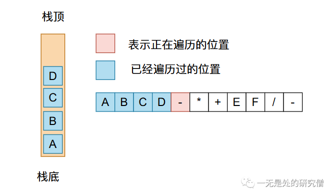

- 现在遍历到$-$，我们需要将$D$和$C$弹出，然后进行$-$操作的运算，在将结果压入栈中。

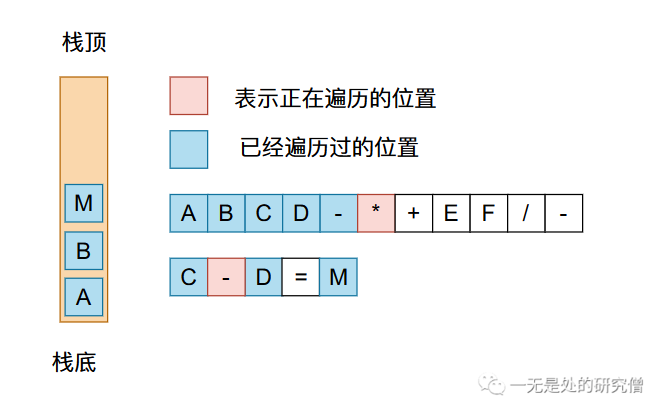

- 现在遍历到$*$，我们需要将$C-D=M$和$B$弹出，进行乘法运算，然后将结果压入栈中。

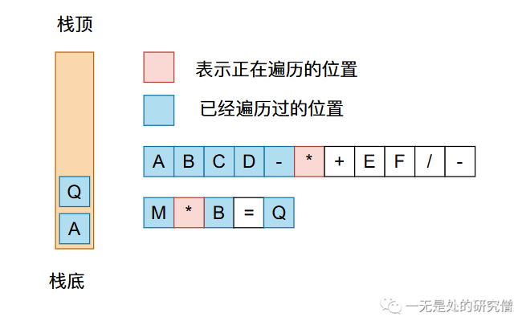

- 现在我们遍历到$+$，需要将栈中剩余的两个数弹出，进行加法运算，在将结果压栈。

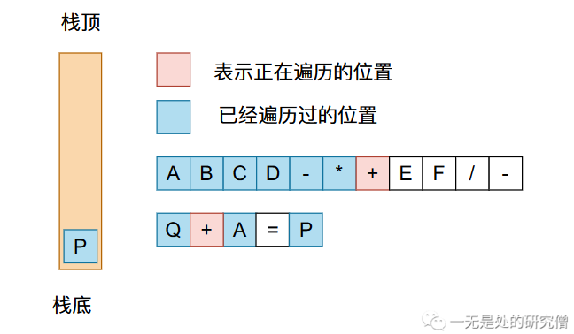

- 遍历$EF$都需要将这两个数压入到栈当中。

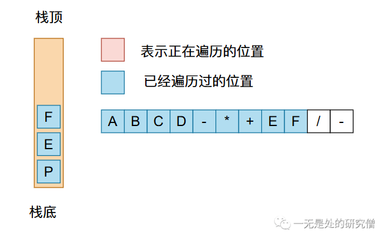

- 现在遍历到$/$，需要进行除法运算，在将得到的结果压入到栈中。

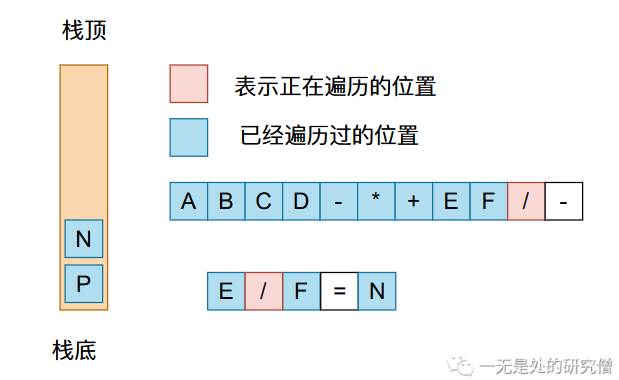

- 最后遍历到$-$，将栈中的两个数弹出栈，进行减法运算得到最后的结果。

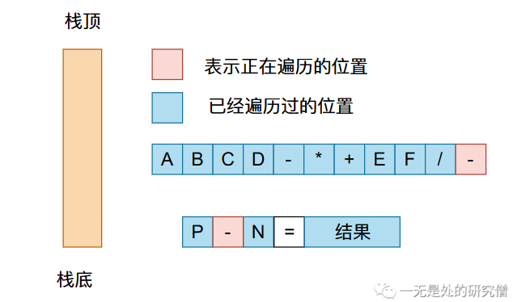

相信经过上面过程你对后缀表达式求值的过程已经非常清楚了。

## 代码实现

在**LeetCode**中有一道题就是根据后缀表达式求值——[剑指 Offer II 036. 后缀表达式](https://leetcode.cn/problems/8Zf90G/)

>根据[ 逆波兰表示法](https://baike.baidu.com/item/逆波兰式/128437)，求该后缀表达式的计算结果。
>
>有效的算符包括 `+`、`-`、`*`、`/` 。每个运算对象可以是整数，也可以是另一个逆波兰表达式。
>
>**说明：**
>
>- 整数除法只保留整数部分。
>- 给定逆波兰表达式总是有效的。换句话说，表达式总会得出有效数值且不存在除数为 0 的情况。
>
>示例 1：
>
>输入：tokens = ["2","1","+","3","*"]
>输出：9
>解释：该算式转化为常见的中缀算术表达式为：((2 + 1) * 3) = 9
>
>示例 2：
>
>输入：tokens = ["4","13","5","/","+"]
>输出：6
>解释：该算式转化为常见的中缀算术表达式为：(4 + (13 / 5)) = 6

上面问题的代码如下：

```java
class Solution {
  public int evalRPN(String[] tokens) {
    Stack<Integer> stack = new Stack<>();
    for (String token : tokens) {
      switch (token) {
        case "+": {
          int a = stack.pop();
          int b = stack.pop();
          stack.push(b + a);
          break;
        }
        case "-": {
          int a = stack.pop();
          int b = stack.pop();
          stack.push(b - a);
          break;
        }
        case "*": {
          int a = stack.pop();
          int b = stack.pop();
          stack.push(b * a);
          break;
        }
        case "/": {
          int a = stack.pop();
          int b = stack.pop();
          stack.push(b / a);
          break;
        }
        default:
          stack.push(Integer.parseInt(token));
          break;
      }
    }
    return stack.pop();
  }
}
```

