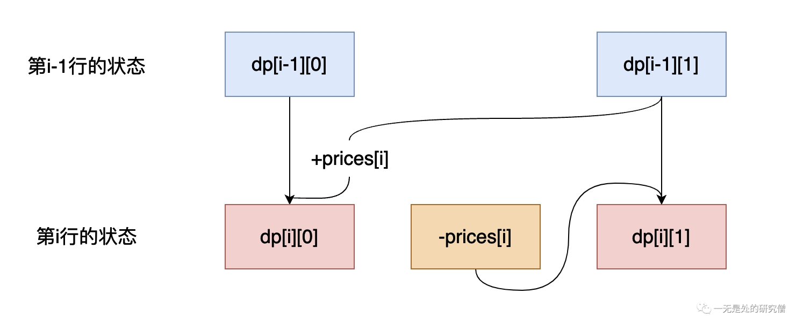

# 这种动态规划你见过吗——状态机动态规划(上)

## 前言

在本片文章当中主要通过介绍各种**股票问题**跟大家介绍**状态机动态规划**，主要了解在**股票问题**当中是如何在动态规划当中进行状态转移的。所谓状态机，就是有很多状态和他们之间的转移关系组成起来形成系统，这个说法看起来有点高大上，其实很简单，在后面讲动态规划的时候大家就明白了。

## [买卖股票的最佳时机I](https://leetcode.cn/problems/best-time-to-buy-and-sell-stock/)

>给定一个数组 prices ，它的第 i 个元素 prices[i] 表示一支给定股票第 i 天的价格。你只能选择 某一天 买入这只股票，并选择在未来的某一个不同的日子卖出该股票。设计一个算法来计算你所能获取的最大利润。返回你可以从这笔交易中获取的最大利润。如果你不能获取任何利润，返回 0 。

>示例 1：
>
>输入：[7,1,5,3,6,4]
>
>输出：5
>
>解释：在第 2 天（股票价格 = 1）的时候买入，在第 5 天（股票价格 = 6）的时候卖出，最大利润 = 6-1 = 5 。注意利润不能是 7-1 = 6, 因为卖出价格需要大于买入价格；同时，你不能在买入前卖出股票。

>示例 2：
>
>输入：prices = [7,6,4,3,1]
>
>输出：0
>
>解释：在这种情况下, 没有交易完成, 所以最大利润为 0。

### 暴力解法

在这个问题当中，我们的任务是在某一天买入股票，然后在未来某天再将股票卖出去，那么我们就可以用一个二重循环，第一层循环遍历每一天的股票，第二层循环遍历该天之后的股票，然后找到差值最大的那一天即可，也就是寻找某天后面价值最高的股票！

```java
class Solution {
  public int maxProfit(int[] prices){
    int ans = 0;
    for (int i = 0; i < prices.length - 1; i++) {
      for (int j = i + 1; j < prices.length; j++) {
        ans = Math.max(ans, prices[j] - prices[i]);
      }
    }
    return ans;
  }

}
```

上面的代码的时间复杂度为$O(n^2)$，空间复杂度为$O(1)$，由于时间复杂度过高，上面的代码在**Leetcode**上面提交会超时。

### 贪心解法

在暴力解法当中我们思考的是寻找某天后面的最大值，在这个问题当中我们可以换一个角度，就是寻找某天前面股票价值最低的那一天，然后在那一天买进，在当天卖出即可，这个效果和上面暴力解法是一样的。这样的话我们可以用一个数组去存某一天前面价值最小的股票，然后做一个减法即可！这样的话我们可以将时间复杂度降低到$O(n)$。

```java
class Solution {
  public int maxProfit(int[] prices) {
    int ans = 0;
    int[] mins = new int[prices.length];
    int min = Integer.MAX_VALUE;
    for (int i = 0; i < prices.length; i++) {
      min = Math.min(min, prices[i]);
      mins[i] = min;
    }
    for (int i = 0; i < prices.length; i++) {
      ans = Math.max(ans, prices[i] - mins[i]);
    }
    return ans;
  }
}
```

上面的代码的时间复杂度为$O(n)$，空间复杂度也是$O(n)$，其实仔细思考一下我们还可以降低空间复杂度：

```java
class Solution {
  public int maxProfit(int[] prices) {
    int low = Integer.MAX_VALUE;
    int ans = 0;
    for (int i = 0; i < prices.length; i++) {
      low = Math.min(prices[i], low);
      ans = Math.max(ans, prices[i] - low);
    }
    return ans;
  }
}
```

我们在第一次遍历的时候可以顺便求出对应位置的能够获取的最大价值，可以避免第二次遍历。在这个情况下我们的时间复杂度为$O(n)$，空间复杂度为$O(1)$。

### 动态规划解法

在求解动态规划问题的时候通常的步骤有一下几个：

- 寻找能够表示状态的数组`dp`，即我们需要寻找`dp`的含义，分析需要用几纬数组表示。
- 通过分析问题，寻找动态转移公式。
- 初始化状态数组。
- 通过分析动态转移方程，确定数组的遍历顺序。

#### 状态表示数组

在这个问题当中我们用一个二维数组去表示我们的状态，在这个问题当中主要有两个状态，一个是手上有股票，另一是手上没有股票：

- `dp[i][0]`表示在第`i`天手上没有股票能够获得的最大的收益，比如我们在第一天的没有股票的收益为0元。

- `dp[i][1]`表示在第`i`天手上存在股票能够获得的最大的收益，比如我们在第一天买入股票之后收益为`-prices[0]`。

那么我们最后的答案是`dp[N][0]`，这个表示在最后一天，我们的手中不存在股票，即我们将股票卖出去能够获取的最大的收益。

#### 状态转移方程

现在我们来分析一下如何进行状态的转移：

- `dp[i][0]`的状态如何从第`i-1`的状态转移过来：

  - 如果第`i-1`个状态是手中不存在股票，即`dp[i-1][0]`，那么第`i`个状态也没有股票，那么直接是`dp[i][0] = dp[i - 1][0]`，因为没有进行交易。
  - 如果第`i-1`个状态手中存在股票，即`dp[i-1][1]`，那么如果想在第`i`个状态没有股票，那么就需要将股票卖出，那么收益就为`dp[i-1][1] +prices[i]`，即`dp[i][0] = dp[i-1][1] +prices[i]`。
  - 综合上面的两种转移方式可以得到下面的转移方程：

  $$
  dp[i][0] = max(dp[i - 1][0], dp[i - 1][1] + prices[i])
  $$

- `dp[i][1]`的状态如何进行转移：

  - 如果第`i-1`个状态是手中不存在股票，即`dp[i-1][0]`，而第`i`个状态有股票，那么`dp[i][0] = -prices[i]`，因为买入股票，而且只能够买入一次，因此直接等于`-prices[i]`即可，注意这里不能是`dp[i - 1][0] - prices[i]`，因为在`dp[i-][0]`当中可能存在先买入再卖出的情况，而题干要求只能买入卖出一次。
  - 如果第`i-1`个状态手中存在股票，即`dp[i-1][1]`，而第`i`个状态有股票，因此不需要进行交易，即`dp[i][1]=dp[i - 1][1]`。
  - 综合上面的两种转移方式可以得到下面的转移方程：

  $$
  dp[i][1] = max(dp[i - 1][1], -prices[i]);
  $$

  整个状态转移过程如下图所示：

  

上面所谈到的有两种状态，一种是有股票，一种是没有股票，这两种状态需要从第`i-1`行转移到第`i`行，即从第`i-1`行的有股票和无股票状态转移到第`i`行的有股票和无股票状态。你可能会问这好像跟之前传统的动态规划区别也不是太大啊，这是因为在这个问题当中只有两个状态，我们在下篇当中遇到的问题就会有多个状态了，在那个时候你可能就更加理解为什么称这种动态规划叫做**状态机动态规划**了。

- 综合两种状态，整个转移方式如下：

$$
\begin{cases}dp[i][0] = max(dp[i - 1][0], dp[i - 1][1] + prices[i])\\
            dp[i][1] = max(dp[i - 1][1], -prices[i]);
            \end{cases}
$$

整个代码如下：

```java
class Solution {
  public int maxProfit(int[] prices) {
    int[][] dp = new int[prices.length][2];
    // 初始化数组 dp[0][0] 默认等于0 不用
    // 显示初始化
    dp[0][1] = -prices[0];
    for (int i = 1; i < prices.length; i++) {
      dp[i][0] = Math.max(dp[i - 1][0], dp[i - 1][1] + prices[i]);
      dp[i][1] = Math.max(dp[i - 1][1], -prices[i]);
    }
    return dp[prices.length - 1][0];
  }
}
```

#### 数组优化（滚动数组优化）

我们可以仔细分析一下上面的状态转移方程，可以发现第`i`行，只依赖第`i-1`行，因此我们只使用两行数组即可，第一行推测出第二行，第二行推测出来的结果再存回第一行.......

```java
class Solution {
  public int maxProfit(int[] prices) {
    int[][] dp = new int[2][2];
    dp[0][1] = -prices[0];
    for (int i = 1; i < prices.length; i++) {
      dp[i % 2][0] = Math.max(dp[(i - 1) % 2][0], dp[(i - 1) % 2][1] + prices[i]);
      dp[i % 2][1] = Math.max(dp[(i - 1) % 2][1], -prices[i]);
    }
    return dp[(prices.length - 1) % 2][0];
  }
}
```

可以使用位运算稍微优化一下（下面代码优化的依赖原理$a \& (2^n - 1) = a \% 2^n$）：

```java
class Solution {
  public int maxProfit(int[] prices) {
    int[][] dp = new int[2][2];
    dp[0][1] = -prices[0];
    for (int i = 1; i < prices.length; i++) {
      dp[i & 1][0] = Math.max(dp[(i - 1) & 1][0], dp[(i - 1) & 1][1] + prices[i]);
      dp[i & 1][1] = Math.max(dp[(i - 1) & 1][1], -prices[i]);
    }
    return dp[(prices.length - 1) & 1][0];
  }
}
```

最终经过上面的优化动态规划的时间和空间复杂度可以优化到$O(n)$和$O(1)$。

### 小结

在上文当中主要介绍了**买卖股票的最佳时机I**各种解决办法，其中最主要想介绍的就是动态规划的方法了，而在动态规划当中最重要的就是状态之间如何进行转换，这个题中其实很像状态机中的状态转换，在这个问题当中只有两种状态之间的转换——有股票和没股票。

# [买卖股票的最佳时机 II](https://leetcode.cn/problems/best-time-to-buy-and-sell-stock-ii/)

>给你一个整数数组 prices ，其中 prices[i] 表示某支股票第 i 天的价格。在每一天，你可以决定是否购买和/或出售股票。你在任何时候 最多 只能持有 一股 股票。你也可以先购买，然后在 同一天 出售。返回你能获得的最大 利润。
>

>示例1:
>
>输入：prices = [7,1,5,3,6,4]
>
>输出：7
>
>解释：在第 2 天（股票价格 = 1）的时候买入，在第 3 天（股票价格 = 5）的时候卖出, 这笔交易所能获得利润 = 5 - 1 = 4 。
>     随后，在第 4 天（股票价格 = 3）的时候买入，在第 5 天（股票价格 = 6）的时候卖出, 这笔交易所能获得利润 = 6 - 3 = 3 。
>     总利润为 4 + 3 = 7 。

>示例 2：
>
>输入：prices = [1,2,3,4,5]
>
>输出：4
>
>解释：在第 1 天（股票价格 = 1）的时候买入，在第 5 天 （股票价格 = 5）的时候卖出, 这笔交易所能获得利润 = 5 - 1 = 4 。
>     总利润为 4 。

这道题和第一题的区别就是，在这道题当中你可以买卖股票多次，但是最多只能持有一只股票，因此这道题和第一题的大多数情况是相同的。

#### 状态表示数组

在这个问题当中我们用一个二维数组去表示我们的状态，在这个问题当中主要有两个状态，一个是手上有股票，另一是手上没有股票：

- `dp[i][0]`表示在第`i`天手上没有股票能够获得的最大的收益，比如我们在第一天的没有股票的收益为0元。

- `dp[i][1]`表示在第`i`天手上存在股票能够获得的最大的收益，比如我们在第一天买入股票之后收益为`-prices[0]`。

那么我们最后的答案是`dp[N][0]`，这个表示在最后一天，我们的手中不存在股票，即我们将股票卖出去能够获取的最大的收益。

#### 状态转移方程

现在我们来分析一下如何进行状态的转移：

- `dp[i][0]`的状态如何从第`i-1`的状态转移过来：

  - 如果第`i-1`个状态是手中不存在股票，即`dp[i-1][0]`，那么第`i`个状态也没有股票，那么直接是`dp[i][0] = dp[i - 1][0]`，因为没有进行交易。
  - 如果第`i-1`个状态手中存在股票，即`dp[i-1][1]`，那么如果想在第`i`个状态没有股票，那么就需要将股票卖出，那么收益就为`dp[i-1][1] +prices[i]`，即`dp[i][0] = dp[i-1][1] +prices[i]`。
  - 综合上面的两种转移方式可以得到下面的转移方程：

  $$
  dp[i][0] = max(dp[i - 1][0], dp[i - 1][1] + prices[i])
  $$

  

- `dp[i][1]`的状态如何进行转移：

  - 如果第`i-1`个状态是手中不存在股票，即`dp[i-1][0]`，而第`i`个状态有股票，这道题目和上一道题目只有这个地方是不一致的，在上一道题当中`dp[i][0] = -prices[i]`，这是因为只能够买入股票一次，具体原因是在`dp[i - 1][0]`当总可以存在股票买入，而且已经卖出这种情况，而第一题只能买入卖出一次，而在这道题目当中，能够买卖股票多次，因此`dp[i][0] = dp[i - 1][0] - prices[i]`。
  - 如果第`i-1`个状态手中存在股票，即`dp[i-1][1]`，而第`i`个状态有股票，因此不需要进行交易，即`dp[i][1]=dp[i - 1][1]`。
  - 综合上面的两种转移方式可以得到下面的转移方程：

  $$
  dp[i][1] = max(dp[i - 1][1], dp[i - 1][0] - prices[i]);
  $$

- 综合上面的两个状态：

$$
\begin{cases}dp[i][0] = max(dp[i - 1][0], dp[i - 1][1] + prices[i])\\
            dp[i][1] = max(dp[i - 1][1], dp[i - 1][0] - prices[i]);
            \end{cases}
$$

参考代码如下：

```java
class Solution {
  public int maxProfit(int[] prices) {
    int[][] dp = new int[2][2];
    dp[0][1] = -prices[0];
    for (int i = 1; i < prices.length; i++) {
      dp[i & 1][0] = Math.max(dp[(i - 1) & 1][0], dp[(i - 1) & 1][1] + prices[i]);
      dp[i & 1][1] = Math.max(dp[(i - 1) & 1][1], dp[(i - 1) & 1][0] - prices[i]);
    }
    return dp[(prices.length - 1) & 1][0];
  }
}
```

#### 贪心解法

因为我们可以无数次买入卖出，因此只要存在前一天的价格低于今天的价格，那么我们就可以在前一天买入，在今天卖出，在这种情况下我们的收益就是最大的，因为我们抓住了“每一次赚钱的机会”。

- 比如`prices=[1, 2, 3]`，我们的收益就等于`(2 - 1) + (3 - 2) = 2`，这个过程相当于在第一天买入，第二天卖出，第二天再买入（注意题目当中说明了一天可以同时买入和卖出，只需要保证手上的股票不超过两个），第三天卖出。
- 又比如`prices=[4, 5, 3, 6]`，我们的收益等于`(5 - 4) + 0 + (6 - 3) = 4`，这个过程相当于第一天买入第二天卖出，第三天再买入第四天卖出。

代码如下：

```java
class Solution {
  public int maxProfit(int[] prices) {
    int ans = 0;
    int n = prices.length;
    for (int i = 1; i < n; ++i) {
      ans += Math.max(0, prices[i] - prices[i - 1]);
    }
    return ans;
  }
}

```

## 总结

在本篇文章当中主要给大家介绍了两个股票问题，这两个问题比较中规中矩的方法就是使用动态规划，但是也可以使用贪心法巧妙求解。在本文当中最想跟大家介绍的还是**状态之间的转换**，但是在本文当中的两个问题当中涉及的状态还是比较少，只有含有股票和不含有股票两种状态，但是也可以看作状态机当中状态之间的转换。下篇当中的题目状态会稍微多一点，可能大家理解起来更加容易一点！

---

更多精彩内容合集可访问项目：<https://github.com/Chang-LeHung/CSCore>

关注公众号：**一无是处的研究僧**，了解更多计算机（Java、Python、计算机系统基础、算法与数据结构）知识。


