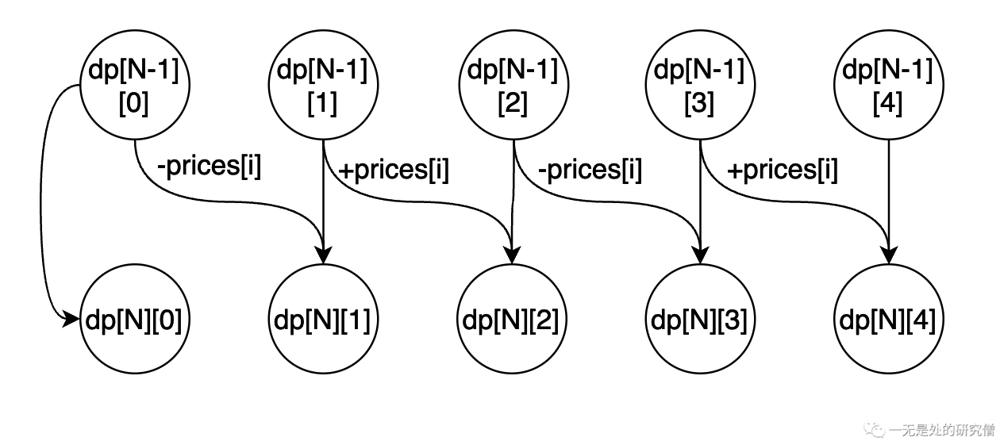

# 这种动态规划你见过吗——状态机动态规划之股票问题(中)

## 前言

在前面的文章[这种动态规划你见过吗——状态机动态规划之股票问题(上)](https://mp.weixin.qq.com/s?__biz=Mzg3ODgyNDgwNg==&mid=2247485286&idx=1&sn=3d0a6a1c2e62ba770d8427c6dd732973&chksm=cf0c9b6ff87b1279d46c775001fd77b8e1437d4001a6c8a1ca8db090eadb4174af1058a1aadf&token=1125062744&lang=zh_CN#rd)我们已经介绍了两个基本的股票问题，并且对**状态机动态规划**做出了简要的介绍在动态规划当中**状态机**当中的状态是如何进行转换的，但是在前面的两个问题当中**状态**的个数比较少，可能不方便大家理解**状态机**的含义，在本篇文章所谈到的两个问题当中状态的数目还是比较多的，因此对于大家深入理解**状态机动态规划**可能会更方便简单一点。

## [卖股票的最佳时机 III](https://leetcode.cn/problems/best-time-to-buy-and-sell-stock-iii/)

### 题目

>给定一个数组，它的第 i 个元素是一支给定的股票在第 i 天的价格。设计一个算法来计算你所能获取的最大利润。你最多可以完成 两笔 交易。注意：你不能同时参与多笔交易（你必须在再次购买前出售掉之前的股票）。

### 示例

示例1

>输入：prices = [3,3,5,0,0,3,1,4]
>
>输出：6
>
>解释：在第 4 天（股票价格 = 0）的时候买入，在第 6 天（股票价格 = 3）的时候卖出，这笔交易所能获得利润 = 3-0 = 3 。随后，在第 7 天（股票价格 = 1）的时候买入，在第 8 天 （股票价格 = 4）的时候卖出，这笔交易所能获得利润 = 4-1 = 3 。

示例2

>输入：prices = [1,2,3,4,5]
>
>输出：4
>
>解释：在第 1 天（股票价格 = 1）的时候买入，在第 5 天 （股票价格 = 5）的时候卖出, 这笔交易所能获得利润 = 5-1 = 4 。注意你不能在第 1 天和第 2 天接连购买股票，之后再将它们卖出。因为这样属于同时参与了多笔交易，你必须在再次购买前出售掉之前的股票。

这道题目和之前的两道题目不同之处在于，在上篇文章当中的两道题要么是能够购买一次，要么能够购买无数次，而在本道题目当中只能够购买两次，在这种情况下我们应该如何定义各种状态呢？

### 状态表示数组和状态转移

在这道题目当中我们也是二维数组进行状态的表示，二维数组为`dp[N][5]`，5表示我们有5个状态，`dp[N][i]`表示第N天的第i个状态能够多的多大的收益！

- `dp[N][0]`，表示第N天一次买入和卖出的操作都没有过，那么`dp[N][0] = dp[N - 1][0]`，跟前一天的状态一样，都没有进行股票的买入和卖出，其实也可以直接令`dp[N][0] = 0`，因为没有进行操作我们的收益肯定等于0。
- `dp[N][1]`，表示第N天已经进行过第一次买入，这个买入可以是在第N天进行买入，也可以在前面N-1天买入，然后在第N天保持状态。
  - 如果第N天刚刚进行买入，那么我们的收益就是从前一天一次买入和卖出都没有操作转移过来的，那么就有`dp[N][0] - prices[i]`，因为根据上面的分析`dp[N][0] = 0`，那么直接让`dp[N][1] = -prices[i]`即可。
  - 如果在钱N-1天已经进行了买入，那么在第N天就不行操作，即在第N天收入为0，即`dp[N][1] = dp[N - 1][1]`。
- `dp[N][2]`，表示第N天已经进行过第一次卖出，这个状态可以是在第N天进行卖出，也可以是在前面N-1天已经卖出，然后在第N天保持状态
  - 如果在第N天进行第一次卖出那么我们在第N天的收益就等于`prices[i]`，在加上前N-1天买入一次的收益，即`dp[N][2] = dp[N - 1][1] + prices[i]`。
  - 如果前N-1天已经卖出，那么直接保持状态即可，我们在第N天的收益就为0，那么`dp[N][2] = dp[N - 1][2]`。
- `dp[N][3]`，表示第N天已经进行过第二次买入，这个状态可以是在第N天进行买入，也可以是在前面N-1天买入，然后在第N天保持状态。
  - 如果在第N天进行第二次买入那么我们在第N天的收益就等于`-prices[i]`，再加上前N-1天买入卖出一次的收益，即`dp[N][3] = dp[N - 1][2] - prices[i]`。
  - 如果前N-1天已经有了第二次买入的操作，那么直接保持状态即可，我们在第N天的收益就为0，那么`dp[N][3] = dp[N - 1][3]`。
- `dp[N][4]`，表示第N天已经进行过第二次卖出，这个状态可以是在第N天进行买入，也可以是在前面N-1天卖出，然后在第N天保持状态。
  - 如果是在第N天卖出，那么在第N天的收益为`prices[i]`，再加上前N-1天买入两次卖出一次的收益`dp[N][3]`，那么`dp[N][4] = dp[N - 1][3] + prices[i]`。
  - 如果是前N-1天已经买入卖出两次了，那么直接保持前一天的状态即可，即`dp[N][4] = dp[N-1][4]`。

根据上面的分析我门可以得到下面的状态机（状态转移图）：



相信看到这里你就应该能够理解为什么这种动态规划叫做**状态机动态规划**，因为在这种动态规划当中数据存在很多状态，而我们需要进行仔细的分析，分析清楚这里面的状态改如何进行转移，进而分析出来各种状态之间的转移关系，即这些状态的**状态机**。

### 数据流依赖分析和状态转移方程

假如可以买卖股票的天数一共有N天，那么我们最终需要求出来的结果是`dp[N][4]`，表示第N天已经买入卖出2次，将两次使用的机会都是用完了，为什么我们最终的结果是`dp[N][4]`呢？这你可能疑惑万一我买入一次卖出一次能够的到的收益最大呢？根据上文的分析我们是允许在同一天买入和卖出股票的，因此买入卖出一次最终也可以转移到买入卖出两次，因此我们最终需要返回的结果就是`dp[N][4]`。

而根据上面的分析我们知道，从上图可以看出转移到`dp[N][4]`这个状态一共有两种方式，我们应该选择转移之后两者方式得到的价值比较大的那个，即`dp[N][4] = max(dp[N - 1][4], dp[N - 1][3] + prices[i]);`，而`dp[N - 1][4]`的转移又有两种方式我们也应该选择其中较大的，`dp[N - 1][3]`也有两种转移方式，因此其也应该选择两者当中比较大的那个值，即`dp[N][3] = max(dp[N - 1][3], dp[N - 1][2] - prices[N]);`，同理我们可以得到其他状态的转移方程，最终我们的状态转移方程如下：

```java
dp[i][0] = dp[i - 1][0];
dp[i][1] = max(dp[i - 1][1], dp[i - 1][0] - prices[i]);
dp[i][2] = max(dp[i - 1][2], dp[i - 1][1] + prices[i]);
dp[i][3] = max(dp[i - 1][3], dp[i - 1][2] - prices[i]);
dp[i][4] = max(dp[i - 1][4], dp[i - 1][3] + prices[i]);
```

### 动态规划设计

在求解动态规划问题的时候通常的步骤有以下几个：

- 寻找能够表示状态的数组`dp`，即我们需要寻找`dp`的含义，分析需要用几纬数组表示具体的状态。
- 通过分析问题，寻找动态转移公式。
- 初始化状态数组。
- 通过分析动态转移方程，确定数组的遍历顺序。

在前文当中我们已经完成了前两步，现在需要对数组进行初始化，第一天我们可以不买入一只股票，那么第一天我们的收益为0，即`dp[0][0] = 0`，我们也可以买入一只股票，即`dp[0][1] = -prices[0]`，我们可以买入一只再卖出，那等于不买，因为同一天价格都一样，即`dp[0][2] = 0`，我们也可以二次买入，也就是先买入再卖出再买入，即`dp[0][3] = -prices[0]`，同样的我们也可以进行两次买入卖出，最终的收益也等于0，即`dp[0][4] = 0`。

综合上面的分析，我们的初始化代码如下：

```java
dp[0][0] = 0;
dp[0][1] = -prices[0];
dp[0][3] = 0;
dp[0][3] = -prices[0];
dp[0][4] = 0;
```

### 代码

```java
class Solution {
  public int maxProfit(int[] prices) {
    int[][] dp = new int[prices.length][5];
    // dp[i][0] 表示一次买入和卖出都没有
    // dp[i][1] 表示第一次买入
    // dp[i][2] 表示第一次卖出
    // dp[i][3] 表示第二次买入
    // dp[i][4] 表示第二次卖出
    dp[0][1] = -prices[0];
    dp[0][3] = -prices[0];
    for (int i = 1; i < prices.length; i++) {
      dp[i][0] = dp[i - 1][0];
      dp[i][1] = Math.max(dp[i - 1][1], dp[i - 1][0] - prices[i]);
      dp[i][2] = Math.max(dp[i - 1][2], dp[i - 1][1] + prices[i]);
      dp[i][3] = Math.max(dp[i - 1][3], dp[i - 1][2] - prices[i]);
      dp[i][4] = Math.max(dp[i - 1][4], dp[i - 1][3] + prices[i]);
    }
    return dp[prices.length - 1][4];
    // 注意数据之前传递依赖的关系
    // 因为要求 dp[N][4] 当中
    // 最大的值 因此需要求解 dp[N - 1][4] 和 dp[i - 1][3] 的最大值
    // ......
  }
}
```

上面的代码的时间和空间复杂度分别为$O(n)$和$O(n)$。

### 空间复杂度优化

其实我们可以使用一个单行数组进行优化，优化代码如下：

```java
class Solution {
  public int maxProfit(int[] prices) {
    int[] dp = new int[5];
    dp[1] = -prices[0];
    dp[3] = -prices[0];
    for (int i = 1; i < prices.length; i++) {
      dp[0] = dp[0]; // 这一行可以不要的 放在这里只是为了状态转移方程的完整
      dp[1] = Math.max(dp[1], dp[0] - prices[i]);
      dp[2] = Math.max(dp[2], dp[1] + prices[i]);
      dp[3] = Math.max(dp[3], dp[2] - prices[i]);
      dp[4] = Math.max(dp[4], dp[3] + prices[i]);
    }
    return dp[4];
  }
}
```

我们现在来简要分析一下上面的代码为什么可行：

比如现在`i=3`，现在要进行更新，现在的`dp`数组还是`i=2`的状态，如果用二维数组来表示的话，现在的单行数组中的`dp[i]`相当于二维数组当中的数据`dp[2][i]`，假如我们现在需要更新`dp[3][2]`，根据二维数组的动态转移方程，我们需要二维数组第二行的数据`dp[2][2]`，但是此时的单行数组当中的数据还没有更新，也就是说`dp[2] = dp[2][2]`（前面的`dp`表示单行数组，后面的`dp`表表示二维数组的`dp`），因此还是上一个状态的数据，因此更新没有问题。

```java
dp[i][0] = dp[i - 1][0];
dp[i][1] = max(dp[i - 1][1], dp[i - 1][0] - prices[i]);
dp[i][2] = max(dp[i - 1][2], dp[i - 1][1] + prices[i]);
dp[i][3] = max(dp[i - 1][3], dp[i - 1][2] - prices[i]);
dp[i][4] = max(dp[i - 1][4], dp[i - 1][3] + prices[i]);
```

根据上面的状态转移方程我们知道`dp[3][2]`依赖于`dp[2][1]`，而`dp[2][1]`相当于`dp[1]`，但是在下面的代码当中，我们在更新`dp[2]`之前`dp[1]`已经更新了，也就是说`dp[1]`已经是第三行的状态了，即`dp[1] = dp[3][1]`，而现在更新的时候需要的是第二行的状态，因此这就不对了。

```java
class Solution {
  public int maxProfit(int[] prices) {
    int[] dp = new int[5];
    dp[1] = -prices[0];
    dp[3] = -prices[0];
    for (int i = 1; i < prices.length; i++) {
      dp[0] = dp[0]; // 这一行可以不要的 放在这里只是为了状态转移方程的完整
      dp[1] = Math.max(dp[1], dp[0] - prices[i]);
      dp[2] = Math.max(dp[2], dp[1] + prices[i]);
      dp[3] = Math.max(dp[3], dp[2] - prices[i]);
      dp[4] = Math.max(dp[4], dp[3] + prices[i]);
    }
    return dp[4];
  }
}
```

那为什么上面的代码又可行呢？

- 如果`dp[1]`是从上一行的`dp[1]`转移而来，那么就是符合我们的想法的，`dp[2]`使用的还是上一个(第2行)状态的`dp[1]`，因为本行状态的(第3行)`dp[1]`和第2行的`dp[1]`相等。
- 如果`dp[1]`是从`dp[0] - prices[3]`转移过来的，那么在这条语句`dp[2] = Math.max(dp[2], dp[1] + prices[3]);`当中，如果选择的是`dp[2]`那么也没关系，如果选择的是`dp[1] + prices[3]`，那么也没关系因为`dp[1]`减去了`prices[3]`，这一加一减相当于没有收益，这并不影响最后的结果，因为这一卖一买都是在今天完成的，而最终对结果产生影响的，对最终结果产生影响的肯定是在前面已经买入的操作（比如第2行的`dp[1]`就表示在之前进行第一次买入），而不会是在今天的买入，理解这一点就可以理解上的代码了。
- 其余代码的影响也是类似的，都可以通过一加一减低消掉，最终都不影响最后的结果。

通过上述的优化之后空间复杂度变为$O(1)$。

## [卖股票的最佳时机 IV](https://leetcode.cn/problems/best-time-to-buy-and-sell-stock-iv/)

### 题目

>给定一个整数数组 prices ，它的第 i 个元素 prices[i] 是一支给定的股票在第 i 天的价格。设计一个算法来计算你所能获取的最大利润。你最多可以完成 k 笔交易。注意：你不能同时参与多笔交易（你必须在再次购买前出售掉之前的股票）。
>

### 示例

示例1

>输入：k = 2, prices = [2,4,1]
>
>输出：2
>
>解释：在第 1 天 (股票价格 = 2) 的时候买入，在第 2 天 (股票价格 = 4) 的时候卖出，这笔交易所能获得利润 = 4-2 = 2 。

示例2

>输入：k = 2, prices = [3,2,6,5,0,3]
>
>输出：7
>
>解释：在第 2 天 (股票价格 = 2) 的时候买入，在第 3 天 (股票价格 = 6) 的时候卖出, 这笔交易所能获得利润 = 6-2 = 4 。随后，在第 5 天 (股票价格 = 0) 的时候买入，在第 6 天 (股票价格 = 3) 的时候卖出, 这笔交易所能获得利润 = 3-0 = 3 。

### 问题分析

这个问题和本文当中的第一个问题其实差不多，只不过上面的问题是最多完成两笔交易，而在这个问题当中是最多可以完成`k`笔交易，这个问题相当于上面问题的推广，我们再来分析一下上一道题目的动态转移公式：

```java
dp[i][0] = dp[i - 1][0];
dp[i][1] = max(dp[i - 1][1], dp[i - 1][0] - prices[i]);
dp[i][2] = max(dp[i - 1][2], dp[i - 1][1] + prices[i]);
dp[i][3] = max(dp[i - 1][3], dp[i - 1][2] - prices[i]);
dp[i][4] = max(dp[i - 1][4], dp[i - 1][3] + prices[i]);
```

上面的公式用一个公式表示就是：
$$
dp[i][j] = max(dp[i - 1][j], dp[i - 1][j - 1] + prices[i]);
$$


### 代码

```java
class Solution {
  public int maxProfit(int k, int[] prices) {
    if (prices == null || prices.length == 0)
      return 0;
    int m = 2 * k + 1;
    int[][] dp = new int[prices.length][m];
    // dp[i][0] 表示一次买入和卖出都没有
    // dp[i][2 * k - 1] 表示第 k 次买入
    // dp[i][2 * k] 表示第 k 次卖出
    for (int i = 1; i < m; i += 2) {
      dp[0][i] = -prices[0];
    }
    for (int i = 1; i < prices.length; i++) {
      dp[i][0] = dp[i - 1][0];
      for (int j = 2; j < m; j += 2) {
        dp[i][j - 1] = Math.max(dp[i - 1][j - 1], dp[i - 1][j - 2] - prices[i]);
        dp[i][j] = Math.max(dp[i - 1][j], dp[i - 1][j - 1] + prices[i]);

      }
    }
    return dp[prices.length - 1][2 * k];
    // 注意数据之前传递依赖的关系
  }

}
```

