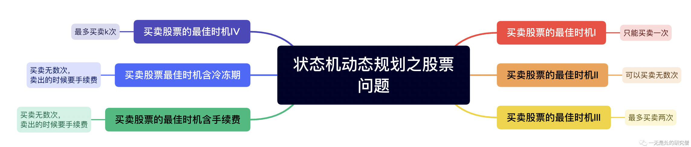

# 状态机动态规划之股票问题总结

## 前言

在前面的三篇股票问题的文章当中我们一共介绍了6道于股票相关的算法题，这些算法题的一个集中的特点就是状态比较多，需要我们去仔细分析状态之间的转换，而这种状态之间的转换特变像状态机，因此这种动态规划也被称作**状态机动态规划**。



如果需要仔细的去分析上面思维导图当中的各个问题，可以参考下面的文章：

| 内容                               | 链接                                                         |
| ---------------------------------- | ------------------------------------------------------------ |
| 买卖股票的最佳时机I和II            | [这种动态规划你见过吗——状态机动态规划之股票问题(上)](https://mp.weixin.qq.com/s?__biz=Mzg3ODgyNDgwNg==&mid=2247485286&idx=1&sn=3d0a6a1c2e62ba770d8427c6dd732973&chksm=cf0c9b6ff87b1279d46c775001fd77b8e1437d4001a6c8a1ca8db090eadb4174af1058a1aadf&token=1125062744&lang=zh_CN#rd) |
| 买卖股票的最佳时机III和Iv          | [这种动态规划你见过吗——状态机动态规划之股票问题(中)](https://mp.weixin.qq.com/s?__biz=Mzg3ODgyNDgwNg==&mid=2247485500&idx=1&sn=f9283ccc6e0c909641eadb9c761f6d1b&chksm=cf0c9435f87b1d23f1361bdd62946d3e6bb79b1415718fd15150bd47215b5ab490510bb51967&token=1092368950&lang=zh_CN#rd) |
| 买卖股票的最佳时机含冷冻期和手续费 | [这种动态规划你见过吗——状态机动态规划之股票问题(下)](买卖股票的最佳时机I和II) |
|                                    |                                                              |

本篇文章就是对上面6个问题进行总结，这6个问题都是动态规划的问题，因此你可以需要熟悉一下动态规划的套路，在求解动态规划问题的时候通常的步骤有以下几个：

- 寻找能够表示状态的数组`dp`，即我们需要寻找`dp`的含义，分析需要用几纬数组表示具体的状态。
- 通过分析问题，寻找动态转移公式。
- 初始化状态数组。
- 通过分析动态转移方程，确定数组的遍历顺序。

## [买卖股票的最佳时机I](https://leetcode.cn/problems/best-time-to-buy-and-sell-stock/)

>给定一个数组 prices ，它的第 i 个元素 prices[i] 表示一支给定股票第 i 天的价格。你只能选择 某一天 买入这只股票，并选择在未来的某一个不同的日子卖出该股票。设计一个算法来计算你所能获取的最大利润。返回你可以从这笔交易中获取的最大利润。如果你不能获取任何利润，返回 0 。

#### 状态表示数组

在这个问题当中我们用一个二维数组去表示我们的状态，在这个问题当中主要有两个状态，一个是手上有股票，另一是手上没有股票：

- `dp[i][0]`表示在第`i`天手上没有股票能够获得的最大的收益，比如我们在第一天的没有股票的收益为0元。

- `dp[i][1]`表示在第`i`天手上存在股票能够获得的最大的收益，比如我们在第一天买入股票之后收益为`-prices[0]`。

那么我们最后的答案是`dp[N][0]`，这个表示在最后一天，我们的手中不存在股票，即我们将股票卖出去能够获取的最大的收益。

#### 状态转移方程

现在我们来分析一下如何进行状态的转移：

- `dp[i][0]`的状态如何从第`i-1`的状态转移过来：

  - 如果第`i-1`个状态是手中不存在股票，即`dp[i-1][0]`，那么第`i`个状态也没有股票，那么直接是`dp[i][0] = dp[i - 1][0]`，因为没有进行交易。
  - 如果第`i-1`个状态手中存在股票，即`dp[i-1][1]`，那么如果想在第`i`个状态没有股票，那么就需要将股票卖出，那么收益就为`dp[i-1][1] +prices[i]`，即`dp[i][0] = dp[i-1][1] +prices[i]`。
  - 综合上面的两种转移方式可以得到下面的转移方程：

  $$
  dp[i][0] = max(dp[i - 1][0], dp[i - 1][1] + prices[i])
  $$

- `dp[i][1]`的状态如何进行转移：

  - 如果第`i-1`个状态是手中不存在股票，即`dp[i-1][0]`，而第`i`个状态有股票，那么`dp[i][0] = -prices[i]`，因为买入股票，而且只能够买入一次，因此直接等于`-prices[i]`即可，注意这里不能是`dp[i - 1][0] - prices[i]`，因为在`dp[i-][0]`当中可能存在先买入再卖出的情况，而题干要求只能买入卖出一次。
  - 如果第`i-1`个状态手中存在股票，即`dp[i-1][1]`，而第`i`个状态有股票，因此不需要进行交易，即`dp[i][1]=dp[i - 1][1]`。
  - 综合上面的两种转移方式可以得到下面的转移方程：

  $$
  dp[i][1] = max(dp[i - 1][1], -prices[i]);
  $$


参考代码如下：

```java
class Solution {
  public int maxProfit(int[] prices) {
    int[][] dp = new int[prices.length][2];
    // 初始化数组 dp[0][0] 默认等于0 不用
    // 显示初始化
    dp[0][1] = -prices[0];
    for (int i = 1; i < prices.length; i++) {
      dp[i][0] = Math.max(dp[i - 1][0], dp[i - 1][1] + prices[i]);
      dp[i][1] = Math.max(dp[i - 1][1], -prices[i]);
    }
    return dp[prices.length - 1][0];
  }
}
```

进行数组空间优化

```java
class Solution {
  public int maxProfit(int[] prices) {
    int[][] dp = new int[2][2];
    dp[0][1] = -prices[0];
    for (int i = 1; i < prices.length; i++) {
      dp[i & 1][0] = Math.max(dp[(i - 1) & 1][0], dp[(i - 1) & 1][1] + prices[i]);
      dp[i & 1][1] = Math.max(dp[(i - 1) & 1][1], -prices[i]);
    }
    return dp[(prices.length - 1) & 1][0];
  }
}
```

# [买卖股票的最佳时机 II](https://leetcode.cn/problems/best-time-to-buy-and-sell-stock-ii/)

>给你一个整数数组 prices ，其中 prices[i] 表示某支股票第 i 天的价格。在每一天，你可以决定是否购买和/或出售股票。你在任何时候 最多 只能持有 一股 股票。你也可以先购买，然后在 同一天 出售。返回你能获得的最大 利润。

#### 状态表示数组

在这个问题当中我们用一个二维数组去表示我们的状态，在这个问题当中主要有两个状态，一个是手上有股票，另一是手上没有股票：

- `dp[i][0]`表示在第`i`天手上没有股票能够获得的最大的收益，比如我们在第一天的没有股票的收益为0元。

- `dp[i][1]`表示在第`i`天手上存在股票能够获得的最大的收益，比如我们在第一天买入股票之后收益为`-prices[0]`。

那么我们最后的答案是`dp[N][0]`，这个表示在最后一天，我们的手中不存在股票，即我们将股票卖出去能够获取的最大的收益。

#### 状态转移方程

现在我们来分析一下如何进行状态的转移：

- `dp[i][0]`的状态如何从第`i-1`的状态转移过来：

  - 如果第`i-1`个状态是手中不存在股票，即`dp[i-1][0]`，那么第`i`个状态也没有股票，那么直接是`dp[i][0] = dp[i - 1][0]`，因为没有进行交易。
  - 如果第`i-1`个状态手中存在股票，即`dp[i-1][1]`，那么如果想在第`i`个状态没有股票，那么就需要将股票卖出，那么收益就为`dp[i-1][1] +prices[i]`，即`dp[i][0] = dp[i-1][1] +prices[i]`。
  - 综合上面的两种转移方式可以得到下面的转移方程：

  $$
  dp[i][0] = max(dp[i - 1][0], dp[i - 1][1] + prices[i])
  $$

  

- `dp[i][1]`的状态如何进行转移：

  - 如果第`i-1`个状态是手中不存在股票，即`dp[i-1][0]`，而第`i`个状态有股票，这道题目和上一道题目只有这个地方是不一致的，在上一道题当中`dp[i][0] = -prices[i]`，这是因为只能够买入股票一次，具体原因是在`dp[i - 1][0]`当中可以存在股票买入，而且已经卖出这种情况，而第一题只能买入卖出一次，而在这道题目当中，能够买卖股票多次，因此`dp[i][0] = dp[i - 1][0] - prices[i]`。
  - 如果第`i-1`个状态手中存在股票，即`dp[i-1][1]`，而第`i`个状态有股票，因此不需要进行交易，即`dp[i][1]=dp[i - 1][1]`。
  - 综合上面的两种转移方式可以得到下面的转移方程：

  $$
  dp[i][1] = max(dp[i - 1][1], dp[i - 1][0] - prices[i]);
  $$

- 综合上面的两个状态：

$$
\begin{cases}dp[i][0] = max(dp[i - 1][0], dp[i - 1][1] + prices[i])\\
            dp[i][1] = max(dp[i - 1][1], dp[i - 1][0] - prices[i]);
            \end{cases}
$$

参考代码如下：

```java
class Solution {
  public int maxProfit(int[] prices) {
    int[][] dp = new int[2][2];
    dp[0][1] = -prices[0];
    for (int i = 1; i < prices.length; i++) {
      dp[i & 1][0] = Math.max(dp[(i - 1) & 1][0], dp[(i - 1) & 1][1] + prices[i]);
      dp[i & 1][1] = Math.max(dp[(i - 1) & 1][1], dp[(i - 1) & 1][0] - prices[i]);
    }
    return dp[(prices.length - 1) & 1][0];
  }
}
```

## [卖股票的最佳时机 III](https://leetcode.cn/problems/best-time-to-buy-and-sell-stock-iii/)


>给定一个数组，它的第 i 个元素是一支给定的股票在第 i 天的价格。设计一个算法来计算你所能获取的最大利润。你最多可以完成 两笔 交易。注意：你不能同时参与多笔交易（你必须在再次购买前出售掉之前的股票）。

### 状态表示数组

在这道题目当中我们也是二维数组进行状态的表示，二维数组为`dp[N][5]`，5表示我们有5个状态，`dp[N][i]`表示第N天的第i个状态能够多大的收益！**（为了方便下面介绍，假设一天有一个股票，`dp[N][]`表示第N天的状态，对应第N个股票的状态）**

- `dp[N][0]`，表示第N天一次买入和卖出的操作都没有过，那么`dp[N][0] = dp[N - 1][0]`，跟前一天的状态一样，都没有进行股票的买入和卖出，其实也可以直接令`dp[N][0] = 0`，因为没有进行操作我们的收益肯定等于0。
- `dp[N][1]`，表示第N天已经进行过第一次买入，这个买入可以是在第N天进行买入，也可以在前面N-1天买入，然后在第N天保持状态。
  - 如果第N天刚刚进行买入，那么我们的收益就是从前一天一次买入和卖出都没有操作转移过来的，那么就有`dp[N][0] - prices[i]`，因为根据上面的分析`dp[N][0] = 0`，那么直接让`dp[N][1] = -prices[i]`即可。
  - 如果在前N-1天已经进行了买入，那么在第N天就不行操作，即在第N天收入为0，即`dp[N][1] = dp[N - 1][1]`。
- `dp[N][2]`，表示第N天已经进行过第一次卖出，这个状态可以是在第N天进行卖出，也可以是在前面N-1天已经卖出，然后在第N天保持状态
  - 如果在第N天进行第一次卖出那么我们在第N天的收益就等于`prices[i]`，再加上前N-1天买入一次的收益，即`dp[N][2] = dp[N - 1][1] + prices[i]`。
  - 如果前N-1天已经卖出，那么直接保持状态即可，我们在第N天的收益就为0，那么`dp[N][2] = dp[N - 1][2]`。
- `dp[N][3]`，表示第N天已经进行过第二次买入，这个状态可以是在第N天进行买入，也可以是在前面N-1天买入，然后在第N天保持状态。
  - 如果在第N天进行第二次买入那么我们在第N天的收益就等于`-prices[i]`，再加上前N-1天买入卖出一次的收益，即`dp[N][3] = dp[N - 1][2] - prices[i]`。
  - 如果前N-1天已经有了第二次买入的操作，那么直接保持状态即可，我们在第N天的收益就为0，那么`dp[N][3] = dp[N - 1][3]`。
- `dp[N][4]`，表示第N天已经进行过第二次卖出，这个状态可以是在第N天进行买入，也可以是在前面N-1天卖出，然后在第N天保持状态。
  - 如果是在第N天卖出，那么在第N天的收益为`prices[i]`，再加上前N-1天买入两次卖出一次的收益`dp[N][3]`，那么`dp[N][4] = dp[N - 1][3] + prices[i]`。
  - 如果是前N-1天已经买入卖出两次了，那么直接保持前一天的状态即可，即`dp[N][4] = dp[N-1][4]`。

根据上面的分析我们可以得到下面的状态机（状态转移图）：


相信看到这里你就应该能够理解为什么这种动态规划叫做**状态机动态规划**，因为在这种动态规划当中数据存在很多状态，而我们需要进行仔细的分析，分析清楚这里面的状态该如何进行转移，进而分析出来各种状态之间的转移关系，这种模式跟状态机非常像，因此叫做**状态机动态规划**。

### 状态转移方程

假如可以买卖股票的天数一共有N天，那么我们最终需要求出来的结果是`dp[N][4]`，表示第N天已经买入卖出2次，将两次使用的机会都是用完了，为什么我们最终的结果是`dp[N][4]`呢？这你可能疑惑万一我买入一次卖出一次能够得到的收益最大呢？我们是允许在同一天多次买入和卖出股票的，而在同一天买入和卖出股票收益为0，所以不影响最后的结果，因此买入卖出一次最终也可以转移到买入卖出两次（其中一次在同一天买入和卖出即可，我们在对数组进行初始化的时候就需要进行多次买入和卖出（可以看下文当中对数组初始化的分析）），因此我们最终需要返回的结果就是`dp[N][4]`。

而根据上面的分析我们知道，从上图可以看出转移到`dp[N][4]`这个状态一共有两种方式，我们应该选择转移之后两者方式得到的价值比较大的那个，即`dp[N][4] = max(dp[N - 1][4], dp[N - 1][3] + prices[i]);`，而`dp[N - 1][4]`的转移又有两种方式我们也应该选择其中较大的，`dp[N - 1][3]`也有两种转移方式，因此其也应该选择两者当中比较大的那个值，即`dp[N][3] = max(dp[N - 1][3], dp[N - 1][2] - prices[N]);`，同理我们可以得到其他状态的转移方程，每个数据都是需要选择转移之后价值最大的那个，最终我们的状态转移方程如下：

```java
dp[i][0] = dp[i - 1][0];
dp[i][1] = max(dp[i - 1][1], dp[i - 1][0] - prices[i]);
dp[i][2] = max(dp[i - 1][2], dp[i - 1][1] + prices[i]);
dp[i][3] = max(dp[i - 1][3], dp[i - 1][2] - prices[i]);
dp[i][4] = max(dp[i - 1][4], dp[i - 1][3] + prices[i]);
```

代码如下：

```java
class Solution {
  public int maxProfit(int[] prices) {
    int[][] dp = new int[prices.length][5];
    // dp[i][0] 表示一次买入和卖出都没有
    // dp[i][1] 表示第一次买入
    // dp[i][2] 表示第一次卖出
    // dp[i][3] 表示第二次买入
    // dp[i][4] 表示第二次卖出
    dp[0][1] = -prices[0];
    dp[0][3] = -prices[0];
    for (int i = 1; i < prices.length; i++) {
      dp[i][0] = dp[i - 1][0];
      dp[i][1] = Math.max(dp[i - 1][1], dp[i - 1][0] - prices[i]);
      dp[i][2] = Math.max(dp[i - 1][2], dp[i - 1][1] + prices[i]);
      dp[i][3] = Math.max(dp[i - 1][3], dp[i - 1][2] - prices[i]);
      dp[i][4] = Math.max(dp[i - 1][4], dp[i - 1][3] + prices[i]);
    }
    return dp[prices.length - 1][4];
    // 注意数据之前传递依赖的关系
    // 因为要求 dp[N][4] 当中
    // 最大的值 因此需要求解 dp[N - 1][4] 和 dp[i - 1][3] 的最大值
    // ......
  }
}
```

