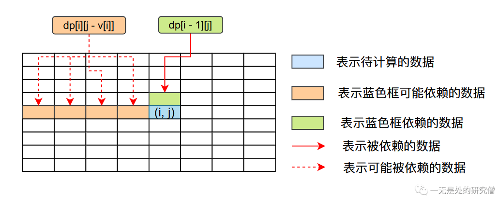
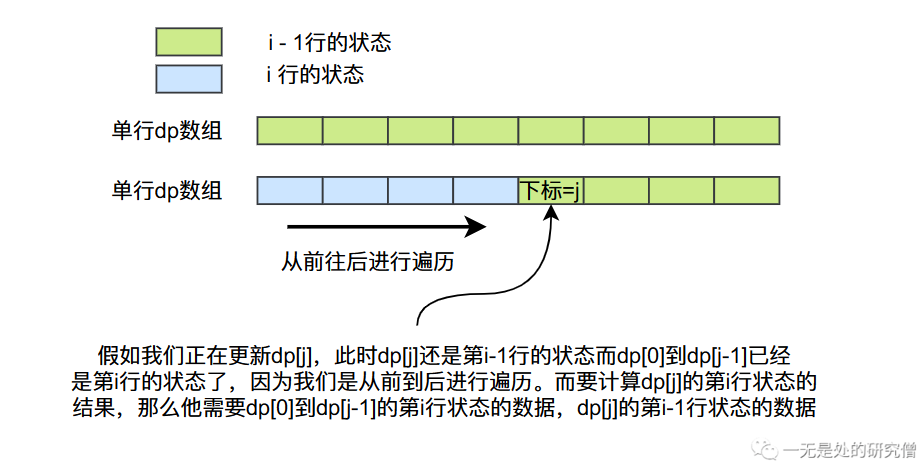

# 深入浅出零钱兑换问题——背包问题的套壳

## 前言

在本篇文章当中主要通过介绍两个算法题，从最基本的问题开始深入浅出零钱兑换问题，帮助大家从动态规划的本源深入理解问题当中的原理，并且学会自己分析问题，再也不怕类似于背包问题的算法题了。

## [零钱兑换](https://leetcode.cn/problems/coin-change/)

### 题目

>给你一个整数数组 coins ，表示不同面额的硬币；以及一个整数 amount ，表示总金额。
>
>计算并返回可以凑成总金额所需的 最少的硬币个数 。如果没有任何一种硬币组合能组成总金额，返回 -1 。
>
>你可以认为每种硬币的数量是无限的。

### 示例

示例1

```
输入：coins = [1, 2, 5], amount = 11
输出：3 
解释：11 = 5 + 5 + 1
```

示例2

```
输入：coins = [2], amount = 3
输出：-1
```

### 状态表示和状态转移方程

在求解动态规划问题的时候通常的步骤有以下几个：

- 寻找能够表示状态的数组`dp`，即我们需要寻找`dp`的含义，分析需要用几纬数组表示具体的状态。
- 通过分析问题，寻找动态转移公式。
- 初始化状态数组。
- 通过分析动态转移方程，确定数组的遍历顺序。

#### 状态表示数组

在背包问题当中通常都是用一个二维数组表示数据的状态，在这个问题当中我们使用一个二维数组`dp`表示我们需要的状态：

`dp[i][j]`表示使用`coins`前`i`种面额的硬币表示金额等于`j`时使用的最少的金币，那么我们最终答案就是`dp[N][amount]`，他表示使用`coins`数组当中所有面额的硬币表示`amount`需要的最少的硬币个数。

#### 寻找动态转移方程

在确定了状态表示的数组之后，现在我们就需要分析出动态转移方程了，在这个问题当中对于每一种面额的硬币我们都有两种选择：**选和不选**，但是在这个问题当中题目已经说明了对于每一种货币都可以认为是无限的，如果我们不选择，那这种情况比较简单，但是如果选择了这种情况就比较复杂了：

- 不选，这种情况比较简单，比如对于`dp[i][j]`，如果第`i`种面额的货币不选择，那么说明只使用前`i - 1`种面额的货币，那么`dp[i][j] = dp[i - 1][j]`，也就是说明如果使用前`i`种面额的货币去表示总额为`j`，但是不选择第`i`种面额的货币，就相当于使用前`i-1`种货币去表示`j`，那么需要的货币个数跟使用前`i-1`种货币去表示`j`需要的货币数目是相等的。
- 选，这种情况看起来就比较复杂了，因为我们需要确定是选一次，还是选两次，......，还是选N次，但是其实仔细思考一下我们可以使用一个类似递归的形式去解决这个问题，如果选择那么`dp[i][j] = dp[i][j - coins[i]] + 1`，我们仔细分析一下这个公式，相当于在总金额等于`j`的情况下先使用一次第`i`个面额的硬币，但是因为我们的硬币是无限的，现在我们还是可以选择第`i`个硬币，相当于总金额等于`j - coins[i]`而且可以使用前`i`个硬币的情况下，需要的最少的硬币个数，这就解决了是选一次还是选N次的问题了，而在上面的公式当中加一的原因是使用了一次第`i`种硬币。

很显然我们需要从上面两种情况当中选择需要的硬币最少的一种方法，因此综合上面的结果又如下的动态转移方程：
$$
dp[i][j] = min(dp[i - 1][j], dp[i][j - coins[i]] + 1)
$$
其实上面这个问题的分析过程跟**完全背包**可以说是一模一样，如果你对**完全背包**感兴趣，你可以阅读这篇文章[完全背包](https://mp.weixin.qq.com/s?__biz=Mzg3ODgyNDgwNg==&mid=2247484544&idx=1&sn=c4de17583010430fa519ecd1703bedea&chksm=cf0c9889f87b119fe5621bacf417b163020dcd8a7c0ed63df94de20ba67ae742b4d86e22ae16&token=883596793&lang=zh_CN#rd)。

#### 初始化状态数组

上面的问题分析过程当中，我们已经分析出来了动态转移方程，这个过程和**完全背包**非常相似，但是这个问题比完全背包还稍微复杂一点，因为不一定能够寻找到这样一种组合凑成的总金额等于题目当中规定的数目。我们用`-1`表示找不到这样一种组合能够表示。

- 在正式初始化之前先将`dp`数组第一行当中的数据全部初始化为-1。
- 初始化第一行代码如下：

```java
for (int i = 0; i * coins[0] <= amount; i++) {
    dp[0][i * coins[0]] = i;
}
```

`dp`数组的第一行表示只使用第一种面额的硬币，因此只有第一种硬币面额的整数倍总金额才能使用第一种硬币进行表示，而且对应的硬币个数等于$\frac{amout}{coins[0]}$。

#### 再看状态转移数组：

- 如果`dp[i][j - coins[i]] == -1`，那么就不能通过选择第`i`种硬币进行表示，在这种情况下，我们只能通过选择前`i-1`一种货币进行表示，即`dp[i][j] = dp[i - 1][j]`。可你你会有疑问，如果也不能使用前`i-1`种物品进行表示呢？没关系，如果不能表示那么`dp[i - 1][j] == -1`，那么赋值之后`dp[i][j]`也等于-1，也是不能表示的。
- 如果`dp[i][j - coins[i]]`不等于-1，但是`dp[i - 1][j]`等于-1，那么`dp[i][j] = dp[i][j - coins[i]] + 1`。
- 如果两者都不等于-1，那么我们就有如下的状态转移公式了：

$$
dp[i][j] = min(dp[i - 1][j], dp[i][j - coins[i]] + 1)
$$

#### 代码

```java
class Solution {
  public int coinChange(int[] coins, int amount) {
    int[][] dp = new int[coins.length][amount + 1];
    Arrays.fill(dp[0], -1);
    for (int i = 0; i * coins[0] <= amount; i++) {
      dp[0][i * coins[0]] = i;
    }
    for (int i = 1; i < coins.length; i++) {
      for (int j = 0; j <= amount; j++) {
        // 如果要使用对应的硬币 
        // 总金额数目肯定要大于硬币的面额
        if (j >= coins[i]) {
          if (dp[i][j - coins[i]] == -1)
            dp[i][j] = dp[i - 1][j];
          else if (dp[i - 1][j] == -1)
            dp[i][j] = dp[i][j - coins[i]] + 1;
          else
            dp[i][j] = Math.min(dp[i - 1][j], dp[i][j - coins[i]] + 1);
        } else {
          // 否则只能使用前 i-1 种硬币
          dp[i][j] = dp[i - 1][j];
        }
      }
    }
    return dp[coins.length - 1][amount];
  }
}
```

#### 单行数组优化

```java
class Solution {
  public int coinChange(int[] coins, int amount) {
    int[] dp = new int[amount + 1];
    Arrays.fill(dp, -1);
    dp[0] = 0;
    for (int i = 0; i < coins.length; i++) {
      for (int j = coins[i]; j <= amount; j++)  {
        if (dp[j - coins[i]] != -1) {
          if (dp[j] == -1) {
            dp[j] = dp[j - coins[i]] + 1;
          }else
            dp[j] = Math.min(dp[j], dp[j - coins[i]] + 1);
        }
      }
    }
    return dp[amount];
  }
}
```



根据动态转移方程，我们可以得到`dp`数组当中数据之间的依赖关系，他们的关系如上图所示，`dp[i][j]`依赖的数据为它上一行同列的位置，和第`i`行前面的某些数据，事实上我们可以使用单行数组去进行实现，我们使用的循环还是一样的，但是使用的数组有所变化，从之前的二维数组变成一维数组。当我们遍历到单行数组第`j`个数据的时候，第`j`个数据还是上一行的状态，但是单行数组的下标从0到`j-1`的位置数据的状态已经从上一行更新了，这些数据的状态相当于二维数组的`dp[i]`这一行的状态，而这正好可以满足动态转移方程的需求，因为在动态转移方程当中，`dp[i][j]`依赖的数据全部符合条件，单行数组当中的下标为`j`数据等于`dp[i][j]`，单行数组下标为`x`的数据等于`dp[i][x]`，其中$0 \le x \le j$，这里你可以结合代码、文字和图片进行理解，理解效果会更加好一点。



#### 另一种角度思考问题

```java
class Solution {
  public int coinChange(int[] coins, int amount) {
    int max = amount + 1;
    int[] dp = new int[amount + 1];
    Arrays.fill(dp, max);
    dp[0] = 0;
    for (int i = 1; i <= amount; i++) {
      for (int j = 0; j < coins.length; j++) {
        if (coins[j] <= i) {
          dp[i] = Math.min(dp[i], dp[i - coins[j]] + 1);
        }
      }
    }
    return dp[amount] > amount ? -1 : dp[amount];
  }
}
```

